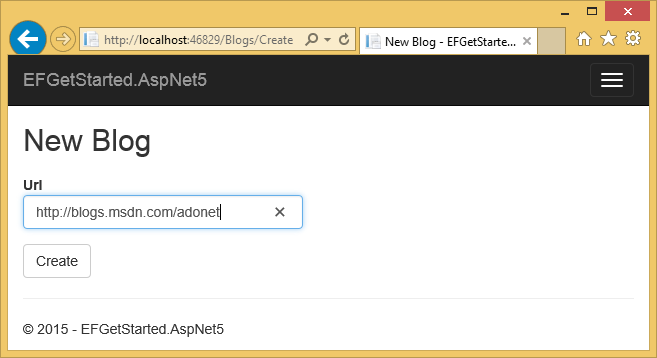
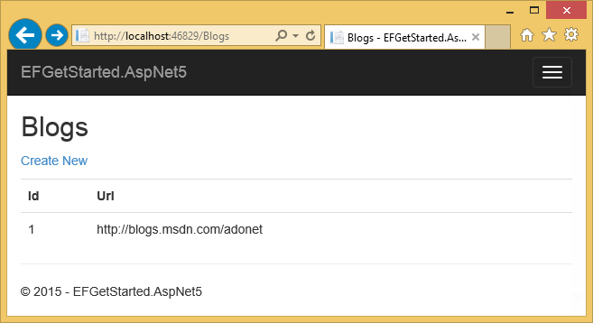

.. include:: /stub-topic.txt

Getting Started on ASP.NET 5
============================

In this walkthrough, you will build an ASP.NET 5 MVC application that performs basic data access using Entity Framework.

In this article:
	- `Create a new project`_
	- `Install Entity Framework`_
	- `Create your model`_
	- `Register your context with dependency injection`_
	- `Create your database`_
	- `Create a controller`_
	- `Create views`_
	- `Run the application`_

`View this article's samples on GitHub <https://github.com/aspnet/EntityFramework.Docs/tree/master/docs/getting-started/aspnet5/sample>`_.

.. note::
    This walkthrough uses EF 7.0.0-beta8 which is the latest pre-release available on NuGet.org.

    You can find nightly builds of the EF7 code base hosted on https://www.myget.org/F/aspnetvnext/api/v2/ but the code base is rapidly changing and we do not maintain up-to-date documentation for getting started.

Prerequisites
-------------

The following items are required to complete this walkthrough:
    - Visual Studio 2015
    - ASP.NET 5 Beta 8 Tools for Visual Studio

Create a new project
--------------------

    - Open Visual Studio 2015
    - :menuselection:`File --> New --> Project...`
    - From the left menu select :menuselection:`Templates --> Visual C# --> Web`
    - Select the **ASP.NET Web Application** project template
    - Ensure you are targeting .NET 4.5.1 or later
    - Enter **EFGetStarted.AspNet5** as the name and click **OK**

When the **New ASP.NET Project** dialog appears:
    - Under **ASP.NET 5 Preview Templates** select **Web Application**
    - Ensure that **Authentication** is set to **No Authentication**
    - Click **OK**

.. caution::
    If you use **Individual User Accounts** instead of **None** for **Authentication** then an Entity Framework model will be added to your project in `Models\\IdentityModel.cs`.

    Using the techniques you will learn in this walkthrough, you can chose to add a second model, or extend this existing model to contain your entity classes.

Install Entity Framework
----------------------------------------
To use EF7 you install the package for the database provider(s) you want to target. This walkthrough uses SQL Server. For a list of available providers see :doc:`/providers/index`.

    - :menuselection:`Tools --> NuGet Package Manager --> Package Manager Console`
    - Run ``Install-Package EntityFramework.MicrosoftSqlServer –Pre``

.. note::
    In ASP.NET 5 projects the ``Install-Package`` will complete quickly and the package installation will occur in the background. You will see **(Restoring...)** appear next to **References** in **Solution Explorer** while the install occurs.

Later in this walkthrough we will also be using some Entity Framework commands to maintain the database. So we will install the commands package as well.

    - Run ``Install-Package EntityFramework.Commands –Pre``
    - Open **project.json**
    - Locate the ``commands`` section and add the ``ef`` command as shown below

.. literalinclude:: aspnet5/sample/src/EFGetStarted.AspNet5/project.json
        :language: json
        :linenos:
        :lines: 21-25
        :emphasize-lines: 3

Create your model
-----------------

Now it's time to define a context and entity classes that make up your model.
    - Right-click on the project in **Solution Explorer** and select :menuselection:`Add --> New Folder`
    - Enter **Models** as the name of the folder
    - Right-click on the **Models** folder and select :menuselection:`Add --> New Item...`
    - From the left menu select :menuselection:`Installed --> Server-side`
    - Select the **Class** item template
    - Enter **BloggingModel.cs** as the name and click **OK**
    - Replace the contents of the file with the following code

.. note::
    In a real application you would typically put each class from your model in a separate file. For the sake of simplicity, we are putting all the classes in one file for this tutorial.

.. literalinclude:: aspnet5/sample/src/EFGetStarted.AspNet5/Models/BloggingModel.cs
        :language: c#
        :linenos:

Register your context with dependency injection
-----------------------------------------------

The concept of dependency injection is central to ASP.NET 5. Services (such as our ``BloggingContext``) are registered with dependency injection during application startup. Components that require these services (such as our MVC controllers) are then provided these services via constructor parameters or properties.

.. tip::
    For more information on dependency injection see the `Dependency Injection <http://docs.asp.net/en/latest/fundamentals/dependency-injection.html>`_ article on the ASP.NET site.

In order for our MVC controllers to make use of ``BloggingContext`` we are going to register it as a service.
    - Open **Startup.cs**
    - Add the following ``using`` statements at the start of the file

.. literalinclude:: aspnet5/sample/src/EFGetStarted.AspNet5/Startup.cs
        :language: c#
        :linenos:
        :lines: 11-12

Now we can use the ``AddDbContext`` method to register it as a service.
    - Locate the ``ConfigureServices`` method
    - Add the lines that are highlighted in the following code

.. literalinclude:: aspnet5/sample/src/EFGetStarted.AspNet5/Startup.cs
        :language: c#
        :linenos:
        :lines: 30-37
        :emphasize-lines: 4-8

Create your database
--------------------

.. caution::
    The migrations experience in ASP.NET 5 is still a work-in-progress. The following steps are overly complex and will be simplified by the time we reach a stable release.

Now that you have a model, you can use migrations to create a database for you.
    - Open a command prompt (**Windows Key + R**, type **cmd**, click **OK**)
    - Use the ``cd`` command to navigate to the project directory
    - Run ``dnvm use 1.0.0-beta8``
    - Run ``dnx ef migrations add MyFirstMigration`` to scaffold a migration to create the initial set of tables for your model.
    - Run ``dnx ef database update`` to apply the new migration to the database. Because your database doesn't exist yet, it will be created for you before the migration is applied.

.. tip::
    If you make future changes to your model, you can use the ``dnx ef migrations add`` command to scaffold a new migration to apply the corresponding changes to the database. Once you have checked the scaffolded code (and made any required changes), you can use the ``dnx ef database update`` command to apply the changes to the database.

Create a controller
-------------------

Next, we'll add an MVC controller that will use EF to query and save data.
	- Right-click on the **Controllers** folder in **Solution Explorer** and select :menuselection:`Add --> New Item...`
	- From the left menu select :menuselection:`Installed --> Server-side`
	- Select the **Class** item template
	- Enter **BlogsController.cs** as the name and click **OK**
	- Replace the contents of the file with the following code

.. literalinclude:: aspnet5/sample/src/EFGetStarted.AspNet5/Controllers/BlogsController.cs
        :language: c#
        :linenos:

You'll notice that the controller takes a ``BlogContext`` as a constructor parameter. ASP.NET dependency injection will take care of passing an instance of ``BlogContext`` into your controller.

The controller contains an ``Index`` action, which displays all blogs in the database, and a ``Create`` action, which inserts a new blogs into the database.

Create views
------------

Now that we have a controller it's time to add the views that will make up the user interface.

We'll start with the view for our ``Index`` action, that displays all blogs.
	- Right-click on the **Views** folder in **Solution Explorer** and select :menuselection:`Add --> New Folder`
	- Enter **Blogs** as the name of the folder
	- Right-click on the **Blogs** folder and select :menuselection:`Add --> New Item...`
	- From the left menu select :menuselection:`Installed --> Server-side`
	- Select the **MVC View Page** item template
	- Enter **Index.cshtml** as the name and click **OK**
	- Replace the contents of the file with the following code

.. literalinclude:: aspnet5/sample/src/EFGetStarted.AspNet5/Views/Blogs/Index.cshtml
        :linenos:

We'll also add a view for the ``Create`` action, which allows the user to enter details for a new blog.
	- Right-click on the **Blogs** folder and select :menuselection:`Add --> New Item...`
	- From the left menu select :menuselection:`Installed --> ASP.NET 5`
	- Select the **MVC View Page** item template
	- Enter **Create.cshtml** as the name and click **OK**
	- Replace the contents of the file with the following code

.. literalinclude:: aspnet5/sample/src/EFGetStarted.AspNet5/Views/Blogs/Create.cshtml
        :linenos:

Run the application
-------------------

You can now run the application to see it in action.
	- :menuselection:`Debug --> Start Without Debugging`
	- The application will build and open in a web browser
	- Navigate to **/Blogs**
	- Click **Create New**
	- Enter a **Url** for the new blog and click **Create**

