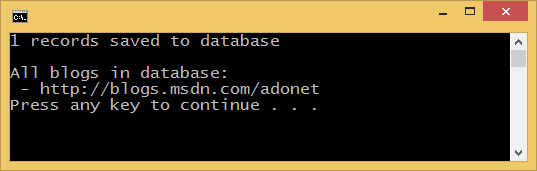

.. include:: /stub-topic.txt

Getting Started on Full .NET (Console, WinForms, WPF, etc.)
===========================================================

In this walkthrough, you will build a console application that performs basic data access using Entity Framework.

In this article:
	- `Ensure NuGet 2.8.6 or later`_
	- `Create a new project`_
	- `Install Entity Framework`_
	- `Create your model`_
	- `Create your database`_
	- `Use your model`_

`View this article's samples on GitHub <https://github.com/aspnet/EntityFramework.Docs/tree/master/docs/getting-started/full-dotnet/sample>`_.

.. note::
    This walkthrough uses EF 7.0.0-beta8 which is the latest pre-release available on NuGet.org.

    You can find nightly builds of the EF7 code base hosted on https://www.myget.org/F/aspnetvnext/api/v2/ but the code base is rapidly changing and we do not maintain up-to-date documentation for getting started.

Ensure NuGet 2.8.6 or later
---------------------------

Installing EF7 requires NuGet 2.8.6 (or higher). Make sure you restart Visual Studio after installing the update.

- **Visual Studio 2015** - No updates needed, a compatible version of NuGet is included.
- **Visual Studio 2013** - `Install the latest NuGet for VS2013 <https://visualstudiogallery.msdn.microsoft.com/4ec1526c-4a8c-4a84-b702-b21a8f5293ca>`_.
- **Visual Studio 2012** - `Install the latest NuGet for VS2012 <https://visualstudiogallery.msdn.microsoft.com/27077b70-9dad-4c64-adcf-c7cf6bc9970c>`_.

.. note::
    NuGet version numbers can be confusing, while the required release is branded 2.8.6 the product version of the extension is 2.8.60610.xxx.

Create a new project
--------------------

* Open Visual Studio (this walkthrough uses 2015 but you can use any version from 2012 onwards)
* :menuselection:`File --> New --> Project...`
* From the left menu select :menuselection:`Templates --> Visual C# --> Windows`
* Select the **Console Application** project template
* Ensure you are targeting .NET 4.5 or later
* Give the project a name and click **OK**

Install Entity Framework
----------------------------------------
To use EF7 you install the package for the database provider(s) you want to target. This walkthrough uses SQL Server. For a list of available providers see :doc:`/providers/index`.

* :menuselection:`Tools --> NuGet Package Manager --> Package Manager Console`
* Run ``Install-Package EntityFramework.MicrosoftSqlServer –Pre``

Later in this walkthrough we will also be using some Entity Framework commands to maintain the database. So we will install the commands package as well.

* Run ``Install-Package EntityFramework.Commands –Pre``

Create your model
-----------------

Now it's time to define a context and entity classes that make up your model.

* :menuselection:`Project --> Add Class...`
* Enter *Model.cs* as the name and click **OK**
* Replace the contents of the file with the following code

.. note::
    Notice the ``OnConfiguring`` method (new in EF7) that is used to specify the provider to use and, optionally, other configuration too.

.. note::
    In a real application you would typically put each class from your model in a separate file. For the sake of simplicity, we are putting all the classes in one file for this tutorial.

.. literalinclude:: full-dotnet/sample/EFGetStarted.ConsoleApp/Model.cs
        :language: c#
        :linenos:

Create your database
--------------------

Now that you have a model, you can use migrations to create a database for you.

* :menuselection:`Tools –> NuGet Package Manager –> Package Manager Console`
* Run ``Add-Migration MyFirstMigration`` to scaffold a migration to create the initial set of tables for your model.
* Run ``Update-Database`` to apply the new migration to the database. Because your database doesn't exist yet, it will be created for you before the migration is applied.

.. tip::
    If you make future changes to your model, you can use the ``Add-Migration`` command to scaffold a new migration to apply the corresponding changes to the database. Once you have checked the scaffolded code (and made any required changes), you can use the ``Update-Database`` command to apply the changes to the database.

Use your model
--------------

You can now use your model to perform data access.

* Open *Program.cs*
* Replace the contents of the file with the following code

.. literalinclude:: full-dotnet/sample/EFGetStarted.ConsoleApp/Program.cs
        :language: c#
        :linenos:

* :menuselection:`Debug --> Start Without Debugging`

You will see that one blog is saved to the database and then the details of all blogs are printed to the console.

