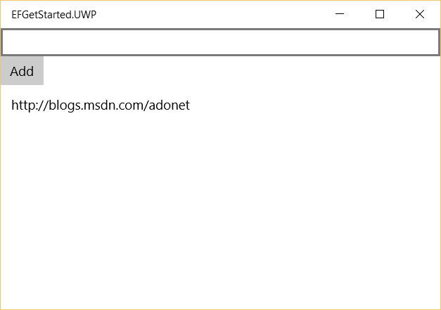

Getting Started on Universal Windows Platform
=============================================

In this walkthrough, you will build a Universal Windows Platform (UWP) application that performs basic data access against a local SQLite database using Entity Framework.

.. caution::
    Deploying a UWP application to the app store requires your application to be compiled with .NET Native. When using Entity Framework there are some query APIs you should avoid to ensure your application is compatible with .NET Native.

    You can query using simple LINQ operators that do not change the type of results returned by the query
     - Where
     - OrderBy
     - Distinct
     - Skip/Take
     - ToList/ToArray
     - etc.

    You cannot use operators that would change the type of results returned by the query. We are working to support these operators and you can `track our progress on GitHub <https://github.com/aspnet/EntityFramework/issues/3603>`_.
     - Select (you can select a single property, but not an anonymous type)
     - GroupBy
     - Include/ThenInclude
     - Join
     - etc.

In this article:
	- `Prerequisites`_
	- `Create a new project`_
	- `Install Entity Framework`_
	- `Create your model`_
	- `Create your database`_
	- `Use your model`_

.. include:: /sample.txt
.. _sample: https://github.com/aspnet/EntityFramework.Docs/tree/master/docs/getting-started/uwp/sample

.. include:: /rc1-notice.txt

Prerequisites
-------------

The following items are required to complete this walkthrough:
    - Windows 10
    - Visual Studio 2015
    - The latest version of `Windows 10 Developer Tools <https://dev.windows.com/en-us/downloads>`_

Create a new project
--------------------

* Open Visual Studio 2015
* :menuselection:`File --> New --> Project...`
* From the left menu select :menuselection:`Templates --> Visual C# --> Windows --> Universal`
* Select the **Blank App (Universal Windows)** project template
* Give the project a name and click **OK**

Install Entity Framework
----------------------------------------
To use EF7 you install the package for the database provider(s) you want to target. This walkthrough uses SQLite. For a list of available providers see :doc:`/providers/index`.

* :menuselection:`Tools --> NuGet Package Manager --> Package Manager Console`
* Run ``Install-Package EntityFramework.SQLite –Pre``

Later in this walkthrough we will also be using some Entity Framework commands to maintain the database. So we will install the commands package as well.

* Run ``Install-Package EntityFramework.Commands –Pre``

Create your model
-----------------

Now it's time to define a context and entity classes that make up your model.

* :menuselection:`Project --> Add Class...`
* Enter *Model.cs* as the name and click **OK**
* Replace the contents of the file with the following code

.. caution::
    The ``try``/``catch`` code to set ``databaseFilePath`` is a temporary workaround to enable migrations to be added at design time. When the application runs, ``databaseFilePath`` will always be under ``ApplicationData.Current.LocalFolder.Path``. However, that API can not be called when migrations creates the context at design time in Visual Studio. The database is never accessed when adding migrations, so we just return a relative file path that will never be used.

.. note::
    Notice the ``OnConfiguring`` method (new in EF7) that is used to specify the provider to use and, optionally, other configuration too.

.. literalinclude:: uwp/sample/EFGetStarted.UWP/Model.cs
    :language: c#
    :linenos:

.. tip::
    In a real application you would typically put each class from your model in a separate file. For the sake of simplicity, we are putting all the classes in one file for this tutorial.

Create your database
--------------------

Now that you have a model, you can use migrations to create a database for you.

* :menuselection:`Build -> Build Solution`
* :menuselection:`Tools –> NuGet Package Manager –> Package Manager Console`
* Run ``Add-Migration MyFirstMigration`` to scaffold a migration to create the initial set of tables for your model.

.. caution::
    Notice that you need to manually build the solution before running the ``Add-Migration`` command. The command does invoke the build operation on the project, but we are currently investigating why this does not result in the correct assemblies being outputted.

Since we want the database to be created on the device that the app runs on, we will add some code to apply any pending migrations to the local database on application startup. The first time that the app runs, this will take care of creating the local database for us.

* Right-click on **App.xaml** in **Solution Explorer** and select **View Code**
* Add the highlighted using to the start of the file

.. literalinclude:: uwp/sample/EFGetStarted.UWP/App.xaml.cs
        :language: c#
        :linenos:
        :lines: 1-6
        :emphasize-lines: 2

* Add the highlighted code to apply any pending migrations

.. literalinclude:: uwp/sample/EFGetStarted.UWP/App.xaml.cs
        :language: c#
        :linenos:
        :lines: 30-42
        :emphasize-lines: 9-12

.. tip::
    If you make future changes to your model, you can use the ``Add-Migration`` command to scaffold a new migration to apply the corresponding changes to the database. Any pending migrations will be applied to the local database on each device when the application starts.

    EF uses a ``__EFMigrationsHistory`` table in the database to keep track of which migrations have already been applied to the database.

Use your model
--------------

You can now use your model to perform data access.

* Open *MainPage.xaml*
* Add the page load handler and UI content highlighted below

.. literalinclude:: uwp/sample/EFGetStarted.UWP/MainPage.xaml
        :language: c#
        :linenos:
        :emphasize-lines: 9,12-22

Now we'll add code to wire up the UI with the database

* Right-click **MainPage.xaml** in **Solution Explorer** and select **View Code**
* Add the highlighted code from the following listing

.. literalinclude:: uwp/sample/EFGetStarted.UWP/MainPage.xaml.cs
        :language: c#
        :linenos:
        :lines: 23-49
        :emphasize-lines: 8-26

You can now run the application to see it in action.

* :menuselection:`Debug --> Start Without Debugging`
* The application will build and launch
* Enter a URL and click the **Add** button

.. image:: uwp/_static/create.png

