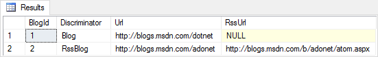

.. include:: /_shared/rc1-notice.txt

Inheritance (Relational Database)
=================================

Inheritance in the EF model is used to control how inheritance in the entity classes is represented in the database.

.. contents:: In this article:
    :depth: 3

Conventions
-----------

By convention, inheritance will be mapped using the table-per-hierarchy (TPH) pattern. TPH uses a single table to store the data for all types in the hierarchy. A discriminator column is used to identify which type each row represents.

EF will only setup inheritance if two or more inherited types are explicitly included in the model (see :doc:`/modeling/inheritance` for more details).

Below is an example showing a simple inheritance scenario and the data stored in a relational database table using the TPH pattern. The `Discriminator` column identifies which type of `Blog` is stored in each row.

.. literalinclude:: /modeling/configuring/sample/EFModeling.Conventions/Samples/InheritanceDbSets.cs
        :language: c#
        :lines: 5-20
        :linenos:

Data Annotations
----------------

You cannot use Data Annotations to configure inheritance.

Fluent API
----------

You can use the Fluent API to configure the name and type of the discriminator column and the values that are used to identify each type in the hierarchy.

.. literalinclude:: /modeling/configuring/sample/EFModeling.Configuring.FluentAPI/Samples/InheritanceTphDiscriminator.cs
        :language: c#
        :lines: 5-27
        :emphasize-lines: 7-10
        :linenos:
