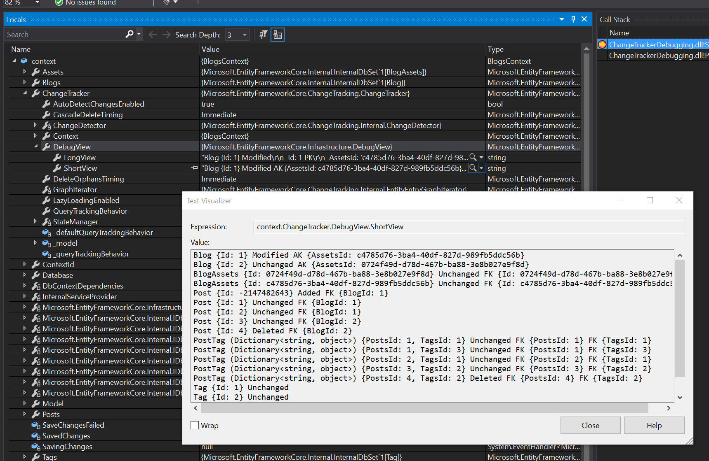

# Change Tracker Debugging

The Entity Framework Core (EF Core) change tracker generates two kinds of output to help with debugging:

- The <xref:Microsoft.EntityFrameworkCore.ChangeTracking.ChangeTracker.DebugView*?displayProperty=nameWithType> provides a human-readable view of all entities being tracked
- Debug-level log messages are generated when the change tracker detects state and fixes up relationships

> [!TIP]
> This document assumes that entity states and the basics of EF Core change tracking are understood. See [Change Tracking in EF Core](xref:core/change-tracking/index) for more information on these topics.

> [!TIP]
> You can run and debug into all the code in this document by [downloading the sample code from GitHub](https://github.com/dotnet/EntityFramework.Docs/tree/main/samples/core/ChangeTracking/ChangeTrackerDebugging).

## Change tracker debug view

The change tracker debug view can be accessed in the debugger of your IDE. For example, with Visual Studio:



It can also be accessed directly from code, for example to send the debug view to the console:

<!--
        Console.WriteLine(context.ChangeTracker.DebugView.ShortView);
-->
[!code-csharp[Change_tracker_debug_view_1b](../../../samples/core/ChangeTracking/ChangeTrackerDebugging/Samples.cs?name=Change_tracker_debug_view_1b)]

The debug view has a short form and a long form. The short form shows tracked entities, their state, and key values. The long form also includes all property and navigation values and state.

### The short view

Let's look at a debug view example using the model shown at the end of this document. First, we will track some entities and put them in some different states, just so we have good change tracking data to view:

<!--
        using var context = new BlogsContext();

        var blogs = context.Blogs
            .Include(e => e.Posts).ThenInclude(e => e.Tags)
            .Include(e => e.Assets)
            .ToList();

        // Mark something Added
        blogs[0].Posts.Add(
            new Post
            {
                Title = "What’s next for System.Text.Json?",
                Content = ".NET 5.0 was released recently and has come with many new features and..."
            });

        // Mark something Deleted
        blogs[1].Posts.Remove(blogs[1].Posts[1]);

        // Make something Modified
        blogs[0].Name = ".NET Blog (All new!)";

        context.ChangeTracker.DetectChanges();
-->
[!code-csharp[Change_tracker_debug_view_1a](../../../samples/core/ChangeTracking/ChangeTrackerDebugging/Samples.cs?name=Change_tracker_debug_view_1a)]

Printing the short view at this point, as shown above, results in the following output:

```output
Blog {Id: 1} Modified AK {AssetsId: ed727978-1ffe-4709-baee-73913e8e44a0}
Blog {Id: 2} Unchanged AK {AssetsId: 3a54b880-2b9d-486b-9403-dc2e52d36d65}
BlogAssets {Id: 3a54b880-2b9d-486b-9403-dc2e52d36d65} Unchanged FK {Id: 3a54b880-2b9d-486b-9403-dc2e52d36d65}
BlogAssets {Id: ed727978-1ffe-4709-baee-73913e8e44a0} Unchanged FK {Id: ed727978-1ffe-4709-baee-73913e8e44a0}
Post {Id: -2147482643} Added FK {BlogId: 1}
Post {Id: 1} Unchanged FK {BlogId: 1}
Post {Id: 2} Unchanged FK {BlogId: 1}
Post {Id: 3} Unchanged FK {BlogId: 2}
Post {Id: 4} Deleted FK {BlogId: 2}
PostTag (Dictionary<string, object>) {PostsId: 1, TagsId: 1} Unchanged FK {PostsId: 1} FK {TagsId: 1}
PostTag (Dictionary<string, object>) {PostsId: 1, TagsId: 3} Unchanged FK {PostsId: 1} FK {TagsId: 3}
PostTag (Dictionary<string, object>) {PostsId: 2, TagsId: 1} Unchanged FK {PostsId: 2} FK {TagsId: 1}
PostTag (Dictionary<string, object>) {PostsId: 3, TagsId: 2} Unchanged FK {PostsId: 3} FK {TagsId: 2}
PostTag (Dictionary<string, object>) {PostsId: 4, TagsId: 2} Deleted FK {PostsId: 4} FK {TagsId: 2}
Tag {Id: 1} Unchanged
Tag {Id: 2} Unchanged
Tag {Id: 3} Unchanged
```

Notice:

- Each tracked entity is listed with its primary key (PK) value. For example, `Blog {Id: 1}`.
- If the entity is a shared-type entity type, then it's CLR type is also shown. For example, `PostTag (Dictionary<string, object>)`.
- The <xref:Microsoft.EntityFrameworkCore.EntityState> is shown next. This will be one of `Unchanged`, `Added`, `Modified`, or `Deleted`.
- Values for any alternate keys (AKs) are shown next. For example, `AK {AssetsId: ed727978-1ffe-4709-baee-73913e8e44a0}`.
- Finally, values for any foreign keys (FKs) are shown. For example, `FK {PostsId: 4} FK {TagsId: 2}`.

### The long view

The long view can be sent to the console in the same way as the short view:

<!--
        Console.WriteLine(context.ChangeTracker.DebugView.LongView);
-->
[!code-csharp[Change_tracker_debug_view_1c](../../../samples/core/ChangeTracking/ChangeTrackerDebugging/Samples.cs?name=Change_tracker_debug_view_1c)]

The output for the same state as the short view above is:

```output
Blog {Id: 1} Modified
  Id: 1 PK
  AssetsId: 'ed727978-1ffe-4709-baee-73913e8e44a0' AK
  Name: '.NET Blog (All new!)' Modified Originally '.NET Blog'
  Assets: {Id: ed727978-1ffe-4709-baee-73913e8e44a0}
  Posts: [{Id: 1}, {Id: 2}, {Id: -2147482643}]
Blog {Id: 2} Unchanged
  Id: 2 PK
  AssetsId: '3a54b880-2b9d-486b-9403-dc2e52d36d65' AK
  Name: 'Visual Studio Blog'
  Assets: {Id: 3a54b880-2b9d-486b-9403-dc2e52d36d65}
  Posts: [{Id: 3}]
BlogAssets {Id: 3a54b880-2b9d-486b-9403-dc2e52d36d65} Unchanged
  Id: '3a54b880-2b9d-486b-9403-dc2e52d36d65' PK FK
  Banner: <null>
  Blog: {Id: 2}
BlogAssets {Id: ed727978-1ffe-4709-baee-73913e8e44a0} Unchanged
  Id: 'ed727978-1ffe-4709-baee-73913e8e44a0' PK FK
  Banner: <null>
  Blog: {Id: 1}
Post {Id: -2147482643} Added
  Id: -2147482643 PK Temporary
  BlogId: 1 FK
  Content: '.NET 5.0 was released recently and has come with many new fe...'
  Title: 'What's next for System.Text.Json?'
  Blog: {Id: 1}
  Tags: []
Post {Id: 1} Unchanged
  Id: 1 PK
  BlogId: 1 FK
  Content: 'Announcing the release of EF Core 5.0, a full featured cross...'
  Title: 'Announcing the Release of EF Core 5.0'
  Blog: {Id: 1}
  Tags: [{Id: 1}, {Id: 3}]
Post {Id: 2} Unchanged
  Id: 2 PK
  BlogId: 1 FK
  Content: 'F# 5 is the latest version of F#, the functional programming...'
  Title: 'Announcing F# 5'
  Blog: {Id: 1}
  Tags: [{Id: 1}]
Post {Id: 3} Unchanged
  Id: 3 PK
  BlogId: 2 FK
  Content: 'If you are focused on squeezing out the last bits of perform...'
  Title: 'Disassembly improvements for optimized managed debugging'
  Blog: {Id: 2}
  Tags: [{Id: 2}]
Post {Id: 4} Deleted
  Id: 4 PK
  BlogId: 2 FK
  Content: 'Examine when database queries were executed and measure how ...'
  Title: 'Database Profiling with Visual Studio'
  Blog: <null>
  Tags: [{Id: 2}]
PostTag (Dictionary<string, object>) {PostsId: 1, TagsId: 1} Unchanged
  PostsId: 1 PK FK
  TagsId: 1 PK FK
PostTag (Dictionary<string, object>) {PostsId: 1, TagsId: 3} Unchanged
  PostsId: 1 PK FK
  TagsId: 3 PK FK
PostTag (Dictionary<string, object>) {PostsId: 2, TagsId: 1} Unchanged
  PostsId: 2 PK FK
  TagsId: 1 PK FK
PostTag (Dictionary<string, object>) {PostsId: 3, TagsId: 2} Unchanged
  PostsId: 3 PK FK
  TagsId: 2 PK FK
PostTag (Dictionary<string, object>) {PostsId: 4, TagsId: 2} Deleted
  PostsId: 4 PK FK
  TagsId: 2 PK FK
Tag {Id: 1} Unchanged
  Id: 1 PK
  Text: '.NET'
  Posts: [{Id: 1}, {Id: 2}]
Tag {Id: 2} Unchanged
  Id: 2 PK
  Text: 'Visual Studio'
  Posts: [{Id: 3}, {Id: 4}]
Tag {Id: 3} Unchanged
  Id: 3 PK
  Text: 'EF Core'
  Posts: [{Id: 1}]
```

Each tracked entity and its state is shown as before. However, the long view also shows property and navigation values.

#### Property values

For each property, the long view shows whether or not the property is part of a primary key (PK), alternate key (AK), or foreign key (FK). For example:

- `Blog.Id` is a primary key property: `Id: 1 PK`
- `Blog.AssetsId` is an alternate key property: `AssetsId: 'ed727978-1ffe-4709-baee-73913e8e44a0' AK`
- `Post.BlogId` is a foreign key property: `BlogId: 2 FK`
- `BlogAssets.Id` is both a primary key and a foreign key property: `Id: '3a54b880-2b9d-486b-9403-dc2e52d36d65' PK FK`

Property values that have been modified are marked as such, and the original value of the property is also shown. For example, `Name: '.NET Blog (All new!)' Modified Originally '.NET Blog'`.

Finally, `Added` entities with temporary key values indicate that the value is temporary. For example, `Id: -2147482643 PK Temporary`.

#### Navigation values

Navigation values are displayed using the primary key values of the entities that the navigations reference. For example, in the output above, post 3 is related to blog 2. This means that the `Post.Blog` navigation points to the `Blog` instance with ID 2. This is shown as `Blog: {Id: 2}`.

The same thing happens for collection navigations, except that in this case there can be multiple related entities. For example, the collection navigation `Blog.Posts` contains three entities, with key values 1, 2, and -2147482643 respectively. This is shown as `[{Id: 1}, {Id: 2}, {Id: -2147482643}]`.

## Change tracker logging

The change tracker logs messages at the `Debug` <xref:Microsoft.Extensions.Logging.LogLevel> whenever it [detects property or navigation changes](xref:core/change-tracking/debug-views). For example, when <xref:Microsoft.EntityFrameworkCore.ChangeTracking.ChangeTracker.DetectChanges?displayProperty=nameWithType> is called in the code at the top of this document and [debug logging is enabled](xref:core/logging-events-diagnostics/index), then the following logs are generated:

```output
dbug: 12/30/2020 13:52:44.815 CoreEventId.DetectChangesStarting[10800] (Microsoft.EntityFrameworkCore.ChangeTracking)
      DetectChanges starting for 'BlogsContext'.
dbug: 12/30/2020 13:52:44.818 CoreEventId.PropertyChangeDetected[10802] (Microsoft.EntityFrameworkCore.ChangeTracking)
      The unchanged property 'Blog.Name' was detected as changed from '.NET Blog' to '.NET Blog (All new!)' and will be marked as modified for entity with key '{Id: 1}'.
dbug: 12/30/2020 13:52:44.820 CoreEventId.StateChanged[10807] (Microsoft.EntityFrameworkCore.ChangeTracking)
      The 'Blog' entity with key '{Id: 1}' tracked by 'BlogsContext' changed state from 'Unchanged' to 'Modified'.
dbug: 12/30/2020 13:52:44.821 CoreEventId.CollectionChangeDetected[10804] (Microsoft.EntityFrameworkCore.ChangeTracking)
      1 entities were added and 0 entities were removed from navigation 'Blog.Posts' on entity with key '{Id: 1}'.
dbug: 12/30/2020 13:52:44.822 CoreEventId.ValueGenerated[10808] (Microsoft.EntityFrameworkCore.ChangeTracking)
      'BlogsContext' generated temporary value '-2147482638' for the property 'Id.Post'.
dbug: 12/30/2020 13:52:44.822 CoreEventId.StartedTracking[10806] (Microsoft.EntityFrameworkCore.ChangeTracking)
      Context 'BlogsContext' started tracking 'Post' entity with key '{Id: -2147482638}'.
dbug: 12/30/2020 13:52:44.827 CoreEventId.CollectionChangeDetected[10804] (Microsoft.EntityFrameworkCore.ChangeTracking)
      0 entities were added and 1 entities were removed from navigation 'Blog.Posts' on entity with key '{Id: 2}'.
dbug: 12/30/2020 13:52:44.827 CoreEventId.StateChanged[10807] (Microsoft.EntityFrameworkCore.ChangeTracking)
      The 'Post' entity with key '{Id: 4}' tracked by 'BlogsContext' changed state from 'Unchanged' to 'Modified'.
dbug: 12/30/2020 13:52:44.829 CoreEventId.CascadeDeleteOrphan[10003] (Microsoft.EntityFrameworkCore.Update)
      An entity of type 'Post' with key '{Id: 4}' changed to 'Deleted' state due to severed required relationship to its parent entity of type 'Blog'.
dbug: 12/30/2020 13:52:44.829 CoreEventId.StateChanged[10807] (Microsoft.EntityFrameworkCore.ChangeTracking)
      The 'Post' entity with key '{Id: 4}' tracked by 'BlogsContext' changed state from 'Modified' to 'Deleted'.
dbug: 12/30/2020 13:52:44.829 CoreEventId.CollectionChangeDetected[10804] (Microsoft.EntityFrameworkCore.ChangeTracking)
      0 entities were added and 1 entities were removed from navigation 'Blog.Posts' on entity with key '{Id: 2}'.
dbug: 12/30/2020 13:52:44.831 CoreEventId.CascadeDelete[10002] (Microsoft.EntityFrameworkCore.Update)
      A cascade state change of an entity of type 'PostTag' with key '{PostsId: 4, TagsId: 2}' to 'Deleted' occurred due to the deletion of its parent entity of type 'Post' with key '{Id: 4}'.
dbug: 12/30/2020 13:52:44.831 CoreEventId.StateChanged[10807] (Microsoft.EntityFrameworkCore.ChangeTracking)
      The 'PostTag' entity with key '{PostsId: 4, TagsId: 2}' tracked by 'BlogsContext' changed state from 'Unchanged' to 'Deleted'.
dbug: 12/30/2020 13:52:44.831 CoreEventId.DetectChangesCompleted[10801] (Microsoft.EntityFrameworkCore.ChangeTracking)
      DetectChanges completed for 'BlogsContext'.
```

The following table summaries the change tracker logging messages:

| Event ID                                                                                                               | Description
|:-----------------------------------------------------------------------------------------------------------------------|----
| <xref:Microsoft.EntityFrameworkCore.Diagnostics.CoreEventId.DetectChangesStarting?displayProperty=nameWithType>        | <xref:Microsoft.EntityFrameworkCore.ChangeTracking.ChangeTracker.DetectChanges> is starting
| <xref:Microsoft.EntityFrameworkCore.Diagnostics.CoreEventId.DetectChangesCompleted?displayProperty=nameWithType>       | <xref:Microsoft.EntityFrameworkCore.ChangeTracking.ChangeTracker.DetectChanges> has completed
| <xref:Microsoft.EntityFrameworkCore.Diagnostics.CoreEventId.PropertyChangeDetected?displayProperty=nameWithType>       | A normal property value has changed
| <xref:Microsoft.EntityFrameworkCore.Diagnostics.CoreEventId.ForeignKeyChangeDetected?displayProperty=nameWithType>     | A foreign key property value has changed
| <xref:Microsoft.EntityFrameworkCore.Diagnostics.CoreEventId.CollectionChangeDetected?displayProperty=nameWithType>     | A non-skip collection navigation has had related entities added or removed.
| <xref:Microsoft.EntityFrameworkCore.Diagnostics.CoreEventId.ReferenceChangeDetected?displayProperty=nameWithType>      | A reference navigation has been changed to point to another entity, or set to null
| <xref:Microsoft.EntityFrameworkCore.Diagnostics.CoreEventId.StartedTracking?displayProperty=nameWithType>              | EF Core started tracking an entity
| <xref:Microsoft.EntityFrameworkCore.Diagnostics.CoreEventId.StateChanged?displayProperty=nameWithType>                 | The <xref:Microsoft.EntityFrameworkCore.EntityState> of an entity has changed
| <xref:Microsoft.EntityFrameworkCore.Diagnostics.CoreEventId.ValueGenerated?displayProperty=nameWithType>               | A value was generated for a property
| <xref:Microsoft.EntityFrameworkCore.Diagnostics.CoreEventId.SkipCollectionChangeDetected?displayProperty=nameWithType> | A skip collection navigation has had related entities added or removed

## The model

The model used for the examples above contains the following entity types:

<!--
public class Blog
{
    public int Id { get; set; } // Primary key
    public Guid AssetsId { get; set; } // Alternate key
    public string Name { get; set; }

    public IList<Post> Posts { get; } = new List<Post>(); // Collection navigation
    public BlogAssets Assets { get; set; } // Reference navigation
}

public class BlogAssets
{
    public Guid Id { get; set; } // Primary key and foreign key
    public byte[] Banner { get; set; }

    public Blog Blog { get; set; } // Reference navigation
}

public class Post
{
    public int Id { get; set; } // Primary key
    public string Title { get; set; }
    public string Content { get; set; }

    public int BlogId { get; set; } // Foreign key
    public Blog Blog { get; set; } // Reference navigation

    public IList<Tag> Tags { get; } = new List<Tag>(); // Skip collection navigation
}

public class Tag
{
    public int Id { get; set; } // Primary key
    public string Text { get; set; }

    public IList<Post> Posts { get; } = new List<Post>(); // Skip collection navigation
}
-->
[!code-csharp[Model](../../../samples/core/ChangeTracking/ChangeTrackerDebugging/Samples.cs?name=Model)]

The model is mostly configured by convention, with just a few lines in OnModelCreating:

<!--
    protected override void OnModelCreating(ModelBuilder modelBuilder)
    {
        modelBuilder
            .Entity<Blog>()
            .Property(e => e.AssetsId)
            .ValueGeneratedOnAdd();

        modelBuilder
            .Entity<BlogAssets>()
            .HasOne(e => e.Blog)
            .WithOne(e => e.Assets)
            .HasForeignKey<BlogAssets>(e => e.Id)
            .HasPrincipalKey<Blog>(e => e.AssetsId);
    }
-->
[!code-csharp[OnModelCreating](../../../samples/core/ChangeTracking/ChangeTrackerDebugging/Samples.cs?name=OnModelCreating)]
