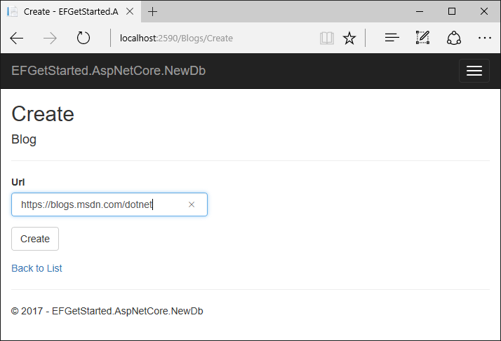
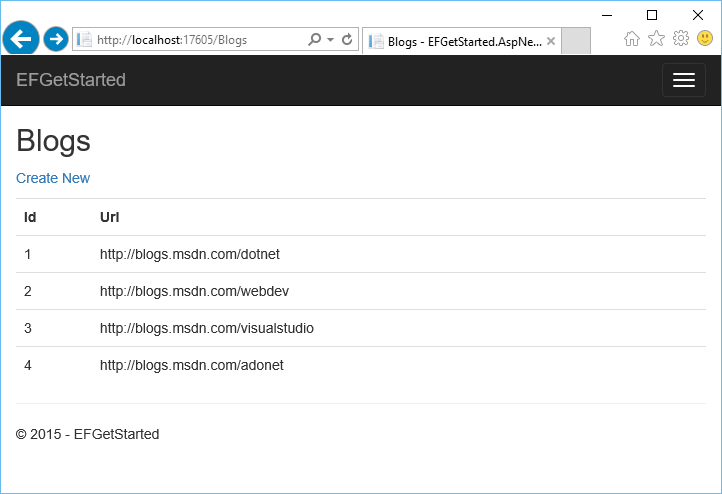

# Getting Started with EF Core on ASP.NET Core with an Existing Database

> [!IMPORTANT]  
> The [.NET Core SDK](https://www.microsoft.com/net/download/core) no longer supports `project.json` or Visual Studio 2015. Everyone doing .NET Core development is encouraged to [migrate from project.json to csproj](https://docs.microsoft.com/dotnet/articles/core/migration/) and [Visual Studio 2017](https://www.visualstudio.com/downloads/).

In this walkthrough, you will build an ASP.NET Core MVC application that performs basic data access using Entity Framework. You will use reverse engineering to create an Entity Framework model based on an existing database.

> [!TIP]  
> You can view this article's [sample](https://github.com/aspnet/EntityFramework.Docs/tree/master/samples/core/GetStarted/AspNetCore/EFGetStarted.AspNetCore.ExistingDb) on GitHub.

## Prerequisites

The following prerequisites are needed to complete this walkthrough:

* [Visual Studio 2017 15.3](https://www.visualstudio.com/downloads/) with these workloads:
  * **ASP.NET and web development** (under **Web & Cloud**)
  * **.NET Core cross-platform development** (under **Other Toolsets**)
* [.NET Core 2.0 SDK](https://www.microsoft.com/net/download/core).
* [Blogging database](#blogging-database)

### Blogging database

This tutorial uses a **Blogging** database on your LocalDb instance as the existing database.

> [!TIP]  
> If you have already created the **Blogging** database as part of another tutorial, you can skip these steps.

* Open Visual Studio
* **Tools -> Connect to Database...**
* Select **Microsoft SQL Server** and click **Continue**
* Enter **(localdb)\mssqllocaldb** as the **Server Name**
* Enter **master** as the **Database Name** and click **OK**
* The master database is now displayed under **Data Connections** in **Server Explorer**
* Right-click on the database in **Server Explorer** and select **New Query**
* Copy the script, listed below, into the query editor
* Right-click on the query editor and select **Execute**

[!code-sql[Main](../_shared/create-blogging-database-script.sql)]

## Create a new project

* Open Visual Studio 2017
* **File -> New -> Project...**
* From the left menu select **Installed -> Templates -> Visual C# -> Web**
* Select the **ASP.NET Core Web Application (.NET Core)** project template
* Enter **EFGetStarted.AspNetCore.ExistingDb** as the name and click **OK**
* Wait for the **New ASP.NET Core Web Application** dialog to appear
* Under **ASP.NET Core Templates 2.0** select the **Web Application (Model-View-Controller)**
* Ensure that **Authentication** is set to **No Authentication**
* Click **OK**

## Install Entity Framework

To use EF Core, install the package for the database provider(s) you want to target. This walkthrough uses SQL Server. For a list of available providers see [Database Providers](../../providers/index.md).

* **Tools > NuGet Package Manager > Package Manager Console**

* Run `Install-Package Microsoft.EntityFrameworkCore.SqlServer`

We will be using some Entity Framework Tools to create a model from the database. So we will install the tools package as well:

* Run `Install-Package Microsoft.EntityFrameworkCore.Tools`

We will be using some ASP.NET Core Scaffolding tools to create controllers and views later on. So we will install this design package as well:

* Run `Install-Package Microsoft.VisualStudio.Web.CodeGeneration.Design`

## Reverse engineer your model

Now it's time to create the EF model based on your existing database.

* **Tools –> NuGet Package Manager –> Package Manager Console**
* Run the following command to create a model from the existing database:

``` powershell
Scaffold-DbContext "Server=(localdb)\mssqllocaldb;Database=Blogging;Trusted_Connection=True;" Microsoft.EntityFrameworkCore.SqlServer -OutputDir Models
```

If you receive an error stating `The term 'Scaffold-DbContext' is not recognized as the name of a cmdlet`, then close and reopen Visual Studio.

> [!TIP]  
> You can specify which tables you want to generate entities for by adding the `-Tables` argument to the command above. E.g. `-Tables Blog,Post`.

The reverse engineer process created entity classes (`Blog.cs` & `Post.cs`) and a derived context (`BloggingContext.cs`) based on the schema of the existing database.

 The entity classes are simple C# objects that represent the data you will be querying and saving.

 [!code-csharp[Main](../../../../samples/core/GetStarted/AspNetCore/EFGetStarted.AspNetCore.ExistingDb/Models/Blog.cs)]

 The context represents a session with the database and allows you to query and save instances of the entity classes.

<!-- Static code listing, rather than a linked file, because the walkthrough modifies the context file heavily -->
 ``` csharp
public partial class BloggingContext : DbContext
{
    public virtual DbSet<Blog> Blog { get; set; }
    public virtual DbSet<Post> Post { get; set; }

    protected override void OnConfiguring(DbContextOptionsBuilder optionsBuilder)
    {
        if (!optionsBuilder.IsConfigured)
        {
            #warning To protect potentially sensitive information in your connection string, you should move it out of source code. See http://go.microsoft.com/fwlink/?LinkId=723263 for guidance on storing connection strings.
            optionsBuilder.UseSqlServer(@"Server=(localdb)\mssqllocaldb;Database=Blogging;Trusted_Connection=True;");
        }
    }

    protected override void OnModelCreating(ModelBuilder modelBuilder)
    {
        modelBuilder.Entity<Blog>(entity =>
        {
            entity.Property(e => e.Url).IsRequired();
        });

        modelBuilder.Entity<Post>(entity =>
        {
            entity.HasOne(d => d.Blog)
                .WithMany(p => p.Post)
                .HasForeignKey(d => d.BlogId);
        });
    }
}
```

## Register your context with dependency injection

The concept of dependency injection is central to ASP.NET Core. Services (such as `BloggingContext`) are registered with dependency injection during application startup. Components that require these services (such as your MVC controllers) are then provided these services via constructor parameters or properties. For more information on dependency injection see the [Dependency Injection](http://docs.asp.net/en/latest/fundamentals/dependency-injection.html) article on the ASP.NET site.

### Remove inline context configuration

In ASP.NET Core, configuration is generally performed in **Startup.cs**. To conform to this pattern, we will move configuration of the database provider to **Startup.cs**.

* Open `Models\BloggingContext.cs`
* Delete the `OnConfiguring(...)` method

``` csharp
protected override void OnConfiguring(DbContextOptionsBuilder optionsBuilder)
{
    #warning To protect potentially sensitive information in your connection string, you should move it out of source code. See http://go.microsoft.com/fwlink/?LinkId=723263 for guidance on storing connection strings.
    optionsBuilder.UseSqlServer(@"Server=(localdb)\mssqllocaldb;Database=Blogging;Trusted_Connection=True;");
}
```

* Add the following constructor, which will allow configuration to be passed into the context by dependency injection

[!code-csharp[Main](../../../../samples/core/GetStarted/AspNetCore/EFGetStarted.AspNetCore.ExistingDb/Models/BloggingContext.cs#Constructor)]

### Register and configure your context in Startup.cs

In order for our MVC controllers to make use of `BloggingContext` we are going to register it as a service.

* Open **Startup.cs**
* Add the following `using` statements at the start of the file

[!code-csharp[Main](../../../../samples/core/GetStarted/AspNetCore/EFGetStarted.AspNetCore.ExistingDb/Startup.cs#AddedUsings)]

Now we can use the `AddDbContext(...)` method to register it as a service.
* Locate the `ConfigureServices(...)` method
* Add the following code to register the context as a service

[!code-csharp[Main](../../../../samples/core/GetStarted/AspNetCore/EFGetStarted.AspNetCore.ExistingDb/Startup.cs?name=ConfigureServices&highlight=7-8)]

> [!TIP]  
> In a real application you would typically put the connection string in a configuration file. For the sake of simplicity, we are defining it in code. For more information, see [Connection Strings](../../miscellaneous/connection-strings.md).

## Create a controller

Next, we'll enable scaffolding in our project.

* Right-click on the **Controllers** folder in **Solution Explorer** and select **Add -> Controller...**
* Select **Full Dependencies** and click **Add**
* You can ignore the instructions in the `ScaffoldingReadMe.txt` file that opens

Now that scaffolding is enabled, we can scaffold a controller for the `Blog` entity.

* Right-click on the **Controllers** folder in **Solution Explorer** and select **Add -> Controller...**
* Select **MVC Controller with views, using Entity Framework** and click **Ok**
* Set **Model class** to **Blog** and **Data context class** to **BloggingContext**
* Click **Add**

## Run the application

You can now run the application to see it in action.

* **Debug -> Start Without Debugging**
* The application will build and open in a web browser
* Navigate to `/Blogs`
* Click **Create New**
* Enter a **Url** for the new blog and click **Create**




