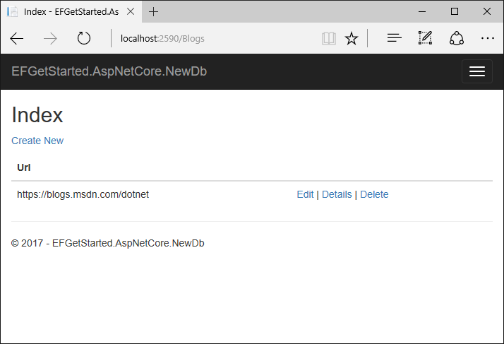

# Getting Started with EF Core on ASP.NET Core with a New database

In this tutorial, you build an ASP.NET Core MVC application that performs basic data access using Entity Framework Core. The tutorial uses migrations to create the database from the data model.

You can follow the tutorial by using Visual Studio 2017 on Windows, or by using the .NET Core CLI on Windows, macOS, or Linux.

View this article's sample on GitHub:
* [Visual Studio 2017 with SQL Server](https://github.com/aspnet/EntityFramework.Docs/tree/master/samples/core/GetStarted/AspNetCore/EFGetStarted.AspNetCore.NewDb)
* [.NET Core CLI with SQLite](https://github.com/aspnet/EntityFramework.Docs/tree/master/samples/core/GetStarted/AspNetCore/EFGetStarted.AspNetCore.NewDb.Sqlite).

## Prerequisites

Install the following software:

# [Visual Studio](#tab/visual-studio)

* [Visual Studio 2017 version 15.7 or later](https://www.visualstudio.com/downloads/) with these workloads:
  * **ASP.NET and web development** (under **Web & Cloud**)
  * **.NET Core cross-platform development** (under **Other Toolsets**)
* [.NET Core 2.1 SDK](https://www.microsoft.com/net/download/core).

# [.NET Core CLI](#tab/netcore-cli)

* [.NET Core 2.1 SDK](https://www.microsoft.com/net/download/core).

---

## Create a new project

# [Visual Studio](#tab/visual-studio)

* Open Visual Studio 2017
* **File > New > Project**
* From the left menu, select **Installed > Visual C# > .NET Core**.
* Select **ASP.NET Core Web Application**.
* Enter **EFGetStarted.AspNetCore.NewDb** for the name and click **OK**.
* In the **New ASP.NET Core Web Application** dialog:
  * Make sure that **.NET Core** and **ASP.NET Core 2.1** are selected in the drop-down lists
  * Select the **Web Application (Model-View-Controller)** project template
  * Make sure that **Authentication** is set to **No Authentication**
  * Click **OK**

Warning: If you use **Individual User Accounts** instead of **None** for **Authentication** then an Entity Framework Core model will be added to the project in `Models\IdentityModel.cs`. Using the techniques you learn in this tutorial, you can choose to add a second model, or extend this existing model to contain your entity classes.

# [.NET Core CLI](#tab/netcore-cli)

* Run the following command to create an MVC project:

   ```cli
   dotnet new mvc -n EFGetStarted.AspNetCore.NewDb
   ```
* Change to the project directory. The next commands you enter need to run against the new project.

   ```cli
   cd EFGetStarted.AspNetCore.NewDb
   ```
---

## Install Entity Framework Core

To install EF Core, you install the package for the EF Core database provider(s) you want to target. For a list of available providers, see [Database Providers](../../providers/index.md).

# [Visual Studio](#tab/visual-studio)

For this tutorial, you don't have to install a provider package because the tutorial uses SQL Server. The SQL Server provider package is included in the [Microsoft.AspnetCore.App metapackage](https://docs.microsoft.com/aspnet/core/fundamentals/metapackage-app?view=aspnetcore-2.1).

# [.NET Core CLI](#tab/netcore-cli)

This tutorial uses SQLite because it runs on all platforms that .NET Core supports.

* Run the following command to install the SQLite provider:

   ```cli
   dotnet add package Microsoft.EntityFrameworkCore.Sqlite
   ```

---

## Create the model

Define a context class and entity classes that make up the model.

# [Visual Studio](#tab/visual-studio)

* Right-click on the **Models** folder and select **Add > Class**.
* Enter **Model.cs** as the name and click **OK**.
* Replace the contents of the file with the following code:

  [!code-csharp[Main](../../../../samples/core/GetStarted/AspNetCore/EFGetStarted.AspNetCore.NewDb/Models/Model.cs)]

# [.NET Core CLI](#tab/netcore-cli)

* In the **Models** folder create **Model.cs** with the following code:

  [!code-csharp[Main](../../../../samples/core/GetStarted/AspNetCore/EFGetStarted.AspNetCore.NewDb.Sqlite/Models/Model.cs)]

---

A production app would typically put each class in a separate file. For the sake of simplicity, this tutorial puts these classes in one file.

## Register the context with dependency injection

Services (such as `BloggingContext`) are registered with [dependency injection](http://docs.asp.net/en/latest/fundamentals/dependency-injection.html) during application startup. Components that require these services (such as MVC controllers) are provided these services via constructor parameters or properties.

To make `BloggingContext` available to MVC controllers, register it as a service.

# [Visual Studio](#tab/visual-studio)

* In **Startup.cs** add the following `using` statements:

  [!code-csharp[Main](../../../../samples/core/GetStarted/AspNetCore/EFGetStarted.AspNetCore.NewDb/Startup.cs#AddedUsings)]

* Add the following highlighted code to the `ConfigureServices` method:

  [!code-csharp[Main](../../../../samples/core/GetStarted/AspNetCore/EFGetStarted.AspNetCore.NewDb/Startup.cs?name=ConfigureServices&highlight=12-14)]

# [.NET Core CLI](#tab/netcore-cli)

* In **Startup.cs** add the following `using` statements:

  [!code-csharp[Main](../../../../samples/core/GetStarted/AspNetCore/EFGetStarted.AspNetCore.NewDb.Sqlite/Startup.cs#AddedUsings)]

* Add the following highlighted code to the `ConfigureServices` method:

  [!code-csharp[Main](../../../../samples/core/GetStarted/AspNetCore/EFGetStarted.AspNetCore.NewDb.Sqlite/Startup.cs?name=ConfigureServices&highlight=12-14)]

---

A production app would typically put the connection string in a configuration file or environment variable. For the sake of simplicity, this tutorial defines it in code. See [Connection Strings](../../miscellaneous/connection-strings.md) for more information.

## Create the database

The following steps use [migrations](xref:core/managing-schemas/migrations/index) to create a database.

# [Visual Studio](#tab/visual-studio)

* **Tools > NuGet Package Manager > Package Manager Console**
* Run the following commands:

  ```powershell
  Add-Migration InitialCreate
  Update-Database
  ```

  If you get an error stating `The term 'add-migration' is not recognized as the name of a cmdlet`, close and reopen Visual Studio.

  The `Add-Migration` command scaffolds a migration to create the initial set of tables for the model. The `Update-Database` command creates the database and applies the new migration to it.

# [.NET Core CLI](#tab/netcore-cli)

* Run the following commands:

  ```cli
  dotnet ef migrations add InitialCreate
  dotnet ef database update
  ```

  The `migrations` command scaffolds a migration to create the initial set of tables for the model. The `database update` command creates the database and applies the new migration to it.

---

## Create a controller

Scaffold a controller and views for the `Blog` entity.

# [Visual Studio](#tab/visual-studio)

* Right-click on the **Controllers** folder in **Solution Explorer** and select **Add > Controller**.
* Select **MVC Controller with views, using Entity Framework** and click **Add**.
* Set **Model class** to **Blog** and **Data context class** to **BloggingContext**.
* Click **Add**.

# [.NET Core CLI](#tab/netcore-cli)

* Run the following commands:

  ```cli
  dotnet tool install -g dotnet-aspnet-codegenerator
  dotnet add package Microsoft.VisualStudio.Web.CodeGeneration.Design
  dotnet restore
  dotnet aspnet-codegenerator controller -name BlogsController -m Blog -dc BloggingContext --relativeFolderPath Controllers --useDefaultLayout --referenceScriptLibraries
  ```

  The `tool install` and `add package` commands install the tooling that can scaffold controllers and views. The `restore` command ensures that all of the project's packages are downloaded, and the `aspnet-codegenerator` command does the scaffolding.
---

The scaffolding engine creates the following files:

* A controller (*Controllers/BlogsController.cs*)
* Razor views for Create, Delete, Details, Edit, and Index pages (_Views/Blogs/*.cshtml_)

## Run the application

# [Visual Studio](#tab/visual-studio)

* **Debug** > **Start Without Debugging**

# [.NET Core CLI](#tab/netcore-cli)

```cli
dotnet run
```
---

* Navigate to `/Blogs`

* Use the **Create New** link to create some blog entries.

  

* Test the **Details**, **Edit**, and **Delete** links.

  

## Additional Resources

* [Tutorial: Get started with EF Core on .NET Core with a new database using SQLite](xref:core/get-started/netcore/new-db-sqlite)
* [Tutorial: Get started with Razor Pages in ASP.NET Core](https://docs.microsoft.com/aspnet/core/tutorials/razor-pages/razor-pages-start)
* [Tutorial: Razor Pages with Entity Framework Core in ASP.NET Core](https://docs.microsoft.com/aspnet/core/data/ef-rp/intro)
