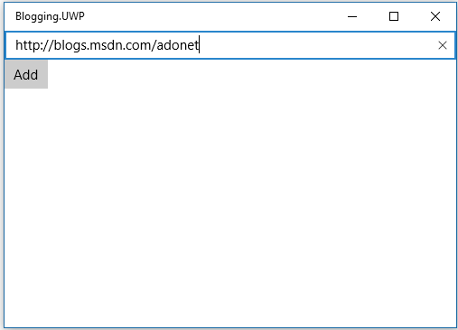
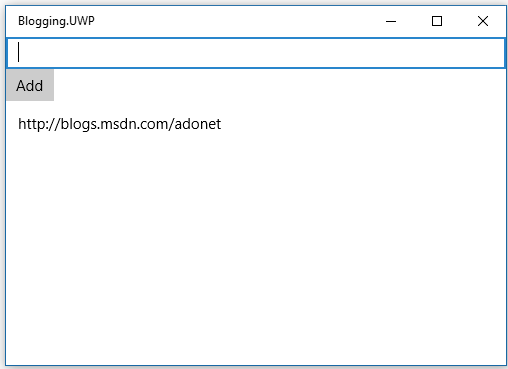

# Getting Started with EF Core on Universal Windows Platform (UWP) with a New Database

> [!NOTE]
> This tutorial uses EF Core 2.0.1 (released alongside ASP.NET Core and .NET Core SDK 2.0.3). EF Core 2.0.0 lacks some crucial bug fixes required for a good UWP experience.

In this walkthrough, you will build a Universal Windows Platform (UWP) application that performs basic data access against a local SQLite database using Entity Framework.

> [!IMPORTANT]
> **Consider avoiding anonymous types in LINQ queries on UWP**. Deploying a UWP application to the app store requires your application to be compiled with .NET Native. Queries with anonymous types have worse performance on .NET Native.

> [!TIP]
> You can view this article's [sample](https://github.com/aspnet/EntityFramework.Docs/tree/master/samples/core/GetStarted/UWP/UWP.SQLite) on GitHub.

## Prerequisites

The following items are required to complete this walkthrough:

* [Windows 10 Fall Creators Update](https://support.microsoft.com/en-us/help/4027667/windows-update-windows-10) (10.0.16299.0)

* [.NET Core 2.0.0 SDK](https://www.microsoft.com/net/core) or later.

* [Visual Studio 2017](https://www.visualstudio.com/downloads/) version 15.4 or later with the **Universal Windows Platform Development** workload.

## Create a new model project

> [!WARNING]
> Due to limitations in the way .NET Core tools interact with UWP projects the model needs to be placed in a non-UWP project to be able to run migrations commands in the Package Manager Console

* Open Visual Studio

* File > New > Project...

* From the left menu select Templates > Visual C#

* Select the **Class Library (.NET Standard)** project template

* Give the project a name and click **OK**

## Install Entity Framework

To use EF Core, install the package for the database provider(s) you want to target. This walkthrough uses SQLite. For a list of available providers see [Database Providers](../../providers/index.md).

* Tools > NuGet Package Manager > Package Manager Console

* Run `Install-Package Microsoft.EntityFrameworkCore.Sqlite`

Later in this walkthrough we will also be using some Entity Framework Tools to maintain the database. So we will install the tools package as well.

* Run `Install-Package Microsoft.EntityFrameworkCore.Tools`

* Edit the .csproj file and replace `<TargetFramework>netstandard2.0</TargetFramework>` with `<TargetFrameworks>netcoreapp2.0;netstandard2.0</TargetFrameworks>`

## Create your model

Now it's time to define a context and entity classes that make up your model.

* Project > Add Class...

* Enter *Model.cs* as the name and click **OK**

* Replace the contents of the file with the following code

[!code-csharp[Main](../../../../samples/core/GetStarted/UWP/UWP.Model/Model.cs)]

## Create a new UWP project

* Open Visual Studio

* File > New > Project...

* From the left menu select Templates > Visual C# > Windows Universal

* Select the **Blank App (Universal Windows)** project template

* Give the project a name and click **OK**

* Set the target and minimum versions to at least `Windows 10 Fall Creators Update (10.0; build 16299.0)`

## Create your database

Now that you have a model, you can use migrations to create a database for you.

* Tools –> NuGet Package Manager –> Package Manager Console

* Select the model project as the Default project and set it as the startup project

* Run `Add-Migration MyFirstMigration` to scaffold a migration to create the initial set of tables for your model.

Since we want the database to be created on the device that the app runs on, we will add some code to apply any pending migrations to the local database on application startup. The first time that the app runs, this will take care of creating the local database for us.

* Right-click on **App.xaml** in **Solution Explorer** and select **View Code**

* Add the highlighted using to the start of the file

* Add the highlighted code to apply any pending migrations

[!code-csharp[Main](../../../../samples/core/GetStarted/UWP/UWP.SQLite/App.xaml.cs?highlight=1,25-28)]

> [!TIP]  
> If you make future changes to your model, you can use the `Add-Migration` command to scaffold a new migration to apply the corresponding changes to the database. Any pending migrations will be applied to the local database on each device when the application starts.
>
>EF uses a `__EFMigrationsHistory` table in the database to keep track of which migrations have already been applied to the database.

## Use your model

You can now use your model to perform data access.

* Open *MainPage.xaml*

* Add the page load handler and UI content highlighted below

[!code-xml[Main](../../../../samples/core/GetStarted/UWP/UWP.SQLite/MainPage.xaml?highlight=9,11-23)]

Now we'll add code to wire up the UI with the database

* Right-click **MainPage.xaml** in **Solution Explorer** and select **View Code**

* Add the highlighted code from the following listing

[!code-csharp[Main](../../../../samples/core/GetStarted/UWP/UWP.SQLite/MainPage.xaml.cs?highlight=30-48)]

You can now run the application to see it in action.

* Debug > Start Without Debugging

* The application will build and launch

* Enter a URL and click the **Add** button

## Next steps

> [!TIP]
> `SaveChanges()` performance can be improved by implementing [`INotifyPropertyChanged`](https://msdn.microsoft.com/en-us/library/system.componentmodel.inotifypropertychanged.aspx), [`INotifyPropertyChanging`](https://msdn.microsoft.com/en-us/library/system.componentmodel.inotifypropertychanging.aspx), [`INotifyCollectionChanged`](https://msdn.microsoft.com/en-us/library/system.collections.specialized.inotifycollectionchanged.aspx) in your entity types and using `ChangeTrackingStrategy.ChangingAndChangedNotifications`.

Tada! You now have a simple UWP app running Entity Framework.

Check out other articles in this documentation to learn more about Entity Framework's features.
