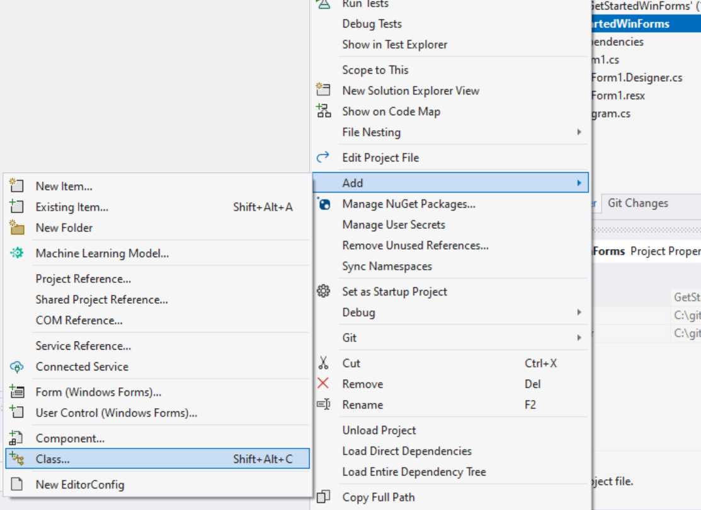
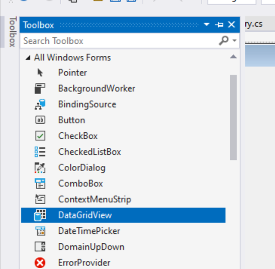
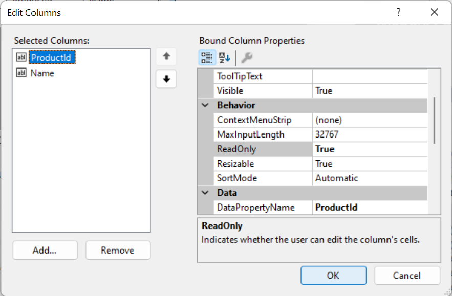

# Getting Started with Windows Forms

This step-by-step walkthrough shows how to build a simple Windows Forms (WinForms) application backed by a SQLite database. The application uses Entity Framework Core (EF Core) to load data from the database, track changes made to that data, and persist those changes back to the database.

The screen shots and code listings in this walkthrough are taken from Visual Studio 2022 17.3.0.

> [!TIP]
> You can view this article's [sample on GitHub](https://github.com/dotnet/EntityFramework.Docs/tree/main/samples/core/WinForms).

## Prerequisites

You need to have Visual Studio 2022 17.3 or later installed with the **.NET desktop workload** selected to complete this walkthrough. For more information about installing the latest version of Visual Studio, see [Install Visual Studio](/visualstudio/install/install-visual-studio).

## Create the Application

1. Open Visual Studio
2. On the start window, choose **Create new project**.
3. Choose **Windows Forms App** and then choose **Next**.

   

4. At the next screen, give the project a name, for example, **GetStartedWinForms**, and choose **Next**.
5. At the next screen, choose the .NET version to use. This walkthrough was created with .NET 7, but it should also work with later versions.
6. Choose **Create**.

## Install the EF Core NuGet packages

1. Right-click on the solution and choose **Manage NuGet Packages for Solution...**

   

2. Choose the **Browse** tab and search for "Microsoft.EntityFrameworkCore.Sqlite".
3. Select the **Microsoft.EntityFrameworkCore.Sqlite** package.
4. Check the project **GetStartedWinForms** in the right pane.
5. Choose the latest version. To use a pre-release version, make sure that the **Include prerelease** box is checked.
6. Click **Install**

   

> [!NOTE]
> The **Microsoft.EntityFrameworkCore.Sqlite** is the "database provider" package for using EF Core with a SQLite database. Similar packages are available for other database systems. Installing a database provider package automatically brings in all the dependencies needed to use EF Core with that database system. This includes the **Microsoft.EntityFrameworkCore** base package.

## Define a Model

In this walkthrough we will implement a model using "Code First". This means that EF Core will create the database tables and schema based on the C# classes you define. See [Managing Database Schemas](xref:core/managing-schemas/index) to see how to use an existing database instead.

1. Right-click on project and choose **Add**, then **Class...** to add a new class.

   

2. Use the filename `Product.cs` and replace the code for the class with:

   [!code-csharp[](../../../samples/core/WinForms/GetStartedWinForms/GetStartedWinForms/Product.cs)]

3. Repeat to create `Category.cs` with the following code:

   [!code-csharp[](../../../samples/core/WinForms/GetStartedWinForms/GetStartedWinForms/Category.cs)]

The `Products` property on the `Category` class and the `Category` property on the `Product` class are called "navigations". In EF Core, navigations define a relationship between two entity types. In this case, the `Product.Category` navigation references the category to which a given product belongs. Likewise, the `Category.Products` collection navigation contains all the products for a given category.

> [!TIP]
> When using Windows Forms, the `ObservableCollectionListSource`, which implements `IListSource`, can be used for collection navigations. This is not necessary, but does improve the two-way data binding experience.

## Define the DbContext

In EF Core, a class derived from `DbContext` is used to configure entity types in a model and act as a session for interacting with the database. In the simplest case, a `DbContext` class:

- Contains `DbSet` properties for each entity type in the model.
- Overrides the `OnConfiguring` method to configure the database provider and connection string to use. See [Configuring a DbContext](xref:core/dbcontext-configuration/index) for more information.

In this case, the DbContext class also overrides the `OnModelCreating` method to provide some sample data for the application.

Add a new `ProductsContext.cs` class to the project with the following code:

[!code-csharp[](../../../samples/core/WinForms/GetStartedWinForms/GetStartedWinForms/ProductsContext.cs)]

Make sure to **build the solution** at this point.

## Adding controls to the form

The application will show a list of categories and a list of products. When a category is selected in the first list, then the second list will change to show products for that category. These lists can be modified to add, remove, or edit products and categories, and these changes can be saved to the SQLite database by clicking a **Save** button.

1. Change the name of the main form from `Form1` to `MainForm`.

   

2. And change the title to "Products and Categories".

   

3. Using the **Toolbox**, add two `DataGridView` controls, arranged next to each other.

   

4. In the **Properties** for the first `DataGridView`, change the **Name** to `dataGridViewCategories`.
5. In the **Properties** for the second `DataGridView`, change the **Name** to `dataGridViewProducts`.
6. Also using the **Toolbox**, add a `Button` control.
7. Name the button `buttonSave` and give it the text "Save". The form should look something this this:

   

## Data binding

The next step is to connect the `Product` and `Category` types from the model to the `DataGridView` controls. This will bind the data loaded by EF Core to the controls, such that the entities tracked by EF Core are kept in sync with those displayed in the controls.

1. Click the **Designer Action Glyph** on the first `DataGridView`. This is the tiny button at the top-right corner of the control.

   

2. This opens the _Action List_, from which the drop-down for **Chose Data Source** can be accessed. We haven't created a data source yet, so go to the bottom and choose **Add new Object Data Source...**.

   

3. Choose **Category** to create an object data source for categories, and click **OK**.

   

   > [!TIP]
   > If no data source types appear here, then make sure that `Product.cs`, `Category.cs` and `ProductsContext.cs` have been added to the project _**and the solution has been built**_.

4. Now the **Choose Data Source** drop-down contains the object data source we just created. Expand **Other Data Sources**, then **Project Data Sources**, and choose **Category**.

   

   The second `DataGridView` will be bound to products. However, rather than binding to the top-level `Product` type, it will instead be bound to the `Products` navigation from the `Category` binding of the first `DataGridView`. This means that when a category is selected in the first view, the products for that category will automatically be used in the second view.

5. Using the **Designer Action Glyph** on the second `DataGridView`, choose **Choose Data Source**, then expand the `categoryBindingSource` and choose `Products`.

   

## Configuring what is displayed

By default, a column is created in the `DataGridView` for every property of the bound types. Also, the values for each of these properties can be edited by the user. However, some values, such as the primary key values, are conceptually read-only, and so should not be edited. Also, some properties, such as the `CategoryId` foreign key property and the `Category` navigation are not useful to the user, and so should be hidden.

> [!TIP]
> It is common to hide primary key properties in a real application. They are left visible here to make it easy to see what EF Core is doing behind the scenes.

1. Right-click on the first `DataGridView` and choose **Edit Columns...**.

   

2. Make the `CategoryId` column, which represents the primary key, read-only, and click **OK**.

   

3. Right-click on the second `DataGridView` and choose **Edit Columns...**. Make the `ProductId` column read-only, and remove the `CategoryId` and `Category` columns, then click **OK**.

   

## Connecting to EF Core

The application now needs a small amount of code to connect EF Core to the data-bound controls.

1. Open the `MainForm` code by right-clicking on the file and choosing **View Code**.

   

2. Add a private field to hold the `DbContext` for the session, and add overrides for the `OnLoad` and `OnClosing` methods. The code should look like this:

```csharp
using Microsoft.EntityFrameworkCore;
using System.ComponentModel;

namespace GetStartedWinForms
{
    public partial class MainForm : Form
    {
        private ProductsContext? dbContext;

        public MainForm()
        {
            InitializeComponent();
        }

        protected override void OnLoad(EventArgs e)
        {
            base.OnLoad(e);

            this.dbContext = new ProductsContext();

            // Uncomment the line below to start fresh with a new database.
            // this.dbContext.Database.EnsureDeleted();
            this.dbContext.Database.EnsureCreated();

            this.dbContext.Categories.Load();

            this.categoryBindingSource.DataSource = dbContext.Categories.Local.ToBindingList();
        }

        protected override void OnClosing(CancelEventArgs e)
        {
            base.OnClosing(e);

            this.dbContext?.Dispose();
            this.dbContext = null;
        }
    }
}
```

The `OnLoad` method is called when the form is loaded. At this time

- An instance of the `ProductsContext` is created that will be used to load and track changes to products and categories displayed by the application.
- `EnsureCreated` is called on the `DbContext` to create the SQLite database if it does not already exist. This is a quick way to create a database when prototyping or testing applications. However, if the model changes, then the database will need to be deleted so that it can be created again. (The `EnsureDeleted` line can be un-commented to easily delete and re-create the database when the application is run.) You may instead wish to use [EF Core Migrations](xref:core/managing-schemas/migrations/index) to modify and update the database schema without losing any data.
- `EnsureCreated` will also populate the new database with the data defined in the `ProductsContext.OnModelCreating` method.
- The `Load` extension method is used to load all the categories from database into the `DbContext`. These entities will now be tracked by the `DbContext`, which will detect any changes made when the categories are edited by the user.
- The `categoryBindingSource.DataSource` property is initialized to the categories that are being tracked by the `DbContext`. This is done by calling `Local.ToBindingList()` on the `Categories` `DbSet` property. `Local` provides access to a local view of the tracked categories, with events hooked up to ensure the local data stays in sync with the displayed data, and vice versa. `ToBindingList()` exposes this data as an `IBindingList`, which is understood by Windows Forms data binding.

The `OnClosing` method is called when the form is closed. At this time, the `DbContext` is disposed, which ensures any database resources will be freed, and the `dbContext` field is set to null so that it cannot be used again.

## Populating the Products view

If the application is started at this point, then it should look something like this:


Notice that the categories have been loaded from the database, but the products table remains empty. Also, the **Save** button does not work.

To populate the products table, EF Core needs to load products from the database for the selected category. To achieve this:

1. In the designer for the main form, select the `DataGridView` for categories.
2. In the **Properties** for the `DataGridView`, choose the events (the lightning button), and double click the **SelectionChanged** event.

   

   This will create stub in the main form code for an event to be fired whenever the category selection changes.  

3. Fill in the code for the event:

```csharp
private void dataGridViewCategories_SelectionChanged(object sender, EventArgs e)
{
    if (this.dbContext != null)
    {
        var category = (Category)this.dataGridViewCategories.CurrentRow.DataBoundItem;

        if (category != null)
        {
            this.dbContext.Entry(category).Collection(e => e.Products).Load();
        }
    }
}
```

In this code, if there is an active (non-null) `DbContext` session, then we obtain the `Category` instance bound to the currently selected row of the `DataViewGrid`. (This may be `null` if the final row in the view is selected, which is used to create new categories.) If there is a selected category, then the `DbContext` is instructed to load the products associated with that category. This is done by:

- Getting an `EntityEntry` for the `Category` instance (`dbContext.Entry(category)`)
- Letting EF Core know that we want to operate on the `Products` collection navigation of that `Category` (`.Collection(e => e.Products)`)
- And finally telling EF Core that we want to load that collection of products from the database (`.Load();`)

> [!TIP]
> When `Load` is called, EF Core will only access the database to load the products if they have not already been loaded.

If the application is now run again, then it should load the appropriate products whenever a category is selected:


## Saving changes

Finally, the **Save** button can be connected to EF Core so that any changes made to the products and categories are saved to the database.

1. In the designer for the main form, select the **Save** button.
2. In the **Properties** for the `Button`, choose the events (the lightning button), and double click the **Click** event.

   

3. Fill in the code for the event:

```csharp
private void buttonSave_Click(object sender, EventArgs e)
{
    this.dbContext!.SaveChanges();

    this.dataGridViewCategories.Refresh();
    this.dataGridViewProducts.Refresh();
}
```

This code calls `SaveChanges` on the `DbContext`, which saves any changes made to the SQLite database. If no changes were made, then this is a no-op, and no database call is made. After saving, the `DataGridView` controls are refreshed. This is because EF Core reads generated primary key values for any new products and categories from the database. Calling `Refresh` updates the display with these generated values.

## The final application

Here is the full code for the main form:

[!code-csharp[](../../../samples/core/WinForms/GetStartedWinForms/GetStartedWinForms/Form1.cs)]

The application can now be run, and products and categories can be added, deleted, and edited. Notice that if the **Save** button is clicked before closing the application, then any changes made will be stored in the database and re-loaded when the application is re-started. If **Save** is not clicked, then any changes are lost when the application is re-started.

> [!TIP]
> A new category or product can be added to a `DataViewControl` using the empty row at the bottom of the control. A row can be deleted by selecting it and pressing the **Del** key.

**Before saving**


**After saving**


Notice that the primary key values for the added category and products are populated when **Save** is clicked.

## Learn more

- [Configuring a DbContext](xref:core/dbcontext-configuration/index)
- [Creating and configuring a model](xref:core/modeling/index)
- [Managing Database Schemas](xref:core/managing-schemas/index)
- [Querying Data](xref:core/querying/index)
- [Change Tracking](xref:core/change-tracking/index)
- [Saving Data](xref:core/saving/index)
- [Databinding with the OOP Windows Forms Designer](https://devblogs.microsoft.com/dotnet/databinding-with-the-oop-windows-forms-designer/)
