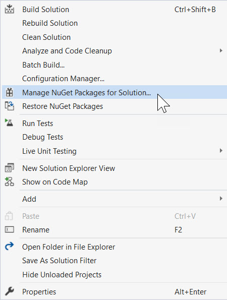
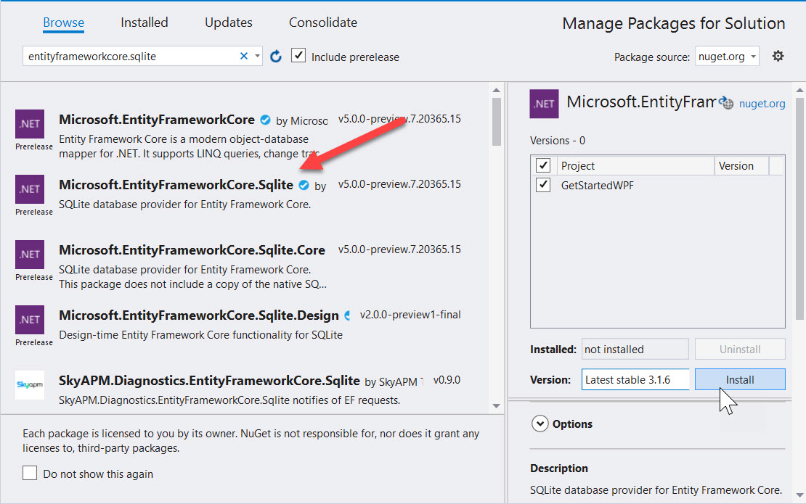
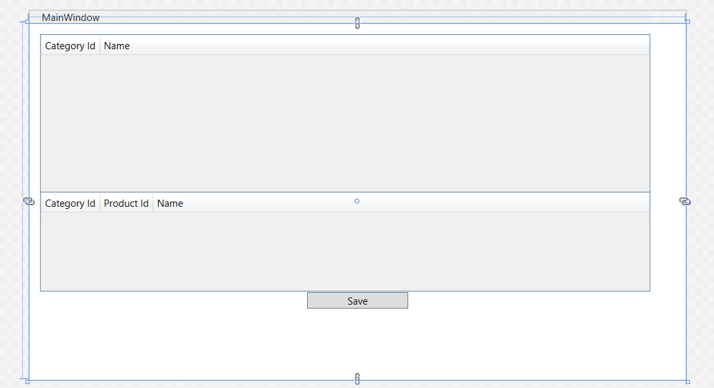
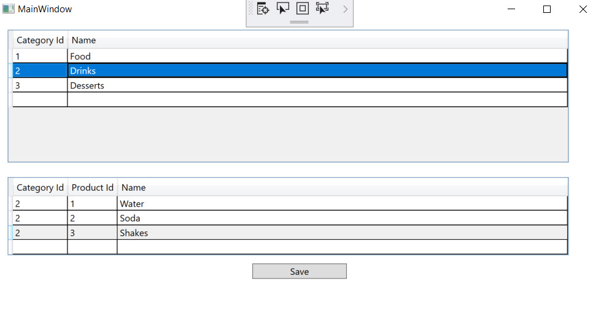

# Getting Started with WPF

This step-by-step walkthrough shows how to bind POCO types to WPF controls in a "main-detail" form. The application uses the Entity Framework APIs to populate objects with data from the database, track changes, and persist data to the database.

The model defines two types that participate in one-to-many relationship: **Category** (principal\\main) and **Product** (dependent\\detail). The WPF data-binding framework enables navigation between related objects: selecting rows in the master view causes the detail view to update with the corresponding child data.

The screen shots and code listings in this walkthrough are taken from Visual Studio 2019 16.6.5.

> [!TIP]
> You can view this article's [sample on GitHub](https://github.com/dotnet/EntityFramework.Docs/tree/main/samples/core/WPF).

## Pre-Requisites

You need to have Visual Studio 2019 16.3 or later installed with the **.NET desktop workload** selected to complete this walkthrough. For more information about installing the latest version of Visual Studio, see [Install Visual Studio](/visualstudio/install/install-visual-studio).

## Create the Application

1. Open Visual Studio
2. On the start window, choose **Create new project**.
3. Search for "WPF," choose **WPF App (.NET Core)** and then choose **Next**.
4. At the next screen, give the project a name, for example, **GetStartedWPF**, and choose **Create.**

## Install the Entity Framework NuGet packages

1. Right-click on the solution and choose **Manage NuGet Packages for Solution...**

    

1. Type `entityframeworkcore.sqlite` in the search box.
1. Select the **Microsoft.EntityFrameworkCore.Sqlite** package.
1. Check the project in the right pane and click **Install**

    

1. Repeat the steps to search for `entityframeworkcore.proxies` and install **Microsoft.EntityFrameworkCore.Proxies**.

> [!NOTE]
> When you installed the Sqlite package, it automatically pulled down the related **Microsoft.EntityFrameworkCore** base package. The **Microsoft.EntityFrameworkCore.Proxies** package provides support for "lazy-loading" data. This means when you have entities with child entities, only the parents are fetched on the initial load. The proxies detect when an attempt to access the child entities is made and automatically loads them on demand.

## Define a Model

In this walkthrough you will implement a model using "code first." This means that EF Core will create the database tables and schema based on the C# classes you define.

Add a new class. Give it the name: `Product.cs` and populate it like this:

**`Product.cs`**

[!code-csharp]

Next, add a class named `Category.cs` and populate it with the following code:

**`Category.cs`**

[!code-csharp]

The **Products** property on the **Category** class and **Category** property on the **Product** class are navigation properties. In Entity Framework, navigation properties provide a way to navigate a relationship between two entity types.

In addition to defining entities, you need to define a class that derives from DbContext and exposes DbSet&lt;TEntity&gt; properties. The DbSet&lt;TEntity&gt; properties let the context know which types you want to include in the model.

An instance of the DbContext derived type manages the entity objects during run time, which includes populating objects with data from a database, change tracking, and persisting data to the database.

Add a new `ProductContext.cs` class to the project with the following definition:

**`ProductContext.cs`**

[!code-csharp]

* The `DbSet` informs EF Core what C# entities should be mapped to the database.
* There are a variety of ways to configure the EF Core `DbContext`. You can read about them in: [Configuring a DbContext](xref:core/dbcontext-configuration/index).
* This example uses the `OnConfiguring` override to specify a Sqlite data file.
* The `UseLazyLoadingProxies` call tells EF Core to implement lazy-loading, so child entities are automatically loaded when accessed from the parent.

Press **CTRL+SHIFT+B** or navigate to **Build &gt; Build Solution** to compile the project.

> [!TIP]
> Learn about the different was to keep your database and EF Core models in sync: [Managing Database Schemas](xref:core/managing-schemas/index).

## Lazy Loading

The **Products** property on the **Category** class and **Category** property on the **Product** class are navigation properties. In Entity Framework Core, navigation properties provide a way to navigate a relationship between two entity types.

EF Core gives you an option of loading related entities from the database automatically the first time you access the navigation property. With this type of loading (called lazy loading), be aware that the first time you access each navigation property a separate query will be executed against the database if the contents are not already in the context.

When using "Plain Old C# Object" (POCO) entity types, EF Core achieves lazy loading by creating instances of derived proxy types during runtime and then overriding virtual properties in your classes to add the loading hook. To get lazy loading of related objects, you must declare navigation property getters as **public** and **virtual** (**Overridable** in Visual Basic), and your class must not be **sealed** (**NotOverridable** in Visual Basic). When using Database First, navigation properties are automatically made virtual to enable lazy loading.

## Bind Object to Controls

Add the classes that are defined in the model as data sources for this WPF application.

1. Double-click **MainWindow.xaml** in Solution Explorer to open the main form
1. Choose the **XAML** tab to edit the XAML.
1. Immediately after the opening `Window` tag, add the following sources to connect to the EF Core entities.

    [!code-xaml]

1. This sets up source for the "parent" categories, and second source for the "detail" products.
1. Next, add the following markup to your XAML after the opening `Grid` tag.

    [!code-xaml]

1. Note that the `CategoryId` is set to `ReadOnly` because it is assigned by the database and cannot be changed.

## Adding a Details Grid

Now that the grid exists to display categories, the details grid can be added to show products. Add this inside the
`Grid` element, after the categories `DataGrid` element.  

**`MainWindow.xaml`**

[!code-xaml]

Finally, add a `Save` button and wire in the click event to `Button_Click`.

[!code-xaml]

Your design view should look like this:

## Add Code that Handles Data Interaction

It's time to add some event handlers to the main window.

1. In the XAML window, click on the **&lt;Window&gt;** element, to select the main window.
1. In the **Properties** window choose **Events** at the top right, then double-click the text box to right of the **Loaded** label.

    

This brings you to the code behind for the form, we'll now edit the code to use the `ProductContext` to perform data access. Update the code as shown below.

The code declares a long-running instance of `ProductContext`. The `ProductContext` object is used to query and save data to the database. The `Dispose()` method on the `ProductContext` instance is then called from the overridden `OnClosing` method. The code comments explain what each step does.

**`MainWindow.xaml.cs`**

[!code-csharp]

> [!NOTE]
> The code uses a call to `EnsureCreated()` to build the database on the first run. This is acceptable for demos, but in production apps you should look at [migrations](xref:core/managing-schemas/migrations/index) to manage your schema. The code also executes synchronously because it uses a local SQLite database. For production scenarios that typically involve a remote server, consider using the asynchronous versions of the `Load` and `SaveChanges` methods.

## Test the WPF Application

Compile and run the application by pressing **F5** or choosing **Debug &gt; Start Debugging**. The database should be automatically created with a file named `products.db`. Enter a category name and hit enter, then add products to the lower grid. Click save and watch the grid refresh with the database provided ids. Highlight a row and hit **Delete** to remove the row. The entity will be deleted when you click **Save**.

## Property Change Notification

This example relies on four steps to synchronize the entities with the UI.

1. The initial call `_context.Categories.Load()` loads the categories data.
1. The lazy-loading proxies load the dependent products data.
1. EF Core's built-in change tracking makes the necessary modifications to entities, including insertions and deletions, when `_context.SaveChanges()` is called.
1. The calls to `DataGridView.Items.Refresh()` force a reload with the newly generated ids.

This works for our getting started sample, but you may require additional code for other scenarios. WPF controls render the UI by reading the fields and properties on your entities. When you edit a value in the user interface (UI), that value is passed to your entity. When you change the value of a property directly on your entity, such as loading it from the database, WPF will not immediately reflect the changes in the UI. The rendering engine must be notified of the changes. The project did this by manually calling `Refresh()`. An easy way to automate this notification is by implementing the [INotifyPropertyChanged](/dotnet/api/system.componentmodel.inotifypropertychanged) interface. WPF components will automatically detect the interface and register for change events. The entity is responsible for raising these events.

> [!TIP]
> To learn more about how to handle changes, read: [How to implement property change notification](/dotnet/framework/wpf/data/how-to-implement-property-change-notification).

## Next Steps

Learn more about [Configuring a DbContext](xref:core/dbcontext-configuration/index).
