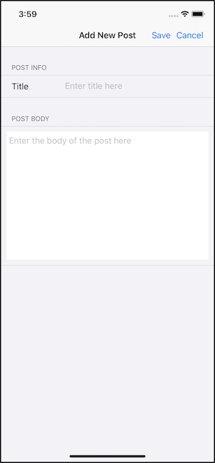

# Getting Started with EF Core and Xamarin

In this tutorial, you create a [Xamarin.Forms](/xamarin/get-started/what-is-xamarin-forms) application that performs data access against a SQLite database using Entity Framework Core.

You can follow the tutorial by using Visual Studio on Windows or Visual Studio for Mac.

> [!TIP]
> You can view this article's [sample on GitHub](https://github.com/dotnet/EntityFramework.Docs/tree/master/samples/core/Xamarin).

## Prerequisites

Install one of the below:

* [Visual Studio 2019 version 16.3 or later](https://www.visualstudio.com/downloads/) with this workload:
  * **Mobile Development with .NET**
* [Visual Studio for Mac](https://visualstudio.microsoft.com/vs/mac/)

This [documentation provides detailed step-by-step installation instructions](/xamarin/get-started/installation) for each platform.

## Download and run the sample project

To run and explore this sample application, download the code on GitHub.

Once downloaded, open the solution file `EFGettingStarted.sln` in Visual Studio or Visual Studio for Mac and run the application on the platform of your choice.

When the app first starts, it will populate the local SQLite database with two entries representing blogs.


Click the **Add** button in the toolbar.

A new page will appear that allows you to enter information about a new blog.


Fill out all the info and click **Save** from the toolbar. The new blog will save to the app's SQLite database and will show in the list.

You can click on one of the blog entries in the list and see any posts for that blog.


Click **Add** in the toolbar.

A page then appears that allows you to fill out information about a new blog post.



Fill out all the information and click **Save** in the toolbar.

The new post will be associated to the blog post you clicked on in a previous step and will save to the app's SQLite database and show in the list.

Go back to the blog list page. And click **Delete All** in the toolbar. All blogs and their corresponding posts will then be deleted from the app's SQLite database.


## Explore the code

The following sections will walk you through the code in the sample project that reads, creates, updates, and deletes data from a SQLite database using EF Core with Xamarin.Forms.

It is assumed that you are familiar with the Xamarin.Forms topics of [displaying data](/xamarin/xamarin-forms/app-fundamentals/data-binding/) and [navigating between pages](/xamarin/xamarin-forms/app-fundamentals/navigation/).

> [!IMPORTANT]
> Entity Framework Core uses reflection to invoke functions which the Xamarin.iOS linker may strip out while in **Release** mode configurations. You can avoid that in one of two ways.
>
> * The first is to add `--linkskip System.Core` to the **Additional mtouch arguments** in the **iOS Build** options.
> * Alternatively set the Xamarin.iOS **Linker behavior** to `Don't Link` in the **iOS Build** options.
> [This article explains more about the Xamarin.iOS linker](/xamarin/ios/deploy-test/linker) including how to set the behavior on Xamarin.iOS. (This approach isn't ideal as it may result in rejection from the store).

## Entity Framework Core NuGet packages

To create Xamarin.Forms apps with EF Core, you install the package for the EF Core database provider(s) you want to target into all of the projects in the Xamarin.Forms solution. This tutorial uses the SQLite provider.

The following NuGet package is needed in each of the projects in the Xamarin.Forms solution.

* `Microsoft.EntityFrameworkCore.Sqlite`

## Model classes

Each table in the SQLite database accessed through EF Core is modeled in a class. In this sample, two classes are used: `Blog` and `Post` which can be found in the `Models` folder.

The model classes are composed only of properties, which model columns in the database.

* **Blog.cs**

  [!code-csharp[](../../../samples/core/Xamarin/EFGetStarted/Models/Blog.cs)]

* The `Posts` property defines a parent-child relationship between `Blog` and `Post`.

* **Post.cs**

  [!code-csharp[](../../../samples/core/Xamarin/EFGetStarted/Models/Post.cs)]

* The `BlogId` and `Blog` properties relate back to the parent `Blog` object for the instance of the `Post`.

## Data context

The `BloggingContext` class is located in the `Services` folder and inherits from the EF Core `DbContext` class. A `DbContext` is used to group together database queries and changes.

  [!code-csharp[](../../../samples/core/Xamarin/EFGetStarted/Services/BloggingContext.cs)]

* Both properties in this class of type `DbSet` are used to operate on the underlying tables representing Blogs and Posts.
* The `SQLitePCL.Batteries_V2.Init()` is needed in the constructor to initiate SQLite on iOS.
* The `OnConfiguring` function sets up the location of the SQLite database on the physical device.

## Create, read, update & delete

The following are some instances in the app where EF Core is used to access SQLite.

### Read

* Return all records.
  * The `OnAppearing` function of `BlogsPage.xaml.cs` returns all `Blog` records and stores them into a `List` variable.

```csharp
using (var blogContext = new BloggingContext())
{
    var theBlogs = blogContext.Blogs.ToList();
}
```

* Return specific records.
  * The `OnAppearing` function of `PostsPage.xaml.cs` returns `Post` records that contain a specific `BlogId`.

```csharp
using (var blogContext = new BloggingContext())
{
    var postList = blogContext.Posts
        .Where(p => p.BlogId == BlogId)
        .ToList();
}
```

### Create

* Insert a new record.
  * The `Save_Clicked` function of `AddBlogPage.xaml.cs` inserts a new `Blog` object into the SQLite database.

```csharp
var blog = new Blog { Url = blogUrl.Text };

using (var blogContext = new BloggingContext())
{
    blogContext.Add(blog);

    await blogContext.SaveChangesAsync();
}
```

### Update

* Update an existing record.
  * The `Save_Clicked` function of `AddPostPage.xaml.cs` updates an existing `Blog` object with a new `Post`.

```csharp
var newPost = new Post
{
    BlogId = BlogId,
    Content = postCell.Text,
    Title = titleCell.Text
};

using (var blogContext = new BloggingContext())
{
    var blog = await blogContext
        .Blogs
        .FirstAsync(b => b.BlogId == BlogId);

    blog.Posts.Add(newPost);

    await blogContext.SaveChangesAsync();
}
```

### Delete

* Delete all records with cascade to child records.
  * The `DeleteAll_Clicked` function of `BlogsPage.xaml.cs` deletes all the `Blog` records in the SQLite database and cascades the deletes to all of the `Blog` child `Post` records.

```csharp
using (var blogContext = new BloggingContext())
{
    blogContext.RemoveRange(blogContext.Blogs);

    await blogContext.SaveChangesAsync();
}
```

## Next steps

In this getting started you have learned how to use a Xamarin.Forms application to access a SQLite database using Entity Framework Core.

Other Entity Framework Core topics of interest to Xamarin developers:

* [Configuring a `DbContext`](xref:core/dbcontext-configuration/index)
* Learn more about [LINQ query expressions](/dotnet/csharp/programming-guide/concepts/linq/basic-linq-query-operations)
* [Configure your model](xref:core/modeling/index) to specify things like [required](xref:core/modeling/entity-properties#required-and-optional-properties) and [maximum length](xref:core/modeling/entity-properties#maximum-length)
