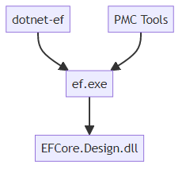
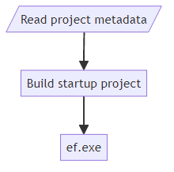
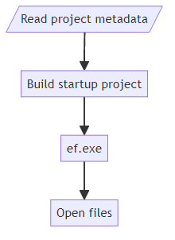

# Design-time Tools Architecture

The design-time tools are the part of EF that bootstrap design-time operations such as scaffolding a model or managing migrations. They are responsible for instantiating DbContext objects for use at design time.



There are two primary entry points: dotnet-ef and the NuGet Package Manager Console (PMC) EF Core tools. Both of these are responsible for gathering information about the user's projects, compiling them, then calling ef.exe which eventually calls the design-time entry points inside EFCore.Design.dll.

## dotnet-ef

dotnet-ef is a [.NET Tool](/dotnet/core/tools/global-tools-how-to-create). The dotnet- prefix allows it to be invoked as part of the main dotnet command: `dotnet ef`.

There are two primary inputs to this command: the startup project and the target project. dotnet-ef is responsible for reading information about these projects then compiling them.



It reads information about the projects by injecting an MSBuild .targets file and calling the custom MSBuild target. The .targets file is compiled into dotnet-ef as an embedded resource. The source is located at [src/dotnet-ef/Resources/EntityFrameworkCore.targets](https://github.com/dotnet/efcore/blob/main/src/dotnet-ef/Resources/EntityFrameworkCore.targets).

It has a bit of logic at the beginning to handle multi-targeting projects. Essentially, it just picks the first target framework and re-invokes itself. After a single target framework has been determined, it gets several MSBuild properties like AssemblyName, OutputPath, RootNamespace, etc.

After we've collected the project information, we compile the startup project. We assume that the target project will also be compiled transitively.

Then dotnet-ef invokes ef.exe.

## PMC Tools

The PMC tools perform a similar function as dotnet-ef, but use Visual Studio APIs instead of MSBuild. They ship as the Microsoft.EntityFrameworkCore.Tools package. They are a special VS-aware [PowerShell module](/powershell/scripting/developer/module/writing-a-windows-powershell-module) that automatically gets loaded into the [NuGet Package Manager Console](/nuget/consume-packages/install-use-packages-powershell) via [init.ps1](https://github.com/dotnet/efcore/blob/main/src/EFCore.Tools/tools/init.ps1). Like dotnet-ef, each command take two primary inputs: the startup project and the target project. But the default values from these are taken from the IDE. The target project defaults to the project specified as the **Default project** inside the Package Manager Console. The startup project defaults to the one specified as the startup project (via **Set as Startup Project**) in Solution Explorer.



The PMC tools gather information about the projects via the [EnvDTE](/dotnet/api/envdte.dte) APIs whenever possible. Occasionally, it needs to drop down to the [Common Project System](https://github.com/microsoft/VSProjectSystem) (CPS) or MSBuild APIs. The modern C# project system implementation source is available under the [dotnet/project-system](https://github.com/dotnet/project-system) project on GitHub.

After collecting the information, it builds the entire solution.

> [!TIP]
> Issue [#9716](https://github.com/dotnet/efcore/issues/9716) is about updating it to only build the startup project.

Then, like dotnet-ef, it invokes ef.exe. The PMC Tools have a bit of extra logic after invoking ef.exe to open any files created by a command to provide a more integrated experience.

## ef.exe

Sometimes referred to as the inside man, ef.exe (for lack of a better name) ships as part of both dotnet-ef and the PMC Tools as a set of binaries. There are various binaries for different target frameworks and platforms.

* tools/
  * net461/
    * any/
      * **ef.exe**
    * win-x86/
      * **ef.exe**
    * win-arm64/
      * **ef.exe**
  * netcoreapp2.0/
    * any/
      * **ef.dll**

The .NET Framework assemblies are only invoked for EF Core 3.1 projects and earlier targeting .NET Framework. By design, you can use the latest version of the tools on projects that use older versions of EF. There is no x64 because the assembly under the any directory targets the AnyCPU platform which runs as x64 on both x64 and arm64 versions of Windows.

The .NET Core 2.0 assembly is used for projects targeting .NET Core or .NET 5 and newer.

The primary responsibility of ef.exe is to load the startup project's output assembly and invoke the design-time entry points inside EFCore.Design.dll.

On .NET Framework, we use a separate AppDomain to load the project assembly passing the project's App/Web.config file to honor and binding redirects added by NuGet or the user.

On .NET Core/5+, we invoke ef.dll using the project's .deps.json and .runtimeconfig.json files to emulate the project's actual runtime and assembly loading behavior.

```dotnetcli
dotnet exec ef.dll --depsfile startupProject.deps.json --runtimeconfig startupProject.runtimeconfig.json
```

> [!TIP]
> Issue [#18840](https://github.com/dotnet/efcore/issues/18840) is primarily about using [AssemblyLoadContext](/dotnet/core/dependency-loading/understanding-assemblyloadcontext) instead of `dotnet exec` to load the user's assembly. This should enable the tools to work with more project types including those targeting Android and iOS.

After everything is set up to be loaded, ef.exe calls into EFCore.Design.dll via reflection and Activator.CreateInstance (or AppDomain.CreateInstance on .NET Framework).

## EFCore.Design.dll

EFCore.Design.dll, or more accurately, Microsoft.EntityFrameworkCore.Design.dll contains all the design-time logic for EF Core. All the entry points are inside the [OperationExecutor](https://github.com/dotnet/efcore/blob/main/src/EFCore.Design/Design/OperationExecutor.cs) class. A lot of the strangeness in the design of this class (MarshallByRefObject, nested types, etc.) stems from needing to invoke it across AppDomains on .NET Framework. A lot could be simplified if this requirement was removed. All of the signatures are weakly typed to enable both forward and backwards compatibility with the tools. Remember that different versions of the tools can be used to invoke projects using different versions of EF.

In addition to the executor, [DbContextActivator](https://github.com/dotnet/efcore/blob/main/src/EFCore.Design/Design/DbContextActivator.cs) is another important type in this assembly. It's used by some of the ASP.NET Web Tools components to instantiate a user's DbContext at design time.

### Creating a DbContext

Before any specific design-time logic runs, a DbContext instance is typically required. The user can specify a simple or fully-qualified, case-insensitive type name for the DbContext, or they can not specify one if there is only a single DbContext type. Either way, we need to discover all the DbContext types before we narrow it down to a single one. The logic for discovering DbContext types live in the FindContextTypes method of [DbContextOperations](https://github.com/dotnet/efcore/blob/main/src/EFCore.Design/Design/Internal/DbContextOperations.cs).

We look for DbContext types using various sources.

* Referenced by IDesignTimeDbContextFactory\<T> implementations in the startup assembly.
* DbContexts added to the application service provider. To get a list of all context types, we get everything registered as `DbContextOptions` and look at the ContextType property. (See below for how we get the application service provider.)
* Types derived from DbContext in both the startup and target assemblies

We also use various ways of instantiating the type. Here they are in order of precedence.

1. Using an IDesignTimeDbContextFactory\<T> implementation
2. Using an IDbContextFactory\<T> from the application service provider
3. Using ActivatorUtilities.CreateInstance

### Finding application services

For the hightest fidelity to runtime behavior, we try to get the DbContext instance directly from the application service provider. We share this logic with the ASP.NET Core tooling. It's maintained as part of [dotnet/runtime](https://github.com/dotnet/runtime) project on GitHub under the [Microsoft.Extensions.HostFactoryResolver](https://github.com/dotnet/runtime/tree/main/src/libraries/Microsoft.Extensions.HostFactoryResolver) directory.

In a nutshell, here are some of the strategies it uses.

* Look for a method named BuildWebHost, CreateWebHostBuilder, or CreateHostBuilder next to the assembly entry point
  * Build the host and get the services from the Services property
* Call the assembly entry point
  * Intercept the services while building the host and terminate before actually starting the host

### Design-time services

In addition to the application services and the internal DbContext services, there is a third set of [design-time services](xref:core/cli/services). These aren't added to internal service provider since they're never needed at runtime. The design-time services are built by [DesignTimeServicesBuilder](https://github.com/dotnet/efcore/blob/main/src/EFCore.Design/Design/Internal/DesignTimeServicesBuilder.cs). There are two main path--one with a context instance and one without. The one without is primarily used when scaffolding a new DbContext. There are several extensibility points here to allow the user, providers, and extensions to override and customize the services.

The user can customize services by adding an implementation of `IDesignTimeServices` to the startup assembly.

Providers can customize services by adding the `DesignTimeProviderServices` attribute to their assembly. This points to an implementation of IDesignTimeServices.

Extensions can customize services by adding `DesignTimeServicesReference` attributes to the target or startup assembly. If the attribute specifies a provider, it will only be added when that provider is in use.

### Logging and exceptions

After instantiating the DbContext, we wire up its logging to the tool's output. This enables output to be generated from the runtime. Any unhandled exceptions will also be written to the output. There is a special exception type `OperationException` that can be thrown to gracefully terminate the tools and show a simple error message without a stack trace.
