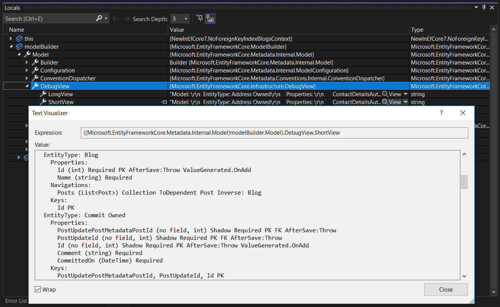

# Creating and Configuring a Model

EF Core uses a metadata _model_ to describe how the application's entity types are mapped to the underlying database. This model is built using a set of [_conventions_](#built-in-conventions) - heuristics that look for common patterns. The model can then be customized using [mapping attributes (also known as _data annotations_)](#use-data-annotations-to-configure-a-model) and/or calls to the <xref:Microsoft.EntityFrameworkCore.ModelBuilder> methods [(also known as _fluent API_)](#use-fluent-api-to-configure-a-model) in <xref:Microsoft.EntityFrameworkCore.DbContext.OnModelCreating*>, both of which will override the configuration performed by conventions.

Most configuration can be applied to a model targeting any data store. Providers may also enable configuration that is specific to a particular data store and they can also ignore configuration that is not supported or not applicable. For documentation on provider-specific configuration see the [Database providers](xref:core/providers/index) section.

> [!TIP]
> You can view this article's [samples](https://github.com/dotnet/EntityFramework.Docs/tree/main/samples/core/Modeling/) on GitHub.

## Use fluent API to configure a model

You can override the `OnModelCreating` method in your derived context and use the fluent API to configure your model. This is the most powerful method of configuration and allows configuration to be specified without modifying your entity classes. Fluent API configuration has the highest precedence and will override conventions and data annotations. The configuration is applied in the order the methods are called and if there are any conflicts the latest call will override previously specified configuration.

[!code-csharp[Main](../../../samples/core/Modeling/EntityProperties/FluentAPI/Required.cs?highlight=12-14)]

> [!TIP]
> To apply the same configuration to multiple objects in the model see [bulk configuration](xref:core/modeling/bulk-configuration).

### Grouping configuration

To reduce the size of the `OnModelCreating` method all configuration for an entity type can be extracted to a separate class implementing <xref:Microsoft.EntityFrameworkCore.IEntityTypeConfiguration`1>.

[!code-csharp[Main](../../../samples/core/Modeling/Misc/EntityTypeConfiguration.cs?Name=IEntityTypeConfiguration)]

Then just invoke the `Configure` method from `OnModelCreating`.

[!code-csharp[Main](../../../samples/core/Modeling/Misc/EntityTypeConfiguration.cs?Name=ApplyIEntityTypeConfiguration)]

#### Applying all configurations in an assembly

It is possible to apply all configuration specified in types implementing `IEntityTypeConfiguration` in a given assembly.

[!code-csharp[Main](../../../samples/core/Modeling/Misc/EntityTypeConfiguration.cs?Name=ApplyConfigurationsFromAssembly)]

> [!NOTE]
> The order in which the configurations will be applied is undefined, therefore this method should only be used when the order doesn't matter.

#### Using `EntityTypeConfigurationAttribute` on entity types

Rather than explicitly calling `Configure`, an <xref:Microsoft.EntityFrameworkCore.EntityTypeConfigurationAttribute> can instead be placed on the entity type such that EF Core can find and use appropriate configuration. For example:

<!--
[EntityTypeConfiguration(typeof(BookConfiguration))]
public class Book
{
    public int Id { get; set; }
    public string Title { get; set; }
    public string Isbn { get; set; }
}
-->
[!code-csharp[BookEntityType](../../../samples/core/Miscellaneous/NewInEFCore6/EntityTypeConfigurationAttributeSample.cs?name=BookEntityType)]

This attribute means that EF Core will use the specified `IEntityTypeConfiguration` implementation whenever the `Book` entity type is included in a model. The entity type is included in a model using one of the normal mechanisms. For example, by creating a <xref:Microsoft.EntityFrameworkCore.DbSet`1> property for the entity type:

<!--
public class BooksContext : DbContext
{
    public DbSet<Book> Books { get; set; }

    //...
-->
[!code-csharp[DbContext](../../../samples/core/Miscellaneous/NewInEFCore6/EntityTypeConfigurationAttributeSample.cs?name=DbContext)]

Or by registering it in <xref:Microsoft.EntityFrameworkCore.DbContext.OnModelCreating*>:

```csharp
protected override void OnModelCreating(ModelBuilder modelBuilder)
{
    modelBuilder.Entity<Book>();
}
```

> [!NOTE]
> `EntityTypeConfigurationAttribute` types will not be automatically discovered in an assembly. Entity types must be added to the model before the attribute will be discovered on that entity type.

## Use data annotations to configure a model

You can also apply certain attributes (known as _Data Annotations_) to your classes and properties. Data annotations will override conventions, but will be overridden by Fluent API configuration.

[!code-csharp[Main](../../../samples/core/Modeling/EntityProperties/DataAnnotations/Annotations.cs)]

## Built-in conventions

EF Core includes many model building conventions that are enabled by default. You can find all of them in the list of classes that implement the <xref:Microsoft.EntityFrameworkCore.Metadata.Conventions.IConvention> interface. However, that list doesn't include conventions introduced by third-party database providers and plugins.

Applications can remove or replace any of these conventions, as well as add new [custom conventions](xref:core/modeling/bulk-configuration#conventions) that apply configuration for patterns that are not recognized by EF out of the box.

> [!TIP]
> The code shown below comes from [ModelBuildingConventionsSample.cs](https://github.com/dotnet/EntityFramework.Docs/tree/main/samples/core/Modeling/BulkConfiguration/ModelBuildingConventionsSample.cs).

### Removing an existing convention

Sometimes one of the built-in conventions may not appropriate for your application, in which case it can be removed.

> [!TIP]
> If your model doesn't use mapping attributes (aka data annotations) for configuration, then all conventions with the name ending in `AttributeConvention` can be safely removed to speed up model building.

#### Example: Don't create indexes for foreign key columns

It usually makes sense to create indexes for foreign key (FK) columns, and hence there is a built-in convention for this: <xref:Microsoft.EntityFrameworkCore.Metadata.Conventions.ForeignKeyIndexConvention>. Looking at the model [debug view](#debug-view) for a `Post` entity type with relationships to `Blog` and `Author`, we can see two indexes are created--one for the `BlogId` FK, and the other for the `AuthorId` FK.

```text
  EntityType: Post
    Properties:
      Id (int) Required PK AfterSave:Throw ValueGenerated.OnAdd
      AuthorId (no field, int?) Shadow FK Index
      BlogId (no field, int) Shadow Required FK Index
    Navigations:
      Author (Author) ToPrincipal Author Inverse: Posts
      Blog (Blog) ToPrincipal Blog Inverse: Posts
    Keys:
      Id PK
    Foreign keys:
      Post {'AuthorId'} -> Author {'Id'} ToDependent: Posts ToPrincipal: Author ClientSetNull
      Post {'BlogId'} -> Blog {'Id'} ToDependent: Posts ToPrincipal: Blog Cascade
    Indexes:
      AuthorId
      BlogId
```

However, indexes have overhead, and it may not always be appropriate to create them for all FK columns. To achieve this, the `ForeignKeyIndexConvention` can be removed when building the model:

```csharp
protected override void ConfigureConventions(ModelConfigurationBuilder configurationBuilder)
{
    configurationBuilder.Conventions.Remove(typeof(ForeignKeyIndexConvention));
}
```

Looking at the debug view of the model for `Post` now, we see that the indexes on FKs have not been created:

```text
  EntityType: Post
    Properties:
      Id (int) Required PK AfterSave:Throw ValueGenerated.OnAdd
      AuthorId (no field, int?) Shadow FK
      BlogId (no field, int) Shadow Required FK
    Navigations:
      Author (Author) ToPrincipal Author Inverse: Posts
      Blog (Blog) ToPrincipal Blog Inverse: Posts
    Keys:
      Id PK
    Foreign keys:
      Post {'AuthorId'} -> Author {'Id'} ToDependent: Posts ToPrincipal: Author ClientSetNull
      Post {'BlogId'} -> Blog {'Id'} ToDependent: Posts ToPrincipal: Blog Cascade
```

When desired, indexes can still be explicitly created for foreign key columns, either using the <xref:Microsoft.EntityFrameworkCore.IndexAttribute> or with configuration in `OnModelCreating`.

## Debug view

The model builder debug view can be accessed in the debugger of your IDE. For example, with Visual Studio:



It can also be accessed directly from code, for example to send the debug view to the console:

```csharp
Console.WriteLine(context.Model.ToDebugString());
```

The debug view has a short form and a long form. The long form also includes all the annotations, which could be useful if you need to view relational or provider-specific metadata. The long view can be accessed from code as well:

```csharp
Console.WriteLine(context.Model.ToDebugString(MetadataDebugStringOptions.LongDefault));
```
