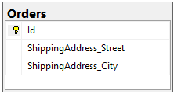
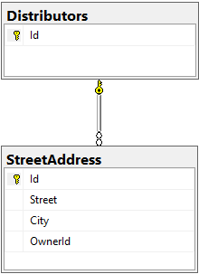
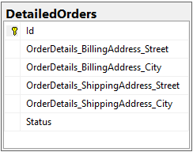

# Owned Entity Types

EF Core allows you to model entity types that can only ever appear on navigation properties of other entity types. These are called _owned entity types_. The entity containing an owned entity type is its _owner_.

Owned entities are essentially a part of the owner and cannot exist without it, they are conceptually similar to [aggregates](https://martinfowler.com/bliki/DDD_Aggregate.html). This means that the owned entity is by definition on the dependent side of the relationship with the owner.

## Configuring types as owned

In most providers, entity types are never configured as owned by convention - you must explicitly use the `OwnsOne` method in `OnModelCreating` or annotate the type with `OwnedAttribute` to configure the type as owned. The Azure Cosmos DB provider is an exception to this. Because Azure Cosmos DB is a document database, the provider configures all related entity types as owned by default.

In this example, `StreetAddress` is a type with no identity property. It is used as a property of the Order type to specify the shipping address for a particular order.

We can use the `OwnedAttribute` to treat it as an owned entity when referenced from another entity type:

[!code-csharp[StreetAddress](../../../samples/core/Modeling/OwnedEntities/StreetAddress.cs?name=StreetAddress)]

[!code-csharp[Order](../../../samples/core/Modeling/OwnedEntities/Order.cs?name=Order)]

It is also possible to use the `OwnsOne` method in `OnModelCreating` to specify that the `ShippingAddress` property is an Owned Entity of the `Order` entity type and to configure additional facets if needed.

[!code-csharp[OwnsOne](../../../samples/core/Modeling/OwnedEntities/OwnedEntityContext.cs?name=OwnsOne)]

If the `ShippingAddress` property is private in the `Order` type, you can use the string version of the `OwnsOne` method:

[!code-csharp[OwnsOneString](../../../samples/core/Modeling/OwnedEntities/OwnedEntityContext.cs?name=OwnsOneString)]

The model above is mapped to the following database schema:

See the [full sample project](https://github.com/dotnet/EntityFramework.Docs/tree/main/samples/core/Modeling/OwnedEntities) for more context.

> [!TIP]
> The owned entity type can be marked as required, see [Required one-to-one dependents](xref:core/modeling/relationships/navigations#required-navigations) for more information.

## Implicit keys

Owned types configured with `OwnsOne` or discovered through a reference navigation always have a one-to-one relationship with the owner, therefore they don't need their own key values as the foreign key values are unique. In the previous example, the `StreetAddress` type does not need to define a key property.

In order to understand how EF Core tracks these objects, it is useful to know that a primary key is created as a [shadow property](xref:core/modeling/shadow-properties) for the owned type. The value of the key of an instance of the owned type will be the same as the value of the key of the owner instance.

## Collections of owned types

To configure a collection of owned types use `OwnsMany` in `OnModelCreating`.

Owned types need a primary key. If there are no good candidates properties on the .NET type, EF Core can try to create one. However, when owned types are defined through a collection, it isn't enough to just create a shadow property to act as both the foreign key into the owner and the primary key of the owned instance, as we do for `OwnsOne`: there can be multiple owned type instances for each owner, and hence the key of the owner isn't enough to provide a unique identity for each owned instance.

The two most straightforward solutions to this are:

- Defining a surrogate primary key on a new property independent of the foreign key that points to the owner. The contained values would need to be unique across all owners (e.g. if Parent {1} has Child {1}, then Parent {2} cannot have Child {1}), so the value doesn't have any inherent meaning. Since the foreign key is not part of the primary key its values can be changed, so you could move a child from one parent to another one, however this usually goes against aggregate semantics.
- Using the foreign key and an additional property as a composite key. The additional property value now only needs to be unique for a given parent (so if Parent {1} has Child {1,1} then Parent {2} can still have Child {2,1}). By making the foreign key part of the primary key the relationship between the owner and the owned entity becomes immutable and reflects aggregate semantics better. This is what EF Core does by default.

In this example we'll use the `Distributor` class.

[!code-csharp[Distributor](../../../samples/core/Modeling/OwnedEntities/Distributor.cs?name=Distributor)]

By default the primary key used for the owned type referenced through the `ShippingCenters` navigation property will be `("DistributorId", "Id")` where `"DistributorId"` is the FK and `"Id"` is a unique `int` value.

To configure a different primary key call `HasKey`.

[!code-csharp[OwnsMany](../../../samples/core/Modeling/OwnedEntities/OwnedEntityContext.cs?name=OwnsMany)]

The model above is mapped to the following database schema:

## Mapping owned types with table splitting

When using relational databases, by default reference owned types are mapped to the same table as the owner. This requires splitting the table in two: some columns will be used to store the data of the owner, and some columns will be used to store data of the owned entity. This is a common feature known as [table splitting](xref:core/modeling/table-splitting).

By default, EF Core will name the database columns for the properties of the owned entity type following the pattern _Navigation_OwnedEntityProperty_. Therefore the `StreetAddress` properties will appear in the 'Orders' table with the names 'ShippingAddress_Street' and 'ShippingAddress_City'.

You can use the `HasColumnName` method to rename those columns.

[!code-csharp[ColumnNames](../../../samples/core/Modeling/OwnedEntities/OwnedEntityContext.cs?name=ColumnNames)]

> [!NOTE]
> Most of the normal entity type configuration methods like [Ignore](/dotnet/api/microsoft.entityframeworkcore.metadata.builders.ownednavigationbuilder.ignore) can be called in the same way.

## Sharing the same .NET type among multiple owned types

An owned entity type can be of the same .NET type as another owned entity type, therefore the .NET type may not be enough to identify an owned type.

In those cases, the property pointing from the owner to the owned entity becomes the _defining navigation_ of the owned entity type. From the perspective of EF Core, the defining navigation is part of the type's identity alongside the .NET type.

For example, in the following class `ShippingAddress` and `BillingAddress` are both of the same .NET type, `StreetAddress`.

[!code-csharp[OrderDetails](../../../samples/core/Modeling/OwnedEntities/OrderDetails.cs?name=OrderDetails)]

In order to understand how EF Core will distinguish tracked instances of these objects, it may be useful to think that the defining navigation has become part of the key of the instance alongside the value of the key of the owner and the .NET type of the owned type.

## Nested owned types

In this example `OrderDetails` owns `BillingAddress` and `ShippingAddress`, which are both `StreetAddress` types. Then `OrderDetails` is owned by the `DetailedOrder` type.

[!code-csharp[DetailedOrder](../../../samples/core/Modeling/OwnedEntities/DetailedOrder.cs?name=DetailedOrder)]

[!code-csharp[OrderStatus](../../../samples/core/Modeling/OwnedEntities/OrderStatus.cs?name=OrderStatus)]

Each navigation to an owned type defines a separate entity type with completely independent configuration.

In addition to nested owned types, an owned type can reference a regular entity which can be either the owner or a different entity as long as the owned entity is on the dependent side. This capability sets owned entity types apart from complex types in EF6.

[!code-csharp[OrderDetails](../../../samples/core/Modeling/OwnedEntities/OrderDetails.cs?name=OrderDetails)]

## Configuring owned types

It is possible to chain the `OwnsOne` method in a fluent call to configure this model:

[!code-csharp[OwnsOneNested](../../../samples/core/Modeling/OwnedEntities/OwnedEntityContext.cs?name=OwnsOneNested)]

Notice the `WithOwner` call used to define the navigation property pointing back at the owner. To define a navigation to the owner entity type that's not part of the ownership relationship `WithOwner()` should be called without any arguments.

It is also possible to achieve this result using `OwnedAttribute` on both `OrderDetails` and `StreetAddress`.

In addition, notice the `Navigation` call. Navigation properties to owned types can be further configured [as for non-owned navigation properties](xref:core/modeling/relationships/navigations#required-navigations).

The model above is mapped to the following database schema:

## Storing owned types in separate tables

Also unlike EF6 complex types, owned types can be stored in a separate table from the owner. In order to override the convention that maps an owned type to the same table as the owner, you can simply call `ToTable` and provide a different table name. The following example will map `OrderDetails` and its two addresses to a separate table from `DetailedOrder`:

[!code-csharp[OwnsOneTable](../../../samples/core/Modeling/OwnedEntities/OwnedEntityContext.cs?name=OwnsOneTable)]

It is also possible to use the `TableAttribute` to accomplish this, but note that this would fail if there are multiple navigations to the owned type since in that case multiple entity types would be mapped to the same table.

## Querying owned types

When querying the owner the owned types will be included by default. It is not necessary to use the `Include` method, even if the owned types are stored in a separate table. Based on the model described before, the following query will get `Order`, `OrderDetails` and the two owned `StreetAddresses` from the database:

[!code-csharp[DetailedOrderQuery](../../../samples/core/Modeling/OwnedEntities/Program.cs?name=DetailedOrderQuery)]

## Limitations

Some of these limitations are fundamental to how owned entity types work, but some others are restrictions that we may be able to remove in future releases:

### By-design restrictions

- You cannot create a `DbSet<T>` for an owned type.
- You cannot call `Entity<T>()` with an owned type on `ModelBuilder`.
- Instances of owned entity types cannot be shared by multiple owners (this is a well-known scenario for value objects that cannot be implemented using owned entity types).

### Current shortcomings

- Owned entity types cannot have inheritance hierarchies

### Shortcomings in previous versions

- In EF Core 2.x reference navigations to owned entity types cannot be null unless they are explicitly mapped to a separate table from the owner.
- In EF Core 3.x the columns for owned entity types mapped to the same table as the owner are always marked as nullable.
