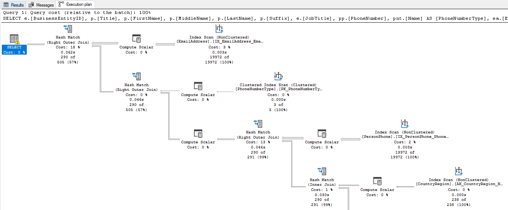

# Performance Diagnosis

This section discusses ways for detecting performance issues in your EF application, and once a problematic area has been identified, how to further analyze them to identify the root problem. It's important to carefully diagnose and investigate any problems before jumping to any conclusions, and to avoid assuming where the root of the issue is.

## Identifying slow database commands via logging

At the end of the day, EF prepares and executes commands to be executed against your database; with relational database, that means executing SQL statements via the ADO.NET database API. If a certain query is taking too much time (e.g. because an index is missing), this can be seen discovered by inspecting command execution logs and observing how long they actually take.

EF makes it very easy to capture command execution times, via either [simple logging](xref:core/logging-events-diagnostics/simple-logging) or [Microsoft.Extensions.Logging](xref:core/logging-events-diagnostics/extensions-logging):

### [Simple logging](#tab/simple-logging)

[!code-csharp[Main](../../../samples/core/Performance/Other/BloggingContext.cs#SimpleLogging)]

### [Microsoft.Extensions.Logging](#tab/microsoft-extensions-logging)

[!code-csharp[Main](../../../samples/core/Performance/Other/ExtensionsLoggingContext.cs#ExtensionsLogging)]

***

When the logging level is set at `LogLevel.Information`, EF emits a log message for each command execution with the time taken:

```log
info: 06/12/2020 09:12:36.117 RelationalEventId.CommandExecuted[20101] (Microsoft.EntityFrameworkCore.Database.Command)
      Executed DbCommand (4ms) [Parameters=[], CommandType='Text', CommandTimeout='30']
      SELECT [b].[Id], [b].[Name]
      FROM [Blogs] AS [b]
      WHERE [b].[Name] = N'foo'
```

The above command took 4 milliseconds. If a certain command takes more than expected, you've found a possible culprit for a performance issue, and can now focus on it to understand why it's running slowly. Command logging can also reveal cases where unexpected database roundtrips are being made; this would show up as multiple commands where only one is expected.

> [!WARNING]
> Leaving command execution logging enabled in your production environment is usually a bad idea. The logging itself slows down your application, and may quickly create huge log files which can fill up your server's disk. It's recommended to only keep logging on for a short interval of time to gather data - while carefully monitoring your application - or to capture logging data on a pre-production system.

## Correlating database commands to LINQ queries

One problem with command execution logging is that it's sometimes difficult to correlate SQL queries and LINQ queries: the SQL commands executed by EF can look very different from the LINQ queries from which they were generated. To help with this difficulty, you may want to use EF's [query tags](xref:core/querying/tags) feature, which allows you to inject a small, identifying comment into the SQL query:

[!code-csharp[Main](../../../samples/core/Querying/Tags/Program.cs#BasicQueryTag)]

The tag shows up in the logs:

```sql
-- This is my spatial query!

SELECT TOP(@__p_1) [p].[Id], [p].[Location]
FROM [People] AS [p]
ORDER BY [p].[Location].STDistance(@__myLocation_0) DESC
```

It's often worth tagging the major queries of an application in this way, to make the command execution logs more immediately readable.

## Other interfaces for capturing performance data

There are various alternatives to EF's logging feature for capturing command execution times, which may be more powerful. Databases typically come with their own tracing and performance analysis tools, which usually provide much richer, database-specific information beyond simple execution times; the actual setup, capabilities and usage vary considerably across databases.

For example, [SQL Server Management Studio](/sql/ssms/download-sql-server-management-studio-ssms) is a powerful client that can connect to your SQL Server  instance and provide valuable management and performance information. It's beyond the scope of this section to go into the details, but two capabilities worth mentioning are the [Activity Monitor](/sql/relational-databases/performance-monitor/open-activity-monitor-sql-server-management-studio), which provides a live dashboard of server activity (including the most expensive queries), and the [Extended Events (XEvent)](/sql/relational-databases/extended-events/quick-start-extended-events-in-sql-server) feature, which allows defining arbitrary data capture sessions which can be tailored to your exact needs. [The SQL Server documentation on monitoring](/sql/relational-databases/performance/monitor-and-tune-for-performance) provides more information on these features, as well as others.

Another approach for capturing performance data is to collect information automatically emitted by either EF or the database driver via the `DiagnosticSource` interface, and then analyze that data or display it on a dashboard. If you are using Azure, then [Azure Application Insights](/azure/azure-monitor/learn/tutorial-performance) provides such powerful monitoring out of the box, integrating database performance and query execution times in the analysis of how quickly your web requests are being served. More information on this is available in the [Application Insights performance tutorial](/azure/azure-monitor/learn/tutorial-performance), and in the [Azure SQL analytics page](/azure/azure-monitor/insights/azure-sql).

## Inspecting query execution plans

Once you've pinpointed a problematic query that requires optimization, the next step is usually analyzing the query's *execution plan*. When databases receive a SQL statement, they typically produce a plan of how that plan is to be executed; this sometimes requires complicated decision-making based on which indexes have been defined, how much data exists in tables, etc. (incidentally, the plan itself should usually be cached at the server for optimal performance). Relational databases typically provide a way for users to see the query plan, along with calculated costing for different parts of the query; this is invaluable for improving your queries.

To get started on SQL Server, see the documentation on [query execution plans](/sql/relational-databases/performance/execution-plans). The typical analysis workflow would be to use [SQL Server Management Studio](/sql/relational-databases/performance/display-an-actual-execution-plan), pasting the SQL of a slow query identified via one of the means above, and [producing a graphical execution plan](/sql/relational-databases/performance/display-an-actual-execution-plan):



While execution plans may seem complicated at first, it's worth spending a bit of time getting familiar with them. It's particularly important to note the costs associated with each node of the plan, and to identify how indexes are used (or not) in the various nodes.

While the above information is specific to SQL Server, other databases typically provide the same kind of tools with similar visualization.

> [!IMPORTANT]
> Databases sometimes generate different query plans depending on actual data in the database. For example, if a table contains only a few rows, a database may choose not to use an index on that table, but to perform a full table scan instead. If analyzing query plans on a test database, always make sure it contains data that is similar to your production system.

## Metrics

The above sections focused on how to get information about your commands, and how these commands are executed in the database. In addition to that, EF exposes a set of *metrics* which provide more lower-level information on what's happening inside EF itself, and how your application is using it. These metrics can be very useful for diagnosing specific performance issues and performance anomalies, such as [query caching issues](xref:core/performance/advanced-performance-topics#dynamically-constructed-queries) which cause constant recompilation, undisposed DbContext leaks, and others.

See the dedicated page on [EF's metrics](xref:core/logging-events-diagnostics/metrics) for more information.

## Benchmarking with EF Core

At the end of the day, you sometimes need to know whether a particular way of writing or executing a query is faster than another. It's important to never assume or speculate the answer, and it's extremely easy to put together a quick benchmark to get the answer. When writing benchmarks, it's strongly recommended to use the well-known [BenchmarkDotNet](https://benchmarkdotnet.org/index.html) library, which handles many pitfalls users encounter when trying to write their own benchmarks: have you performed some warmup iterations? How many iterations does your benchmark actually run, and why? Let's take a look at what a benchmark with EF Core looks like.

> [!TIP]
> The full benchmark project for the source below is available [here](https://github.com/dotnet/EntityFramework.Docs/tree/main/samples/core/Benchmarks/AverageBlogRanking.cs). You are encouraged to copy it and use it as a template for your own benchmarks.

As a simple benchmark scenario, let's compare the following different methods of calculating the average ranking of all Blogs in our database:

* Load all entities, sum up their individual rankings, and calculate the average.
* The same as above, only use a non-tracking query. This should be faster, since identity resolution isn't performed, and the entities aren't snapshotted for the purposes of change tracking.
* Avoid loading the entire Blog entity instances at all, by projecting out the ranking only. The saves us from transferring the other, unneeded columns of the Blog entity type.
* Calculate the average in the database by making it part of the query. This should be the fastest way, since everything is calculated in the database and only the result is transferred back to the client.

With BenchmarkDotNet, you write the code to be benchmarked as a simple method - just like a unit test - and BenchmarkDotNet automatically runs each method for a sufficient number of iterations, reliably measuring how long it takes and how much memory is allocated. Here are the different methods ([the full benchmark code can be seen here](https://github.com/dotnet/EntityFramework.Docs/tree/main/samples/core/Benchmarks/AverageBlogRanking.cs)):

### [Load entities](#tab/load-entities)

[!code-csharp[Main](../../../samples/core/Benchmarks/AverageBlogRanking.cs?name=LoadEntities)]

### [Load entities, no tracking](#tab/load-entities-no-tracking)

[!code-csharp[Main](../../../samples/core/Benchmarks/AverageBlogRanking.cs?name=LoadEntitiesNoTracking)]

### [Project only ranking](#tab/project-only-ranking)

[!code-csharp[Main](../../../samples/core/Benchmarks/AverageBlogRanking.cs?name=ProjectOnlyRanking)]

### [Calculate in database](#tab/calculate-in-database)

[!code-csharp[Main](../../../samples/core/Benchmarks/AverageBlogRanking.cs?name=CalculateInDatabase)]

***

The results are below, as printed by BenchmarkDotNet:

|                 Method |       Mean |    Error |   StdDev |     Median | Ratio | RatioSD |    Gen 0 |   Gen 1 | Gen 2 |  Allocated |
|----------------------- |-----------:|---------:|---------:|-----------:|------:|--------:|---------:|--------:|------:|-----------:|
|           LoadEntities | 2,860.4 us | 54.31 us | 93.68 us | 2,844.5 us |  4.55 |    0.33 | 210.9375 | 70.3125 |     - | 1309.56 KB |
| LoadEntitiesNoTracking | 1,353.0 us | 21.26 us | 18.85 us | 1,355.6 us |  2.10 |    0.14 |  87.8906 |  3.9063 |     - |  540.09 KB |
|     ProjectOnlyRanking |   910.9 us | 20.91 us | 61.65 us |   892.9 us |  1.46 |    0.14 |  41.0156 |  0.9766 |     - |  252.08 KB |
|    CalculateInDatabase |   627.1 us | 14.58 us | 42.54 us |   626.4 us |  1.00 |    0.00 |   4.8828 |       - |     - |   33.27 KB |

> [!NOTE]
> As the methods instantiate and dispose the context within the method, these operations are counted for the benchmark, although strictly speaking they are not part of the querying process. This should not matter if the goal is to compare two alternatives to one another (since the context instantiation and disposal are the same), and gives a more holistic measurement for the entire operation.

One limitation of BenchmarkDotNet is that it measures simple, single-thread performance of the methods you provide, and is therefore not well-suited for benchmarking concurrent scenarios.

> [!IMPORTANT]
> Always make sure to have data in your database that is similar to production data when benchmarking, otherwise the benchmark results may not represent actual performance in production.
