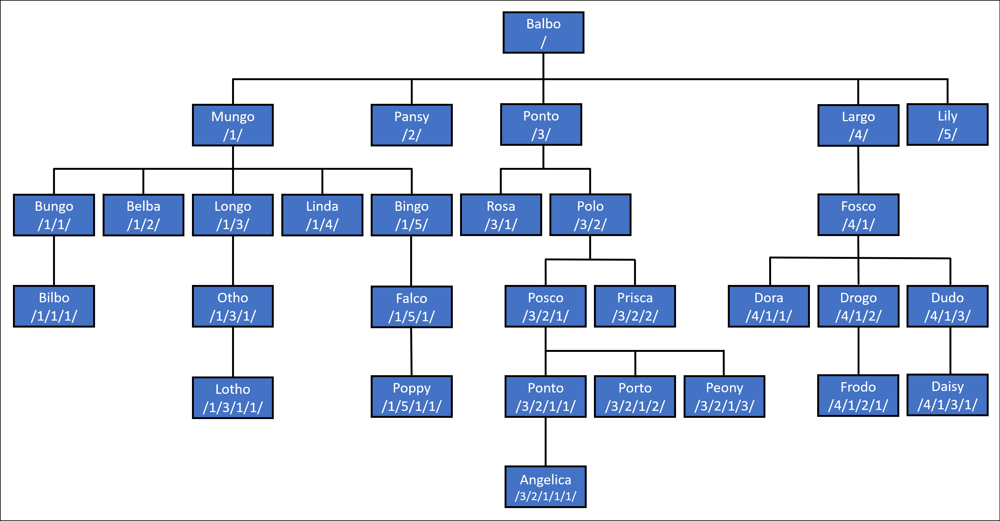

# Hierarchical Data in the SQL Server EF Core Provider

> [!NOTE]
> This feature was added in EF Core 8.0.

Azure SQL and SQL Server have a special data type called [`hierarchyid`](/sql/t-sql/data-types/hierarchyid-data-type-method-reference) that is used to store [hierarchical data](/sql/relational-databases/hierarchical-data-sql-server). In this case, "hierarchical data" essentially means data that forms a tree structure, where each item can have a parent and/or children. Examples of such data are:

- An organizational structure
- A file system
- A set of tasks in a project
- A taxonomy of language terms
- A graph of links between Web pages

The database is then able to run queries against this data using its hierarchical structure. For example, a query can find ancestors and dependents of given items, or find all items at a certain depth in the hierarchy.

## Using HierarchyId in .NET and EF Core

At the lowest level, the [Microsoft.SqlServer.Types](https://www.nuget.org/packages/Microsoft.SqlServer.Types) NuGet package includes a type called `SqlHierarchyId`. While this type supports working hierarchyid values, it is a bit cumbersome to work with in LINQ.

At the next level, a new [Microsoft.EntityFrameworkCore.SqlServer.Abstractions](https://www.nuget.org/packages/Microsoft.EntityFrameworkCore.SqlServer.Abstractions) package has been introduced, which includes a higher-level `HierarchyId` type intended for use in entity types.

> [!TIP]
> The `HierarchyId` type is more idiomatic to the norms of .NET than `SqlHierarchyId`, which is instead modeled after how .NET Framework types are hosted inside the SQL Server database engine.  `HierarchyId` is designed to work with EF Core, but it can also be used outside of EF Core in other applications. The `Microsoft.EntityFrameworkCore.SqlServer.Abstractions` package doesn't reference any other packages, and so has minimal impact on deployed application size and dependencies.

Use of `HierarchyId` for EF Core functionality such as queries and updates requires the [Microsoft.EntityFrameworkCore.SqlServer.HierarchyId](https://www.nuget.org/packages/Microsoft.EntityFrameworkCore.SqlServer.HierarchyId) package. This package brings in `Microsoft.EntityFrameworkCore.SqlServer.Abstractions` and `Microsoft.SqlServer.Types` as transitive dependencies, and so is often the only package needed.

### [.NET Core CLI](#tab/netcore-cli)

```dotnetcli
dotnet add package Microsoft.EntityFrameworkCore.SqlServer.HierarchyId
```

### [Visual Studio](#tab/visual-studio)

- **Tools > NuGet Package Manager > Package Manager Console**
- Run the following commands:

  ```powershell
  Install-Package Microsoft.EntityFrameworkCore.SqlServer.HierarchyId
  ```

Tip: You can also install packages by right-clicking on the project and selecting **Manage NuGet Packages**

---

Once the package is installed, use of `HierarchyId` is enabled by calling `UseHierarchyId` as part of the application's call to `UseSqlServer`. For example:

```csharp
options.UseSqlServer(
    connectionString,
    x => x.UseHierarchyId());
```

#### Modeling hierarchies

The `HierarchyId` type can be used for properties of an entity type. For example, assume we want to model the paternal family tree of some fictional [halflings](https://en.wikipedia.org/wiki/Halfling). In the entity type for `Halfling`, a `HierarchyId` property can be used to locate each halfling in the family tree.

<!--
    public class Halfling
    {
        public Halfling(HierarchyId pathFromPatriarch, string name, int? yearOfBirth = null)
        {
            PathFromPatriarch = pathFromPatriarch;
            Name = name;
            YearOfBirth = yearOfBirth;
        }

        public int Id { get; private set; }
        public HierarchyId PathFromPatriarch { get; set; }
        public string Name { get; set; }
        public int? YearOfBirth { get; set; }
    }
-->
[!code-csharp[Halfling](../../../../samples/core/Miscellaneous/NewInEFCore8/HierarchyIdSample.cs?name=Halfling)]

> [!TIP]
> The code shown here and in the examples below comes from [HierarchyIdSample.cs](https://github.com/dotnet/EntityFramework.Docs/tree/main/samples/core/Miscellaneous/NewInEFCore8/HierarchyIdSample.cs).

> [!TIP]
> If desired, `HierarchyId` is suitable for use as a key property type.

In this case, the family tree is rooted with the patriarch of the family. Each halfling can be traced from the patriarch down the tree using its `PathFromPatriarch` property. SQL Server uses a compact binary format for these paths, but it is common to parse to and from a human-readable string representation when working with code. In this representation, the position at each level is separated by a `/` character. For example, consider the family tree in the diagram below:



In this tree:

- Balbo is at the root of the tree, represented by `/`.
- Balbo has five children, represented by `/1/`, `/2/`, `/3/`, `/4/`, and `/5/`.
- Balbo's first child, Mungo, also has five children, represented by `/1/1/`, `/1/2/`, `/1/3/`, `/1/4/`, and `/1/5/`. Notice that the `HierarchyId` for Mungo (`/1/`) is the prefix for all his children.
- Similarly, Balbo's third child, Ponto, has two children, represented by `/3/1/` and `/3/2/`. Again the each of these children is prefixed by the `HierarchyId` for Ponto, which is represented as `/3/`.
- And so on down the tree...

The following code inserts this family tree into a database using EF Core:

<!--
            await AddRangeAsync(
                new Halfling(HierarchyId.Parse("/"), "Balbo", 1167),
                new Halfling(HierarchyId.Parse("/1/"), "Mungo", 1207),
                new Halfling(HierarchyId.Parse("/2/"), "Pansy", 1212),
                new Halfling(HierarchyId.Parse("/3/"), "Ponto", 1216),
                new Halfling(HierarchyId.Parse("/4/"), "Largo", 1220),
                new Halfling(HierarchyId.Parse("/5/"), "Lily", 1222),
                new Halfling(HierarchyId.Parse("/1/1/"), "Bungo", 1246),
                new Halfling(HierarchyId.Parse("/1/2/"), "Belba", 1256),
                new Halfling(HierarchyId.Parse("/1/3/"), "Longo", 1260),
                new Halfling(HierarchyId.Parse("/1/4/"), "Linda", 1262),
                new Halfling(HierarchyId.Parse("/1/5/"), "Bingo", 1264),
                new Halfling(HierarchyId.Parse("/3/1/"), "Rosa", 1256),
                new Halfling(HierarchyId.Parse("/3/2/"), "Polo"),
                new Halfling(HierarchyId.Parse("/4/1/"), "Fosco", 1264),
                new Halfling(HierarchyId.Parse("/1/1/1/"), "Bilbo", 1290),
                new Halfling(HierarchyId.Parse("/1/3/1/"), "Otho", 1310),
                new Halfling(HierarchyId.Parse("/1/5/1/"), "Falco", 1303),
                new Halfling(HierarchyId.Parse("/3/2/1/"), "Posco", 1302),
                new Halfling(HierarchyId.Parse("/3/2/2/"), "Prisca", 1306),
                new Halfling(HierarchyId.Parse("/4/1/1/"), "Dora", 1302),
                new Halfling(HierarchyId.Parse("/4/1/2/"), "Drogo", 1308),
                new Halfling(HierarchyId.Parse("/4/1/3/"), "Dudo", 1311),
                new Halfling(HierarchyId.Parse("/1/3/1/1/"), "Lotho", 1310),
                new Halfling(HierarchyId.Parse("/1/5/1/1/"), "Poppy", 1344),
                new Halfling(HierarchyId.Parse("/3/2/1/1/"), "Ponto", 1346),
                new Halfling(HierarchyId.Parse("/3/2/1/2/"), "Porto", 1348),
                new Halfling(HierarchyId.Parse("/3/2/1/3/"), "Peony", 1350),
                new Halfling(HierarchyId.Parse("/4/1/2/1/"), "Frodo", 1368),
                new Halfling(HierarchyId.Parse("/4/1/3/1/"), "Daisy", 1350),
                new Halfling(HierarchyId.Parse("/3/2/1/1/1/"), "Angelica", 1381));

            await SaveChangesAsync();
-->
[!code-csharp[AddRangeAsync](../../../../samples/core/Miscellaneous/NewInEFCore8/HierarchyIdSample.cs?name=AddRangeAsync)]

> [!TIP]
> If needed, decimal values can be used to create new nodes between two existing nodes. For example, `/3/2.5/2/` goes between `/3/2/2/` and `/3/3/2/`.

#### Querying hierarchies

`HierarchyId` exposes several methods that can be used in LINQ queries.

| Method                                                           | Description                                                                                                                                                                |
|------------------------------------------------------------------|----------------------------------------------------------------------------------------------------------------------------------------------------------------------------|
| `GetAncestor(int n)`                                             | Gets the node `n` levels up the hierarchical tree.                                                                                                                         |
| `GetDescendant(HierarchyId? child1, HierarchyId? child2)`        | Gets the value of a descendant node that is greater than `child1` and less than `child2`.                                                                                  |
| `GetLevel()`                                                     | Gets the level of this node in the hierarchical tree.                                                                                                                      |
| `GetReparentedValue(HierarchyId? oldRoot, HierarchyId? newRoot)` | Gets a value representing the location of a new node that has a path from `newRoot` equal to the path from `oldRoot` to this, effectively moving this to the new location. |
| `IsDescendantOf(HierarchyId? parent)`                            | Gets a value indicating whether this node is a descendant of `parent`.                                                                                                     |

In addition, the operators `==`, `!=`, `<`, `<=`, `>` and `>=` can be used.

The following are examples of using these methods in LINQ queries.

**Get entities at a given level in the tree**

The following query uses `GetLevel` to return all halflings at a given level in the family tree:

<!--
            var generation = await context.Halflings.Where(halfling => halfling.PathFromPatriarch.GetLevel() == level).ToListAsync();
-->
[!code-csharp[GetLevel](../../../../samples/core/Miscellaneous/NewInEFCore8/HierarchyIdSample.cs?name=GetLevel)]

This translates to the following SQL:

```sql
SELECT [h].[Id], [h].[Name], [h].[PathFromPatriarch], [h].[YearOfBirth]
FROM [Halflings] AS [h]
WHERE [h].[PathFromPatriarch].GetLevel() = @__level_0
```

Running this in a loop we can get the halflings for every generation:

```text
Generation 0: Balbo
Generation 1: Mungo, Pansy, Ponto, Largo, Lily
Generation 2: Bungo, Belba, Longo, Linda, Bingo, Rosa, Polo, Fosco
Generation 3: Bilbo, Otho, Falco, Posco, Prisca, Dora, Drogo, Dudo
Generation 4: Lotho, Poppy, Ponto, Porto, Peony, Frodo, Daisy
Generation 5: Angelica
```

**Get the direct ancestor of an entity**

The following query uses `GetAncestor` to find the direct ancestor of a halfling, given that halfling's name:

<!--
        async Task<Halfling?> FindDirectAncestor(string name)
            => await context.Halflings
                .SingleOrDefaultAsync(
                    ancestor => ancestor.PathFromPatriarch == context.Halflings
                        .Single(descendent => descendent.Name == name).PathFromPatriarch
                        .GetAncestor(1));
-->
[!code-csharp[FindDirectAncestor](../../../../samples/core/Miscellaneous/NewInEFCore8/HierarchyIdSample.cs?name=FindDirectAncestor)]

This translates to the following SQL:

```sql
SELECT TOP(2) [h].[Id], [h].[Name], [h].[PathFromPatriarch], [h].[YearOfBirth]
FROM [Halflings] AS [h]
WHERE [h].[PathFromPatriarch] = (
    SELECT TOP(1) [h0].[PathFromPatriarch]
    FROM [Halflings] AS [h0]
    WHERE [h0].[Name] = @__name_0).GetAncestor(1)
```

Running this query for the halfling "Bilbo" returns "Bungo".

**Get the direct descendants of an entity**

The following query also uses `GetAncestor`, but this time to find the direct descendants of a halfling, given that halfling's name:

<!--
        IQueryable<Halfling> FindDirectDescendents(string name)
            => context.Halflings.Where(
                descendent => descendent.PathFromPatriarch.GetAncestor(1) == context.Halflings
                    .Single(ancestor => ancestor.Name == name).PathFromPatriarch);
-->
[!code-csharp[FindDirectDescendents](../../../../samples/core/Miscellaneous/NewInEFCore8/HierarchyIdSample.cs?name=FindDirectDescendents)]

This translates to the following SQL:

```sql
SELECT [h].[Id], [h].[Name], [h].[PathFromPatriarch], [h].[YearOfBirth]
FROM [Halflings] AS [h]
WHERE [h].[PathFromPatriarch].GetAncestor(1) = (
    SELECT TOP(1) [h0].[PathFromPatriarch]
    FROM [Halflings] AS [h0]
    WHERE [h0].[Name] = @__name_0)
```

Running this query for the halfling "Mungo" returns "Bungo", "Belba", "Longo", and "Linda".

**Get all ancestors of an entity**

`GetAncestor` is useful for searching up or down a single level, or, indeed, a specified number of levels. On the other hand, `IsDescendantOf` is useful for finding all ancestors or dependents. For example, the following query uses `IsDescendantOf` to find the all the ancestors of a halfling, given that halfling's name:

<!--
        IQueryable<Halfling> FindAllAncestors(string name)
            => context.Halflings.Where(
                    ancestor => context.Halflings
                        .Single(
                            descendent =>
                                descendent.Name == name
                                && ancestor.Id != descendent.Id)
                        .PathFromPatriarch.IsDescendantOf(ancestor.PathFromPatriarch))
                .OrderByDescending(ancestor => ancestor.PathFromPatriarch.GetLevel());
-->
[!code-csharp[FindAllAncestors](../../../../samples/core/Miscellaneous/NewInEFCore8/HierarchyIdSample.cs?name=FindAllAncestors)]

> [!IMPORTANT]
> `IsDescendantOf` returns true for itself, which is why it is filtered out in the query above.

This translates to the following SQL:

```sql
SELECT [h].[Id], [h].[Name], [h].[PathFromPatriarch], [h].[YearOfBirth]
FROM [Halflings] AS [h]
WHERE (
    SELECT TOP(1) [h0].[PathFromPatriarch]
    FROM [Halflings] AS [h0]
    WHERE [h0].[Name] = @__name_0 AND [h].[Id] <> [h0].[Id]).IsDescendantOf([h].[PathFromPatriarch]) = CAST(1 AS bit)
ORDER BY [h].[PathFromPatriarch].GetLevel() DESC
```

Running this query for the halfling "Bilbo" returns "Bungo", "Mungo", and "Balbo".

**Get all descendants of an entity**

The following query also uses `IsDescendantOf`, but this time to all the descendants of a halfling, given that halfling's name:

<!--
        IQueryable<Halfling> FindAllDescendents(string name)
            => context.Halflings.Where(
                    descendent => descendent.PathFromPatriarch.IsDescendantOf(
                        context.Halflings
                            .Single(
                                ancestor =>
                                    ancestor.Name == name
                                    && descendent.Id != ancestor.Id)
                            .PathFromPatriarch))
                .OrderBy(descendent => descendent.PathFromPatriarch.GetLevel());
-->
[!code-csharp[FindAllDescendents](../../../../samples/core/Miscellaneous/NewInEFCore8/HierarchyIdSample.cs?name=FindAllDescendents)]

This translates to the following SQL:

```sql
SELECT [h].[Id], [h].[Name], [h].[PathFromPatriarch], [h].[YearOfBirth]
FROM [Halflings] AS [h]
WHERE [h].[PathFromPatriarch].IsDescendantOf((
    SELECT TOP(1) [h0].[PathFromPatriarch]
    FROM [Halflings] AS [h0]
    WHERE [h0].[Name] = @__name_0 AND [h].[Id] <> [h0].[Id])) = CAST(1 AS bit)
ORDER BY [h].[PathFromPatriarch].GetLevel()
```

Running this query for the halfling "Mungo" returns "Bungo", "Belba", "Longo", "Linda", "Bingo", "Bilbo", "Otho", "Falco", "Lotho", and "Poppy".

**Finding a common ancestor**

One of the most common questions asked about this particular family tree is, "who is the common ancestor of Frodo and Bilbo?" We can use `IsDescendantOf` to write such a query:

<!--
        async Task<Halfling?> FindCommonAncestor(Halfling first, Halfling second)
            => await context.Halflings
                .Where(
                    ancestor => first.PathFromPatriarch.IsDescendantOf(ancestor.PathFromPatriarch)
                                && second.PathFromPatriarch.IsDescendantOf(ancestor.PathFromPatriarch))
                .OrderByDescending(ancestor => ancestor.PathFromPatriarch.GetLevel())
                .FirstOrDefaultAsync();
-->
[!code-csharp[FindCommonAncestor](../../../../samples/core/Miscellaneous/NewInEFCore8/HierarchyIdSample.cs?name=FindCommonAncestor)]

This translates to the following SQL:

```sql
SELECT TOP(1) [h].[Id], [h].[Name], [h].[PathFromPatriarch], [h].[YearOfBirth]
FROM [Halflings] AS [h]
WHERE @__first_PathFromPatriarch_0.IsDescendantOf([h].[PathFromPatriarch]) = CAST(1 AS bit)
  AND @__second_PathFromPatriarch_1.IsDescendantOf([h].[PathFromPatriarch]) = CAST(1 AS bit)
ORDER BY [h].[PathFromPatriarch].GetLevel() DESC
```

Running this query with "Bilbo" and "Frodo" tells us that their common ancestor is "Balbo".

#### Updating hierarchies

The normal [change tracking](xref:core/change-tracking/index) and [SaveChanges](xref:core/saving/basic) mechanisms can be used to update `hierarchyid` columns.

**Re-parenting a sub-hierarchy**

For example, I'm sure we all remember the scandal of SR 1752 (a.k.a. "LongoGate") when DNA testing revealed that Longo was not in fact the son of Mungo, but actually the son of Ponto! One fallout from this scandal was that the family tree needed to be re-written. In particular, Longo and all his descendants needed to be re-parented from Mungo to Ponto. `GetReparentedValue` can be used to do this. For example, first "Longo" and all his descendants are queried:

<!--
        var longoAndDescendents = await context.Halflings.Where(
                descendent => descendent.PathFromPatriarch.IsDescendantOf(
                    context.Halflings.Single(ancestor => ancestor.Name == "Longo").PathFromPatriarch))
            .ToListAsync();
-->
[!code-csharp[LongoAndDescendents](../../../../samples/core/Miscellaneous/NewInEFCore8/HierarchyIdSample.cs?name=LongoAndDescendents)]

Then `GetReparentedValue` is used to update the `HierarchyId` for Longo and each descendent, followed by a call to `SaveChangesAsync`:

<!--
        foreach (var descendent in longoAndDescendents)
        {
            descendent.PathFromPatriarch
                = descendent.PathFromPatriarch.GetReparentedValue(
                    mungo.PathFromPatriarch, ponto.PathFromPatriarch)!;
        }

        await context.SaveChangesAsync();
-->
[!code-csharp[GetReparentedValue](../../../../samples/core/Miscellaneous/NewInEFCore8/HierarchyIdSample.cs?name=GetReparentedValue)]

This results in the following database update:

```sql
SET NOCOUNT ON;
UPDATE [Halflings] SET [PathFromPatriarch] = @p0
OUTPUT 1
WHERE [Id] = @p1;
UPDATE [Halflings] SET [PathFromPatriarch] = @p2
OUTPUT 1
WHERE [Id] = @p3;
UPDATE [Halflings] SET [PathFromPatriarch] = @p4
OUTPUT 1
WHERE [Id] = @p5;
```

Using these parameters:

```text
 @p1='9',
 @p0='0x7BC0' (Nullable = false) (Size = 2) (DbType = Object),
 @p3='16',
 @p2='0x7BD6' (Nullable = false) (Size = 2) (DbType = Object),
 @p5='23',
 @p4='0x7BD6B0' (Nullable = false) (Size = 3) (DbType = Object)
 ```

> [!NOTE]
> The parameters values for `HierarchyId` properties are sent to the database in their compact, binary format.

Following the update, querying for the descendants of "Mungo" returns "Bungo", "Belba", "Linda", "Bingo", "Bilbo", "Falco", and "Poppy", while querying for the descendants of "Ponto" returns "Longo", "Rosa", "Polo", "Otho", "Posco", "Prisca", "Lotho", "Ponto", "Porto", "Peony", and "Angelica".

## Function mappings

.NET                                             | SQL
------------------------------------------------ | ---
hierarchyId.GetAncestor(n)                       | @hierarchyId.GetAncestor(@n)
hierarchyId.GetDescendant(child)                 | @hierarchyId.GetDescendant(@child, NULL)
hierarchyId.GetDescendant(child1, child2)        | @hierarchyId.GetDescendant(@child1, @child2)
hierarchyId.GetLevel()                           | @hierarchyId.GetLevel()
hierarchyId.GetReparentedValue(oldRoot, newRoot) | @hierarchyId.GetReparentedValue(@oldRoot, @newRoot)
HierarchyId.GetRoot()                            | hierarchyid::GetRoot()
hierarchyId.IsDescendantOf(parent)               | @hierarchyId.IsDescendantOf(@parent)
HierarchyId.Parse(input)                         | hierarchyid::Parse(@input)
hierarchyId.ToString()                           | @hierarchyId.ToString()

## Additional resources

- [Hierarchical Data in SQL Server](/sql/relational-databases/hierarchical-data-sql-server)
