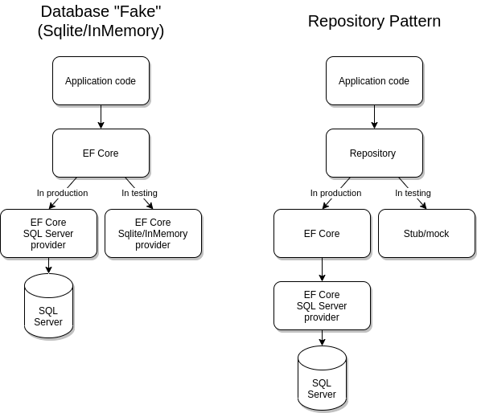

# Choosing a testing strategy

As discussed in the [Overview](xref:core/testing/index), a basic decision you need to make is whether your tests will involve your production database system - just as your application does - or whether your tests will run against a [test double](https://martinfowler.com/bliki/TestDouble.html), which replaces your production database system.

Testing against a real external resource - rather than replacing it with a test double - can involve the following difficulties:

1. In many cases, it's simply not possible or practical to test against the actual external resource. For example, your application may interact with some service that cannot be easily tested against (because of rate limiting, or the lack of a testing environment).
2. Even when it's possible to involve the real external resource, this may be exceedingly slow: running a large amount of tests against a cloud service may cause tests to take too long. Testing should be part of the developer's everyday workflow, so it's important that tests run quickly.
3. Executing tests against an external resource may involve isolation issues, where tests interfere with one another. For example, multiple tests running in parallel against a database may modify data and cause each other to fail in various ways. Using a test double avoids this, as each test runs against its own, in-memory resource, and is therefore naturally isolated from other tests.

However, tests which pass against a test double don't guarantee that your program works when running against the real external resource. For example, a database test double may perform case-sensitive string comparisons, whereas the production database system does case-insensitive comparisons. Such issues are only uncovered when tests are executed against your real production database, making these tests an important part of any testing strategy.

## Testing against the database may be easier than it seems

Because of the above difficulties with testing against a real database, developers are frequently urged to use test doubles first, and have a robust test suite which they can run frequently on their machines; tests involving the database, in contrast, are supposed to be executed much less frequently, and in many cases also provide far less coverage. We recommend giving more thought to the latter, and suggest that databases may actually be far less affected by the above problems than people tend to think:

1. Most databases can nowadays be easily installed on the developer's machine. Container-based technologies such as Docker can make this very easy, and technologies such as [Github Workspaces](https://docs.github.com/en/codespaces/overview) and [Dev Container](https://code.visualstudio.com/docs/remote/create-dev-container) set up your entire development environment for you (including the database). When using SQL Server, it's also possible to test against [LocalDB](/sql/database-engine/configure-windows/sql-server-express-localdb) on Windows, or easily set up a Docker image on Linux.
2. Testing against a local database - with a reasonable test dataset - is usually extremely fast: communication is completely local, and test data is typically buffered in memory on the database side. EF Core itself contains over 30,000 tests against SQL Server alone; these complete reliably in a few minutes, execute in CI on every single commit, and are very frequently executed by developers locally. Some developers turn to an in-memory database (a "fake") in the belief that this is needed for speed - this is almost never actually the case.
3. Isolation is indeed a hurdle when running tests against a real database, as tests may modify data and interfere with one another. However, there are various techniques to provide isolation in database testing scenarios; we concentrate on these in [Testing against your production database system](xref:core/testing/testing-with-the-database)).

The above is not meant to disparage test doubles or to argue against using them. For one thing, test doubles are necessary for some scenarios which cannot be tested otherwise, such as simulating database failure. However, in our experience, users frequently shy away from testing against their database for the above reasons, believing it's slow, hard or unreliable, when that isn't necessarily the case. [Testing against your production database system](xref:core/testing/testing-with-the-database) aims to address this, providing guidelines and samples for writing fast, isolated tests against your database.

## Different types of test doubles

[Test doubles](https://martinfowler.com/bliki/TestDouble.html) is a broad term which encompasses very different approaches. This section covers some common techniques involving test doubles for testing EF Core applications:

1. Use SQLite (in-memory mode) as a database fake, replacing your production database system.
2. Use the EF Core in-memory provider as a database fake, replacing your production database system.
3. Mock or stub out `DbContext` and `DbSet`.
4. Introduce a repository layer between EF Core and your application code, and mock or stub that layer.

Below, we'll explore what each method means, and compare it with the others. We recommend reading through the different methods to gain a full understanding of each one. If you've decided to write tests which don't involve your production database system, then a repository layer is the only approach allowing the comprehensive and reliable stubbing/mocking of the data layer. However, that approach has a significant cost in terms of implementation and maintenance.

### SQLite as a database fake

One possible testing approach is to swap your production database (e.g. SQL Server) with SQLite, effectively using it as a testing "fake". Aside from ease of setup, SQLite has an [in-memory database](https://sqlite.org/inmemorydb.html) feature which is especially useful for testing: each test is naturally isolated in its own in-memory database, and no actual files need to be managed.

However, before doing this, it's important to understand that in EF Core, different database providers behave differently - EF Core does not attempt to abstract every aspect of the underlying database system. Fundamentally, this means that testing against SQLite does not guarantee the same results as against SQL Server, or any other database. Here are some examples of possible behavioral differences:

* The same LINQ query may return different results on different providers. For example, SQL Server does case-insensitive string comparison by default, whereas SQLite is case-sensitive. This can make your tests pass against SQLite where they would fail against SQL Server (or vice versa).
* Some queries which work on SQL Server simply aren't supported on SQLite, because the exact SQL support in these two database differs.
* If your query happens to use a provider-specific method such as SQL Server's [`EF.Functions.DateDiffDay`](xref:core/providers/sql-server/functions#date-and-time-functions), that query will fail on SQLite, and cannot be tested.
* Raw SQL may work, or it may fail or return different results, depending on exactly what is being done. SQL dialects are different in many ways across databases.

Compared to running tests against your production database system, it's relatively easy to get started with SQLite, and so many users do. Unfortunately, the above limitations tend to eventually become problematic when testing EF Core applications, even if they don't seem to be at the beginning. As a result, we recommend either writing your tests against your real database, or if using a test double is an absolute necessity, taking onboard the cost of a repository pattern as discussed below.

For information on how to use SQLite for testing, [see this section](xref:core/testing/testing-without-the-database#sqlite-in-memory).

### In-memory as a database fake

As an alternative to SQLite, EF Core also comes with an in-memory provider. Although this provider was originally designed to support internal testing of EF Core itself, some developers use it as a database fake when testing EF Core applications. Doing so is **highly discouraged**: as a database fake, in-memory has the same issues as SQLite (see above), but in addition has the following additional limitations:

* The in-memory provider generally supports fewer query types than the SQLite provider, since it isn't a relational database. More queries will fail or behave differently in comparison to your production database.
* Transactions are not supported.
* Raw SQL is completely unsupported. Compare this with SQLite, where it's possible to use raw SQL, as long as that SQL works in the same way on SQLite and your production database.
* The in-memory provider has not been optimized for performance, and will generally work slower than SQLite in in-memory mode (or even your production database system).

In summary, in-memory has all the disadvantages of SQLite, along with a few more - and offers no advantages in return. If you are looking for a simple, in-memory database fake, use SQLite instead of the in-memory provider; but consider using the repository pattern instead as described below.

For information on how to use in-memory for testing, see the [see this section](xref:core/testing/testing-without-the-database#inmemory).

### Mocking or stubbing DbContext and DbSet

This approach typically uses a mock framework to create a test double of `DbContext` and `DbSet`, and tests against those doubles. Mocking `DbContext` can be a good approach for testing various *non-query* functionality, such as calls to <xref:Microsoft.EntityFrameworkCore.DbContext.Add*> or <xref:Microsoft.EntityFrameworkCore.DbContext.SaveChanges>, allowing you to verify that your code called them in write scenarios.

However, properly mocking `DbSet` *query* functionality is not possible, since queries are expressed via LINQ operators, which are static extension method calls over `IQueryable`. As a result, when some people talk about "mocking `DbSet`", what they really mean is that they create a `DbSet` backed by an in-memory collection, and then evaluate query operators against that collection in memory, just like a simple `IEnumerable`. Rather than a mock, this is actually a sort of fake, where the in-memory collection replaces the the real database.

Since only the `DbSet` itself is faked and the query is evaluated in-memory, this approach ends up being very similar to using the EF Core in-memory provider: both techniques execute query operators in .NET over an in-memory collection. As a result, this technique suffers from the same drawbacks as well: queries will behave differently (e.g. around case sensitivity) or will simply fail (e.g. because of provider-specific methods), raw SQL won't work and transactions will be ignored at best. As a result, this technique should generally be avoided for testing any query code.

### Repository pattern

The approaches above attempted to either swap EF Core's production database provider with a fake testing provider, or to create a `DbSet` backed by an in-memory collection. These techniques are similar in that they still evaluate the program's LINQ queries - either in SQLite or in memory - and this is ultimately the source of the difficulties outlined above: a query designed to execute against a specific production database cannot reliably execute elsewhere without issues.

For a proper, reliable test double, consider introducing a [repository layer](https://martinfowler.com/eaaCatalog/repository.html) which mediates between your application code and EF Core. The production implementation of the repository contains the actual LINQ queries and executes them via EF Core. In testing, the repository abstraction is directly stubbed or mocked without needing any actual LINQ queries, effectively removing EF Core from your testing stack altogether and allowing tests to focus on application code alone.

The following diagram compares the database fake approach (SQLite/in-memory) with the repository pattern:

Since LINQ queries are no longer part of testing, you can directly provide query results to your application. Put another way, the previous approaches roughly allow stubbing out *query inputs* (e.g. replacing SQL Server *tables* with in-memory ones), but then still execute the actual query operators in-memory. The repository pattern, in contrast, allows you to stub out *query outputs* directly, allowing for far more powerful and focused unit testing. Note that for this to work, your repository cannot expose any IQueryable-returning methods, as these once again cannot be stubbed out; IEnumerable should be returned instead.

However, since the repository pattern requires encapsulating each and every (testable) LINQ query in an IEnumerable-returning method, it imposes an additional architectural layer on your application, and can incur significant cost to implement and maintain. This cost should not be discounted when making a choice on how to test an application, especially given that tests against the real database are still likely to be needed for the queries exposed by the repository.

It's worth noting that repositories do have advantages outside of just testing. They ensure all data access code is concentrated in one place rather than being spread around the application, and if your application needs to support more than one database, then the repository abstraction can be very helpful for tweaking queries across providers.

For a sample showing testing with a repository, [see this section](xref:core/testing/testing-without-the-database#repository-pattern).

## Overall comparison

The following table provides a quick, comparative view of the different testing techniques, and shows which functionality can be tested under which approach:

Feature                                   | In-memory    | SQLite in-memory          | Mock DbContext | Repository pattern | Testing against the database
----------------------------------------- | ------------ | ------------------------- | -------------- | ------------------ | ----------------------------
Test double type                          | Fake         | Fake                      | Fake           | Mock/stub          | Real, no double
Raw SQL?                                  | No           | Depends                   | No             | Yes                | Yes
Transactions?                             | No (ignored) | Yes                       | Yes            | Yes                | Yes
Provider-specific translations?           | No           | No                        | No             | Yes                | Yes
Exact query behavior?                     | Depends      | Depends                   | Depends        | Yes                | Yes
Can use LINQ anywhere in the application? | Yes          | Yes                       | Yes            | No*                | Yes

* All testable database LINQ queries must be encapsulated in IEnumerable-returning repository methods, in order to be stubbed/mocked.

## Summary

* We recommend that developers have good test coverage of their application running against their actual production database system. This provides confidence that the application actually works in production, and with proper design, tests can execute reliably and quickly. Since these tests are required in any case, it's a good idea to start there, and if needed, add tests using test doubles later, as required.
* If you've decided to use a test double, we recommend implementing the repository pattern, which allows you to stub or mock out your data access layer above EF Core, rather than using a fake EF Core provider (Sqlite/in-memory) or by mocking `DbSet`.
* If the repository pattern isn't a viable option for some reason, consider using SQLite in-memory databases.
* Avoid the in-memory provider for testing purposes - this is discouraged and only supported for legacy applications.
* Avoid mocking `DbSet` for querying purposes.
