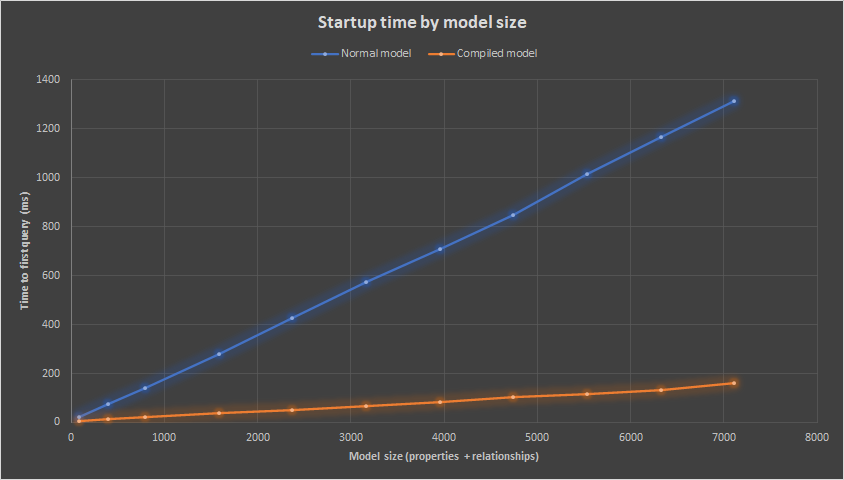

# What's New in EF Core 6.0

EF Core 6.0 has [shipped to NuGet](https://www.nuget.org/packages/Microsoft.EntityFrameworkCore/). This page contains an overview of interesting changes introduced in this release.

> [!TIP]
> You can run and debug into the samples shown below by [downloading the sample code from GitHub](https://github.com/dotnet/EntityFramework.Docs/tree/main/samples/core/Miscellaneous/NewInEFCore6).

## SQL Server temporal tables

GitHub Issue: [#4693](https://github.com/dotnet/efcore/issues/4693).

[SQL Server temporal tables](/sql/relational-databases/tables/temporal-tables) automatically keep track of all data ever stored in a table, even after that data has been updated or deleted. This is achieved by creating a parallel "history table" into which timestamped historical data is stored whenever a change is made to the main table. This allows historical data to be queried, such as for auditing, or restored, such as for recovery after accidental mutation or deletion.

EF Core now supports:

* The creation of temporal tables using Migrations
* Transformation of existing tables into temporal tables, again using Migrations
* Querying historical data
* Restoring data from some point in the past

### Configuring a temporal table

The model builder can be used to configure a table as temporal. For example:

<!--
modelBuilder
    .Entity<Employee>()
    .ToTable("Employees", b => b.IsTemporal());
-->
[!code-csharp[SimpleConfig](../../../../samples/core/Miscellaneous/NewInEFCore6/TemporalTablesSample.cs?name=SimpleConfig)]

When using EF Core to create the database, the new table will be configured as a temporal table with the SQL Server defaults for the timestamps and history table. For example, consider an `Employee` entity type:

<!--
    public class Employee
    {
        public Guid EmployeeId { get; set; }
        public string Name { get; set; }
        public string Position { get; set; }
        public string Department { get; set; }
        public string Address { get; set; }
        public decimal AnnualSalary { get; set; }
    }
-->
[!code-csharp[Employee](../../../../samples/core/Miscellaneous/NewInEFCore6/TemporalTablesSample.cs?name=Employee)]

The temporal table created will look like this:

```sql
DECLARE @historyTableSchema sysname = SCHEMA_NAME()
EXEC(N'CREATE TABLE [Employees] (
    [EmployeeId] uniqueidentifier NOT NULL,
    [Name] nvarchar(100) NULL,
    [Position] nvarchar(100) NULL,
    [Department] nvarchar(100) NULL,
    [Address] nvarchar(1024) NULL,
    [AnnualSalary] decimal(10,2) NOT NULL,
    [PeriodEnd] datetime2 GENERATED ALWAYS AS ROW END NOT NULL,
    [PeriodStart] datetime2 GENERATED ALWAYS AS ROW START NOT NULL,
    CONSTRAINT [PK_Employees] PRIMARY KEY ([EmployeeId]),
    PERIOD FOR SYSTEM_TIME([PeriodStart], [PeriodEnd])
) WITH (SYSTEM_VERSIONING = ON (HISTORY_TABLE = [' + @historyTableSchema + N'].[EmployeeHistory]))');
```

Notice that SQL Server creates two hidden `datetime2` columns called `PeriodEnd` and `PeriodStart`. These "period columns" represent the time range during which the data in the row existed. These columns are mapped to [shadow properties](xref:core/modeling/shadow-properties) in the EF Core model, allowing them to be used in queries as shown later.

> [!IMPORTANT]
> The times in these columns are always UTC time generated by SQL Server. UTC times are used for all operations involving temporal tables, such as in the queries shown below.

Notice also that an associated history table called `EmployeeHistory` is created automatically. The names of the period columns and history table can be changed with additional configuration to the model builder. For example:

<!--
modelBuilder
    .Entity<Employee>()
    .ToTable(
        "Employees",
        b => b.IsTemporal(
            b =>
            {
                b.HasPeriodStart("ValidFrom");
                b.HasPeriodEnd("ValidTo");
                b.UseHistoryTable("EmployeeHistoricalData");
            }));
-->
[!code-csharp[AdvancedConfig](../../../../samples/core/Miscellaneous/NewInEFCore6/TemporalTablesSample.cs?name=AdvancedConfig)]

This is reflected in the table created by SQL Server:

```sql
DECLARE @historyTableSchema sysname = SCHEMA_NAME()
EXEC(N'CREATE TABLE [Employees] (
    [EmployeeId] uniqueidentifier NOT NULL,
    [Name] nvarchar(100) NULL,
    [Position] nvarchar(100) NULL,
    [Department] nvarchar(100) NULL,
    [Address] nvarchar(1024) NULL,
    [AnnualSalary] decimal(10,2) NOT NULL,
    [ValidFrom] datetime2 GENERATED ALWAYS AS ROW START NOT NULL,
    [ValidTo] datetime2 GENERATED ALWAYS AS ROW END NOT NULL,
    CONSTRAINT [PK_Employees] PRIMARY KEY ([EmployeeId]),
    PERIOD FOR SYSTEM_TIME([ValidFrom], [ValidTo])
) WITH (SYSTEM_VERSIONING = ON (HISTORY_TABLE = [' + @historyTableSchema + N'].[EmployeeHistoricalData]))');
```

### Using temporal tables

Most of the time, temporal tables are used just like any other table. That is, the period columns and historical data are handled transparently by SQL Server such that the application can ignore them. For example, new entities can be saved to the database in the normal way:

<!--
context.AddRange(
    new Employee
    {
        Name = "Pinky Pie",
        Address = "Sugarcube Corner, Ponyville, Equestria",
        Department = "DevDiv",
        Position = "Party Organizer",
        AnnualSalary = 100.0m
    },
    new Employee
    {
        Name = "Rainbow Dash",
        Address = "Cloudominium, Ponyville, Equestria",
        Department = "DevDiv",
        Position = "Ponyville weather patrol",
        AnnualSalary = 900.0m
    },
    new Employee
    {
        Name = "Fluttershy",
        Address = "Everfree Forest, Equestria",
        Department = "DevDiv",
        Position = "Animal caretaker",
        AnnualSalary = 30.0m
    });

context.SaveChanges();
-->
[!code-csharp[InsertData](../../../../samples/core/Miscellaneous/NewInEFCore6/TemporalTablesSample.cs?name=InsertData)]

This data can then be queried, updated, and deleted in the normal way. For example:

<!--
var employee = context.Employees.Single(e => e.Name == "Rainbow Dash");
context.Remove(employee);
context.SaveChanges();
-->
[!code-csharp[NormalQuery](../../../../samples/core/Miscellaneous/NewInEFCore6/TemporalTablesSample.cs?name=NormalQuery)]

Also, after a normal [tracking query](xref:core/querying/tracking#no-tracking-queries), the values from the period columns of the current data can be [accessed from the tracked entities](xref:core/change-tracking/entity-entries). For example:

<!--
var employees = context.Employees.ToList();
foreach (var employee in employees)
{
    var employeeEntry = context.Entry(employee);
    var validFrom = employeeEntry.Property<DateTime>("ValidFrom").CurrentValue;
    var validTo = employeeEntry.Property<DateTime>("ValidTo").CurrentValue;

    Console.WriteLine($"  Employee {employee.Name} valid from {validFrom} to {validTo}");
}
-->
[!code-csharp[TrackingQuery](../../../../samples/core/Miscellaneous/NewInEFCore6/TemporalTablesSample.cs?name=TrackingQuery)]

This prints:

```none
Starting data:
  Employee Pinky Pie valid from 8/26/2021 4:38:58 PM to 12/31/9999 11:59:59 PM
  Employee Rainbow Dash valid from 8/26/2021 4:38:58 PM to 12/31/9999 11:59:59 PM
  Employee Fluttershy valid from 8/26/2021 4:38:58 PM to 12/31/9999 11:59:59 PM
```

Notice that the `ValidTo` column (by default called `PeriodEnd`) contains the `datetime2` max value. This is always the case for the current rows in the table. The `ValidFrom` columns (by default called `PeriodStart`) contains the UTC time that the row was inserted.

### Querying historical data

EF Core supports queries that include historical data through several new query operators:

* `TemporalAsOf`: Returns rows that were active (current) at the given UTC time. This is a single row from the current table or history table for a given primary key.
* `TemporalAll`: Returns all rows in the historical data. This is typically many rows from the history table and/or the current table for a given primary key.
* `TemporalFromTo`: Returns all rows that were active between two given UTC times. This may be many rows from the history table and/or the current table for a given primary key.
* `TemporalBetween`: The same as `TemporalFromTo`, except that rows are included that became active on the upper boundary.
* `TemporalContainedIn`: Returns all rows that started being active and ended being active between two given UTC times. This may be many rows from the history table and/or the current table for a given primary key.

> [!NOTE]
> See the [SQL Server temporal tables documentation](/sql/relational-databases/tables/temporal-tables#how-do-i-query-temporal-data) for more information on exactly which rows are included for each of these operators.

For example, after making some updates and deletes to our data, we can run a query using `TemporalAll` to see the historical data:

<!--
var history = context
    .Employees
    .TemporalAll()
    .Where(e => e.Name == "Rainbow Dash")
    .OrderBy(e => EF.Property<DateTime>(e, "ValidFrom"))
    .Select(
        e => new
        {
            Employee = e,
            ValidFrom = EF.Property<DateTime>(e, "ValidFrom"),
            ValidTo = EF.Property<DateTime>(e, "ValidTo")
        })
    .ToList();

foreach (var pointInTime in history)
{
    Console.WriteLine(
        $"  Employee {pointInTime.Employee.Name} was '{pointInTime.Employee.Position}' from {pointInTime.ValidFrom} to {pointInTime.ValidTo}");
}
-->
[!code-csharp[TemporalAll](../../../../samples/core/Miscellaneous/NewInEFCore6/TemporalTablesSample.cs?name=TemporalAll)]

Notice how the [EF.Property method](xref:core/modeling/shadow-properties#accessing-shadow-properties) can be used to access values from the period columns. This is used in the `OrderBy` clause to sort the data, and then in a projection to include these values in the returned data.

This query brings back the following data:

```none
Historical data for Rainbow Dash:
  Employee Rainbow Dash was 'Ponyville weather patrol' from 8/26/2021 4:38:58 PM to 8/26/2021 4:40:29 PM
  Employee Rainbow Dash was 'Wonderbolt Trainee' from 8/26/2021 4:40:29 PM to 8/26/2021 4:41:59 PM
  Employee Rainbow Dash was 'Wonderbolt Reservist' from 8/26/2021 4:41:59 PM to 8/26/2021 4:43:29 PM
  Employee Rainbow Dash was 'Wonderbolt' from 8/26/2021 4:43:29 PM to 8/26/2021 4:44:59 PM
```

Notice that the last row returned stopped being active at 8/26/2021 4:44:59 PM. This is because the row for Rainbow Dash was deleted from the main table at that time. We will see later how this data can be restored.

Similar queries can be written using `TemporalFromTo`, `TemporalBetween`, or `TemporalContainedIn`. For example:

<!--
var history = context
    .Employees
    .TemporalBetween(timeStamp2, timeStamp3)
    .Where(e => e.Name == "Rainbow Dash")
    .OrderBy(e => EF.Property<DateTime>(e, "ValidFrom"))
    .Select(
        e => new
        {
            Employee = e,
            ValidFrom = EF.Property<DateTime>(e, "ValidFrom"),
            ValidTo = EF.Property<DateTime>(e, "ValidTo")
        })
    .ToList();
-->
[!code-csharp[TemporalBetween](../../../../samples/core/Miscellaneous/NewInEFCore6/TemporalTablesSample.cs?name=TemporalBetween)]

This query returns the following rows:

```none
Historical data for Rainbow Dash between 8/26/2021 4:41:14 PM and 8/26/2021 4:42:44 PM:
  Employee Rainbow Dash was 'Wonderbolt Trainee' from 8/26/2021 4:40:29 PM to 8/26/2021 4:41:59 PM
  Employee Rainbow Dash was 'Wonderbolt Reservist' from 8/26/2021 4:41:59 PM to 8/26/2021 4:43:29 PM
```

### Restoring historical data

As mentioned above, Rainbow Dash was deleted from the `Employees` table. This was clearly a mistake, so let's go back to a point-in-time and restore the missing row from that time.

<!--
var employee = context
    .Employees
    .TemporalAsOf(timeStamp2)
    .Single(e => e.Name == "Rainbow Dash");

context.Add(employee);
context.SaveChanges();
-->
[!code-csharp[RestoreData](../../../../samples/core/Miscellaneous/NewInEFCore6/TemporalTablesSample.cs?name=RestoreData)]

This query returns a single row for Rainbow Dash as it was at the given UTC time. All queries using temporal operators are no-tracking by default, so the returned entity here is not tracked. This makes sense, because it does not currently exist in the main table. To re-insert the entity into the main table, we simply mark it as `Added` and then call `SaveChanges`.

After re-inserting the row Rainbow Dash, querying the historical data shows that the row was restored as it was at the given UTC time:

```none
Historical data for Rainbow Dash:
  Employee Rainbow Dash was 'Ponyville weather patrol' from 8/26/2021 4:38:58 PM to 8/26/2021 4:40:29 PM
  Employee Rainbow Dash was 'Wonderbolt Trainee' from 8/26/2021 4:40:29 PM to 8/26/2021 4:41:59 PM
  Employee Rainbow Dash was 'Wonderbolt Reservist' from 8/26/2021 4:41:59 PM to 8/26/2021 4:43:29 PM
  Employee Rainbow Dash was 'Wonderbolt' from 8/26/2021 4:43:29 PM to 8/26/2021 4:44:59 PM
  Employee Rainbow Dash was 'Wonderbolt Trainee' from 8/26/2021 4:44:59 PM to 12/31/9999 11:59:59 PM
```

## Migration Bundles

GitHub Issue: [#19693](https://github.com/dotnet/efcore/issues/19693).

EF Core migrations are used to generate database schema updates based on changes to the EF model. These schema updates should be applied at application deployment time, often as part of a continuous integration/continuous deployment (C.I./C.D.) system.

EF Core now includes a new way to apply these schema updates: migration bundles. A migration bundle is a small executable containing migrations and the code needed to apply these migrations to the database.

> [!NOTE]
> See [Introducing DevOps-friendly EF Core Migration Bundles](https://devblogs.microsoft.com/dotnet/introducing-devops-friendly-ef-core-migration-bundles/) on the .NET Blog for a more in-depth discussion on migrations, bundles, and deployment.

Migration bundles are created using the `dotnet ef` command-line tool. Ensure that you have [installed the latest version of the tool](xref:core/cli/dotnet#installing-the-tools) before continuing.

A bundle needs migrations to include. These are created using `dotnet ef migrations add` as described in the [migrations documentation](xref:core/managing-schemas/migrations/index). Once you have migrations ready to deploy, create a bundle using the `dotnet ef migrations bundle`. For example:

```dotnetcli
PS C:\local\AllTogetherNow\SixOh> dotnet ef migrations bundle
Build started...
Build succeeded.
Building bundle...
Done. Migrations Bundle: C:\local\AllTogetherNow\SixOh\efbundle.exe
PS C:\local\AllTogetherNow\SixOh>
```

The output is an executable suitable for your target operating system. In my case this is Windows x64, so I get an `efbundle.exe` dropped in my local folder. Running this executable applies the migrations contained within it:

```dotnetcli
PS C:\local\AllTogetherNow\SixOh> .\efbundle.exe
Applying migration '20210903083845_MyMigration'.
Done.
PS C:\local\AllTogetherNow\SixOh>
```

Migrations are applied to the database only if they have not been already applied. For example, running the same bundle again does nothing, since there are no new migrations to apply:

```dotnetcli
PS C:\local\AllTogetherNow\SixOh> .\efbundle.exe
No migrations were applied. The database is already up to date.
Done.
PS C:\local\AllTogetherNow\SixOh>
```

However, if changes are made to the model and more migrations are generated with `dotnet ef migrations add`, then these can be bundled into a new executable ready to apply. For example:

```dotnetcli
PS C:\local\AllTogetherNow\SixOh> dotnet ef migrations add SecondMigration
Build started...
Build succeeded.
Done. To undo this action, use 'ef migrations remove'
PS C:\local\AllTogetherNow\SixOh> dotnet ef migrations add Number3
Build started...
Build succeeded.
Done. To undo this action, use 'ef migrations remove'
PS C:\local\AllTogetherNow\SixOh> dotnet ef migrations bundle --force
Build started...
Build succeeded.
Building bundle...
Done. Migrations Bundle: C:\local\AllTogetherNow\SixOh\efbundle.exe
PS C:\local\AllTogetherNow\SixOh>
```

Notice that the `--force` option can be used to overwrite the existing bundle with a new one.

Executing this new bundle applies these two new migrations to the database:

```dotnetcli
PS C:\local\AllTogetherNow\SixOh> .\efbundle.exe
Applying migration '20210903084526_SecondMigration'.
Applying migration '20210903084538_Number3'.
Done.
PS C:\local\AllTogetherNow\SixOh>
```

By default, the bundle uses the database connection string from your application's configuration. However, a different database can be migrated by passing the connection string on the command line. For example:

```dotnetcli
PS C:\local\AllTogetherNow\SixOh> .\efbundle.exe --connection "Data Source=(LocalDb)\MSSQLLocalDB;Database=SixOhProduction"
Applying migration '20210903083845_MyMigration'.
Applying migration '20210903084526_SecondMigration'.
Applying migration '20210903084538_Number3'.
Done.
PS C:\local\AllTogetherNow\SixOh>
```

Notice that this time all three migrations were applied, since none of them had yet been applied to the production database.

Other options can be passed to the command line. Some common options are:

* `--output` to specify the path of executable file to create.
* `--context` to specify the DbContext type to use when the project contains multiple context types.
* `--project` to specify the project to use. Defaults to the current working directory.
* `--startup-project` to specify the startup project to use. Defaults to the current working directory.
* `--no-build` to prevent the project from being built before running the command. This should only be used if the project is known to be up-to-date.
* `--verbose` to see detailed information on what the command is doing. Use this option when including information in bug reports.

Use `dotnet ef migrations bundle --help` to see all available options.

Note that by default each migration is applied in its own transaction. See [GitHub issue #22616](https://github.com/dotnet/efcore/issues/22616) for a discussion of possible future enhancements in this area.

## Pre-convention model configuration

GitHub Issue: [#12229](https://github.com/dotnet/efcore/issues/12229).

Previous versions of EF Core require that the mapping for every property of a given type is configured explicitly when that mapping differs from the default. This includes "facets" like the maximum length of strings and decimal precision, as well as value conversion for the property type.

This necessitated either:

* Model builder configuration for each property
* A mapping attribute on each property
* Explicit iteration over all properties of all entity types and use of the low-level metadata APIs when building the model.

Note that explicit iteration is error-prone and hard to do robustly because the list of entity types and mapped properties may not be final at the time this iteration happens.

EF Core 6.0 allows this mapping configuration to be specified once for a given type. It will then be applied to all properties of that type in the model. This is called "pre-convention model configuration", since it configures aspects of the model that are then used by the model building conventions. Such configuration is applied by overriding `ConfigureConventions` on your `DbContext`:

<!--
    public class SomeDbContext : DbContext
    {
        protected override void ConfigureConventions(
            ModelConfigurationBuilder configurationBuilder)
        {
            // Pre-convention model configuration goes here
        }
    }
-->
[!code-csharp[WhereItGoes](../../../../samples/core/Miscellaneous/NewInEFCore6/PreConventionModelConfigurationSample.cs?name=WhereItGoes)]

For example, consider the following entity types:

<!--
    public class Customer
    {
        public int Id { get; set; }
        public string Name { get; set; }
        public bool IsActive { get; set; }
        public Money AccountValue { get; set; }

        public Session CurrentSession { get; set; }

        public ICollection<Order> Orders { get; } = new List<Order>();
    }

    public class Order
    {
        public int Id { get; set; }
        public string SpecialInstructions { get; set; }
        public DateTime OrderDate { get; set; }
        public bool IsComplete { get; set; }
        public Money Price { get; set; }
        public Money? Discount { get; set; }

        public Customer Customer { get; set; }
    }
-->
[!code-csharp[EntityTypes](../../../../samples/core/Miscellaneous/NewInEFCore6/PreConventionModelConfigurationSample.cs?name=EntityTypes)]

All string properties can be configured to be ANSI (instead of Unicode) and have a maximum length of 1024:

<!--
            configurationBuilder
                .Properties<string>()
                .AreUnicode(false)
                .HaveMaxLength(1024);
-->
[!code-csharp[StringFacets](../../../../samples/core/Miscellaneous/NewInEFCore6/PreConventionModelConfigurationSample.cs?name=StringFacets)]

All DateTime properties can be converted to 64-bit integers in the database, using the default conversion from DateTimes to longs:

<!--
            configurationBuilder
                .Properties<DateTime>()
                .HaveConversion<long>();
-->
[!code-csharp[DateTimeConversion](../../../../samples/core/Miscellaneous/NewInEFCore6/PreConventionModelConfigurationSample.cs?name=DateTimeConversion)]

All bool properties can be converted to the integers `0` or `1` using one of the built-in value converters:

<!--
            configurationBuilder
                .Properties<bool>()
                .HaveConversion<BoolToZeroOneConverter<int>>();
-->
[!code-csharp[BoolConversion](../../../../samples/core/Miscellaneous/NewInEFCore6/PreConventionModelConfigurationSample.cs?name=BoolConversion)]

Assuming `Session` is a transient property of the entity and should not be persisted, it can be ignored everywhere in the model:

<!--
            configurationBuilder
                .IgnoreAny<Session>();
-->
[!code-csharp[IgnoreSession](../../../../samples/core/Miscellaneous/NewInEFCore6/PreConventionModelConfigurationSample.cs?name=IgnoreSession)]

Pre-convention model configuration is very useful when working with value objects. For example, the type `Money` in the model above is represented by read-only struct:

<!--
    public readonly struct Money
    {
        [JsonConstructor]
        public Money(decimal amount, Currency currency)
        {
            Amount = amount;
            Currency = currency;
        }

        public override string ToString()
            => (Currency == Currency.UsDollars ? "$" : "£") + Amount;

        public decimal Amount { get; }
        public Currency Currency { get; }
    }

    public enum Currency
    {
        UsDollars,
        PoundsSterling
    }
-->
[!code-csharp[MoneyType](../../../../samples/core/Miscellaneous/NewInEFCore6/PreConventionModelConfigurationSample.cs?name=MoneyType)]

This is then serialized to and from JSON using a custom value converter:

<!--
    public class MoneyConverter : ValueConverter<Money, string>
    {
        public MoneyConverter()
            : base(
                v => JsonSerializer.Serialize(v, (JsonSerializerOptions)null),
                v => JsonSerializer.Deserialize<Money>(v, (JsonSerializerOptions)null))
        {
        }
    }
-->
[!code-csharp[MoneyConverter](../../../../samples/core/Miscellaneous/NewInEFCore6/PreConventionModelConfigurationSample.cs?name=MoneyConverter)]

This value converter can be configured once for all uses of Money:

<!--
            configurationBuilder
                .Properties<Money>()
                .HaveConversion<MoneyConverter>()
                .HaveMaxLength(64);
-->
[!code-csharp[MoneyConversion](../../../../samples/core/Miscellaneous/NewInEFCore6/PreConventionModelConfigurationSample.cs?name=MoneyConversion)]

Notice also that additional facets can be specified for the string column into which the serialized JSON is stored. In this case, the column is limited to a maximum length of 64.

The tables created for SQL Server using migrations show how the configuration has been applied to all mapped columns:

```sql
CREATE TABLE [Customers] (
    [Id] int NOT NULL IDENTITY,
    [Name] varchar(1024) NULL,
    [IsActive] int NOT NULL,
    [AccountValue] nvarchar(64) NOT NULL,
    CONSTRAINT [PK_Customers] PRIMARY KEY ([Id])
);
CREATE TABLE [Order] (
    [Id] int NOT NULL IDENTITY,
    [SpecialInstructions] varchar(1024) NULL,
    [OrderDate] bigint NOT NULL,
    [IsComplete] int NOT NULL,
    [Price] nvarchar(64) NOT NULL,
    [Discount] nvarchar(64) NULL,
    [CustomerId] int NULL,
    CONSTRAINT [PK_Order] PRIMARY KEY ([Id]),
    CONSTRAINT [FK_Order_Customers_CustomerId] FOREIGN KEY ([CustomerId]) REFERENCES [Customers] ([Id])
);
```

It is also possible to specify a default type mapping for a given type. For example:

<!--
            configurationBuilder
                .DefaultTypeMapping<string>()
                .IsUnicode(false);
-->
[!code-csharp[DefaultTypeMapping](../../../../samples/core/Miscellaneous/NewInEFCore6/PreConventionModelConfigurationSample.cs?name=DefaultTypeMapping)]

This is rarely needed, but can be useful if a type is used in query in a way that is uncorrelated with any mapped property of the model.

> [!NOTE]
> See [Announcing Entity Framework Core 6.0 Preview 6: Configure Conventions](https://devblogs.microsoft.com/dotnet/announcing-entity-framework-core-6-0-preview-6-configure-conventions/) on the .NET Blog for more discussion and examples of pre-convention model configuration.

## Compiled models

GitHub Issue: [#1906](https://github.com/dotnet/efcore/issues/1906).

Compiled models can improve EF Core startup time for applications with large models. A large model typically means 100s to 1000s of entity types and relationships.

Startup time means the time to perform the first operation on a DbContext when that DbContext type is used for the first time in the application. Note that just creating a DbContext instance does not cause the EF model to be initialized. Instead, typical first operations that cause the model to be initialized include calling `DbContext.Add` or executing the first query.

Compiled models are created using the `dotnet ef` command-line tool. Ensure that you have [installed the latest version of the tool](xref:core/cli/dotnet#installing-the-tools) before continuing.

A new `dbcontext optimize` command is used to generate the compiled model. For example:

```dotnetcli
dotnet ef dbcontext optimize
```

The `--output-dir` and `--namespace` options can be used to specify the directory and namespace into which the compiled model will be generated. For example:

```dotnetcli
PS C:\dotnet\efdocs\samples\core\Miscellaneous\CompiledModels> dotnet ef dbcontext optimize --output-dir MyCompiledModels --namespace MyCompiledModels
Build started...
Build succeeded.
Successfully generated a compiled model, to use it call 'options.UseModel(MyCompiledModels.BlogsContextModel.Instance)'. Run this command again when the model is modified.
PS C:\dotnet\efdocs\samples\core\Miscellaneous\CompiledModels>
```

The output from running this command includes a piece of code to copy-and-paste into your DbContext configuration to cause EF Core to use the compiled model. For example:

```csharp
protected override void OnConfiguring(DbContextOptionsBuilder optionsBuilder)
    => optionsBuilder
        .UseModel(MyCompiledModels.BlogsContextModel.Instance)
        .UseSqlite(@"Data Source=test.db");
```

### Compiled model bootstrapping

It is typically not necessary to look at the generated bootstrapping code. However, sometimes it can be useful to customize the model or its loading. The bootstrapping code looks something like this:

<!--
[DbContext(typeof(BlogsContext))]
partial class BlogsContextModel : RuntimeModel
{
    private static BlogsContextModel _instance;
    public static IModel Instance
    {
        get
        {
            if (_instance == null)
            {
                _instance = new BlogsContextModel();
                _instance.Initialize();
                _instance.Customize();
            }

            return _instance;
        }
    }

    partial void Initialize();

    partial void Customize();
}
-->
[!code-csharp[RuntimeModel](../../../../samples/core/Miscellaneous/CompiledModels/SingleRuntimeModel.cs?name=RuntimeModel)]

This is a partial class with partial methods that can be implemented to customize the model as needed.

In addition, multiple compiled models can be generated for DbContext types that may use different models depending on some runtime configuration. These should be placed into different folders and namespaces, as shown above. Runtime information, such as the connection string, can then be examined and the correct model returned as needed. For example:

<!--
public static class RuntimeModelCache
{
    private static readonly ConcurrentDictionary<string, IModel> _runtimeModels
        = new();

    public static IModel GetOrCreateModel(string connectionString)
        => _runtimeModels.GetOrAdd(
            connectionString, cs =>
                {
                    if (cs.Contains("X"))
                    {
                        return BlogsContextModel1.Instance;
                    }

                    if (cs.Contains("Y"))
                    {
                        return BlogsContextModel2.Instance;
                    }

                    throw new InvalidOperationException("No appropriate compiled model found.");
                });
}
-->
[!code-csharp[RuntimeModelCache](../../../../samples/core/Miscellaneous/CompiledModels/MultipleRuntimeModels.cs?name=RuntimeModelCache)]

### Limitations

Compiled models have some limitations:

* [Global query filters are not supported](https://github.com/dotnet/efcore/issues/24897).
* [Lazy loading and change-tracking proxies are not supported](https://github.com/dotnet/efcore/issues/24902).
* Custom IModelCacheKeyFactory implementations are not supported. However, you can compile multiple models and load the appropriate one as needed.
* [The model must be manually synchronized by regenerating it any time the model definition or configuration change](https://github.com/dotnet/efcore/issues/24894).

Because of these limitations, you should only use compiled models if your EF Core startup time is too slow. Compiling small models is typically not worth it.

If supporting any of these features is critical to your success, then please vote for the appropriate issues linked above.

### Benchmarks

> [!TIP]
> You can try compiling a large model and running a benchmark on it by [downloading the sample code from GitHub](https://github.com/dotnet/EntityFramework.Docs/tree/main/samples/core/Miscellaneous/CompiledModels).

The model in the GitHub repo referenced above contains 449 entity types, 6390 properties, and 720 relationships. This is a moderately large model. Using [BenchmarkDotNet](https://www.nuget.org/packages/BenchmarkDotNet) to measure, the average time to first query is 1.02 seconds on a reasonably powerful laptop. Using compiled models brings this down to 117 milliseconds on the same hardware. An 8x to 10x improvement like this stays relatively constant as the model size increases.



> [!NOTE]
> See [Announcing Entity Framework Core 6.0 Preview 5: Compiled Models](https://devblogs.microsoft.com/dotnet/announcing-entity-framework-core-6-0-preview-5-compiled-models/) on the .NET Blog for a more in-depth discussion of EF Core startup performance and compiled models.

## Improved performance on TechEmpower Fortunes

GitHub Issue: [#23611](https://github.com/dotnet/efcore/issues/23611).

We made significant improvements to query performance for EF Core 6.0. Specifically:

* EF Core 6.0 performance is now 70% faster on the industry-standard TechEmpower Fortunes benchmark, compared to 5.0.
  * This is the full-stack perf improvement, including improvements in the benchmark code, the .NET runtime, etc.
* EF Core 6.0 itself is 31% faster executing untracked queries.
* Heap allocations have been reduced by 43% when executing queries.

After these improvements, the gap between the popular "micro-ORM" [Dapper](https://github.com/DapperLib/Dapper) and EF Core in the TechEmpower Fortunes benchmark narrowed from 55% to around a little under 5%.

> [!NOTE]
> See [Announcing Entity Framework Core 6.0 Preview 4: Performance Edition](https://devblogs.microsoft.com/dotnet/announcing-entity-framework-core-6-0-preview-4-performance-edition/) on the .NET Blog for a detailed discussion of query performance improvements in EF Core 6.0.

## Azure Cosmos DB provider enhancements

EF Core 6.0 contains many improvements to the Azure Cosmos DB database provider.

> [!TIP]
> You can run and debug into all the the Cosmos-specific samples by [downloading the sample code from GitHub](https://github.com/dotnet/EntityFramework.Docs/tree/main/samples/core/Miscellaneous/NewInEFCore6.Cosmos).

### Default to implicit ownership

GitHub Issue: [#24803](https://github.com/dotnet/efcore/issues/24803).

When building a model for the Azure Cosmos DB provider, EF Core 6.0 will mark child entity types as owned by their parent entity by default. This removes the need for much of the `OwnsMany` and `OwnsOne` calls in the Azure Cosmos DB model. This makes it easier to embed child types into the document for the parent type, which is usually the appropriate way to model parents and children in a document database.

For example, consider these entity types:

<!--
public class Family
{
    [JsonPropertyName("id")]
    public string Id { get; set; }
    
    public string LastName { get; set; }
    public bool IsRegistered { get; set; }
    
    public Address Address { get; set; }

    public IList<Parent> Parents { get; } = new List<Parent>();
    public IList<Child> Children { get; } = new List<Child>();
}

public class Parent
{
    public string FamilyName { get; set; }
    public string FirstName { get; set; }
}

public class Child
{
    public string FamilyName { get; set; }
    public string FirstName { get; set; }
    public int Grade { get; set; }

    public string Gender { get; set; }

    public IList<Pet> Pets { get; } = new List<Pet>();
}
-->
[!code-csharp[Model](../../../../samples/core/Miscellaneous/NewInEFCore6.Cosmos/CosmosImplicitOwnershipSample.cs?name=Model)]

In EF Core 5.0, these types would have been modeled for Azure Cosmos DB with the following configuration:

<!--
modelBuilder.Entity<Family>()
    .HasPartitionKey(e => e.LastName)
    .OwnsMany(f => f.Parents);

modelBuilder.Entity<Family>()
    .OwnsMany(f => f.Children)
    .OwnsMany(c => c.Pets);

modelBuilder.Entity<Family>()
    .OwnsOne(f => f.Address);        
-->
[!code-csharp[OldOnModelCreating](../../../../samples/core/Miscellaneous/NewInEFCore6.Cosmos/CosmosImplicitOwnershipSample.cs?name=OldOnModelCreating)]

In EF Core 6.0, the ownership is implicit, reducing the model configuration to:

<!--
modelBuilder.Entity<Family>().HasPartitionKey(e => e.LastName);
-->
[!code-csharp[OnModelCreating](../../../../samples/core/Miscellaneous/NewInEFCore6.Cosmos/CosmosImplicitOwnershipSample.cs?name=OnModelCreating)]

The resulting Azure Cosmos DB documents have the family's parents, children, pets, and address embedded in the family document. For example:

```json
{
  "Id": "Wakefield.7",
  "LastName": "Wakefield",
  "Discriminator": "Family",
  "IsRegistered": true,
  "id": "Family|Wakefield.7",
  "Address": {
    "City": "NY",
    "County": "Manhattan",
    "State": "NY"
  },
  "Children": [
    {
      "FamilyName": "Merriam",
      "FirstName": "Jesse",
      "Gender": "female",
      "Grade": 8,
      "Pets": [
        {
          "GivenName": "Goofy"
        },
        {
          "GivenName": "Shadow"
        }
      ]
    },
    {
      "FamilyName": "Miller",
      "FirstName": "Lisa",
      "Gender": "female",
      "Grade": 1,
      "Pets": []
    }
  ],
  "Parents": [
    {
      "FamilyName": "Wakefield",
      "FirstName": "Robin"
    },
    {
      "FamilyName": "Miller",
      "FirstName": "Ben"
    }
  ],
  "_rid": "x918AKh6p20CAAAAAAAAAA==",
  "_self": "dbs/x918AA==/colls/x918AKh6p20=/docs/x918AKh6p20CAAAAAAAAAA==/",
  "_etag": "\"00000000-0000-0000-adee-87f30c8c01d7\"",
  "_attachments": "attachments/",
  "_ts": 1632121802
}
```

> [!NOTE]
> It's important to remember that the `OwnsOne`/`OwnsMany` configuration must be used if you need to further configure these owned types.

### Collections of primitive types

GitHub Issue: [#14762](https://github.com/dotnet/efcore/issues/14762).

EF Core 6.0 natively maps collections of primitive types when using the Azure Cosmos DB database provider. For example, consider this entity type:

<!--
public class Book
{
    public Guid Id { get; set; }
    public string Title { get; set; }
    public IList<string> Quotes { get; set; }
    public IDictionary<string, string> Notes { get; set; }
}
-->
[!code-csharp[BookEntity](../../../../samples/core/Miscellaneous/NewInEFCore6.Cosmos/CosmosPrimitiveTypesSample.cs?name=BookEntity)]

Both the list and the dictionary can be populated and inserted into the database in the normal way:

<!--
using var context = new BooksContext();

var book = new Book
{
    Title = "How It Works: Incredible History",
    Quotes = new List<string>
    {
        "Thomas (Tommy) Flowers was the British engineer behind the design of the Colossus computer.",
        "Invented originally for Guinness, plastic widgets are nitrogen-filled spheres.",
        "For 20 years after its introduction in 1979, the Walkman dominated the personal stereo market."
    },
    Notes = new Dictionary<string, string>
    {
        { "121", "Fridges" },
        { "144", "Peter Higgs" },
        { "48", "Saint Mark's Basilica" },
        { "36", "The Terracotta Army" }
    }
};

context.Add(book);
context.SaveChanges();
-->
[!code-csharp[Insert](../../../../samples/core/Miscellaneous/NewInEFCore6.Cosmos/CosmosPrimitiveTypesSample.cs?name=Insert)]

This results in the following JSON document:

```json
{
    "Id": "0b32283e-22a8-4103-bb4f-6052604868bd",
    "Discriminator": "Book",
    "Notes": {
        "36": "The Terracotta Army",
        "48": "Saint Mark's Basilica",
        "121": "Fridges",
        "144": "Peter Higgs"
    },
    "Quotes": [
        "Thomas (Tommy) Flowers was the British engineer behind the design of the Colossus computer.",
        "Invented originally for Guinness, plastic widgets are nitrogen-filled spheres.",
        "For 20 years after its introduction in 1979, the Walkman dominated the personal stereo market."
    ],
    "Title": "How It Works: Incredible History",
    "id": "Book|0b32283e-22a8-4103-bb4f-6052604868bd",
    "_rid": "t-E3AIxaencBAAAAAAAAAA==",
    "_self": "dbs/t-E3AA==/colls/t-E3AIxaenc=/docs/t-E3AIxaencBAAAAAAAAAA==/",
    "_etag": "\"00000000-0000-0000-9b50-fc769dc901d7\"",
    "_attachments": "attachments/",
    "_ts": 1630075016
}
```

These collections can then be updated, again in the normal way:

<!--
book.Quotes.Add("Pressing the emergency button lowered the rods again.");
book.Notes["48"] = "Chiesa d'Oro";

context.SaveChanges();
-->
[!code-csharp[Updates](../../../../samples/core/Miscellaneous/NewInEFCore6.Cosmos/CosmosPrimitiveTypesSample.cs?name=Updates)]

Limitations:

* Only dictionaries with string keys are supported
* Querying into the contents of primitive collections is not currently supported. Vote for [#16926](https://github.com/dotnet/efcore/issues/16926), [#25700](https://github.com/dotnet/efcore/issues/25700), and [#25701](https://github.com/dotnet/efcore/issues/25701) if these features are important to you.

### Translations to built-in functions

GitHub Issue: [#16143](https://github.com/dotnet/efcore/issues/16143).

The Azure Cosmos DB provider now translates more Base Class Library (BCL) methods to Azure Cosmos DB built-in-functions. The following tables show translations that are new in EF Core 6.0.

**String translations**

| BCL method         | Built-in function | Notes                       |
|:-------------------|-------------------|-----------------------------|
| `String.Length`    | `LENGTH`          |                             |
| `String.ToLower`   | `LOWER`           |                             |
| `String.TrimStart` | `LTRIM`           |                             |
| `String.TrimEnd`   | `RTRIM`           |                             |
| `String.Trim`      | `TRIM`            |                             |
| `String.ToUpper`   | `UPPER`           |                             |
| `String.Substring` | `SUBSTRING`       |                             |
| `+` operator       | `CONCAT`          |                             |
| `String.IndexOf`   | `INDEX_OF`        |                             |
| `String.Replace`   | `REPLACE`         |                             |
| `String.Equals`    | `STRINGEQUALS`    | Only case-insensitive calls |

Translations for `LOWER`, `LTRIM`, `RTRIM`, `TRIM`, `UPPER`, and `SUBSTRING` were contributed by [@Marusyk](https://github.com/Marusyk). Many thanks!

For Example:

<!--
var stringResults =
    context.Triangles.Where(
        e => e.Name.Length > 4
             && e.Name.Trim().ToLower() != "obtuse"
             && e.Name.TrimStart().Substring(2, 2).Equals("uT", StringComparison.OrdinalIgnoreCase))
        .ToList();
-->
[!code-csharp[StringTranslations](../../../../samples/core/Miscellaneous/NewInEFCore6.Cosmos/CosmosQueriesSample.cs?name=StringTranslations)]

Which translates to:

```sql
SELECT c
FROM root c
WHERE ((c["Discriminator"] = "Triangle") AND (((LENGTH(c["Name"]) > 4) AND (LOWER(TRIM(c["Name"])) != "obtuse")) AND STRINGEQUALS(SUBSTRING(LTRIM(c["Name"]), 2, 2), "uT", true)))
```

**Math translations**

| BCL method                          | Built-in function |
|:------------------------------------|-------------------|
| `Math.Abs` or `MathF.Abs`           | `ABS`             |
| `Math.Acos` or `MathF.Acos`         | `ACOS`            |
| `Math.Asin` or `MathF.Asin`         | `ASIN`            |
| `Math.Atan` or `MathF.Atan`         | `ATAN`            |
| `Math.Atan2` or `MathF.Atan2`       | `ATN2`            |
| `Math.Ceiling` or `MathF.Ceiling`   | `CEILING`         |
| `Math.Cos` or `MathF.Cos`           | `COS`             |
| `Math.Exp` or `MathF.Exp`           | `EXP`             |
| `Math.Floor` or `MathF.Floor`       | `FLOOR`           |
| `Math.Log` or `MathF.Log`           | `LOG`             |
| `Math.Log10` or `MathF.Log10`       | `LOG10`           |
| `Math.Pow` or `MathF.Pow`           | `POWER`           |
| `Math.Round` or `MathF.Round`       | `ROUND`           |
| `Math.Sign` or `MathF.Sign`         | `SIGN`            |
| `Math.Sin` or `MathF.Sin`           | `SIN`             |
| `Math.Sqrt` or `MathF.Sqrt`         | `SQRT`            |
| `Math.Tan` or `MathF.Tan`           | `TAN`             |
| `Math.Truncate` or `MathF.Truncate` | `TRUNC`           |
| `DbFunctions.Random`                | `RAND`            |

These translations were contributed by [@Marusyk](https://github.com/Marusyk). Many thanks!

For Example:

<!--
var hypotenuse = 42.42;
var mathResults =
    context.Triangles.Where(
            e => (Math.Round(e.Angle1) == 90.0
                  || Math.Round(e.Angle2) == 90.0)
                 && (hypotenuse * Math.Sin(e.Angle1) > 30.0
                     || hypotenuse * Math.Cos(e.Angle2) > 30.0))
        .ToList();
-->
[!code-csharp[MathTranslations](../../../../samples/core/Miscellaneous/NewInEFCore6.Cosmos/CosmosQueriesSample.cs?name=MathTranslations)]

Which translates to:

```sql
SELECT c
FROM root c
WHERE ((c["Discriminator"] = "Triangle") AND (((ROUND(c["Angle1"]) = 90.0) OR (ROUND(c["Angle2"]) = 90.0)) AND (((@__hypotenuse_0 * SIN(c["Angle1"])) > 30.0) OR ((@__hypotenuse_0 * COS(c["Angle2"])) > 30.0))))
```

**DateTime translations**

| BCL method        | Built-in function    |
|:------------------|----------------------|
| `DateTime.UtcNow` | `GetCurrentDateTime` |

These translations were contributed by [@Marusyk](https://github.com/Marusyk). Many thanks!

For Example:

<!--
var timeResults =
    context.Triangles.Where(
            e => e.InsertedOn <= DateTime.UtcNow)
        .ToList();
-->
[!code-csharp[TimeTranslations](../../../../samples/core/Miscellaneous/NewInEFCore6.Cosmos/CosmosQueriesSample.cs?name=TimeTranslations)]

Which translates to:

```sql
SELECT c
FROM root c
WHERE ((c["Discriminator"] = "Triangle") AND (c["InsertedOn"] <= GetCurrentDateTime()))
```

### Raw SQL queries with FromSql

GitHub Issue: [#17311](https://github.com/dotnet/efcore/issues/17311).

Sometimes it is necessary to execute a raw SQL query instead of using LINQ. This is now supported with the Azure Cosmos DB provider through use of the `FromSql` method. This works the same way it always has done with relational providers. For example:

<!--
var maxAngle = 60;
var rawResults
    = context.Triangles.FromSqlRaw(
            @"SELECT * FROM root c WHERE c[""Angle1""] <= {0} OR c[""Angle2""] <= {0}",
            maxAngle)
        .ToList();
-->
[!code-csharp[FromSql](../../../../samples/core/Miscellaneous/NewInEFCore6.Cosmos/CosmosQueriesSample.cs?name=FromSql)]

Which is executed as:

```sql
SELECT c
FROM (
    SELECT * FROM root c WHERE c["Angle1"] <= @p0 OR c["Angle2"] <= @p0
) c
```

### Distinct queries

GitHub Issue: [#16144](https://github.com/dotnet/efcore/issues/16144).

Simple queries using `Distinct` are now translated. For example:

<!--
var distinctResults
    = context.Triangles
        .Select(e => e.Angle1).OrderBy(e => e).Distinct()
        .ToList();
-->
[!code-csharp[DistictTranslation](../../../../samples/core/Miscellaneous/NewInEFCore6.Cosmos/CosmosQueriesSample.cs?name=DistictTranslation)]

Which translates to:

```sql
SELECT DISTINCT c["Angle1"]
FROM root c
WHERE (c["Discriminator"] = "Triangle")
ORDER BY c["Angle1"]
```

### Diagnostics

GitHub Issue: [#17298](https://github.com/dotnet/efcore/issues/17298).

The Azure Cosmos DB provider now logs more diagnostic information, including events for inserting, querying, updating, and deleting data from the database. The request units (RU) are included in these events whenever appropriate.

> [!NOTE]
> The logs show here use `EnableSensitiveDataLogging()` so that ID values are shown.

Inserting an item into the Azure Cosmos DB database generates the `CosmosEventId.ExecutedCreateItem` event. For example, this code:

<!--
var triangle = new Triangle
{
    Name = "Impossible", 
    PartitionKey = "TrianglesPartition", 
    Angle1 = 90, 
    Angle2 = 90, 
    InsertedOn = DateTime.UtcNow
};
context.Add(triangle);
context.SaveChanges();
-->
[!code-csharp[InsertEvents](../../../../samples/core/Miscellaneous/NewInEFCore6.Cosmos/CosmosDiagnosticsSample.cs?name=InsertEvents)]

Logs the following diagnostic event:

```none
info: 8/30/2021 14:41:13.356 CosmosEventId.ExecutedCreateItem[30104] (Microsoft.EntityFrameworkCore.Database.Command)
      Executed CreateItem (5 ms, 7.43 RU) ActivityId='417db46f-fcdd-49d9-a7f0-77210cd06f84', Container='Shapes', Id='Impossible', Partition='TrianglesPartition'
```

Retrieving items from the Azure Cosmos DB database using a query generates the `CosmosEventId.ExecutingSqlQuery` event, and then one or more `CosmosEventId.ExecutedReadNext` events for the items read. For example, this code:

<!--
var equilateral = context.Triangles.Single(e => e.Name == "Equilateral");
-->
[!code-csharp[QueryEvents](../../../../samples/core/Miscellaneous/NewInEFCore6.Cosmos/CosmosDiagnosticsSample.cs?name=QueryEvents)]

Logs the following diagnostic events:

```none
info: 8/30/2021 14:41:13.475 CosmosEventId.ExecutingSqlQuery[30100] (Microsoft.EntityFrameworkCore.Database.Command)
      Executing SQL query for container 'Shapes' in partition '(null)' [Parameters=[]]
      SELECT c
      FROM root c
      WHERE ((c["Discriminator"] = "Triangle") AND (c["id"] = "Equilateral"))
      OFFSET 0 LIMIT 2
info: 8/30/2021 14:41:13.651 CosmosEventId.ExecutedReadNext[30102] (Microsoft.EntityFrameworkCore.Database.Command)
      Executed ReadNext (169.6126 ms, 2.93 RU) ActivityId='4e465fae-3d49-4c1f-bd04-142bc5d0b0a1', Container='Shapes', Partition='(null)', Parameters=[]
      SELECT c
      FROM root c
      WHERE ((c["Discriminator"] = "Triangle") AND (c["id"] = "Equilateral"))
      OFFSET 0 LIMIT 2
```

Retrieving a single item from the Azure Cosmos DB database using `Find` with a partition key generates the `CosmosEventId.ExecutingReadItem` and `CosmosEventId.ExecutedReadItem` events. For example, this code:

<!--
var isosceles = context.Triangles.Find("Isosceles", "TrianglesPartition");
-->
[!code-csharp[FindEvents](../../../../samples/core/Miscellaneous/NewInEFCore6.Cosmos/CosmosDiagnosticsSample.cs?name=FindEvents)]

Logs the following diagnostic events:

```none
info: 8/30/2021 14:53:39.326 CosmosEventId.ExecutingReadItem[30101] (Microsoft.EntityFrameworkCore.Database.Command)
      Reading resource 'Isosceles' item from container 'Shapes' in partition 'TrianglesPartition'.
info: 8/30/2021 14:53:39.330 CosmosEventId.ExecutedReadItem[30103] (Microsoft.EntityFrameworkCore.Database.Command)
      Executed ReadItem (1 ms, 1 RU) ActivityId='3c278643-4e7f-4bb2-9953-6055b5f1288f', Container='Shapes', Id='Isosceles', Partition='TrianglesPartition'
```

Saving an updated item to the Azure Cosmos DB database generates the `CosmosEventId.ExecutedReplaceItem` event. For example, this code:

<!--
triangle.Angle2 = 89;
context.SaveChanges();
-->
[!code-csharp[UpdateEvents](../../../../samples/core/Miscellaneous/NewInEFCore6.Cosmos/CosmosDiagnosticsSample.cs?name=UpdateEvents)]

Logs the following diagnostic event:

```none
info: 8/30/2021 14:53:39.343 CosmosEventId.ExecutedReplaceItem[30105] (Microsoft.EntityFrameworkCore.Database.Command)
      Executed ReplaceItem (6 ms, 10.67 RU) ActivityId='1525b958-fea1-49e8-89f9-d429d0351fdb', Container='Shapes', Id='Impossible', Partition='TrianglesPartition'
```

Deleting an item from the Azure Cosmos DB database generates the `CosmosEventId.ExecutedDeleteItem` event. For example, this code:

<!--
context.Remove(triangle);
context.SaveChanges();
-->
[!code-csharp[DeleteEvents](../../../../samples/core/Miscellaneous/NewInEFCore6.Cosmos/CosmosDiagnosticsSample.cs?name=DeleteEvents)]

Logs the following diagnostic event:

```none
info: 8/30/2021 14:53:39.359 CosmosEventId.ExecutedDeleteItem[30106] (Microsoft.EntityFrameworkCore.Database.Command)
      Executed DeleteItem (6 ms, 7.43 RU) ActivityId='cbc54463-405b-48e7-8c32-2c6502a4138f', Container='Shapes', Id='Impossible', Partition='TrianglesPartition'
```

### Configure throughput

GitHub Issue: [#17301](https://github.com/dotnet/efcore/issues/17301).

The Azure Cosmos DB model can now be configured with manual or auto-scale throughput. These values provision throughput on the database. For example:

<!--
modelBuilder.HasManualThroughput(2000);
modelBuilder.HasAutoscaleThroughput(6000);
-->
[!code-csharp[ModelThroughput](../../../../samples/core/Miscellaneous/NewInEFCore6.Cosmos/CosmosModelConfigurationSample.cs?name=ModelThroughput)]

In addition, individual entity types can be configured to provision throughput for the corresponding container. For example:

<!--
modelBuilder.Entity<Family>(
    entityTypeBuilder =>
    {
        entityTypeBuilder.HasAutoscaleThroughput(3000);
        entityTypeBuilder.HasAutoscaleThroughput(12000);
    });
-->
[!code-csharp[EntityTypeThroughput](../../../../samples/core/Miscellaneous/NewInEFCore6.Cosmos/CosmosModelConfigurationSample.cs?name=EntityTypeThroughput)]

### Configure time-to-live

GitHub Issue: [#17307](https://github.com/dotnet/efcore/issues/17307).

Entity types in the Azure Cosmos DB model can now be configured with the default time-to-live and time-to-live for the analytical store. For example:

<!--
modelBuilder.Entity<Family>(
    entityTypeBuilder =>
    {
        entityTypeBuilder.HasDefaultTimeToLive(100);
        entityTypeBuilder.HasAnalyticalStoreTimeToLive(200);
    });
-->
[!code-csharp[TimeToLive](../../../../samples/core/Miscellaneous/NewInEFCore6.Cosmos/CosmosModelConfigurationSample.cs?name=TimeToLive)]

### Resolve HTTP client factory

GitHub Issue: [#21274](https://github.com/dotnet/efcore/issues/21274). This feature was contributed by [@dnperfors](https://github.com/dnperfors). Many thanks!

The `HttpClientFactory` used by the Azure Cosmos DB provider can now be set explicitly. This can be especially useful during testing, for example to bypass certificate validation when using the Azure Cosmos DB emulator on Linux:

<!--
optionsBuilder
    .EnableSensitiveDataLogging()
    .UseCosmos(
        "https://localhost:8081",
        "C2y6yDjf5/R+ob0N8A7Cgv30VRDJIWEHLM+4QDU5DE2nQ9nDuVTqobD4b8mGGyPMbIZnqyMsEcaGQy67XIw/Jw==",
        "PrimitiveCollections",
        cosmosOptionsBuilder =>
        {
            cosmosOptionsBuilder.HttpClientFactory(
                () => new HttpClient(
                    new HttpClientHandler
                    {
                        ServerCertificateCustomValidationCallback =
                            HttpClientHandler.DangerousAcceptAnyServerCertificateValidator
                    }));
        });
-->
[!code-csharp[HttpClientFactory](../../../../samples/core/Miscellaneous/NewInEFCore6.Cosmos/CosmosPrimitiveTypesSample.cs?name=HttpClientFactory)]

> [!NOTE]
> See [Taking the EF Core Azure Cosmos DB Provider for a Test Drive](https://devblogs.microsoft.com/dotnet/taking-the-ef-core-azure-cosmos-db-provider-for-a-test-drive/) on the .NET Blog for a detailed example of applying the Azure Cosmos DB provider improvements to an existing application.

## Improvements to scaffolding from an existing database

EF Core 6.0 contains several improvements when reverse engineering an EF model from an existing database.

### Scaffolding many-to-many relationships

GitHub Issue: [#22475](https://github.com/dotnet/efcore/issues/22475).

EF Core 6.0 detects simple join tables and automatically generates a many-to-many mapping for them. For example, consider tables for `Posts` and `Tags`, and a join table `PostTag` connecting them:

```sql
CREATE TABLE [Tags] (
  [Id] int NOT NULL IDENTITY,
  [Name] nvarchar(max) NOT NULL,
  [Description] nvarchar(max) NULL,
  CONSTRAINT [PK_Tags] PRIMARY KEY ([Id]));

CREATE TABLE [Posts] (
    [Id] int NOT NULL IDENTITY,
    [Title] nvarchar(max) NOT NULL,
    [Contents] nvarchar(max) NOT NULL,
    [PostedOn] datetime2 NOT NULL,
    [UpdatedOn] datetime2 NULL,
    CONSTRAINT [PK_Posts] PRIMARY KEY ([Id]));

CREATE TABLE [PostTag] (
    [PostsId] int NOT NULL,
    [TagsId] int NOT NULL,
    CONSTRAINT [PK_PostTag] PRIMARY KEY ([PostsId], [TagsId]),
    CONSTRAINT [FK_PostTag_Posts_TagsId] FOREIGN KEY ([TagsId]) REFERENCES [Tags] ([Id]) ON DELETE CASCADE,
    CONSTRAINT [FK_PostTag_Tags_PostsId] FOREIGN KEY ([PostsId]) REFERENCES [Posts] ([Id]) ON DELETE CASCADE);
```

These tables can be scaffolded from the command line. For example:

```dotnetcli
dotnet ef dbcontext scaffold "Data Source=(localdb)\MSSQLLocalDB;Initial Catalog=BloggingWithNRTs" Microsoft.EntityFrameworkCore.SqlServer
```

This results in a class for Post:

<!--
public partial class Post
{
    public int Id { get; set; }
    public string Title { get; set; } = null!;
    public string Contents { get; set; } = null!;
    public DateTime PostedOn { get; set; }
    public DateTime? UpdatedOn { get; set; }
    public int BlogId { get; set; }

    public virtual Blog Blog { get; set; } = null!;

    public virtual ICollection<Tag> Tags { get; set; }
}
-->
[!code-csharp[Post](../../../../samples/core/Miscellaneous/NewInEFCore6/ScaffoldingSample.cs?name=Post)]

And a class for Tag:

<!--
    public partial class Tag
    {
        public int Id { get; set; }
        public string Name { get; set; } = null!;
        public string? Description { get; set; }

        public virtual ICollection<Post> Posts { get; set; }
    }
-->
[!code-csharp[Tag](../../../../samples/core/Miscellaneous/NewInEFCore6/ScaffoldingSample.cs?name=Tag)]

But no class for the `PostTag` table. Instead, configuration for a many-to-many relationship is scaffolded:

<!--
entity.HasMany(d => d.Tags)
    .WithMany(p => p.Posts)
    .UsingEntity<Dictionary<string, object>>(
        "PostTag",
        l => l.HasOne<Tag>().WithMany().HasForeignKey("PostsId"),
        r => r.HasOne<Post>().WithMany().HasForeignKey("TagsId"),
        j =>
            {
                j.HasKey("PostsId", "TagsId");
                j.ToTable("PostTag");
                j.HasIndex(new[] { "TagsId" }, "IX_PostTag_TagsId");
            });
-->
[!code-csharp[ManyToMany](../../../../samples/core/Miscellaneous/NewInEFCore6/ScaffoldingSample.cs?name=ManyToMany)]

### Scaffold C# nullable reference types

GitHub Issue: [#15520](https://github.com/dotnet/efcore/issues/15520).

EF Core 6.0 now scaffolds an EF model and entity types that use C# nullable reference types (NRTs). NRT usage is scaffolded automatically when NRT support is enabled in the C# project into which the code is being scaffolded.

For example, the following `Tags` table contains both nullable non-nullable string columns:

```sql
CREATE TABLE [Tags] (
  [Id] int NOT NULL IDENTITY,
  [Name] nvarchar(max) NOT NULL,
  [Description] nvarchar(max) NULL,
  CONSTRAINT [PK_Tags] PRIMARY KEY ([Id]));
```

This results in corresponding nullable and non-nullable string properties in the generated class:

<!--
    public partial class Tag
    {
        public int Id { get; set; }
        public string Name { get; set; } = null!;
        public string? Description { get; set; }

        public virtual ICollection<Post> Posts { get; set; }
    }
-->
[!code-csharp[Tag](../../../../samples/core/Miscellaneous/NewInEFCore6/ScaffoldingSample.cs?name=Tag)]

Similarly, the following `Posts` tables contains a required relationship to the `Blogs` table:

```sql
CREATE TABLE [Posts] (
    [Id] int NOT NULL IDENTITY,
    [Title] nvarchar(max) NOT NULL,
    [Contents] nvarchar(max) NOT NULL,
    [PostedOn] datetime2 NOT NULL,
    [UpdatedOn] datetime2 NULL,
    [BlogId] int NOT NULL,
    CONSTRAINT [PK_Posts] PRIMARY KEY ([Id]),
    CONSTRAINT [FK_Posts_Blogs_BlogId] FOREIGN KEY ([BlogId]) REFERENCES [Blogs] ([Id]));
```

This results in the scaffolding of non-nullable (required) relationship between blogs:  

<!--
    public partial class Blog
    {
        public Blog()
        {
            Posts = new HashSet<Post>();
        }

        public int Id { get; set; }
        public string Name { get; set; } = null!;

        public virtual ICollection<Post> Posts { get; set; }
    }
-->
[!code-csharp[Blog](../../../../samples/core/Miscellaneous/NewInEFCore6/ScaffoldingSample.cs?name=Blog)]

And posts:

<!--
public partial class Post
{
    public int Id { get; set; }
    public string Title { get; set; } = null!;
    public string Contents { get; set; } = null!;
    public DateTime PostedOn { get; set; }
    public DateTime? UpdatedOn { get; set; }
    public int BlogId { get; set; }

    public virtual Blog Blog { get; set; } = null!;

    public virtual ICollection<Tag> Tags { get; set; }
}
-->
[!code-csharp[Post](../../../../samples/core/Miscellaneous/NewInEFCore6/ScaffoldingSample.cs?name=Post)]

Finally, DbSet properties in the generated DbContext are created in a NRT-friendly way. For example:

<!--
public virtual DbSet<Blog> Blogs { get; set; } = null!;
public virtual DbSet<Post> Posts { get; set; } = null!;
public virtual DbSet<Tag> Tags { get; set; } = null!;
-->
[!code-csharp[DbSets](../../../../samples/core/Miscellaneous/NewInEFCore6/ScaffoldingSample.cs?name=DbSets)]

### Database comments are scaffolded to code comments

GitHub Issue: [#19113](https://github.com/dotnet/efcore/issues/19113). This feature was contributed by [@ErikEJ](https://github.com/ErikEJ). Many thanks!

Comments on SQL tables and columns are now scaffolded into the entity types created when [reverse-engineering an EF Core model](xref:core/managing-schemas/scaffolding) from an existing SQL Server database.

```csharp
/// <summary>
/// The Blog table.
/// </summary>
public partial class Blog
{
    /// <summary>
    /// The primary key.
    /// </summary>
    [Key]
    public int Id { get; set; }
}
```

## LINQ query enhancements

EF Core 6.0 contains several improvements in the translation and execution of LINQ queries.

### Improved GroupBy support

GitHub Issues: [#12088](https://github.com/dotnet/efcore/issues/12088), [#13805](https://github.com/dotnet/efcore/issues/13805), and [#22609](https://github.com/dotnet/efcore/issues/22609).

EF Core 6.0 contains better support for `GroupBy` queries. Specifically, EF Core now:

* Translate GroupBy followed by `FirstOrDefault` (or similar) over a group
* Supports selecting the top N results from a group
* Expands navigations after the `GroupBy` operator has been applied

The following are example queries from customer reports and their translation on SQL Server.

**Example 1:**

<!--
var people = context.People
    .Include(e => e.Shoes)
    .GroupBy(e => e.FirstName)
    .Select(
        g => g.OrderBy(e => e.FirstName)
            .ThenBy(e => e.LastName)
            .FirstOrDefault())
    .ToList();
-->
[!code-csharp[GroupBy1](../../../../samples/core/Miscellaneous/NewInEFCore6/GroupBySample.cs?name=GroupBy1)]

```sql
SELECT [t0].[Id], [t0].[Age], [t0].[FirstName], [t0].[LastName], [t0].[MiddleInitial], [t].[FirstName], [s].[Id], [s].[Age], [s].[PersonId], [s].[Style]
FROM (
    SELECT [p].[FirstName]
    FROM [People] AS [p]
    GROUP BY [p].[FirstName]
) AS [t]
LEFT JOIN (
    SELECT [t1].[Id], [t1].[Age], [t1].[FirstName], [t1].[LastName], [t1].[MiddleInitial]
    FROM (
        SELECT [p0].[Id], [p0].[Age], [p0].[FirstName], [p0].[LastName], [p0].[MiddleInitial], ROW_NUMBER() OVER(PARTITION BY [p0].[FirstName] ORDER BY [p0].[FirstName], [p0].[LastName]) AS [row]
        FROM [People] AS [p0]
    ) AS [t1]
    WHERE [t1].[row] <= 1
) AS [t0] ON [t].[FirstName] = [t0].[FirstName]
LEFT JOIN [Shoes] AS [s] ON [t0].[Id] = [s].[PersonId]
ORDER BY [t].[FirstName], [t0].[FirstName]
```

**Example 2:**

<!--
var group = context.People
    .Select(
        p => new
        {
            p.FirstName,
            FullName = p.FirstName + " " + p.MiddleInitial + " " + p.LastName
        })
    .GroupBy(p => p.FirstName)
    .Select(g => g.First())
    .First();
-->
[!code-csharp[GroupBy2](../../../../samples/core/Miscellaneous/NewInEFCore6/GroupBySample.cs?name=GroupBy2)]

```sql
SELECT [t0].[FirstName], [t0].[FullName], [t0].[c]
FROM (
    SELECT TOP(1) [p].[FirstName]
    FROM [People] AS [p]
    GROUP BY [p].[FirstName]
) AS [t]
LEFT JOIN (
    SELECT [t1].[FirstName], [t1].[FullName], [t1].[c]
    FROM (
        SELECT [p0].[FirstName], (((COALESCE([p0].[FirstName], N'') + N' ') + COALESCE([p0].[MiddleInitial], N'')) + N' ') + COALESCE([p0].[LastName], N'') AS [FullName], 1 AS [c], ROW_NUMBER() OVER(PARTITION BY [p0].[FirstName] ORDER BY [p0].[FirstName]) AS [row]
        FROM [People] AS [p0]
    ) AS [t1]
    WHERE [t1].[row] <= 1
) AS [t0] ON [t].[FirstName] = [t0].[FirstName]
```

**Example 3:**

<!--
var people = context.People
    .Where(e => e.MiddleInitial == "Q" && e.Age == 20)
    .GroupBy(e => e.LastName)
    .Select(g => g.First().LastName)
    .OrderBy(e => e.Length)
    .ToList();
-->
[!code-csharp[GroupBy3](../../../../samples/core/Miscellaneous/NewInEFCore6/GroupBySample.cs?name=GroupBy3)]

```sql
SELECT (
    SELECT TOP(1) [p1].[LastName]
    FROM [People] AS [p1]
    WHERE (([p1].[MiddleInitial] = N'Q') AND ([p1].[Age] = 20)) AND (([p].[LastName] = [p1].[LastName]) OR ([p].[LastName] IS NULL AND [p1].[LastName] IS NULL)))
FROM [People] AS [p]
WHERE ([p].[MiddleInitial] = N'Q') AND ([p].[Age] = 20)
GROUP BY [p].[LastName]
ORDER BY CAST(LEN((
    SELECT TOP(1) [p1].[LastName]
    FROM [People] AS [p1]
    WHERE (([p1].[MiddleInitial] = N'Q') AND ([p1].[Age] = 20)) AND (([p].[LastName] = [p1].[LastName]) OR ([p].[LastName] IS NULL AND [p1].[LastName] IS NULL)))) AS int)
```

**Example 4:**

<!--
var results = (from person in context.People
               join shoes in context.Shoes on person.Age equals shoes.Age
               group shoes by shoes.Style
               into people
               select new
               {
                   people.Key,
                   Style = people.Select(p => p.Style).FirstOrDefault(),
                   Count = people.Count()
               })
    .ToList();
-->
[!code-csharp[GroupBy4](../../../../samples/core/Miscellaneous/NewInEFCore6/GroupBySample.cs?name=GroupBy4)]

```sql
SELECT [s].[Style] AS [Key], (
    SELECT TOP(1) [s0].[Style]
    FROM [People] AS [p0]
    INNER JOIN [Shoes] AS [s0] ON [p0].[Age] = [s0].[Age]
    WHERE ([s].[Style] = [s0].[Style]) OR ([s].[Style] IS NULL AND [s0].[Style] IS NULL)) AS [Style], COUNT(*) AS [Count]
FROM [People] AS [p]
INNER JOIN [Shoes] AS [s] ON [p].[Age] = [s].[Age]
GROUP BY [s].[Style]
```

**Example 5:**

<!--
var results = context.People
    .GroupBy(e => e.FirstName)
    .Select(g => g.First().LastName)
    .OrderBy(e => e)
    .ToList();
-->
[!code-csharp[GroupBy5](../../../../samples/core/Miscellaneous/NewInEFCore6/GroupBySample.cs?name=GroupBy5)]

```sql
SELECT (
    SELECT TOP(1) [p1].[LastName]
    FROM [People] AS [p1]
    WHERE ([p].[FirstName] = [p1].[FirstName]) OR ([p].[FirstName] IS NULL AND [p1].[FirstName] IS NULL))
FROM [People] AS [p]
GROUP BY [p].[FirstName]
ORDER BY (
    SELECT TOP(1) [p1].[LastName]
    FROM [People] AS [p1]
    WHERE ([p].[FirstName] = [p1].[FirstName]) OR ([p].[FirstName] IS NULL AND [p1].[FirstName] IS NULL))
```

**Example 6:**

<!--
var results = context.People.Where(e => e.Age == 20)
    .GroupBy(e => e.Id)
    .Select(g => g.First().MiddleInitial)
    .OrderBy(e => e)
    .ToList();
-->
[!code-csharp[GroupBy6](../../../../samples/core/Miscellaneous/NewInEFCore6/GroupBySample.cs?name=GroupBy6)]

```sql
SELECT (
    SELECT TOP(1) [p1].[MiddleInitial]
    FROM [People] AS [p1]
    WHERE ([p1].[Age] = 20) AND ([p].[Id] = [p1].[Id]))
FROM [People] AS [p]
WHERE [p].[Age] = 20
GROUP BY [p].[Id]
ORDER BY (
    SELECT TOP(1) [p1].[MiddleInitial]
    FROM [People] AS [p1]
    WHERE ([p1].[Age] = 20) AND ([p].[Id] = [p1].[Id]))
```

**Example 7:**

<!--
var size = 11;
var results
    = context.People
        .Where(
            p => p.Feet.Size == size
                 && p.MiddleInitial != null
                 && p.Feet.Id != 1)
        .GroupBy(
            p => new
            {
                p.Feet.Size,
                p.Feet.Person.LastName
            })
        .Select(
            g => new
            {
                g.Key.LastName,
                g.Key.Size,
                Min = g.Min(p => p.Feet.Size),
            })
        .ToList();
-->
[!code-csharp[GroupBy7](../../../../samples/core/Miscellaneous/NewInEFCore6/GroupBySample.cs?name=GroupBy7)]

```sql
Executed DbCommand (12ms) [Parameters=[@__size_0='11'], CommandType='Text', CommandTimeout='30']
SELECT [p0].[LastName], [f].[Size], MIN([f0].[Size]) AS [Min]
FROM [People] AS [p]
LEFT JOIN [Feet] AS [f] ON [p].[Id] = [f].[Id]
LEFT JOIN [People] AS [p0] ON [f].[Id] = [p0].[Id]
LEFT JOIN [Feet] AS [f0] ON [p].[Id] = [f0].[Id]
WHERE (([f].[Size] = @__size_0) AND [p].[MiddleInitial] IS NOT NULL) AND (([f].[Id] <> 1) OR [f].[Id] IS NULL)
GROUP BY [f].[Size], [p0].[LastName]
```

**Example 8:**

<!--
var result = context.People
    .Include(x => x.Shoes)
    .Include(x => x.Feet)
    .GroupBy(
        x => new
        {
            x.Feet.Id,
            x.Feet.Size
        })
    .Select(
        x => new
        {
            Key = x.Key.Id + x.Key.Size,
            Count = x.Count(),
            Sum = x.Sum(el => el.Id),
            SumOver60 = x.Sum(el => el.Id) / (decimal)60,
            TotalCallOutCharges = x.Sum(el => el.Feet.Size == 11 ? 1 : 0)
        })
    .Count();
-->
[!code-csharp[GroupBy8](../../../../samples/core/Miscellaneous/NewInEFCore6/GroupBySample.cs?name=GroupBy8)]

```sql
SELECT COUNT(*)
FROM (
    SELECT [f].[Id], [f].[Size]
    FROM [People] AS [p]
    LEFT JOIN [Feet] AS [f] ON [p].[Id] = [f].[Id]
    GROUP BY [f].[Id], [f].[Size]
) AS [t]
```

**Example 9:**

<!--
var results = context.People
    .GroupBy(n => n.FirstName)
    .Select(g => new 
    {
        Feet = g.Key,
        Total = g.Sum(n => n.Feet.Size) 
    })
    .ToList();
-->
[!code-csharp[GroupBy9](../../../../samples/core/Miscellaneous/NewInEFCore6/GroupBySample.cs?name=GroupBy9)]

```sql
SELECT [p].[FirstName] AS [Feet], COALESCE(SUM([f].[Size]), 0) AS [Total]
FROM [People] AS [p]
LEFT JOIN [Feet] AS [f] ON [p].[Id] = [f].[Id]
GROUP BY [p].[FirstName]
```

**Example 10:**

<!--
var results = from Person person1
                  in from Person person2
                         in context.People
                     select person2
              join Shoes shoes
                  in context.Shoes
                  on person1.Age equals shoes.Age
              group shoes by
                  new
                  {
                      person1.Id,
                      shoes.Style,
                      shoes.Age
                  }
              into temp
              select
                  new
                  {
                      temp.Key.Id,
                      temp.Key.Age,
                      temp.Key.Style,
                      Values = from t
                                   in temp
                               select
                                   new
                                   {
                                       t.Id,
                                       t.Style,
                                       t.Age
                                   }
                  };
-->
[!code-csharp[GroupBy10](../../../../samples/core/Miscellaneous/NewInEFCore6/GroupBySample.cs?name=GroupBy10)]

```sql
SELECT [t].[Id], [t].[Age], [t].[Style], [t0].[Id], [t0].[Style], [t0].[Age], [t0].[Id0]
FROM (
    SELECT [p].[Id], [s].[Age], [s].[Style]
    FROM [People] AS [p]
    INNER JOIN [Shoes] AS [s] ON [p].[Age] = [s].[Age]
    GROUP BY [p].[Id], [s].[Style], [s].[Age]
) AS [t]
LEFT JOIN (
    SELECT [s0].[Id], [s0].[Style], [s0].[Age], [p0].[Id] AS [Id0]
    FROM [People] AS [p0]
    INNER JOIN [Shoes] AS [s0] ON [p0].[Age] = [s0].[Age]
) AS [t0] ON (([t].[Id] = [t0].[Id0]) AND (([t].[Style] = [t0].[Style]) OR ([t].[Style] IS NULL AND [t0].[Style] IS NULL))) AND ([t].[Age] = [t0].[Age])
ORDER BY [t].[Id], [t].[Style], [t].[Age], [t0].[Id0]
```

**Example 11:**

<!--
var grouping = context.People
    .GroupBy(i => i.LastName)
    .Select(g => new { LastName = g.Key, Count = g.Count() , First = g.FirstOrDefault(), Take = g.Take(2)})
    .OrderByDescending(e => e.LastName)
    .ToList();
-->
[!code-csharp[GroupBy11](../../../../samples/core/Miscellaneous/NewInEFCore6/GroupBySample.cs?name=GroupBy11)]

```sql
SELECT [t].[LastName], [t].[c], [t0].[Id], [t2].[Id], [t2].[Age], [t2].[FirstName], [t2].[LastName], [t2].[MiddleInitial], [t0].[Age], [t0].[FirstName], [t0].[LastName], [t0].[MiddleInitial]
FROM (
    SELECT [p].[LastName], COUNT(*) AS [c]
    FROM [People] AS [p]
    GROUP BY [p].[LastName]
) AS [t]
LEFT JOIN (
    SELECT [t1].[Id], [t1].[Age], [t1].[FirstName], [t1].[LastName], [t1].[MiddleInitial]
    FROM (
        SELECT [p0].[Id], [p0].[Age], [p0].[FirstName], [p0].[LastName], [p0].[MiddleInitial], ROW_NUMBER() OVER(PARTITION BY [p0].[LastName] ORDER BY [p0].[Id]) AS [row]
        FROM [People] AS [p0]
    ) AS [t1]
    WHERE [t1].[row] <= 1
) AS [t0] ON [t].[LastName] = [t0].[LastName]
LEFT JOIN (
    SELECT [t3].[Id], [t3].[Age], [t3].[FirstName], [t3].[LastName], [t3].[MiddleInitial]
    FROM (
        SELECT [p1].[Id], [p1].[Age], [p1].[FirstName], [p1].[LastName], [p1].[MiddleInitial], ROW_NUMBER() OVER(PARTITION BY [p1].[LastName] ORDER BY [p1].[Id]) AS [row]
        FROM [People] AS [p1]
    ) AS [t3]
    WHERE [t3].[row] <= 2
) AS [t2] ON [t].[LastName] = [t2].[LastName]
ORDER BY [t].[LastName] DESC, [t0].[Id], [t2].[LastName], [t2].[Id]
```

**Example 12:**

<!--
var grouping = context.People
    .Include(e => e.Shoes)
    .OrderBy(e => e.FirstName)
    .ThenBy(e => e.LastName)
    .GroupBy(e => e.FirstName)
    .Select(g => new { Name = g.Key, People = g.ToList()})
    .ToList();
-->
[!code-csharp[GroupBy12](../../../../samples/core/Miscellaneous/NewInEFCore6/GroupBySample.cs?name=GroupBy12)]

```sql
SELECT [t].[FirstName], [t0].[Id], [t0].[Age], [t0].[FirstName], [t0].[LastName], [t0].[MiddleInitial], [t0].[Id0], [t0].[Age0], [t0].[PersonId], [t0].[Style]
FROM (
    SELECT [p].[FirstName]
    FROM [People] AS [p]
    GROUP BY [p].[FirstName]
) AS [t]
LEFT JOIN (
    SELECT [p0].[Id], [p0].[Age], [p0].[FirstName], [p0].[LastName], [p0].[MiddleInitial], [s].[Id] AS [Id0], [s].[Age] AS [Age0], [s].[PersonId], [s].[Style]
    FROM [People] AS [p0]
    LEFT JOIN [Shoes] AS [s] ON [p0].[Id] = [s].[PersonId]
) AS [t0] ON [t].[FirstName] = [t0].[FirstName]
ORDER BY [t].[FirstName], [t0].[Id]
```

**Example 13:**

<!--
var grouping = context.People
    .GroupBy(m => new {m.FirstName, m.MiddleInitial })
    .Select(am => new
    {
        Key = am.Key,
        Items = am.ToList()
    })
    .ToList();
-->
[!code-csharp[GroupBy13](../../../../samples/core/Miscellaneous/NewInEFCore6/GroupBySample.cs?name=GroupBy13)]

```sql
SELECT [t].[FirstName], [t].[MiddleInitial], [p0].[Id], [p0].[Age], [p0].[FirstName], [p0].[LastName], [p0].[MiddleInitial]
FROM (
    SELECT [p].[FirstName], [p].[MiddleInitial]
    FROM [People] AS [p]
    GROUP BY [p].[FirstName], [p].[MiddleInitial]
) AS [t]
LEFT JOIN [People] AS [p0] ON (([t].[FirstName] = [p0].[FirstName]) OR ([t].[FirstName] IS NULL AND [p0].[FirstName] IS NULL)) AND (([t].[MiddleInitial] = [p0].[MiddleInitial]) OR ([t].[MiddleInitial] IS NULL AND [p0].[MiddleInitial] IS NULL))
ORDER BY [t].[FirstName], [t].[MiddleInitial]
```

**Model**

The entity types used for these examples are:

<!--
public class Person
{
    public int Id { get; set; }
    public int Age { get; set; }
    public string FirstName { get; set; }
    public string LastName { get; set; }
    public string MiddleInitial { get; set; }
    public Feet Feet { get; set; }
    public ICollection<Shoes> Shoes { get; } = new List<Shoes>();
}

public class Shoes
{
    public int Id { get; set; }
    public int Age { get; set; }
    public string Style { get; set; }
    public Person Person { get; set; }
}

public class Feet
{
    public int Id { get; set; }
    public int Size { get; set; }
    public Person Person { get; set; }
}
-->
[!code-csharp[Model](../../../../samples/core/Miscellaneous/NewInEFCore6/GroupBySample.cs?name=Model)]

### Translate String.Concat with multiple arguments

GitHub Issue: [#23859](https://github.com/dotnet/efcore/issues/23859). This feature was contributed by [@wmeints](https://github.com/wmeints). Many thanks!

Starting with EF Core 6.0, calls to <xref:System.String.Concat*?displayProperty=nameWithType> with multiple arguments are now translated to SQL. For example, the following query:

<!--
        var shards = context.Shards
            .Where(e => string.Concat(e.Token1, e.Token2, e.Token3) != e.TokensProcessed).ToList();
-->
[!code-csharp[StringConcat](../../../../samples/core/Miscellaneous/NewInEFCore6/StringConcatSample.cs?name=StringConcat)]

Will be translated to the following SQL when using SQL Server:

```sql
SELECT [s].[Id], [s].[Token1], [s].[Token2], [s].[Token3], [s].[TokensProcessed]
FROM [Shards] AS [s]
WHERE (([s].[Token1] + ([s].[Token2] + [s].[Token3])) <> [s].[TokensProcessed]) OR [s].[TokensProcessed] IS NULL
```

### Smoother integration with System.Linq.Async

GitHub Issue: [#24041](https://github.com/dotnet/efcore/issues/24041).

The [System.Linq.Async](https://www.nuget.org/packages/System.Linq.Async/) package adds client-side async LINQ processing. Using this package with previous versions of EF Core was cumbersome due to a namespace clash for the async LINQ methods. In EF Core 6.0 we have taken advantage of C# pattern matching for <xref:System.Collections.Generic.IAsyncEnumerable`1> such that the exposed EF Core <xref:Microsoft.EntityFrameworkCore.DbSet`1> does not need to implement the interface directly.

Note that most applications do not need to use System.Linq.Async since EF Core queries are usually fully translated on the server.

### More flexible SQL Server free-text search

GitHub Issue: [#23921](https://github.com/dotnet/efcore/issues/23921).

In EF Core 6.0, we have relaxed the parameter requirements for <xref:Microsoft.EntityFrameworkCore.SqlServerDbFunctionsExtensions.FreeText(Microsoft.EntityFrameworkCore.DbFunctions,System.String,System.String)> and <xref:Microsoft.EntityFrameworkCore.SqlServerDbFunctionsExtensions.Contains*>. This allows these functions to be used with binary columns, or with columns mapped using a value converter. For example, consider an entity type with a `Name` property defined as a value object:

<!--
    public class Customer
    {
        public int Id { get; set; }

        public Name Name { get; set; }
    }

    public class Name
    {
        public string First { get; set; }
        public string MiddleInitial { get; set; }
        public string Last { get; set; }
    }
-->
[!code-csharp[EntityType](../../../../samples/core/Miscellaneous/NewInEFCore6/ContainsFreeTextSample.cs?name=EntityType)]

This is mapped to JSON in the database:

<!--
            modelBuilder.Entity<Customer>()
                .Property(e => e.Name)
                .HasConversion(
                    v => JsonSerializer.Serialize(v, null),
                    v => JsonSerializer.Deserialize<Name>(v, null));
-->
[!code-csharp[ConfigureCompositeValueObject](../../../../samples/core/Miscellaneous/NewInEFCore6/ContainsFreeTextSample.cs?name=ConfigureCompositeValueObject)]

A query can now be executed using `Contains` or `FreeText` even though the type of the property is `Name` not `string`. For example:

<!--
        var result = context.Customers.Where(e => EF.Functions.Contains(e.Name, "Martin")).ToList();
-->
[!code-csharp[Query](../../../../samples/core/Miscellaneous/NewInEFCore6/ContainsFreeTextSample.cs?name=Query)]

This generates the following SQL, when using SQL Server:

```sql
SELECT [c].[Id], [c].[Name]
FROM [Customers] AS [c]
WHERE CONTAINS([c].[Name], N'Martin')
```

### Translate ToString on SQLite

GitHub Issue: [#17223](https://github.com/dotnet/efcore/issues/17223). This feature was contributed by [@ralmsdeveloper](https://github.com/ralmsdeveloper). Many thanks!

Calls to <xref:System.Object.ToString> are now translated to SQL when using the SQLite database provider. This can be useful for text searches involving non-string columns. For example, consider a `User` entity type that stores phone numbers as numeric values:

<!--
    public class User
    {
        public int Id { get; set; }
        public string Username { get; set; }
        public long PhoneNumber { get; set; }
    }
-->
[!code-csharp[UserEntityType](../../../../samples/core/Miscellaneous/NewInEFCore6/ToStringTranslationSample.cs?name=UserEntityType)]

`ToString` can be used to convert the number to a string in the database. We can then use this string with a function such as `LIKE` to find numbers that match a pattern. For example, to find all numbers containing 555:

<!--
var users = context.Users.Where(u => EF.Functions.Like(u.PhoneNumber.ToString(), "%555%")).ToList();
-->
[!code-csharp[Query](../../../../samples/core/Miscellaneous/NewInEFCore6/ToStringTranslationSample.cs?name=Query)]

This translates to the following SQL when using a SQLite database:

```sql
SELECT "u"."Id", "u"."PhoneNumber", "u"."Username"
FROM "Users" AS "u"
WHERE CAST("u"."PhoneNumber" AS TEXT) LIKE '%555%'
```

Note that translation of <xref:System.Object.ToString> for SQL Server is already supported in EF Core 5.0, and may also be supported by other database providers.

### EF.Functions.Random

GitHub Issue: [#16141](https://github.com/dotnet/efcore/issues/16141). This feature was contributed by [@RaymondHuy](https://github.com/RaymondHuy). Many thanks!

`EF.Functions.Random` maps to a database function returning a pseudo-random number between 0 and 1 exclusive. Translations have been implemented in the EF Core repo for SQL Server, SQLite, and Azure Cosmos DB. For example, consider a `User` entity type with a `Popularity` property:

<!--
    public class User
    {
        public int Id { get; set; }
        public string Username { get; set; }
        public int Popularity { get; set; }
    }
-->
[!code-csharp[UserEntityType](../../../../samples/core/Miscellaneous/NewInEFCore6/RandomFunctionSample.cs?name=UserEntityType)]

`Popularity` can have values from 1 to 5 inclusive. Using `EF.Functions.Random` we can write a query to return all users with a randomly chosen popularity:

<!--
var users = context.Users.Where(u => u.Popularity == (int)(EF.Functions.Random() * 5.0) + 1).ToList();
-->
[!code-csharp[Query](../../../../samples/core/Miscellaneous/NewInEFCore6/RandomFunctionSample.cs?name=Query)]

This translates to the following SQL when using a SQL Server database:

```sql
SELECT [u].[Id], [u].[Popularity], [u].[Username]
FROM [Users] AS [u]
WHERE [u].[Popularity] = (CAST((RAND() * 4.0E0) AS int) + 1)
```

### Improved SQL Server translation for IsNullOrWhitespace

GitHub Issue: [#22916](https://github.com/dotnet/efcore/issues/22916). This feature was contributed by [@Marusyk](https://github.com/Marusyk). Many thanks!

Consider the following query:

<!--
        var users = context.Users.Where(
            e => string.IsNullOrWhiteSpace(e.FirstName)
                 || string.IsNullOrWhiteSpace(e.LastName)).ToList();
-->
[!code-csharp[Query](../../../../samples/core/Miscellaneous/NewInEFCore6/IsNullOrWhitespaceSample.cs?name=Query)]

Before EF Core 6.0, this was translated to the following on SQL Server:

```sql
SELECT [u].[Id], [u].[FirstName], [u].[LastName]
FROM [Users] AS [u]
WHERE ([u].[FirstName] IS NULL OR (LTRIM(RTRIM([u].[FirstName])) = N'')) OR ([u].[LastName] IS NULL OR (LTRIM(RTRIM([u].[LastName])) = N''))
```

This translation has been improved for EF Core 6.0 to:

```sql
SELECT [u].[Id], [u].[FirstName], [u].[LastName]
FROM [Users] AS [u]
WHERE ([u].[FirstName] IS NULL OR ([u].[FirstName] = N'')) OR ([u].[LastName] IS NULL OR ([u].[LastName] = N''))
```

### Defining query for in-memory provider

GitHub Issue: [#24600](https://github.com/dotnet/efcore/issues/24600).

A new method `ToInMemoryQuery` can be used to write a defining query against the in-memory database for a given entity type. This is most useful for creating the equivalent of views on the in-memory database, especially when those views return keyless entity types. For example, consider a customer database for customers based in the United Kingdom. Each customer has an address:

<!--
public class Customer
{
    public int Id { get; set; }
    public string Name { get; set; }
    public Address Address { get; set; }
}

public class Address
{
    public int Id { get; set; }
    public string House { get; set; }
    public string Street { get; set; }
    public string City { get; set; }
    public string Postcode { get; set; }
}
-->
[!code-csharp[EntityTypes](../../../../samples/core/Miscellaneous/NewInEFCore6/ToInMemoryQuerySample.cs?name=EntityTypes)]

Now, imagine we want a view over this data that shows how many customers their are into each postcode area. We can create a keyless entity type to represent this:

<!--
public class CustomerDensity
{
    public string Postcode { get; set; }
    public int CustomerCount { get; set; }
}
-->
[!code-csharp[ViewType](../../../../samples/core/Miscellaneous/NewInEFCore6/ToInMemoryQuerySample.cs?name=ViewType)]

And define a DbSet property for it on the DbContext, along with sets for other top-level entity types:

<!--
        public DbSet<Customer> Customers { get; set; }
        public DbSet<CustomerDensity> CustomerDensities { get; set; }
-->
[!code-csharp[DbSets](../../../../samples/core/Miscellaneous/NewInEFCore6/ToInMemoryQuerySample.cs?name=DbSets)]

Then, in `OnModelCreating`, we can write a LINQ query that defines the data to be returned for `CustomerDensities`:

<!--
protected override void OnModelCreating(ModelBuilder modelBuilder)
{
    modelBuilder
        .Entity<CustomerDensity>()
        .HasNoKey()
        .ToInMemoryQuery(
            () => Customers
                .GroupBy(c => c.Address.Postcode.Substring(0, 3))
                .Select(
                    g =>
                        new CustomerDensity
                        {
                            Postcode = g.Key,
                            CustomerCount = g.Count()
                        }));
}
-->
[!code-csharp[ToInMemoryQuery](../../../../samples/core/Miscellaneous/NewInEFCore6/ToInMemoryQuerySample.cs?name=ToInMemoryQuery)]

This can then be queried just like any other DbSet property:

<!--
var results = context.CustomerDensities.ToList();
-->
[!code-csharp[Query](../../../../samples/core/Miscellaneous/NewInEFCore6/ToInMemoryQuerySample.cs?name=Query)]

### Translate Substring with single parameter

GitHub Issue: [#20173](https://github.com/dotnet/efcore/issues/20173). This feature was contributed by [@stevendarby](https://github.com/stevendarby). Many thanks!

EF Core 6.0 now translates uses of `string.Substring` with a single argument. For example:

<!--
var result = context.Customers
    .Select(a => new { Name = a.Name.Substring(3) })
    .FirstOrDefault(a => a.Name == "hur");
-->
[!code-csharp[Substring](../../../../samples/core/Miscellaneous/NewInEFCore6/SubstringTranslationSample.cs?name=Substring)]

This translates to the following SQL when using SQL Server:

```sql
SELECT TOP(1) SUBSTRING([c].[Name], 3 + 1, LEN([c].[Name])) AS [Name]
FROM [Customers] AS [c]
WHERE SUBSTRING([c].[Name], 3 + 1, LEN([c].[Name])) = N'hur'
```

### Split-queries for non-navigation collections

GitHub Issue: [#21234](https://github.com/dotnet/efcore/issues/21234).

EF Core supports splitting a single LINQ query into multiple SQL queries. In EF Core 6.0, this support has been expanded to include cases where non-navigation collections are contained in the query projection.

The following are example queries showing the translation on SQL Server into either a single query or multiple queries.

**Example 1:**

LINQ query:

<!--
context.Customers
    .Select(
        c => new
        {
            c,
            Orders = c.Orders
                .Where(o => o.Id > 1)
        })
    .ToList();
-->
[!code-csharp[SplitQuery1](../../../../samples/core/Miscellaneous/NewInEFCore6/SplitQuerySample.cs?name=SplitQuery1)]

Single SQL query:

```sql
SELECT [c].[Id], [t].[Id], [t].[CustomerId], [t].[OrderDate]
FROM [Customers] AS [c]
LEFT JOIN (
    SELECT [o].[Id], [o].[CustomerId], [o].[OrderDate]
    FROM [Order] AS [o]
    WHERE [o].[Id] > 1
) AS [t] ON [c].[Id] = [t].[CustomerId]
ORDER BY [c].[Id]
```

Multiple SQL queries:

```sql
SELECT [c].[Id]
FROM [Customers] AS [c]
ORDER BY [c].[Id]

SELECT [t].[Id], [t].[CustomerId], [t].[OrderDate], [c].[Id]
FROM [Customers] AS [c]
INNER JOIN (
    SELECT [o].[Id], [o].[CustomerId], [o].[OrderDate]
    FROM [Order] AS [o]
    WHERE [o].[Id] > 1
) AS [t] ON [c].[Id] = [t].[CustomerId]
ORDER BY [c].[Id]
```

**Example 2:**

LINQ query:

<!--
context.Customers
    .Select(
        c => new
        {
            c,
            OrderDates = c.Orders
                .Where(o => o.Id > 1)
                .Select(o => o.OrderDate)
        })
    .ToList();
-->
[!code-csharp[SplitQuery2](../../../../samples/core/Miscellaneous/NewInEFCore6/SplitQuerySample.cs?name=SplitQuery2)]

Single SQL query:

```sql
SELECT [c].[Id], [t].[OrderDate], [t].[Id]
FROM [Customers] AS [c]
  LEFT JOIN (
  SELECT [o].[OrderDate], [o].[Id], [o].[CustomerId]
  FROM [Order] AS [o]
  WHERE [o].[Id] > 1
  ) AS [t] ON [c].[Id] = [t].[CustomerId]
ORDER BY [c].[Id]
```

Multiple SQL queries:

```sql
SELECT [c].[Id]
FROM [Customers] AS [c]
ORDER BY [c].[Id]

SELECT [t].[Id], [t].[CustomerId], [t].[OrderDate], [c].[Id]
FROM [Customers] AS [c]
INNER JOIN (
    SELECT [o].[Id], [o].[CustomerId], [o].[OrderDate]
    FROM [Order] AS [o]
    WHERE [o].[Id] > 1
) AS [t] ON [c].[Id] = [t].[CustomerId]
ORDER BY [c].[Id]
```

**Example 3:**

LINQ query:

<!--
context.Customers
    .Select(
        c => new
        {
            c,
            OrderDates = c.Orders
                .Where(o => o.Id > 1)
                .Select(o => o.OrderDate)
                .Distinct()
        })
    .ToList();
-->
[!code-csharp[SplitQuery3](../../../../samples/core/Miscellaneous/NewInEFCore6/SplitQuerySample.cs?name=SplitQuery3)]

Single SQL query:

```sql
SELECT [c].[Id], [t].[OrderDate]
FROM [Customers] AS [c]
  OUTER APPLY (
  SELECT DISTINCT [o].[OrderDate]
  FROM [Order] AS [o]
  WHERE ([c].[Id] = [o].[CustomerId]) AND ([o].[Id] > 1)
  ) AS [t]
ORDER BY [c].[Id]
```

Multiple SQL queries:

```sql
SELECT [c].[Id]
FROM [Customers] AS [c]
ORDER BY [c].[Id]

SELECT [t].[OrderDate], [c].[Id]
FROM [Customers] AS [c]
  CROSS APPLY (
  SELECT DISTINCT [o].[OrderDate]
  FROM [Order] AS [o]
  WHERE ([c].[Id] = [o].[CustomerId]) AND ([o].[Id] > 1)
  ) AS [t]
ORDER BY [c].[Id]
```

### Remove last ORDER BY clause when joining for collection

GitHub Issue: [#19828](https://github.com/dotnet/efcore/issues/19828).

When loading related one-to-many entities, EF Core adds ORDER BY clauses to make sure all related entities for a given entity are grouped together.  However, the last ORDER BY clause is not necessary for EF generate the needed groupings, and can have an impact in performance. Therefore, EF Core 6.0 this clause is removed.

For example, consider this query:

<!--
context.Customers
    .Select(
        e => new
        {
            e.Id,
            FirstOrder = e.Orders.Where(i => i.Id == 1).ToList()
        })
    .ToList();
-->
[!code-csharp[OrderBy](../../../../samples/core/Miscellaneous/NewInEFCore6/SplitQuerySample.cs?name=OrderBy)]

With EF Core 5.0 on SQL Server, this query is translated to:

```sql
SELECT [c].[Id], [t].[Id], [t].[CustomerId], [t].[OrderDate]
FROM [Customers] AS [c]
LEFT JOIN (
    SELECT [o].[Id], [o].[CustomerId], [o].[OrderDate]
    FROM [Order] AS [o]
    WHERE [o].[Id] = 1
) AS [t] ON [c].[Id] = [t].[CustomerId]
ORDER BY [c].[Id], [t].[Id]
```

With EF Core 6.0, it is instead translated to:

```sql
SELECT [c].[Id], [t].[Id], [t].[CustomerId], [t].[OrderDate]
FROM [Customers] AS [c]
LEFT JOIN (
    SELECT [o].[Id], [o].[CustomerId], [o].[OrderDate]
    FROM [Order] AS [o]
    WHERE [o].[Id] = 1
) AS [t] ON [c].[Id] = [t].[CustomerId]
ORDER BY [c].[Id]
```

### Tag queries with file name and line number

GitHub Issue: [#14176](https://github.com/dotnet/efcore/issues/14176). This feature was contributed by [@michalczerwinski](https://github.com/michalczerwinski). Many thanks!

Query tags allow adding a textural tag to a LINQ query such that it is then included in the generated SQL. In EF Core 6.0, this can be used to tag queries with the filename and line number of the LINQ code. For example:

<!--
var results1 = context
    .Customers
    .TagWithCallSite()
    .Where(c => c.Name.StartsWith("A"))
    .ToList();
-->
[!code-csharp[TagWithCallSite](../../../../samples/core/Miscellaneous/NewInEFCore6/TagWithFileAndLineSample.cs?name=TagWithCallSite)]

This results in the following generated SQL when using SQL Server:

```sql
-- file: C:\dotnet\efdocs\samples\core\Miscellaneous\NewInEFCore6\TagWithFileAndLineSample.cs:21

SELECT [c].[Id], [c].[Name]
FROM [Customers] AS [c]
WHERE [c].[Name] IS NOT NULL AND ([c].[Name] LIKE N'A%')
```

### Changes to owned optional dependent handling

GitHub Issue: [#24558](https://github.com/dotnet/efcore/issues/24558).

It becomes tricky to know whether an optional dependent entity exists or not when it shares a table with its principal entity. This is because there is a row in the table for the dependent because the principal needs it, regardless of whether or not the dependent exists. The way to handle this unambiguously is to ensure that the dependent has at least one required property. Since a required property cannot be null, it means if the value in the column for that property is null, then the dependent entity does not exist.

For example, consider a `Customer` class where each customer has an owned `Address`:

<!--
public class Customer
{
    public int Id { get; set; }
    public string Name { get; set; }
    public Address Address { get; set; }
}

public class Address
{
    public string House { get; set; }
    public string Street { get; set; }
    public string City { get; set; }

    [Required]
    public string Postcode { get; set; }
}
-->
[!code-csharp[AddressWithRequiredProperty](../../../../samples/core/Miscellaneous/NewInEFCore6/OptionalDependentsSample.cs?name=AddressWithRequiredProperty)]

The address is optional, meaning that it is valid to save a customer with no address:

<!--
context.Customers1.Add(
    new()
    {
        Name = "Foul Ole Ron"
    });
-->
[!code-csharp[NoAddress](../../../../samples/core/Miscellaneous/NewInEFCore6/OptionalDependentsSample.cs?name=NoAddress)]

However, if a customer does have an address, then that address must have at least a non-null postcode:

<!--
context.Customers1.Add(
    new()
    {
        Name = "Havelock Vetinari",
        Address = new()
        {
            Postcode = "AN1 1PL",
        }
    });
-->
[!code-csharp[PostcodeOnly](../../../../samples/core/Miscellaneous/NewInEFCore6/OptionalDependentsSample.cs?name=PostcodeOnly)]

This is ensured by marking the `Postcode` property as `Required`.

Now when customers are queried, if the Postcode column is null, then this means the customer does not have an address, and the `Customer.Address` navigation property is left null. For example, iterating through the customers and checking if the Address is null:

<!--
foreach (var customer in context.Customers1)
{
    Console.Write(customer.Name);

    if (customer.Address == null)
    {
        Console.WriteLine(" has no address.");
    }
    else
    {
        Console.WriteLine($" has postcode {customer.Address.Postcode}.");
    }
}
-->
[!code-csharp[CheckForNullAddress](../../../../samples/core/Miscellaneous/NewInEFCore6/OptionalDependentsSample.cs?name=CheckForNullAddress)]

Generates the following results:

```output
Foul Ole Ron has no address.
Havelock Vetinari has postcode AN1 1PL.
```

Consider instead the case where no property off the address is required:

<!--
public class Customer
{
    public int Id { get; set; }
    public string Name { get; set; }
    public Address Address { get; set; }
}

public class Address
{
    public string House { get; set; }
    public string Street { get; set; }
    public string City { get; set; }
    public string Postcode { get; set; }
}
-->
[!code-csharp[AddressWithoutRequiredProperty](../../../../samples/core/Miscellaneous/NewInEFCore6/OptionalDependentsSample.cs?name=AddressWithoutRequiredProperty)]

Now it is possible to save both a customer with no address, and a customer with an address where all the address properties are null:

<!--
context.Customers2.Add(
    new()
    {
        Name = "Foul Ole Ron"
    });

context.Customers2.Add(
    new()
    {
        Name = "Havelock Vetinari",
        Address = new()
    });
-->
[!code-csharp[AllNull](../../../../samples/core/Miscellaneous/NewInEFCore6/OptionalDependentsSample.cs?name=AllNull)]

However, in the database, these two cases are indistinguishable, as we can see by directly querying the database columns:

```output
Id  Name               House   Street  City    Postcode
1   Foul Ole Ron       NULL    NULL    NULL    NULL
2   Havelock Vetinari  NULL    NULL    NULL    NULL
```

For this reason, EF Core 6.0 will now warn you when saving an optional dependent where all of its properties are null. For example:

> warn: 9/27/2021 09:25:01.338 RelationalEventId.OptionalDependentWithAllNullPropertiesWarning[20704] (Microsoft.EntityFrameworkCore.Update)
> The entity of type 'Address' with primary key values {CustomerId: -2147482646} is an optional dependent using table sharing. The entity does not have any property with a non-default value to identify whether the entity exists. This means that when it is queried no object instance will be created instead of an instance with all properties set to default values. Any nested dependents will also be lost. Either don't save any instance with only default values or mark the incoming navigation as required in the model.

This becomes even more tricky where the optional dependent itself acts a a principal for a further optional dependent, also mapped to the same table. Rather than just warning, EF Core 6.0 disallows just cases of nested optional dependents. For example, consider the following model, where `ContactInfo` is owned by `Customer` and `Address` is in turned owned by `ContactInfo`:

<!--
public class Customer
{
    public int Id { get; set; }
    public string Name { get; set; }
    public ContactInfo ContactInfo { get; set; }
}

public class ContactInfo
{
    public string Phone { get; set; }
    public Address Address { get; set; }
}

public class Address
{
    public string House { get; set; }
    public string Street { get; set; }
    public string City { get; set; }
    public string Postcode { get; set; }
}
-->
[!code-csharp[NestedWithoutRequiredProperty](../../../../samples/core/Miscellaneous/NewInEFCore6/OptionalDependentsSample.cs?name=NestedWithoutRequiredProperty)]

Now if `ContactInfo.Phone` is null, then EF Core will not create an instance of `Address` if the relationship is optional, even though the address itself may have data. For this kind of model, EF Core 6.0 will throw the following exception:

> System.InvalidOperationException:
> Entity type 'ContactInfo' is an optional dependent using table sharing and containing other dependents without any required non shared property to identify whether the entity exists. If all nullable properties contain a null value in database then an object instance won't be created in the query causing nested dependent's values to be lost. Add a required property to create instances with null values for other properties or mark the incoming navigation as required to always create an instance.

The bottom line here is to avoid the case where an optional dependent can contain all nullable property values and shares a table with its principal. There are three easy ways to avoid this:

1. Make the dependent required. This means that the dependent entity will always have a value after it is queried, even if all its properties are null.
2. Make sure that the dependent contains at least one required property, as described above.
3. Save optional dependents to their own table, instead of sharing a table with the principal.

A dependent can be made required by using the `Required` attribute on it's navigation:

<!--
public class Customer
{
    public int Id { get; set; }
    public string Name { get; set; }
    
    [Required]
    public Address Address { get; set; }
}

public class Address
{
    public string House { get; set; }
    public string Street { get; set; }
    public string City { get; set; }
    public string Postcode { get; set; }
}
-->
[!code-csharp[AddressWithRequiredNavigation](../../../../samples/core/Miscellaneous/NewInEFCore6/OptionalDependentsSample.cs?name=AddressWithRequiredNavigation)]

Or by specifying it is required in `OnModelCreating`:

<!--
modelBuilder.Entity<WithRequiredNavigation.Customer>(
    b =>
        {
            b.OwnsOne(e => e.Address);
            b.Navigation(e => e.Address).IsRequired();
        });
-->
[!code-csharp[RequiredInModel](../../../../samples/core/Miscellaneous/NewInEFCore6/OptionalDependentsSample.cs?name=RequiredInModel)]

Dependents can be saved to a different table by specifying the tables to use in `OnModelCreating`:

<!--
modelBuilder
    .Entity<WithDifferentTable.Customer>(
        b =>
            {
                b.ToTable("Customers");
                b.OwnsOne(
                    e => e.Address,
                    b => b.ToTable("CustomerAddresses"));
            });
-->
[!code-csharp[WithDifferentTable](../../../../samples/core/Miscellaneous/NewInEFCore6/OptionalDependentsSample.cs?name=WithDifferentTable)]

See the [OptionalDependentsSample](https://github.com/dotnet/EntityFramework.Docs/tree/main/samples/core/Miscellaneous/NewInEFCore6) in GitHub for more examples of optional dependents, including cases with nested optional dependents.

## New mapping attributes

EF Core 6.0 contains several new attributes that can be applied to code to change the way it is mapped to the database.

### UnicodeAttribute

GitHub Issue: [#19794](https://github.com/dotnet/efcore/issues/19794). This feature was contributed by [@RaymondHuy](https://github.com/RaymondHuy). Many thanks!

Starting with EF Core 6.0, a string property can now be mapped to a non-Unicode column using a mapping attribute _without specifying the database type directly_. For example, consider a `Book` entity type with a property for the [International Standard Book Number (ISBN)](https://en.wikipedia.org/wiki/International_Standard_Book_Number) in the form "ISBN 978-3-16-148410-0":

<!--
    public class Book
    {
        public int Id { get; set; }
        public string Title { get; set; }

        [Unicode(false)]
        [MaxLength(22)]
        public string Isbn { get; set; }
    }
-->
[!code-csharp[BookEntityType](../../../../samples/core/Miscellaneous/NewInEFCore6/UnicodeAttributeSample.cs?name=BookEntityType)]

Since ISBNs cannot contain any non-unicode characters, the `Unicode` attribute will cause a non-Unicode string type to be used. In addition, `MaxLength` is used to limit the size of the database column. For example, when using SQL Server, this results in a database column of `varchar(22)`:

```sql
CREATE TABLE [Book] (
    [Id] int NOT NULL IDENTITY,
    [Title] nvarchar(max) NULL,
    [Isbn] varchar(22) NULL,
    CONSTRAINT [PK_Book] PRIMARY KEY ([Id]));
```

> [!NOTE]
> EF Core maps string properties to Unicode columns by default. `UnicodeAttribute` is ignored when the database system supports only Unicode types.

### PrecisionAttribute

GitHub Issue: [#17914](https://github.com/dotnet/efcore/issues/17914). This feature was contributed by [@RaymondHuy](https://github.com/RaymondHuy). Many thanks!

The precision and scale of a database column can now be configured using mapping attributes _without specifying the database type directly_. For example, consider a `Product` entity type with a decimal `Price` property:

<!--
    public class Product
    {
        public int Id { get; set; }

        [Precision(precision: 10, scale: 2)]
        public decimal Price { get; set; }
    }
-->
[!code-csharp[ProductEntityType](../../../../samples/core/Miscellaneous/NewInEFCore6/PrecisionAttributeSample.cs?name=ProductEntityType)]

EF Core will map this property to a database column with precision 10 and scale 2. For example, on SQL Server:

```sql
CREATE TABLE [Product] (
    [Id] int NOT NULL IDENTITY,
    [Price] decimal(10,2) NOT NULL,
    CONSTRAINT [PK_Product] PRIMARY KEY ([Id]));
```

### EntityTypeConfigurationAttribute

GitHub Issue: [#23163](https://github.com/dotnet/efcore/issues/23163). This feature was contributed by [@KaloyanIT](https://github.com/KaloyanIT). Many thanks!

<xref:Microsoft.EntityFrameworkCore.IEntityTypeConfiguration`1> instances allow <xref:Microsoft.EntityFrameworkCore.ModelBuilder> configuration for each entity type to be contained in its own configuration class. For example:

<!--
public class BookConfiguration : IEntityTypeConfiguration<Book>
{
    public void Configure(EntityTypeBuilder<Book> builder)
    {
        builder
            .Property(e => e.Isbn)
            .IsUnicode(false)
            .HasMaxLength(22);
    }
}
-->
[!code-csharp[BookConfiguration](../../../../samples/core/Miscellaneous/NewInEFCore6/EntityTypeConfigurationAttributeSample.cs?name=BookConfiguration)]

Normally, this configuration class must be instantiated and called into from <xref:Microsoft.EntityFrameworkCore.DbContext.OnModelCreating*?displayProperty=nameWithType>. For example:

```csharp
protected override void OnModelCreating(ModelBuilder modelBuilder)
{
    new BookConfiguration().Configure(modelBuilder.Entity<Book>());
}
```

Starting with EF Core 6.0, an `EntityTypeConfigurationAttribute` can be placed on the entity type such that EF Core can find and use appropriate configuration. For example:

<!--
[EntityTypeConfiguration(typeof(BookConfiguration))]
public class Book
{
    public int Id { get; set; }
    public string Title { get; set; }
    public string Isbn { get; set; }
}
-->
[!code-csharp[BookEntityType](../../../../samples/core/Miscellaneous/NewInEFCore6/EntityTypeConfigurationAttributeSample.cs?name=BookEntityType)]

This attribute means that EF Core will use the specified `IEntityTypeConfiguration` implementation whenever the `Book` entity type is included in a model. The entity type is included in a model using one of the normal mechanisms. For example, by creating a <xref:Microsoft.EntityFrameworkCore.DbSet`1> property for the entity type:

<!--
public class BooksContext : DbContext
{
    public DbSet<Book> Books { get; set; }

    //...
-->
[!code-csharp[DbContext](../../../../samples/core/Miscellaneous/NewInEFCore6/EntityTypeConfigurationAttributeSample.cs?name=DbContext)]

Or by registering it in <xref:Microsoft.EntityFrameworkCore.DbContext.OnModelCreating*>:

```csharp
protected override void OnModelCreating(ModelBuilder modelBuilder)
{
    modelBuilder.Entity<Book>();
}
```

> [!NOTE]
> `EntityTypeConfigurationAttribute` types will not be automatically discovered in an assembly. Entity types must be added to the model before the attribute will be discovered on that entity type.

## Model building improvements

In addition to new mapping attributes, EF Core 6.0 contains several other improvements to the model building process.

### Support for SQL Server sparse columns

GitHub Issue: [#8023](https://github.com/dotnet/efcore/issues/8023).

SQL Server [sparse columns](/sql/relational-databases/tables/use-sparse-columns) are ordinary columns that are optimized to store null values. This can be useful when using [TPH inheritance mapping](xref:core/modeling/inheritance) where properties of a rarely used subtype will result in null column values for most rows in the table. For example, consider a `ForumModerator` class that extends from `ForumUser`:

<!--
    public class ForumUser
    {
        public int Id { get; set; }
        public string Username { get; set; }
    }

    public class ForumModerator : ForumUser
    {
        public string ForumName { get; set; }
    }
-->
[!code-csharp[UserEntityType](../../../../samples/core/Miscellaneous/NewInEFCore6/SparseColumnsSample.cs?name=UserEntityType)]

There may be millions of users, with only a handful of these being moderators. This means mapping the `ForumName` as sparse might make sense here. This can now be configured using `IsSparse` in <xref:Microsoft.EntityFrameworkCore.DbContext.OnModelCreating*>. For example:

<!--
        protected override void OnModelCreating(ModelBuilder modelBuilder)
        {
            modelBuilder
                .Entity<ForumModerator>()
                .Property(e => e.ForumName)
                .IsSparse();
        }
-->
[!code-csharp[OnModelCreating](../../../../samples/core/Miscellaneous/NewInEFCore6/SparseColumnsSample.cs?name=OnModelCreating)]

EF Core migrations will then mark the column as sparse. For example:

```sql
CREATE TABLE [ForumUser] (
    [Id] int NOT NULL IDENTITY,
    [Username] nvarchar(max) NULL,
    [Discriminator] nvarchar(max) NOT NULL,
    [ForumName] nvarchar(max) SPARSE NULL,
    CONSTRAINT [PK_ForumUser] PRIMARY KEY ([Id]));
```

> [!NOTE]
> Sparse columns have limitations. Make sure to read the [SQL Server sparse columns documentation](/sql/relational-databases/tables/use-sparse-columns) to ensure that sparse columns are the right choice for your scenario.

### Improvements to HasConversion API

GitHub Issue: [#25468](https://github.com/dotnet/efcore/issues/25468).

Before EF Core 6.0, the generic overloads of the `HasConversion` methods used the generic parameter to specify _the type to convert to_. For example, consider a `Currency` enum:

<!--
public enum Currency
{
    UsDollars,
    PoundsStirling,
    Euros
}
-->
[!code-csharp[CurrencyEnum](../../../../samples/core/Miscellaneous/NewInEFCore6/HasConversionSample.cs?name=CurrencyEnum)]

EF Core can be configured to save values of this enum as the strings "UsDollars", "PoundsStirling", and "Euros" using `HasConversion<string>`. For example:

<!--
modelBuilder.Entity<TestEntity1>()
    .Property(e => e.Currency)
    .HasConversion<string>();
-->
[!code-csharp[AsString](../../../../samples/core/Miscellaneous/NewInEFCore6/HasConversionSample.cs?name=AsString)]

Starting with EF Core 6.0, the generic type can instead specify a _value converter type_. This can be one of the built-in value converters. For example, to store the enum values as 16-bit numbers in the database:

<!--
modelBuilder.Entity<TestEntity2>()
    .Property(e => e.Currency)
    .HasConversion<EnumToNumberConverter<Currency, short>>();
-->
[!code-csharp[AsShort](../../../../samples/core/Miscellaneous/NewInEFCore6/HasConversionSample.cs?name=AsShort)]

Or it can be a custom value converter type. For example, consider a converter that stores the enum values as their currency symbols:

<!--
public class CurrencyToSymbolConverter : ValueConverter<Currency, string>
{
    public CurrencyToSymbolConverter()
        : base(
            v => v == Currency.PoundsStirling ? "£" : v == Currency.Euros ? "€" : "$",
            v => v == "£" ? Currency.PoundsStirling : v == "€" ? Currency.Euros : Currency.UsDollars)
    {
    }
}
-->
[!code-csharp[CurrencyConverter](../../../../samples/core/Miscellaneous/NewInEFCore6/HasConversionSample.cs?name=CurrencyConverter)]

This can now be configured using the generic `HasConversion` method:

<!--
modelBuilder.Entity<TestEntity3>()
    .Property(e => e.Currency)
    .HasConversion<CurrencyToSymbolConverter>();
-->
[!code-csharp[AsSymbol](../../../../samples/core/Miscellaneous/NewInEFCore6/HasConversionSample.cs?name=AsSymbol)]

### Less configuration for many-to-many relationships

GitHub Issue: [#21535](https://github.com/dotnet/efcore/issues/21535).

Unambiguous many-to-many relationships between two entity types are discovered by convention. Where necessary or if desired, the navigations can be specified explicitly. For example:

<!--
modelBuilder.Entity<Cat>()
    .HasMany(e => e.Humans)
    .WithMany(e => e.Cats);
-->
[!code-csharp[JustNavigation](../../../../samples/core/Miscellaneous/NewInEFCore6/ManyToManyConfigurationSample.cs?name=JustNavigation)]

In both these cases, EF Core creates a shared entity typed based on `Dictionary<string, object>` to act as the join entity between the two types. Starting with EF Core 6.0, `UsingEntity` can be added to the configuration to change only this type, without the need for additional configuration. For example:

<!--
modelBuilder.Entity<Cat>()
    .HasMany(e => e.Humans)
    .WithMany(e => e.Cats)
    .UsingEntity<CatHuman>();
-->
[!code-csharp[SpecifyEntityType](../../../../samples/core/Miscellaneous/NewInEFCore6/ManyToManyConfigurationSample.cs?name=SpecifyEntityType)]

In addition, the join entity type can be additional configured without needing to specify the left and right relationships explicitly. For example:

<!--
modelBuilder.Entity<Cat>()
    .HasMany(e => e.Humans)
    .WithMany(e => e.Cats)
    .UsingEntity<CatHuman>(
        e => e.HasKey(e => new { e.CatsId, e.HumansId }));
-->
[!code-csharp[SpecifyEntityTypeAndKey](../../../../samples/core/Miscellaneous/NewInEFCore6/ManyToManyConfigurationSample.cs?name=SpecifyEntityTypeAndKey)]

And finally, the full configuration can be supplied. For example:

<!--
modelBuilder.Entity<Cat>()
    .HasMany(e => e.Humans)
    .WithMany(e => e.Cats)
    .UsingEntity<CatHuman>(
        e => e.HasOne<Human>().WithMany().HasForeignKey(e => e.CatsId),
        e => e.HasOne<Cat>().WithMany().HasForeignKey(e => e.HumansId),
        e => e.HasKey(e => new { e.CatsId, e.HumansId }));
-->
[!code-csharp[SpecifyEntityTypeAndFks](../../../../samples/core/Miscellaneous/NewInEFCore6/ManyToManyConfigurationSample.cs?name=SpecifyEntityTypeAndFks)]

### Allow value converters to convert nulls

GitHub Issue: [#13850](https://github.com/dotnet/efcore/issues/13850).

> [!IMPORTANT]
> Due to the problems outlined below, the constructors for `ValueConverter` that allow conversion of nulls have been marked with `[EntityFrameworkInternal]` for the EF Core 6.0 release. Using these constructors will now generate a build warning.

Value converters do not generally allow the conversion of null to some other value. This is because the same value converter can be used for both nullable and non-nullable types, which is very useful for PK/FK combinations where the FK is often nullable and the PK is not.

Starting with EF Core 6.0, a value converter can be created that does convert nulls. However, validation of this feature has revealed proved it to be very problematic in practice with many pitfalls. For example:

* [Value conversion to null in the store generates bad queries](https://github.com/dotnet/efcore/issues/26209)
* [Value conversion from null in the store generates bad queries](https://github.com/dotnet/efcore/issues/26210)
* [Value converters do not handle cases where the database column has multiple different values that convert to the same value](https://github.com/dotnet/efcore/issues/13850#issuecomment-894166107)
* [Allow value converters to change nullability of columns](https://github.com/dotnet/efcore/issues/24685)

These are not trivial issues and for the query issues they are not easy to detect. Therefore, we have marked this feature as internal for EF Core 6.0. You can still use it, but you will get a compiler warning. The warning can be disabled using `#pragma warning disable EF1001`.

One example of where converting nulls can be useful is when the database contains nulls, but the entity type wants to use some other default value for the property. For example, consider an enum where its default value is "Unknown":

<!--
public enum Breed
{
    Unknown,
    Burmese,
    Tonkinese 
}
-->
[!code-csharp[Breed](../../../../samples/core/Miscellaneous/NewInEFCore6/ConvertNullsSample.cs?name=Breed)]

However, the database may have null values when the breed is unknown. In EF Core 6.0, a value converter can be used to account for this:

<!--
    public class BreedConverter : ValueConverter<Breed, string>
    {
#pragma warning disable EF1001
        public BreedConverter()
            : base(
                v => v == Breed.Unknown ? null : v.ToString(),
                v => v == null ? Breed.Unknown : Enum.Parse<Breed>(v),
                convertsNulls: true)
        {
        }
#pragma warning restore EF1001
    }
-->
[!code-csharp[BreedConverter](../../../../samples/core/Miscellaneous/NewInEFCore6/ConvertNullsSample.cs?name=BreedConverter)]

Cats with a breed of "Unknown" will have their `Breed` column set to null in the database. For example:

<!--
context.AddRange(
    new Cat { Name = "Mac", Breed = Breed.Unknown },
    new Cat { Name = "Clippy", Breed = Breed.Burmese },
    new Cat { Name = "Sid", Breed = Breed.Tonkinese });

context.SaveChanges();
-->
[!code-csharp[InsertCats](../../../../samples/core/Miscellaneous/NewInEFCore6/ConvertNullsSample.cs?name=InsertCats)]

Which generates the following insert statements on SQL Server:

```output
info: 9/27/2021 19:43:55.966 RelationalEventId.CommandExecuted[20101] (Microsoft.EntityFrameworkCore.Database.Command)
      Executed DbCommand (16ms) [Parameters=[@p0=NULL (Size = 4000), @p1='Mac' (Size = 4000)], CommandType='Text', CommandTimeout='30']
      SET NOCOUNT ON;
      INSERT INTO [Cats] ([Breed], [Name])
      VALUES (@p0, @p1);
      SELECT [Id]
      FROM [Cats]
      WHERE @@ROWCOUNT = 1 AND [Id] = scope_identity();
info: 9/27/2021 19:43:55.983 RelationalEventId.CommandExecuted[20101] (Microsoft.EntityFrameworkCore.Database.Command)
      Executed DbCommand (0ms) [Parameters=[@p0='Burmese' (Size = 4000), @p1='Clippy' (Size = 4000)], CommandType='Text', CommandTimeout='30']
      SET NOCOUNT ON;
      INSERT INTO [Cats] ([Breed], [Name])
      VALUES (@p0, @p1);
      SELECT [Id]
      FROM [Cats]
      WHERE @@ROWCOUNT = 1 AND [Id] = scope_identity();
info: 9/27/2021 19:43:55.983 RelationalEventId.CommandExecuted[20101] (Microsoft.EntityFrameworkCore.Database.Command)
      Executed DbCommand (0ms) [Parameters=[@p0='Tonkinese' (Size = 4000), @p1='Sid' (Size = 4000)], CommandType='Text', CommandTimeout='30']
      SET NOCOUNT ON;
      INSERT INTO [Cats] ([Breed], [Name])
      VALUES (@p0, @p1);
      SELECT [Id]
      FROM [Cats]
      WHERE @@ROWCOUNT = 1 AND [Id] = scope_identity();
```

## DbContext factory improvements

### AddDbContextFactory also registers DbContext directly

GitHub Issue: [#25164](https://github.com/dotnet/efcore/issues/25164).

Sometimes it is useful to have both a DbContext type _and_ a factory for contexts of that type both registered in the applications dependency injection (D.I.) container. This allows, for example, a scoped instance of the DbContext to be resolved from the request scope, while the factory can be used to create multiple independent instances when needed.

To support this, `AddDbContextFactory` now also registers the DbContext type as a scoped service. For example, consider this registration in the application's D.I. container:

<!--
var container = services
    .AddDbContextFactory<SomeDbContext>(
        builder => builder.UseSqlServer(@"Server=(localdb)\mssqllocaldb;Database=EFCoreSample"))
    .BuildServiceProvider();
-->
[!code-csharp[Registration](../../../../samples/core/Miscellaneous/NewInEFCore6/DbContextFactorySample.cs?name=Registration)]

With this registration, the factory can be resolved from the root D.I. container, just as in previous versions:

<!--
var factory = container.GetService<IDbContextFactory<SomeDbContext>>();
using (var context = factory.CreateDbContext())
{
    // Contexts obtained from the factory must be explicitly disposed
}
-->
[!code-csharp[ResolveFactory](../../../../samples/core/Miscellaneous/NewInEFCore6/DbContextFactorySample.cs?name=ResolveFactory)]

Note that context instances created by the factory must be explicitly disposed.

In addition, a DbContext instance can be resolved directly from a container scope:

<!--
using (var scope = container.CreateScope())
{
    var context = scope.ServiceProvider.GetService<SomeDbContext>();
    // Context is disposed when the scope is disposed
}
-->
[!code-csharp[ResolveContext](../../../../samples/core/Miscellaneous/NewInEFCore6/DbContextFactorySample.cs?name=ResolveContext)]

In this case the context instance is disposed when the container scope is disposed; the context should not be disposed explicitly.

At a higher level, this means that either the DbContext of the factory can be injected into other D.I. types. For example:

<!--
private class MyController2
{
    private readonly IDbContextFactory<SomeDbContext> _contextFactory;

    public MyController2(IDbContextFactory<SomeDbContext> contextFactory)
    {
        _contextFactory = contextFactory;
    }

    public void DoSomething()
    {
        using var context1 = _contextFactory.CreateDbContext();
        using var context2 = _contextFactory.CreateDbContext();

        var results1 = context1.Blogs.ToList();
        var results2 = context2.Blogs.ToList();
        
        // Contexts obtained from the factory must be explicitly disposed
    }
}
-->
[!code-csharp[InjectFactory](../../../../samples/core/Miscellaneous/NewInEFCore6/DbContextFactorySample.cs?name=InjectFactory)]

Or:

<!--
private class MyController1
{
    private readonly SomeDbContext _context;

    public MyController1(SomeDbContext context)
    {
        _context = context;
    }

    public void DoSomething()
    {
        var results = _context.Blogs.ToList();

        // Injected context is disposed when the request scope is disposed
    }
}
-->
[!code-csharp[InjectContext](../../../../samples/core/Miscellaneous/NewInEFCore6/DbContextFactorySample.cs?name=InjectContext)]

### DbContextFactory ignores DbContext parameterless constructor

GitHub Issue: [#24124](https://github.com/dotnet/efcore/issues/24124).

EF Core 6.0 now allows both a parameterless DbContext constructor, and a constructor that takes `DbContextOptions` to be used on the same context type when the factory is registered through `AddDbContextFactory`. For example, the context used in the examples above contains both constructors:

<!--
public class SomeDbContext : DbContext
{
    public SomeDbContext()
    {
    }

    public SomeDbContext(DbContextOptions<SomeDbContext> options)
        : base(options)
    {
    }
    
    public DbSet<Blog> Blogs { get; set; }
}
-->
[!code-csharp[Context](../../../../samples/core/Miscellaneous/NewInEFCore6/DbContextFactorySample.cs?name=Context)]

### DbContext pooling can be used without dependency injection

GitHub Issue: [#24137](https://github.com/dotnet/efcore/issues/24137).

The `PooledDbContextFactory` type has been made public so that it can be used as a stand-alone pool for DbContext instances, without the need for your application to have a dependency injection container. The pool is created with an instance of `DbContextOptions` that will be used to create context instances:

<!--
var options = new DbContextOptionsBuilder<SomeDbContext>()
    .EnableSensitiveDataLogging()
    .UseSqlServer(@"Server=(localdb)\mssqllocaldb;Database=EFCoreSample")
    .Options;

var factory = new PooledDbContextFactory<SomeDbContext>(options);
-->
[!code-csharp[CreatePool](../../../../samples/core/Miscellaneous/NewInEFCore6/PublicPooledDbContextFactorySample.cs?name=CreatePool)]

The factory can then be used to create and pool instances. For example:

<!--
for (var i = 0; i < 2; i++)
{
    using var context1 = factory.CreateDbContext();
    Console.WriteLine($"Created DbContext with ID {context1.ContextId}");

    using var context2 = factory.CreateDbContext();
    Console.WriteLine($"Created DbContext with ID {context2.ContextId}");
}
-->
[!code-csharp[UsePool](../../../../samples/core/Miscellaneous/NewInEFCore6/PublicPooledDbContextFactorySample.cs?name=UsePool)]

Instances are returned to the pool when they are disposed.

## Miscellaneous improvements

And finally, EF Core contains several improvements in areas not covered above.

### Use [ColumnAttribute.Order] when creating tables

GitHub Issue: [#10059](https://github.com/dotnet/efcore/issues/10059).

The `Order` property of `ColumnAttribute` can now be used to order columns when creating a table with migrations. For example, consider the following model:

<!--
public class EntityBase
{
    public int Id { get; set; }
    public DateTime UpdatedOn { get; set; }
    public DateTime CreatedOn { get; set; }
}

public class PersonBase : EntityBase
{
    public string FirstName { get; set; }
    public string LastName { get; set; }
}

public class Employee : PersonBase
{
    public string Department { get; set; }
    public decimal AnnualSalary { get; set; }
    public Address Address { get; set; }
}

[Owned]
public class Address
{
    public string House { get; set; }
    public string Street { get; set; }
    public string City { get; set; }

    [Required]
    public string Postcode { get; set; }
}
-->
[!code-csharp[WithoutOrdering](../../../../samples/core/Miscellaneous/NewInEFCore6/ColumnOrderSample.cs?name=WithoutOrdering)]

By default, EF Core orders primary key columns first, following by properties of the entity type and owned types, and finally properties from base types. For example, the following table is created on SQL Server:

```sql
CREATE TABLE [EmployeesWithoutOrdering] (
    [Id] int NOT NULL IDENTITY,
    [Department] nvarchar(max) NULL,
    [AnnualSalary] decimal(18,2) NOT NULL,
    [Address_House] nvarchar(max) NULL,
    [Address_Street] nvarchar(max) NULL,
    [Address_City] nvarchar(max) NULL,
    [Address_Postcode] nvarchar(max) NULL,
    [UpdatedOn] datetime2 NOT NULL,
    [CreatedOn] datetime2 NOT NULL,
    [FirstName] nvarchar(max) NULL,
    [LastName] nvarchar(max) NULL,
    CONSTRAINT [PK_EmployeesWithoutOrdering] PRIMARY KEY ([Id]));
```

In EF Core 6.0, `ColumnAttribute` can be used to specify a different column order. For example:

<!--
public class EntityBase
{
    [Column(Order = 1)]
    public int Id { get; set; }

    [Column(Order = 98)]
    public DateTime UpdatedOn { get; set; }

    [Column(Order = 99)]
    public DateTime CreatedOn { get; set; }
}

public class PersonBase : EntityBase
{
    [Column(Order = 2)]
    public string FirstName { get; set; }

    [Column(Order = 3)]
    public string LastName { get; set; }
}

public class Employee : PersonBase
{
    [Column(Order = 20)]
    public string Department { get; set; }

    [Column(Order = 21)]
    public decimal AnnualSalary { get; set; }

    public Address Address { get; set; }
}

[Owned]
public class Address
{
    [Column("House", Order = 10)]
    public string House { get; set; }

    [Column("Street", Order = 11)]
    public string Street { get; set; }

    [Column("City", Order = 12)]
    public string City { get; set; }

    [Required]
    [Column("Postcode", Order = 13)]
    public string Postcode { get; set; }
}
-->
[!code-csharp[WithOrdering](../../../../samples/core/Miscellaneous/NewInEFCore6/ColumnOrderSample.cs?name=WithOrdering)]

On SQL Server, the table generated is now:

```sql
CREATE TABLE [EmployeesWithOrdering] (
    [Id] int NOT NULL IDENTITY,
    [FirstName] nvarchar(max) NULL,
    [LastName] nvarchar(max) NULL,
    [House] nvarchar(max) NULL,
    [Street] nvarchar(max) NULL,
    [City] nvarchar(max) NULL,
    [Postcode] nvarchar(max) NULL,
    [Department] nvarchar(max) NULL,
    [AnnualSalary] decimal(18,2) NOT NULL,
    [UpdatedOn] datetime2 NOT NULL,
    [CreatedOn] datetime2 NOT NULL,
    CONSTRAINT [PK_EmployeesWithOrdering] PRIMARY KEY ([Id]));
```

This moves the `FistName` and `LastName` columns are moved to the top, even though they are defined in a base type. Notice that the column order values can have gaps, allowing ranges to be used to always place columns at the end, even when used by multiple derived types.

This example also shows how the same `ColumnAttribute` can be used to specify both the column name and order.

Column ordering can also be configured using the `ModelBuilder` API in `OnModelCreating`. For example:

<!--
modelBuilder.Entity<UsingModelBuilder.Employee>(
    entityBuilder =>
    {
        entityBuilder.Property(e => e.Id).HasColumnOrder(1);
        entityBuilder.Property(e => e.FirstName).HasColumnOrder(2);
        entityBuilder.Property(e => e.LastName).HasColumnOrder(3);

        entityBuilder.OwnsOne(
            e => e.Address,
            ownedBuilder =>
            {
                ownedBuilder.Property(e => e.House).HasColumnName("House").HasColumnOrder(4);
                ownedBuilder.Property(e => e.Street).HasColumnName("Street").HasColumnOrder(5);
                ownedBuilder.Property(e => e.City).HasColumnName("City").HasColumnOrder(6);
                ownedBuilder.Property(e => e.Postcode).HasColumnName("Postcode").HasColumnOrder(7).IsRequired();
            });

        entityBuilder.Property(e => e.Department).HasColumnOrder(8);
        entityBuilder.Property(e => e.AnnualSalary).HasColumnOrder(9);
        entityBuilder.Property(e => e.UpdatedOn).HasColumnOrder(10);
        entityBuilder.Property(e => e.CreatedOn).HasColumnOrder(11);
    });
-->
[!code-csharp[UsingModelBuilder](../../../../samples/core/Miscellaneous/NewInEFCore6/ColumnOrderSample.cs?name=UsingModelBuilder)]

Ordering on the model builder with `HasColumnOrder` takes precedence over any order specified with `ColumnAttribute`. This means `HasColumnOrder` can be used to override ordering made with attributes, including resolving any conflicts when attributes on different properties specify the same order number.

> [!IMPORTANT]
> Note that, in the general case, most databases only support ordering columns when the table is created. This means that the column order attribute cannot be used to re-order columns in an existing table. One notable exception to this is SQLite, where migrations will rebuild the entire table with new column orders.

### EF Core Minimal API

GitHub Issue: [#25192](https://github.com/dotnet/efcore/issues/25192).

.NET Core 6.0 includes updated templates that feature simplified "minimal APIs" which remove a lot of the boilerplate code traditionally needed in .NET applications.

EF Core 6.0 contains a new extension method that registers a DbContext type and supplies the configuration for a database provider in a single line. For example:

<!--
var builder = WebApplication.CreateBuilder(args);

builder.Services.AddSqlite<MyDbContext>("Data Source=mydatabase.db");
-->
[!code-csharp[SqliteMinimal](../../../../samples/core/Miscellaneous/NewInEFCore6/MinimalApiSample.cs?name=SqliteMinimal)]

<!--
var builder = WebApplication.CreateBuilder(args);

builder.Services.AddSqlServer<MyDbContext>(@"Server=(localdb)\mssqllocaldb;Database=MyDatabase");
-->
[!code-csharp[SqlServerMinimal](../../../../samples/core/Miscellaneous/NewInEFCore6/MinimalApiSample.cs?name=SqlServerMinimal)]

<!--
var builder = WebApplication.CreateBuilder(args);

builder.Services.AddCosmos<MyDbContext>(
    "https://localhost:8081",
    "C2y6yDjf5/R+ob0N8A7Cgv30VRDJIWEHLM+4QDU5DE2nQ9nDuVTqobD4b8mGGyPMbIZnqyMsEcaGQy67XIw/Jw==");
-->
[!code-csharp[CosmosMinimal](../../../../samples/core/Miscellaneous/NewInEFCore6.Cosmos/CosmosMinimalApiSample.cs?name=CosmosMinimal)]

These are exactly equivalent to:

<!--
var builder = WebApplication.CreateBuilder(args);

builder.Services.AddDbContext<MyDbContext>(
    options => options.UseSqlite("Data Source=mydatabase.db"));
-->
[!code-csharp[SqliteNormal](../../../../samples/core/Miscellaneous/NewInEFCore6/MinimalApiSample.cs?name=SqliteNormal)]

<!--
var builder = WebApplication.CreateBuilder(args);

builder.Services.AddDbContext<MyDbContext>(
    options => options.UseSqlServer(@"Server=(localdb)\mssqllocaldb;Database=MyDatabase"));
-->
[!code-csharp[SqlServerNormal](../../../../samples/core/Miscellaneous/NewInEFCore6/MinimalApiSample.cs?name=SqlServerNormal)]

<!--
var builder = WebApplication.CreateBuilder(args);

builder.Services.AddDbContext<MyDbContext>(
    options => options.UseCosmos(
        "https://localhost:8081",
        "C2y6yDjf5/R+ob0N8A7Cgv30VRDJIWEHLM+4QDU5DE2nQ9nDuVTqobD4b8mGGyPMbIZnqyMsEcaGQy67XIw/Jw=="));
-->
[!code-csharp[CosmosNormal](../../../../samples/core/Miscellaneous/NewInEFCore6.Cosmos/CosmosMinimalApiSample.cs?name=CosmosNormal)]

> [!NOTE]
> The EF Core minimal APIs support only very basic registration and configuration of a DbContext and provider. Use `AddDbContext`, `AddDbContextPool`, `AddDbContextFactory`, etc. to access all types of registration and configuration available in EF Core.

Check out these resources to learn more about minimal APIs:

* The presentation [Minimal APIs in .NET 6](https://www.plainconcepts.com/knowledge/minimal-apis-net6/) by Maria Naggaga
* [A .NET 6 Minimal API Todo example Playground](https://www.hanselman.com/blog/a-net-6-minimal-api-todo-example-playground) on Scott Hanselman's blog
* The gist [Minimal APIs at a glance](https://gist.github.com/davidfowl/ff1addd02d239d2d26f4648a06158727) by David Fowler
* [A minimal API Playground](https://github.com/DamianEdwards/MinimalApiPlayground) by Damian Edwards on GitHub

### Preserve synchronization context in SaveChangesAsync

GitHub Issue: [#23971](https://github.com/dotnet/efcore/issues/23971).

We [changed the EF Core code in the 5.0 release](https://github.com/dotnet/efcore/issues/10164) to set <xref:System.Threading.Tasks.Task.ConfigureAwait*?displayProperty=nameWithType> to `false` in all places where we `await` async code. This is generally a better choice for EF Core usage. However, <xref:System.Data.Entity.DbContext.SaveChangesAsync*> is a special case because EF Core will set generated values into tracked entities after the async database operation is complete. These changes may then trigger notifications which, for example, may have to run on the U.I. thread. Therefore, we are reverting this change in EF Core 6.0 for the <xref:System.Data.Entity.DbContext.SaveChangesAsync*> method only.

### In-memory database: validate required properties are not null

GitHub Issue: [#10613](https://github.com/dotnet/efcore/issues/10613). This feature was contributed by [@fagnercarvalho](https://github.com/fagnercarvalho). Many thanks!

The EF Core in-memory database will now throw an exception if an attempt is made to save a null value for a property marked as required. For example, consider a `User` type with a required `Username` property:

<!--
    public class User
    {
        public int Id { get; set; }

        [Required]
        public string Username { get; set; }
    }
-->
[!code-csharp[UserEntityType](../../../../samples/core/Miscellaneous/NewInEFCore6/InMemoryRequiredPropertiesSample.cs?name=UserEntityType)]

Attempting to save an entity with a null `Username` will result in the following exception:

> Microsoft.EntityFrameworkCore.DbUpdateException: Required properties '{'Username'}' are missing for the instance of entity type 'User' with the key value '{Id: 1}'.

This validation can be disabled if necessary. For example:

<!--
        protected override void OnConfiguring(DbContextOptionsBuilder optionsBuilder)
        {
            optionsBuilder
                .LogTo(Console.WriteLine, new[] { InMemoryEventId.ChangesSaved })
                .UseInMemoryDatabase("UserContextWithNullCheckingDisabled")
                .EnableNullabilityCheck(false);
        }
-->
[!code-csharp[OnConfiguring](../../../../samples/core/Miscellaneous/NewInEFCore6/InMemoryRequiredPropertiesSample.cs?name=OnConfiguring)]

### Command source information for diagnostics and interceptors

GitHub Issue: [#23719](https://github.com/dotnet/efcore/issues/23719). This feature was contributed by [@Giorgi](https://github.com/Giorgi). Many thanks!

The `CommandEventData` supplied to diagnostics sources and interceptors now contains an enum value indicating which part of EF was responsible for creating the command. This can be used as a filter in the diagnostics or interceptor. For example, we may want an interceptor that only applies to commands that come from `SaveChanges`:

<!--
public class CommandSourceInterceptor : DbCommandInterceptor
{
    public override InterceptionResult<DbDataReader> ReaderExecuting(
        DbCommand command, CommandEventData eventData, InterceptionResult<DbDataReader> result)
    {
        if (eventData.CommandSource == CommandSource.SaveChanges)
        {
            Console.WriteLine($"Saving changes for {eventData.Context!.GetType().Name}:");
            Console.WriteLine();
            Console.WriteLine(command.CommandText);
        }

        return result;
    }
}
-->
[!code-csharp[Interceptor](../../../../samples/core/Miscellaneous/NewInEFCore6/CommandSourceSample.cs?name=Interceptor)]

This filters the interceptor to only `SaveChanges` events when used in an application which also generates migrations and queries. For example:

```output
Saving changes for CustomersContext:

SET NOCOUNT ON;
INSERT INTO [Customers] ([Name])
VALUES (@p0);
SELECT [Id]
FROM [Customers]
WHERE @@ROWCOUNT = 1 AND [Id] = scope_identity();
```

### Better temporary values handling

GitHub Issue: [#24245](https://github.com/dotnet/efcore/issues/24245).

EF Core does not expose temporary values on entity type instances. For example, consider a `Blog` entity type with a store-generated key:

<!--
public class Blog
{
    public int Id { get; set; }

    public ICollection<Post> Posts { get; } = new List<Post>();
}
-->
[!code-csharp[Blog](../../../../samples/core/Miscellaneous/NewInEFCore6/TemporaryValuesSample.cs?name=Blog)]

The `Id` key property will get a temporary value as soon as a `Blog` is tracked by the context. For example, when calling `DbContext.Add`:

<!--
var blog = new Blog();
context.Add(blog);
-->
[!code-csharp[AddBlog](../../../../samples/core/Miscellaneous/NewInEFCore6/TemporaryValuesSample.cs?name=AddBlog)]

The temporary value can be obtained from the context change tracker, but is not set into the entity instance. For example, this code:

<!--
Console.WriteLine($"Blog.Id value on entity instance = {blog.Id}");
Console.WriteLine($"Blog.Id value tracked by EF = {context.Entry(blog).Property(e => e.Id).CurrentValue}");
-->
[!code-csharp[ShowValues](../../../../samples/core/Miscellaneous/NewInEFCore6/TemporaryValuesSample.cs?name=ShowValues)]

Generates the following output:

```output
Blog.Id value on entity instance = 0
Blog.Id value tracked by EF = -2147482647
```

This is good because it prevents the temporary value leaking into application code where it can accidentally be treated as non-temporary. However, sometimes it is useful to deal with temporary values directly. For example, an application may want to generate its own temporary values for a graph of entities before they are tracked so that they can be used to form relationships using foreign keys. This can be done by explicitly marking the values as temporary. For example:

<!--
var blog = new Blog { Id = -1 };
var post1 = new Post { Id = -1, BlogId = -1 };
var post2 = new Post { Id = -2, BlogId = -1 };

context.Add(blog).Property(e => e.Id).IsTemporary = true;
context.Add(post1).Property(e => e.Id).IsTemporary = true;
context.Add(post2).Property(e => e.Id).IsTemporary = true;

Console.WriteLine($"Blog has explicit temporary ID = {blog.Id}");
Console.WriteLine($"Post 1 has explicit temporary ID = {post1.Id} and FK to Blog = {post1.BlogId}");
Console.WriteLine($"Post 2 has explicit temporary ID = {post2.Id} and FK to Blog = {post2.BlogId}");
-->
[!code-csharp[MarkTemporary](../../../../samples/core/Miscellaneous/NewInEFCore6/TemporaryValuesSample.cs?name=MarkTemporary)]

In EF Core 6.0, the value will remain on the entity instance even though it is now marked as temporary. For example, the code above generates the following output:

```output
Blog has explicit temporary ID = -1
Post 1 has explicit temporary ID = -1 and FK to Blog = -1
Post 2 has explicit temporary ID = -2 and FK to Blog = -1
```

Likewise, temporary values generated by EF Core can be set explicitly on to entity instances and marked as temporary values. This can be used to explicitly set relationships between new entities using their temporary key values. For example:

<!--
var post1 = new Post();
var post2 = new Post();

var blogIdEntry = context.Entry(blog).Property(e => e.Id);
blog.Id = blogIdEntry.CurrentValue;
blogIdEntry.IsTemporary = true;

var post1IdEntry = context.Add(post1).Property(e => e.Id);
post1.Id = post1IdEntry.CurrentValue;
post1IdEntry.IsTemporary = true;
post1.BlogId = blog.Id;

var post2IdEntry = context.Add(post2).Property(e => e.Id);
post2.Id = post2IdEntry.CurrentValue;
post2IdEntry.IsTemporary = true;
post2.BlogId = blog.Id;

Console.WriteLine($"Blog has generated temporary ID = {blog.Id}");
Console.WriteLine($"Post 1 has generated temporary ID = {post1.Id} and FK to Blog = {post1.BlogId}");
Console.WriteLine($"Post 2 has generated temporary ID = {post2.Id} and FK to Blog = {post2.BlogId}");
-->
[!code-csharp[ExplicitManipulation](../../../../samples/core/Miscellaneous/NewInEFCore6/TemporaryValuesSample.cs?name=ExplicitManipulation)]

Resulting in:

```output
Blog has generated temporary ID = -2147482647
Post 1 has generated temporary ID = -2147482647 and FK to Blog = -2147482647
Post 2 has generated temporary ID = -2147482646 and FK to Blog = -2147482647
```

### EF Core annotated for C# nullable reference types

GitHub Issue: [#19007](https://github.com/dotnet/efcore/issues/19007).

The EF Core codebase now uses [C# nullable reference types (NRTs)](/dotnet/csharp/tutorials/nullable-reference-types) throughout. This means that you will get the correct compiler indications for null usage when using EF Core 6.0 from your own code.

## Microsoft.Data.Sqlite 6.0

> [!TIP]
> You can run and debug into all the samples shown below by [downloading the sample code from GitHub](https://github.com/dotnet/EntityFramework.Docs/tree/main/samples/core/Miscellaneous/NewInEFCore6).

### Connection Pooling

GitHub Issue: [#13837](https://github.com/dotnet/efcore/issues/13837).

It is common practice to keep database connections open for as little time as possible. This helps prevent contention on the connection resource. This is why libraries like EF Core open the connection immediately before performing a database operation, and close it again immediately after. For example, consider this EF Core code:

<!--
Console.WriteLine("Starting query...");
Console.WriteLine();

var users = context.Users.ToList();

Console.WriteLine();
Console.WriteLine("Query finished.");
Console.WriteLine();

foreach (var user in users)
{
    if (user.Username.Contains("microsoft"))
    {
        user.Username = "msft:" + user.Username;

        Console.WriteLine("Starting SaveChanges...");
        Console.WriteLine();

        context.SaveChanges();

        Console.WriteLine();
        Console.WriteLine("SaveChanges finished.");
    }
}
-->
[!code-csharp[ConnectionExample](../../../../samples/core/Miscellaneous/NewInEFCore6/SqliteSamples.cs?name=ConnectionExample)]

The output from this code, with logging for connections turned on, is:

```none
Starting query...

dbug: 8/27/2021 09:26:57.810 RelationalEventId.ConnectionOpened[20001] (Microsoft.EntityFrameworkCore.Database.Connection)
      Opened connection to database 'main' on server 'C:\dotnet\efdocs\samples\core\Miscellaneous\NewInEFCore6\bin\Debug\net6.0\test.db'.
dbug: 8/27/2021 09:26:57.813 RelationalEventId.ConnectionClosed[20003] (Microsoft.EntityFrameworkCore.Database.Connection)
      Closed connection to database 'main' on server 'test.db'.

Query finished.

Starting SaveChanges...

dbug: 8/27/2021 09:26:57.813 RelationalEventId.ConnectionOpened[20001] (Microsoft.EntityFrameworkCore.Database.Connection)
      Opened connection to database 'main' on server 'C:\dotnet\efdocs\samples\core\Miscellaneous\NewInEFCore6\bin\Debug\net6.0\test.db'.
dbug: 8/27/2021 09:26:57.814 RelationalEventId.ConnectionClosed[20003] (Microsoft.EntityFrameworkCore.Database.Connection)
      Closed connection to database 'main' on server 'test.db'.

SaveChanges finished.
```

Notice that the connection is opened and closed rapidly for each operation.

However, for most database systems, opening a physical connection to the database is an expensive operation. Therefore most ADO.NET providers create a pool of physical connections and rent them out to `DbConnection` instances as needed.

SQLite is a little bit different since database access is typically just accessing a file. This means opening a connection to a SQLite database is usually very fast. However, this is not always the case. For example, opening a connection to an encrypted database can be very slow. Therefore, SQLite connections are now pooled when using Microsoft.Data.Sqlite 6.0.

### Support DateOnly and TimeOnly

GitHub Issue: [#24506](https://github.com/dotnet/efcore/issues/24506).

Microsoft.Data.Sqlite 6.0 supports the new `DateOnly` and `TimeOnly` types from .NET 6. These can also be used in EF Core 6.0 with the SQLite provider. As always with SQLite, its native type system means that the values from these types need to be stored as one of the four supported types. Microsoft.Data.Sqlite stores them as `TEXT`. For example, an entity using these types:

<!--
public class User
{
    public int Id { get; set; }
    public string Username { get; set; }
    
    public DateOnly Birthday { get; set; }
    public TimeOnly TokensRenewed { get; set; }
}
-->
[!code-csharp[UserEntityType](../../../../samples/core/Miscellaneous/NewInEFCore6/SqliteSamples.cs?name=UserEntityType)]

Maps to the following table in the SQLite database:

```sql
CREATE TABLE "Users" (
    "Id" INTEGER NOT NULL CONSTRAINT "PK_Users" PRIMARY KEY AUTOINCREMENT,
    "Username" TEXT NULL,
    "Birthday" TEXT NOT NULL,
    "TokensRenewed" TEXT NOT NULL);
```

Values can then be saved, queried, and updated in the normal way. For example, this EF Core LINQ query:

<!--
var users = context.Users.Where(u => u.Birthday < new DateOnly(1900, 1, 1)).ToList();
-->
[!code-csharp[DateOnlyQuery](../../../../samples/core/Miscellaneous/NewInEFCore6/SqliteSamples.cs?name=DateOnlyQuery)]

Is translated into the following on SQLite:

```sql
SELECT "u"."Id", "u"."Birthday", "u"."TokensRenewed", "u"."Username"
FROM "Users" AS "u"
WHERE "u"."Birthday" < '1900-01-01'
```

And returns only uses with birthdays before 1900 CE:

```output
Found 'ajcvickers'
Found 'wendy'
```

### Savepoints API

GitHub Issue: [#20228](https://github.com/dotnet/efcore/issues/20228).

We have been standardizing on [a common API for savepoints in ADO.NET providers](https://github.com/dotnet/runtime/issues/33397). Microsoft.Data.Sqlite now supports this API, including:

* <xref:System.Data.Common.DbTransaction.Save(System.String)> to create a savepoint in the transaction
* <xref:System.Data.Common.DbTransaction.Rollback(System.String)> to roll back to a previous savepoint
* <xref:System.Data.Common.DbTransaction.Release(System.String)> to release a savepoint

Using a savepoint allows part of a transaction to be rolled back without rolling back the entire transaction. For example, the code below:

* Creates a transaction
* Sends an update to the database
* Creates a savepoint
* Sends another update to the database
* Rolls back to the savepoint previous created
* Commits the transaction

<!--
        using var connection = new SqliteConnection("DataSource=test.db");
        connection.Open();

        using var transaction = connection.BeginTransaction();

        using (var command = connection.CreateCommand())
        {
            command.CommandText = @"UPDATE Users SET Username = 'ajcvickers' WHERE Id = 1";
            command.ExecuteNonQuery();
        }

        transaction.Save("MySavepoint");

        using (var command = connection.CreateCommand())
        {
            command.CommandText = @"UPDATE Users SET Username = 'wfvickers' WHERE Id = 2";
            command.ExecuteNonQuery();
        }

        transaction.Rollback("MySavepoint");

        transaction.Commit();
-->
[!code-csharp[PerformUpdates](../../../../samples/core/Miscellaneous/NewInEFCore6/SqliteSamples.cs?name=PerformUpdates)]

This will result in the first update being committed to the database, while the second update is not committed since the savepoint was rolled back before committing the transaction.

### Command timeout in the connection string

GitHub Issue: [#22505](https://github.com/dotnet/efcore/issues/22505). This feature was contributed by [@nmichels](https://github.com/nmichels). Many thanks!

ADO.NET providers support two distinct timeouts:

* The connection timeout, which determines the maximum time to wait when making a connection to the database.
* The command timeout, which determines the maximum time to wait for a command to complete executing.

The command timeout can be set from code using <xref:System.Data.Common.DbCommand.CommandTimeout?displayProperty=nameWithType>. Many providers are now also exposing this command timeout in the connection string. Microsoft.Data.Sqlite is following this trend with the `Command Timeout` connection string keyword. For example, `"Command Timeout=60;DataSource=test.db"` will use 60 seconds as the default timeout for commands created by the connection.

> [!TIP]
> Sqlite treats `Default Timeout` as a synonym for `Command Timeout` and so can be used instead if preferred.
