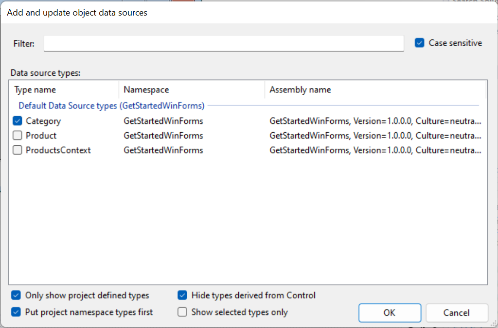

# What's New in EF Core 7.0

EF Core 7.0 (EF7) was [released in November 2022](https://devblogs.microsoft.com/dotnet/announcing-ef7/).

> [!TIP]
> You can run and debug into the samples by [downloading the sample code from GitHub](https://github.com/dotnet/EntityFramework.Docs). Each section links to the source code specific to that section.

EF7 targets .NET 6, and so can be used with either [.NET 6 (LTS)](https://dotnet.microsoft.com/download/dotnet/6.0) or [.NET 7](https://dotnet.microsoft.com/download/dotnet/7.0).

## Sample model

Many of the examples below use a simple model with blogs, posts, tags, and authors:

[!code-csharp[BlogsModel](../../../../samples/core/Miscellaneous/NewInEFCore7/BlogsContext.cs?name=BlogsModel)]

Some of the examples also use aggregate types, which are mapped in different ways in different samples. There is one aggregate type for contacts:

[!code-csharp[ContactDetailsAggregate](../../../../samples/core/Miscellaneous/NewInEFCore7/BlogsContext.cs?name=ContactDetailsAggregate)]

And a second aggregate type for post metadata:

[!code-csharp[PostMetadataAggregate](../../../../samples/core/Miscellaneous/NewInEFCore7/BlogsContext.cs?name=PostMetadataAggregate)]

> [!TIP]
> The sample model can be found in [BlogsContext.cs](https://github.com/dotnet/EntityFramework.Docs/tree/main/samples/core/Miscellaneous/NewInEFCore7/BlogsContext.cs).

## JSON Columns

Most relational databases support columns that contain JSON documents. The JSON in these columns can be drilled into with queries. This allows, for example, filtering and sorting by the elements of the documents, as well as the projection of elements out of the documents into results. JSON columns allow relational databases to take on some of the characteristics of document databases, creating a useful hybrid between the two.

EF7 contains provider-agnostic support for JSON columns, with an implementation for SQL Server. This support allows the mapping of aggregates built from .NET types to JSON documents. Normal LINQ queries can be used on the aggregates, and these will be translated to the appropriate query constructs needed to drill into the JSON. EF7 also supports updating and saving changes to JSON documents.

> [!NOTE]
> SQLite support for JSON is [planned for post EF7](https://github.com/dotnet/efcore/issues/28816). The PostgreSQL and Pomelo MySQL providers already contain some support for JSON columns. We will be working with the authors of those providers to align JSON support across all providers.

### Mapping to JSON columns

In EF Core, aggregate types are defined using `OwnsOne` and `OwnsMany`. For example, consider the aggregate type from our sample model used to store contact information:

<!--
public class ContactDetails
{
    public Address Address { get; init; } = null!;
    public string? Phone { get; set; }
}

public class Address
{
    public Address(string street, string city, string postcode, string country)
    {
        Street = street;
        City = city;
        Postcode = postcode;
        Country = country;
    }

    public string Street { get; set; }
    public string City { get; set; }
    public string Postcode { get; set; }
    public string Country { get; set; }
}
-->
[!code-csharp[ContactDetailsAggregate](../../../../samples/core/Miscellaneous/NewInEFCore7/BlogsContext.cs?name=ContactDetailsAggregate)]

This can then be used in an "owner" entity type, for example, to store the contact details of an author:

```csharp
public class Author
{
    public int Id { get; set; }
    public string Name { get; set; }
    public ContactDetails Contact { get; set; }
}
```

The aggregate type is configured  in `OnModelCreating` using `OwnsOne`:

<!--
    protected override void OnModelCreating(ModelBuilder modelBuilder)
    {
        modelBuilder.Entity<Author>().OwnsOne(
            author => author.Contact, ownedNavigationBuilder =>
            {
                ownedNavigationBuilder.OwnsOne(contactDetails => contactDetails.Address);
            });
    }
-->
[!code-csharp[TableSharingAggregate](../../../../samples/core/Miscellaneous/NewInEFCore7/JsonColumnsSample.cs?name=TableSharingAggregate)]

> [!TIP]
> The code shown here comes from [JsonColumnsSample.cs](https://github.com/dotnet/EntityFramework.Docs/tree/main/samples/core/Miscellaneous/NewInEFCore7/JsonColumnsSample.cs).

By default, relational database providers map aggregate types like this to the same table as the owning entity type. That is, each property of the `ContactDetails` and `Address` classes is mapped to a column in the `Authors` table.

Some saved authors with contact details will look like this:

**Authors**

| Id  | Name             | Contact\_Address\_Street | Contact\_Address\_City | Contact\_Address\_Postcode | Contact\_Address\_Country | Contact\_Phone |
|:----|:-----------------|:-------------------------|:-----------------------|:---------------------------|:--------------------------|:---------------|
| 1   | Maddy Montaquila | 1 Main St                | Camberwick Green       | CW1 5ZH                    | UK                        | 01632 12345    |
| 2   | Jeremy Likness   | 2 Main St                | Chigley                | CW1 5ZH                    | UK                        | 01632 12346    |
| 3   | Daniel Roth      | 3 Main St                | Camberwick Green       | CW1 5ZH                    | UK                        | 01632 12347    |
| 4   | Arthur Vickers   | 15a Main St              | Chigley                | CW1 5ZH                    | United Kingdom            | 01632 22345    |
| 5   | Brice Lambson    | 4 Main St                | Chigley                | CW1 5ZH                    | UK                        | 01632 12349    |

If desired, each entity type making up the aggregate can be mapped to its own table instead:

<!--
    protected override void OnModelCreating(ModelBuilder modelBuilder)
    {
        modelBuilder.Entity<Author>().OwnsOne(
            author => author.Contact, ownedNavigationBuilder =>
            {
                ownedNavigationBuilder.ToTable("Contacts");
                ownedNavigationBuilder.OwnsOne(contactDetails => contactDetails.Address, ownedOwnedNavigationBuilder =>
                {
                    ownedOwnedNavigationBuilder.ToTable("Addresses");
                });
            });
    }
-->
[!code-csharp[TableMappedAggregate](../../../../samples/core/Miscellaneous/NewInEFCore7/JsonColumnsSample.cs?name=TableMappedAggregate)]

The same data is then stored across three tables:

**Authors**

| Id  | Name             |
|:----|:-----------------|
| 1   | Maddy Montaquila |
| 2   | Jeremy Likness   |
| 3   | Daniel Roth      |
| 4   | Arthur Vickers   |
| 5   | Brice Lambson    |

**Contacts**

| AuthorId | Phone       |
|:---------|:------------|
| 1        | 01632 12345 |
| 2        | 01632 12346 |
| 3        | 01632 12347 |
| 4        | 01632 22345 |
| 5        | 01632 12349 |

**Addresses**

| ContactDetailsAuthorId | Street      | City             | Postcode | Country        |
|:-----------------------|:------------|:-----------------|:---------|:---------------|
| 1                      | 1 Main St   | Camberwick Green | CW1 5ZH  | UK             |
| 2                      | 2 Main St   | Chigley          | CW1 5ZH  | UK             |
| 3                      | 3 Main St   | Camberwick Green | CW1 5ZH  | UK             |
| 4                      | 15a Main St | Chigley          | CW1 5ZH  | United Kingdom |
| 5                      | 4 Main St   | Chigley          | CW1 5ZH  | UK             |

Now, for the interesting part. In EF7, the `ContactDetails` aggregate type can be mapped to a JSON column. This requires just one call to `ToJson()` when configuring the aggregate type:  

<!--
    protected override void OnModelCreating(ModelBuilder modelBuilder)
    {
        modelBuilder.Entity<Author>().OwnsOne(
            author => author.Contact, ownedNavigationBuilder =>
            {
                ownedNavigationBuilder.ToJson();
                ownedNavigationBuilder.OwnsOne(contactDetails => contactDetails.Address);
            });
    }
-->
[!code-csharp[JsonColumnAggregate](../../../../samples/core/Miscellaneous/NewInEFCore7/JsonColumnsSample.cs?name=JsonColumnAggregate)]

The `Authors` table will now contain a JSON column for `ContactDetails` populated with a JSON document for each author:

**Authors**

| Id  | Name             | Contact                                                                                                                                                                                                                                                                                             |
|:----|:-----------------|:----------------------------------------------------------------------------------------------------------------------------------------------------------------------------------------------------------------------------------------------------------------------------------------------------|
| 1   | Maddy Montaquila | {<br/>&nbsp;&nbsp;"Phone":"01632 12345",<br/>&nbsp;&nbsp;"Address": {<br/>&nbsp;&nbsp;&nbsp;&nbsp;"City":"Camberwick Green",<br/>&nbsp;&nbsp;&nbsp;&nbsp;"Country":"UK",<br/>&nbsp;&nbsp;&nbsp;&nbsp;"Postcode":"CW1 5ZH",<br/>&nbsp;&nbsp;&nbsp;&nbsp;"Street":"1 Main St"<br/>&nbsp;&nbsp;}<br/>} |
| 2   | Jeremy Likness   | {<br/>&nbsp;&nbsp;"Phone":"01632 12346",<br/>&nbsp;&nbsp;"Address": {<br/>&nbsp;&nbsp;&nbsp;&nbsp;"City":"Chigley",<br/>&nbsp;&nbsp;&nbsp;&nbsp;"Country":"UK",<br/>&nbsp;&nbsp;&nbsp;&nbsp;"Postcode":"CH1 5ZH",<br/>&nbsp;&nbsp;&nbsp;&nbsp;"Street":"2 Main St"<br/>&nbsp;&nbsp;}<br/>}          |
| 3   | Daniel Roth      | {<br/>&nbsp;&nbsp;"Phone":"01632 12347",<br/>&nbsp;&nbsp;"Address": {<br/>&nbsp;&nbsp;&nbsp;&nbsp;"City":"Camberwick Green",<br/>&nbsp;&nbsp;&nbsp;&nbsp;"Country":"UK",<br/>&nbsp;&nbsp;&nbsp;&nbsp;"Postcode":"CW1 5ZH",<br/>&nbsp;&nbsp;&nbsp;&nbsp;"Street":"3 Main St"<br/>&nbsp;&nbsp;}<br/>} |
| 4   | Arthur Vickers   | {<br/>&nbsp;&nbsp;"Phone":"01632 12348",<br/>&nbsp;&nbsp;"Address": {<br/>&nbsp;&nbsp;&nbsp;&nbsp;"City":"Chigley",<br/>&nbsp;&nbsp;&nbsp;&nbsp;"Country":"UK",<br/>&nbsp;&nbsp;&nbsp;&nbsp;"Postcode":"CH1 5ZH",<br/>&nbsp;&nbsp;&nbsp;&nbsp;"Street":"15a Main St"<br/>&nbsp;&nbsp;}<br/>}        |
| 5   | Brice Lambson    | {<br/>&nbsp;&nbsp;"Phone":"01632 12349",<br/>&nbsp;&nbsp;"Address": {<br/>&nbsp;&nbsp;&nbsp;&nbsp;"City":"Chigley",<br/>&nbsp;&nbsp;&nbsp;&nbsp;"Country":"UK",<br/>&nbsp;&nbsp;&nbsp;&nbsp;"Postcode":"CH1 5ZH",<br/>&nbsp;&nbsp;&nbsp;&nbsp;"Street":"4 Main St"<br/>&nbsp;&nbsp;}<br/>}          |

> [!TIP]
> This use of aggregates is very similar to the way JSON documents are mapped when using the EF Core provider for Azure Cosmos DB. JSON columns bring the capabilities of using EF Core against document databases to documents embedded in a relational database.

The JSON documents shown above are very simple, but this mapping capability can also be used with more complex document structures. For example, consider another aggregate type from our sample model, used to represent metadata about a post:

<!--
public class PostMetadata
{
    public PostMetadata(int views)
    {
        Views = views;
    }

    public int Views { get; set; }
    public List<SearchTerm> TopSearches { get; } = new();
    public List<Visits> TopGeographies { get; } = new();
    public List<PostUpdate> Updates { get; } = new();
}

public class SearchTerm
{
    public SearchTerm(string term, int count)
    {
        Term = term;
        Count = count;
    }

    public string Term { get; private set; }
    public int Count { get; private set; }
}

public class Visits
{
    public Visits(double latitude, double longitude, int count)
    {
        Latitude = latitude;
        Longitude = longitude;
        Count = count;
    }

    public double Latitude { get; private set; }
    public double Longitude { get; private set; }
    public int Count { get; private set; }
    public List<string>? Browsers { get; set; }
}

public class PostUpdate
{
    public PostUpdate(IPAddress postedFrom, DateTime updatedOn)
    {
        PostedFrom = postedFrom;
        UpdatedOn = updatedOn;
    }

    public IPAddress PostedFrom { get; private set; }
    public string? UpdatedBy { get; init; }
    public DateTime UpdatedOn { get; private set; }
    public List<Commit> Commits { get; } = new();
}

public class Commit
{
    public Commit(DateTime committedOn, string comment)
    {
        CommittedOn = committedOn;
        Comment = comment;
    }

    public DateTime CommittedOn { get; private set; }
    public string Comment { get; set; }
}
-->
[!code-csharp[PostMetadataAggregate](../../../../samples/core/Miscellaneous/NewInEFCore7/BlogsContext.cs?name=PostMetadataAggregate)]

This aggregate type contains several nested types and collections. Calls to `OwnsOne` and `OwnsMany` are used to map this aggregate type:

<!--
        modelBuilder.Entity<Post>().OwnsOne(
            post => post.Metadata, ownedNavigationBuilder =>
            {
                ownedNavigationBuilder.ToJson();
                ownedNavigationBuilder.OwnsMany(metadata => metadata.TopSearches);
                ownedNavigationBuilder.OwnsMany(metadata => metadata.TopGeographies);
                ownedNavigationBuilder.OwnsMany(
                    metadata => metadata.Updates,
                    ownedOwnedNavigationBuilder => ownedOwnedNavigationBuilder.OwnsMany(update => update.Commits));
            });
-->
[!code-csharp[PostMetadataConfig](../../../../samples/core/Miscellaneous/NewInEFCore7/JsonColumnsSample.cs?name=PostMetadataConfig)]

> [!TIP]
> `ToJson` is only needed on the aggregate root to map the entire aggregate to a JSON document.

With this mapping, EF7 can create and query into a complex JSON document like this:

```json
{
  "Views": 5085,
  "TopGeographies": [
    {
      "Browsers": "Firefox, Netscape",
      "Count": 924,
      "Latitude": 110.793,
      "Longitude": 39.2431
    },
    {
      "Browsers": "Firefox, Netscape",
      "Count": 885,
      "Latitude": 133.793,
      "Longitude": 45.2431
    }
  ],
  "TopSearches": [
    {
      "Count": 9359,
      "Term": "Search #1"
    }
  ],
  "Updates": [
    {
      "PostedFrom": "127.0.0.1",
      "UpdatedBy": "Admin",
      "UpdatedOn": "1996-02-17T19:24:29.5429092Z",
      "Commits": []
    },
    {
      "PostedFrom": "127.0.0.1",
      "UpdatedBy": "Admin",
      "UpdatedOn": "2019-11-24T19:24:29.5429093Z",
      "Commits": [
        {
          "Comment": "Commit #1",
          "CommittedOn": "2022-08-21T00:00:00+01:00"
        }
      ]
    },
    {
      "PostedFrom": "127.0.0.1",
      "UpdatedBy": "Admin",
      "UpdatedOn": "1997-05-28T19:24:29.5429097Z",
      "Commits": [
        {
          "Comment": "Commit #1",
          "CommittedOn": "2022-08-21T00:00:00+01:00"
        },
        {
          "Comment": "Commit #2",
          "CommittedOn": "2022-08-21T00:00:00+01:00"
        }
      ]
    }
  ]
}
```

> [!NOTE]
> Mapping spatial types directly to JSON is not yet supported. The document above uses `double` values as a workaround. Vote for [Support spatial types in JSON columns](https://github.com/dotnet/efcore/issues/28811) if this is something you are interested in.

> [!NOTE]
> Mapping collections of primitive types to JSON is not yet supported. The document above uses a value converter to transform the collection into a comma-separated string. Vote for [Json: add support for collection of primitive types](https://github.com/dotnet/efcore/issues/28688) if this is something you are interested in.

> [!NOTE]
> Mapping of owned types to JSON is not yet supported in conjunction with TPT or TPC inheritance. Vote for [Support JSON properties with TPT/TPC inheritance mapping](https://github.com/dotnet/efcore/issues/28443) if this is something you are interested in.

### Queries into JSON columns

Queries into JSON columns work just the same as querying into any other aggregate type in EF Core. That is, just use LINQ! Here are some examples.

A query for all authors that live in Chigley:

<!--
        var authorsInChigley = await context.Authors
            .Where(author => author.Contact.Address.City == "Chigley")
            .ToListAsync();
-->
[!code-csharp[AuthorsInChigley](../../../../samples/core/Miscellaneous/NewInEFCore7/JsonColumnsSample.cs?name=AuthorsInChigley)]

This query generates the following SQL when using SQL Server:

```sql
SELECT [a].[Id], [a].[Name], JSON_QUERY([a].[Contact],'$')
FROM [Authors] AS [a]
WHERE CAST(JSON_VALUE([a].[Contact],'$.Address.City') AS nvarchar(max)) = N'Chigley'
```

Notice the use of `JSON_VALUE` to get the `City` from the `Address` inside the JSON document.

`Select` can be used to extract and project elements from the JSON document:

<!--
        var postcodesInChigley = await context.Authors
            .Where(author => author.Contact.Address.City == "Chigley")
            .Select(author => author.Contact.Address.Postcode)
            .ToListAsync();
-->
[!code-csharp[PostcodesInChigley](../../../../samples/core/Miscellaneous/NewInEFCore7/JsonColumnsSample.cs?name=PostcodesInChigley)]

This query generates the following SQL:

```sql
SELECT CAST(JSON_VALUE([a].[Contact],'$.Address.Postcode') AS nvarchar(max))
FROM [Authors] AS [a]
WHERE CAST(JSON_VALUE([a].[Contact],'$.Address.City') AS nvarchar(max)) = N'Chigley'
```

Here's an example that does a bit more in the filter and projection, and also orders by the phone number in the JSON document:

<!--
        var orderedAddresses = await context.Authors
            .Where(
                author => (author.Contact.Address.City == "Chigley"
                           && author.Contact.Phone != null)
                          || author.Name.StartsWith("D"))
            .OrderBy(author => author.Contact.Phone)
            .Select(
                author => author.Name + " (" + author.Contact.Address.Street
                          + ", " + author.Contact.Address.City
                          + " " + author.Contact.Address.Postcode + ")")
            .ToListAsync();
-->
[!code-csharp[OrderedAddresses](../../../../samples/core/Miscellaneous/NewInEFCore7/JsonColumnsSample.cs?name=OrderedAddresses)]

This query generates the following SQL:

```sql
SELECT (((((([a].[Name] + N' (') + CAST(JSON_VALUE([a].[Contact],'$.Address.Street') AS nvarchar(max))) + N', ') + CAST(JSON_VALUE([a].[Contact],'$.Address.City') AS nvarchar(max))) + N' ') + CAST(JSON_VALUE([a].[Contact],'$.Address.Postcode') AS nvarchar(max))) + N')'
FROM [Authors] AS [a]
WHERE (CAST(JSON_VALUE([a].[Contact],'$.Address.City') AS nvarchar(max)) = N'Chigley' AND CAST(JSON_VALUE([a].[Contact],'$.Phone') AS nvarchar(max)) IS NOT NULL) OR ([a].[Name] LIKE N'D%')
ORDER BY CAST(JSON_VALUE([a].[Contact],'$.Phone') AS nvarchar(max))
```

And when the JSON document contains collections, then these can be projected out in the results:

<!--
        var postsWithViews = await context.Posts.Where(post => post.Metadata!.Views > 3000)
            .AsNoTracking()
            .Select(
                post => new
                {
                    post.Author!.Name,
                    post.Metadata!.Views,
                    Searches = post.Metadata.TopSearches,
                    Commits = post.Metadata.Updates
                })
            .ToListAsync();
-->
[!code-csharp[PostsWithViews](../../../../samples/core/Miscellaneous/NewInEFCore7/JsonColumnsSample.cs?name=PostsWithViews)]

This query generates the following SQL:

```sql
SELECT [a].[Name], CAST(JSON_VALUE([p].[Metadata],'$.Views') AS int), JSON_QUERY([p].[Metadata],'$.TopSearches'), [p].[Id], JSON_QUERY([p].[Metadata],'$.Updates')
FROM [Posts] AS [p]
LEFT JOIN [Authors] AS [a] ON [p].[AuthorId] = [a].[Id]
WHERE CAST(JSON_VALUE([p].[Metadata],'$.Views') AS int) > 3000
```

> [!NOTE]
> More complex queries involving JSON collections require `jsonpath` support. Vote for [Support jsonpath querying](https://github.com/dotnet/efcore/issues/28616) if this is something you are interested in.

> [!TIP]
> Consider creating indexes to improve query performance in JSON documents. For example, see [Index Json data](/sql/relational-databases/json/index-json-data) when using SQL Server.

### Updating JSON columns

[`SaveChanges` and `SaveChangesAsync`](xref:core/saving/basic) work in the normal way to make updates to a JSON column. For extensive changes, the entire document will be updated. For example, replacing most of the `Contact` document for an author:

<!--
        var jeremy = await context.Authors.SingleAsync(author => author.Name.StartsWith("Jeremy"));

        jeremy.Contact = new() { Address = new("2 Riverside", "Trimbridge", "TB1 5ZS", "UK"), Phone = "01632 88346" };

        await context.SaveChangesAsync();
-->
[!code-csharp[UpdateDocument](../../../../samples/core/Miscellaneous/NewInEFCore7/JsonColumnsSample.cs?name=UpdateDocument)]

In this case, the entire new document is passed as a parameter:

```text
info: 8/30/2022 20:21:24.392 RelationalEventId.CommandExecuted[20101] (Microsoft.EntityFrameworkCore.Database.Command)
      Executed DbCommand (2ms) [Parameters=[@p0='{"Phone":"01632 88346","Address":{"City":"Trimbridge","Country":"UK","Postcode":"TB1 5ZS","Street":"2 Riverside"}}' (Nullable = false) (Size = 114), @p1='2'], CommandType='Text', CommandTimeout='30']
```

Which is then used in the `UPDATE` SQL:

```sql
UPDATE [Authors] SET [Contact] = @p0
OUTPUT 1
WHERE [Id] = @p1;
```

However, if only a sub-document is changed, then EF Core will use a `JSON_MODIFY` command to update only the sub-document. For example, changing the `Address` inside a `Contact` document:

<!--
        var brice = await context.Authors.SingleAsync(author => author.Name.StartsWith("Brice"));

        brice.Contact.Address = new("4 Riverside", "Trimbridge", "TB1 5ZS", "UK");

        await context.SaveChangesAsync();
-->
[!code-csharp[UpdateSubDocument](../../../../samples/core/Miscellaneous/NewInEFCore7/JsonColumnsSample.cs?name=UpdateSubDocument)]

Generates the following parameters:

```text
info: 10/2/2022 15:51:15.895 RelationalEventId.CommandExecuted[20101] (Microsoft.EntityFrameworkCore.Database.Command)
      Executed DbCommand (2ms) [Parameters=[@p0='{"City":"Trimbridge","Country":"UK","Postcode":"TB1 5ZS","Street":"4 Riverside"}' (Nullable = false) (Size = 80), @p1='5'], CommandType='Text', CommandTimeout='30']
```

Which is used in the `UPDATE` via a `JSON_MODIFY` call:

```sql
UPDATE [Authors] SET [Contact] = JSON_MODIFY([Contact], 'strict $.Address', JSON_QUERY(@p0))
OUTPUT 1
WHERE [Id] = @p1;
```

Finally, if only a single property is changed, then EF Core will again use a "JSON_MODIFY" command, this time to patch only the changed property value. For example:

<!--
        var arthur = await context.Authors.SingleAsync(author => author.Name.StartsWith("Arthur"));

        arthur.Contact.Address.Country = "United Kingdom";

        await context.SaveChangesAsync();
-->
[!code-csharp[UpdateProperty](../../../../samples/core/Miscellaneous/NewInEFCore7/JsonColumnsSample.cs?name=UpdateProperty)]

Generates the following parameters:

```text
info: 10/2/2022 15:54:05.112 RelationalEventId.CommandExecuted[20101] (Microsoft.EntityFrameworkCore.Database.Command)
      Executed DbCommand (2ms) [Parameters=[@p0='["United Kingdom"]' (Nullable = false) (Size = 18), @p1='4'], CommandType='Text', CommandTimeout='30']
```

Which are again used with a `JSON_MODIFY`:

```sql
UPDATE [Authors] SET [Contact] = JSON_MODIFY([Contact], 'strict $.Address.Country', JSON_VALUE(@p0, '$[0]'))
OUTPUT 1
WHERE [Id] = @p1;
```

## ExecuteUpdate and ExecuteDelete (Bulk updates)

By default, EF Core [tracks changes to entities](xref:core/change-tracking/index), and then [sends updates to the database](xref:core/saving/index) when one of the `SaveChanges` methods is called. Changes are only sent for properties and relationships that have actually changed. Also, the tracked entities remain in sync with the changes sent to the database. This mechanism is an efficient and convenient way to send general-purpose inserts, updates, and deletes to the database. These changes are also batched to reduce the number of database round-trips.

However, it is sometimes useful to execute update or delete commands on the database without involving the change tracker. EF7 enables this with the new <xref:Microsoft.EntityFrameworkCore.RelationalQueryableExtensions.ExecuteUpdate*> and <xref:Microsoft.EntityFrameworkCore.RelationalQueryableExtensions.ExecuteDelete*> methods. These methods are applied to a LINQ query and will update or delete entities in the database based on the results of that query. Many entities can be updated with a single command and the entities are not loaded into memory, which means this can result in more efficient updates and deletes.

However, keep in mind that:

- The specific changes to make must be specified explicitly; they are not automatically detected by EF Core.
- Any tracked entities will not be kept in sync.
- Additional commands may need to be sent in the correct order so as not to violate database constraints. For example, deleting dependents before a principal can be deleted.

All of this means that the `ExecuteUpdate` and `ExecuteDelete` methods complement, rather than replace, the existing `SaveChanges` mechanism.

### Basic `ExecuteDelete` examples

> [!TIP]
> The code shown here comes from [ExecuteDeleteSample.cs](https://github.com/dotnet/EntityFramework.Docs/tree/main/samples/core/Miscellaneous/NewInEFCore7/ExecuteDeleteSample.cs).

Calling `ExecuteDelete` or `ExecuteDeleteAsync` on a `DbSet` immediately deletes all entities of that `DbSet` from the database. For example, to delete all `Tag` entities:

<!--
        await context.Tags.ExecuteDeleteAsync();
-->
[!code-csharp[DeleteAllTags](../../../../samples/core/Miscellaneous/NewInEFCore7/ExecuteDeleteSample.cs?name=DeleteAllTags)]

This executes the following SQL when using SQL Server:

```sql
DELETE FROM [t]
FROM [Tags] AS [t]
```

More interestingly, the query can contain a filter. For example:

<!--
        await context.Tags.Where(t => t.Text.Contains(".NET")).ExecuteDeleteAsync();
-->
[!code-csharp[DeleteTagsContainingDotNet](../../../../samples/core/Miscellaneous/NewInEFCore7/ExecuteDeleteSample.cs?name=DeleteTagsContainingDotNet)]

This executes the following SQL:

```sql
DELETE FROM [t]
FROM [Tags] AS [t]
WHERE [t].[Text] LIKE N'%.NET%'
```

The query can also use more complex filters, including navigations to other types. For example, to delete tags only from old blog posts:

<!--
        await context.Tags.Where(t => t.Posts.All(e => e.PublishedOn.Year < 2022)).ExecuteDeleteAsync();
-->
[!code-csharp[DeleteTagsFromOldPosts](../../../../samples/core/Miscellaneous/NewInEFCore7/ExecuteDeleteSample.cs?name=DeleteTagsFromOldPosts)]

Which executes:

```sql
DELETE FROM [t]
FROM [Tags] AS [t]
WHERE NOT EXISTS (
    SELECT 1
    FROM [PostTag] AS [p]
    INNER JOIN [Posts] AS [p0] ON [p].[PostsId] = [p0].[Id]
    WHERE [t].[Id] = [p].[TagsId] AND NOT (DATEPART(year, [p0].[PublishedOn]) < 2022))
```

### Basic `ExecuteUpdate` examples

> [!TIP]
> The code shown here comes from [ExecuteUpdateSample.cs](https://github.com/dotnet/EntityFramework.Docs/tree/main/samples/core/Miscellaneous/NewInEFCore7/ExecuteUpdateSample.cs).

`ExecuteUpdate` and `ExecuteUpdateAsync` behave in a very similar way to the `ExecuteDelete` methods. The main difference is that an update requires knowing _which_ properties to update, and _how_ to update them. This is achieved using one or more calls to `SetProperty`. For example, to update the `Name` of every blog:

<!--
        await context.Blogs.ExecuteUpdateAsync(
            s => s.SetProperty(b => b.Name, b => b.Name + " *Featured!*"));
-->
[!code-csharp[UpdateAllBlogs](../../../../samples/core/Miscellaneous/NewInEFCore7/ExecuteUpdateSample.cs?name=UpdateAllBlogs)]

The first parameter of `SetProperty` specifies which property to update; in this case, `Blog.Name`. The second parameter specifies how the new value should be calculated; in this case, by taking the existing value and appending `"*Featured!*"`. The resulting SQL is:

```sql
UPDATE [b]
SET [b].[Name] = [b].[Name] + N' *Featured!*'
FROM [Blogs] AS [b]
```

As with `ExecuteDelete`, the query can be used to filter which entities are updated. In addition, multiple calls to `SetProperty` can be used to update more than one property on the target entity. For example, to update the `Title` and `Content` of all posts published before 2022:

<!--
            .Where(p => p.PublishedOn.Year < 2022)
            .ExecuteUpdateAsync(s => s
                .SetProperty(b => b.Title, b => b.Title + " (" + b.PublishedOn.Year + ")")
                .SetProperty(b => b.Content, b => b.Content + " ( This content was published in " + b.PublishedOn.Year + ")"));
-->
[!code-csharp[UpdateOldPosts](../../../../samples/core/Miscellaneous/NewInEFCore7/ExecuteUpdateSample.cs?name=UpdateOldPosts)]

In this case the generated SQL is a bit more complicated:

```sql
UPDATE [p]
SET [p].[Content] = (([p].[Content] + N' ( This content was published in ') + COALESCE(CAST(DATEPART(year, [p].[PublishedOn]) AS nvarchar(max)), N'')) + N')',
    [p].[Title] = (([p].[Title] + N' (') + COALESCE(CAST(DATEPART(year, [p].[PublishedOn]) AS nvarchar(max)), N'')) + N')'
FROM [Posts] AS [p]
WHERE DATEPART(year, [p].[PublishedOn]) < 2022
```

Finally, again as with `ExecuteDelete`, the filter can reference other tables. For example, to update all tags from old posts:

<!--
        await context.Tags
            .Where(t => t.Posts.All(e => e.PublishedOn.Year < 2022))
            .ExecuteUpdateAsync(s => s.SetProperty(t => t.Text, t => t.Text + " (old)"));
-->
[!code-csharp[UpdateTagsOnOldPosts](../../../../samples/core/Miscellaneous/NewInEFCore7/ExecuteUpdateSample.cs?name=UpdateTagsOnOldPosts)]

Which generates:

```sql
UPDATE [t]
SET [t].[Text] = [t].[Text] + N' (old)'
FROM [Tags] AS [t]
WHERE NOT EXISTS (
    SELECT 1
    FROM [PostTag] AS [p]
    INNER JOIN [Posts] AS [p0] ON [p].[PostsId] = [p0].[Id]
    WHERE [t].[Id] = [p].[TagsId] AND NOT (DATEPART(year, [p0].[PublishedOn]) < 2022))
```

For more information and code samples on `ExecuteUpdate` and `ExecuteDelete`, see [ExecuteUpdate and ExecuteDelete](xref:core/saving/execute-insert-update-delete).

### Inheritance and multiple tables

`ExecuteUpdate` and `ExecuteDelete` can only act on a single table. This has implications when working with different [inheritance mapping strategies](xref:core/modeling/inheritance). Generally, there are no problems when using the TPH mapping strategy, since there is only one table to modify. For example, deleting all `FeaturedPost` entities:

<!--
        await context.Set<FeaturedPost>().ExecuteDeleteAsync();
-->
[!code-csharp[DeleteFeaturedPosts](../../../../samples/core/Miscellaneous/NewInEFCore7/ExecuteDeleteSample.cs?name=DeleteFeaturedPosts)]

Generates the following SQL when using TPH mapping:

```sql
DELETE FROM [p]
FROM [Posts] AS [p]
WHERE [p].[Discriminator] = N'FeaturedPost'
```

There are also no issues for this case when using the TPC mapping strategy, since again only changes to a single table are needed:

```sql
DELETE FROM [f]
FROM [FeaturedPosts] AS [f]
```

However, attempting this when using the TPT mapping strategy will fail since it would require deleting rows from two different tables.

Adding a filter to the query often means the operation will fail with both the TPC and TPT strategies. This is again because the rows may need to be deleted from multiple tables. For example, this query:

<!--
        await context.Posts.Where(p => p.Author.Name.StartsWith("Arthur")).ExecuteDeleteAsync();
-->
[!code-csharp[DeletePostsForGivenAuthor](../../../../samples/core/Miscellaneous/NewInEFCore7/ExecuteDeleteSample.cs?name=DeletePostsForGivenAuthor)]

Generates the following SQL when using TPH:

```sql
DELETE FROM [p]
FROM [Posts] AS [p]
LEFT JOIN [Authors] AS [a] ON [p].[AuthorId] = [a].[Id]
WHERE [a].[Name] IS NOT NULL AND ([a].[Name] LIKE N'Arthur%')
```

But fails when using TPC or TPT.

> [!TIP]
> [Issue #10879](https://github.com/dotnet/efcore/issues/28520) tracks adding support for automatically sending multiple commands in these scenarios. Vote for this issue if it's something you would like to see implemented.

### `ExecuteDelete` and relationships

As mentioned above, it may be necessary to delete or update dependent entities before the principal of a relationship can be deleted. For example, each `Post` is a dependent of its associated `Author`. This means that an author cannot be deleted if a post still references it; doing so will violate the foreign key constraint in the database. For example, attempting this:

```csharp
await context.Authors.ExecuteDeleteAsync();
```

Will result in the following exception on SQL Server:

> Microsoft.Data.SqlClient.SqlException (0x80131904): The DELETE statement conflicted with the REFERENCE constraint "FK_Posts_Authors_AuthorId". The conflict occurred in database "TphBlogsContext", table "dbo.Posts", column 'AuthorId'.
The statement has been terminated.

To fix this, we must first either delete the posts, or sever the relationship between each post and its author by setting `AuthorId` foreign key property to null. For example, using the delete option:

<!--
        await context.Posts.TagWith("Deleting posts...").ExecuteDeleteAsync();
        await context.Authors.TagWith("Deleting authors...").ExecuteDeleteAsync();
-->
[!code-csharp[DeleteAllAuthors](../../../../samples/core/Miscellaneous/NewInEFCore7/ExecuteDeleteSample.cs?name=DeleteAllAuthors)]

> [!TIP]
> `TagWith` can be used to tag `ExecuteDelete` or `ExecuteUpdate` in the same way as it tags normal queries.

This results in two separate commands; the first to delete the dependents:

```sql
-- Deleting posts...

DELETE FROM [p]
FROM [Posts] AS [p]
```

And the second to delete the principals:

```sql
-- Deleting authors...

DELETE FROM [a]
FROM [Authors] AS [a]
```

> [!IMPORTANT]
> Multiple `ExecuteDelete` and `ExecuteUpdate` commands will not be contained in a single transaction by default. However, the [DbContext transaction APIs](xref:core/saving/transactions) can be used in the normal way to wrap these commands in a transaction.

> [!TIP]
> Sending these commands in a single round-trip depends on [Issue #10879](https://github.com/dotnet/efcore/issues/10879). Vote for this issue if it's something you would like to see implemented.

Configuring [cascade deletes](xref:core/saving/cascade-delete) in the database can be very useful here. In our model, the relationship between `Blog` and `Post` is required, which causes EF Core to configure a cascade delete by convention.  This means when a blog is deleted from the database, then all its dependent posts will also be deleted. It then follows that to delete all blogs and posts we need only delete the blogs:

<!--
        await context.Blogs.ExecuteDeleteAsync();
-->
[!code-csharp[DeleteAllBlogsAndPosts](../../../../samples/core/Miscellaneous/NewInEFCore7/ExecuteDeleteSample.cs?name=DeleteAllBlogsAndPosts)]

This results in the following SQL:

```sql
DELETE FROM [b]
FROM [Blogs] AS [b]
```

Which, as it is deleting a blog, will also cause all related posts to be deleted by the configured cascade delete.

## Faster SaveChanges

In EF7, the performance of <xref:Microsoft.EntityFrameworkCore.DbContext.SaveChanges*> and <xref:Microsoft.EntityFrameworkCore.DbContext.SaveChangesAsync*> has been significantly improved. In some scenarios, saving changes is now up to four times faster than with EF Core 6.0!

Most of these improvements come from:

- Performing fewer roundtrips to the database
- Generating faster SQL

Some examples of these improvements are shown below.

> [!NOTE]
> See [Announcing Entity Framework Core 7 Preview 6: Performance Edition](https://devblogs.microsoft.com/dotnet/announcing-ef-core-7-preview6-performance-optimizations/) on the .NET Blog for an in-depth discussion of these changes.

> [!TIP]
> The code shown here comes from [SaveChangesPerformanceSample.cs](https://github.com/dotnet/EntityFramework.Docs/tree/main/samples/core/Miscellaneous/NewInEFCore7/SaveChangesPerformanceSample.cs).

### Unneeded transactions are eliminated

All modern relational databases guarantee transactionality for (most) single SQL statements. That is, the statement will never be only partially completed, even if an error occurs. EF7 avoids starting an explicit transaction in these cases.

For example, looking at the logging for the following call to `SaveChanges`:

<!--
            await context.AddAsync(new Blog { Name = "MyBlog" });
            await context.SaveChangesAsync();
-->
[!code-csharp[SimpleInsert](../../../../samples/core/Miscellaneous/NewInEFCore7/SaveChangesPerformanceSample.cs?name=SimpleInsert)]

Shows that in EF Core 6.0, the `INSERT` command is wrapped by commands to begin and and then commit a transaction:

```output
dbug: 9/29/2022 11:43:09.196 RelationalEventId.TransactionStarted[20200] (Microsoft.EntityFrameworkCore.Database.Transaction)
      Began transaction with isolation level 'ReadCommitted'.
info: 9/29/2022 11:43:09.265 RelationalEventId.CommandExecuted[20101] (Microsoft.EntityFrameworkCore.Database.Command)
      Executed DbCommand (27ms) [Parameters=[@p0='MyBlog' (Nullable = false) (Size = 4000)], CommandType='Text', CommandTimeout='30']
      SET NOCOUNT ON;
      INSERT INTO [Blogs] ([Name])
      VALUES (@p0);
      SELECT [Id]
      FROM [Blogs]
      WHERE @@ROWCOUNT = 1 AND [Id] = scope_identity();
dbug: 9/29/2022 11:43:09.297 RelationalEventId.TransactionCommitted[20202] (Microsoft.EntityFrameworkCore.Database.Transaction)
      Committed transaction.
```

EF7 detects that the transaction is not needed here and so removes these calls:

```output
info: 9/29/2022 11:42:34.776 RelationalEventId.CommandExecuted[20101] (Microsoft.EntityFrameworkCore.Database.Command)
      Executed DbCommand (25ms) [Parameters=[@p0='MyBlog' (Nullable = false) (Size = 4000)], CommandType='Text', CommandTimeout='30']
      SET IMPLICIT_TRANSACTIONS OFF;
      SET NOCOUNT ON;
      INSERT INTO [Blogs] ([Name])
      OUTPUT INSERTED.[Id]
      VALUES (@p0);
```

This removes two database roundtrips, which can make a huge difference to overall performance, especially when the latency of calls to the database is high. In typical production systems, the database is not co-located on the same machine as the application. This means latency is often relatively high, making this optimization particularly effective in real-world production systems.

### Improved SQL for simple Identity insert

The case above inserts a single row with an `IDENTITY` key column and no other database-generated values. EF7 simplifies the SQL in this case by using `OUTPUT INSERTED`. While this simplification is not valid for many other cases, it is still important to improve since this kind of single-row insert is very common in many applications.

### Inserting multiple rows

In EF Core 6.0, the default approach for inserting multiple rows was driven by limitations in SQL Server support for tables with triggers. We wanted to make sure that the default experience worked even for the minority of users with triggers in their tables. This meant that we could not use a simple `OUTPUT` clause, because, on SQL Server, this [doesn't work with triggers](/sql/t-sql/queries/output-clause-transact-sql#triggers). Instead, when inserting multiple entities, EF Core 6.0 generated some fairly convoluted SQL. For example, this call to `SaveChanges`:

<!--
            for (var i = 0; i < 4; i++)
            {
                await context.AddAsync(new Blog { Name = "Foo" + i });
            }
            await context.SaveChangesAsync();
-->
[!code-csharp[MultipleInsert](../../../../samples/core/Miscellaneous/NewInEFCore7/SaveChangesPerformanceSample.cs?name=MultipleInsert)]

Results in the following actions when run against SQL Server with EF Core 6.0:

```output
dbug: 9/30/2022 17:19:51.919 RelationalEventId.TransactionStarted[20200] (Microsoft.EntityFrameworkCore.Database.Transaction)
      Began transaction with isolation level 'ReadCommitted'.
info: 9/30/2022 17:19:51.993 RelationalEventId.CommandExecuted[20101] (Microsoft.EntityFrameworkCore.Database.Command)
      Executed DbCommand (27ms) [Parameters=[@p0='Foo0' (Nullable = false) (Size = 4000), @p1='Foo1' (Nullable = false) (Size = 4000), @p2='Foo2' (Nullable = false) (Size = 4000), @p3='Foo3' (Nullable = false) (Size = 4000)], CommandType='Text', CommandTimeout='30']
      SET NOCOUNT ON;
      DECLARE @inserted0 TABLE ([Id] int, [_Position] [int]);
      MERGE [Blogs] USING (
      VALUES (@p0, 0),
      (@p1, 1),
      (@p2, 2),
      (@p3, 3)) AS i ([Name], _Position) ON 1=0
      WHEN NOT MATCHED THEN
      INSERT ([Name])
      VALUES (i.[Name])
      OUTPUT INSERTED.[Id], i._Position
      INTO @inserted0;

      SELECT [i].[Id] FROM @inserted0 i
      ORDER BY [i].[_Position];
dbug: 9/30/2022 17:19:52.023 RelationalEventId.TransactionCommitted[20202] (Microsoft.EntityFrameworkCore.Database.Transaction)
      Committed transaction.
```

> [!IMPORTANT]
> Even though this is complicated, batching multiple inserts like this is still significantly faster than sending a single command for each insert.

In EF7, you can still get this SQL if your tables contain triggers, but for the common case we now generate much more efficient, if still somewhat complex, commands:

```output
info: 9/30/2022 17:40:37.612 RelationalEventId.CommandExecuted[20101] (Microsoft.EntityFrameworkCore.Database.Command)
      Executed DbCommand (4ms) [Parameters=[@p0='Foo0' (Nullable = false) (Size = 4000), @p1='Foo1' (Nullable = false) (Size = 4000), @p2='Foo2' (Nullable = false) (Size = 4000), @p3='Foo3' (Nullable = false) (Size = 4000)], CommandType='Text', CommandTimeout='30']
      SET IMPLICIT_TRANSACTIONS OFF;
      SET NOCOUNT ON;
      MERGE [Blogs] USING (
      VALUES (@p0, 0),
      (@p1, 1),
      (@p2, 2),
      (@p3, 3)) AS i ([Name], _Position) ON 1=0
      WHEN NOT MATCHED THEN
      INSERT ([Name])
      VALUES (i.[Name])
      OUTPUT INSERTED.[Id], i._Position;
```

The transaction is gone, as in the single insert case, because `MERGE` is a single statement protected by an implicit transaction. Also, the temporary table is gone and the OUTPUT clause now sends the generated IDs directly back to the client. This can be **four times faster than on EF Core 6.0**, depending on environmental factors such as latency between the application and database.

### Triggers

If the table has triggers, then the call to `SaveChanges` in the code above will throw an exception:

> Unhandled exception. Microsoft.EntityFrameworkCore.DbUpdateException:</br>
> Could not save changes because the target table has database triggers. Please configure your entity type accordingly, see `https://aka.ms/efcore-docs-sqlserver-save-changes-and-triggers` for more information.</br>
> ---> Microsoft.Data.SqlClient.SqlException (0x80131904):</br>
> The target table 'BlogsWithTriggers' of the DML statement cannot have any enabled triggers if the statement contains an OUTPUT clause without INTO clause.

The following code can be used to inform EF Core that the table has a trigger:

<!--
            modelBuilder.Entity<BlogWithTrigger>()
                .ToTable(tb => tb.HasTrigger("TRG_InsertUpdateBlog"));
-->
[!code-csharp[HasTrigger](../../../../samples/core/Miscellaneous/NewInEFCore7/SaveChangesPerformanceSample.cs?name=HasTrigger)]

EF7 will then revert to the EF Core 6.0 SQL when sending insert and update commands for this table.

For more information, including a convention to automatically configure all mapped tables with triggers, see [SQL Server tables with triggers now require special EF Core configuration](xref:core/what-is-new/ef-core-7.0/breaking-changes#sqlserver-tables-with-triggers) in the EF7 breaking changes documentation.

### Fewer roundtrips for inserting graphs

Consider inserting a graph of entities containing a new principal entity and also new dependent entities with foreign keys that reference the new principal. For example:

<!--
            await context.AddAsync(new Blog
            {
                Name = "MyBlog",
                Posts =
                {
                    new() { Title = "My first post" },
                    new() { Title = "My second post" }
                }
            });
            await context.SaveChangesAsync();
-->
[!code-csharp[InsertGraph](../../../../samples/core/Miscellaneous/NewInEFCore7/SaveChangesPerformanceSample.cs?name=InsertGraph)]

If the principal's primary key is generated by the database, then the value to set for the foreign key in the dependent is not known until the principal has been inserted. EF Core generates two roundtrips for this--one to insert the principal and get back the new primary key, and a second to insert the dependents with the foreign key value set. And since there are two statements for this, a transaction is needed, meaning there are in total four roundtrips:

```output
dbug: 10/1/2022 13:12:02.517 RelationalEventId.TransactionStarted[20200] (Microsoft.EntityFrameworkCore.Database.Transaction)
      Began transaction with isolation level 'ReadCommitted'.
info: 10/1/2022 13:12:02.517 RelationalEventId.CommandExecuted[20101] (Microsoft.EntityFrameworkCore.Database.Command)
      Executed DbCommand (0ms) [Parameters=[@p0='MyBlog' (Nullable = false) (Size = 4000)], CommandType='Text', CommandTimeout='30']
      SET IMPLICIT_TRANSACTIONS OFF;
      SET NOCOUNT ON;
      INSERT INTO [Blogs] ([Name])
      OUTPUT INSERTED.[Id]
      VALUES (@p0);
info: 10/1/2022 13:12:02.529 RelationalEventId.CommandExecuted[20101] (Microsoft.EntityFrameworkCore.Database.Command)
      Executed DbCommand (5ms) [Parameters=[@p1='6', @p2='My first post' (Nullable = false) (Size = 4000), @p3='6', @p4='My second post' (Nullable = false) (Size = 4000)], CommandType='Text', CommandTimeout='30']
      SET IMPLICIT_TRANSACTIONS OFF;
      SET NOCOUNT ON;
      MERGE [Post] USING (
      VALUES (@p1, @p2, 0),
      (@p3, @p4, 1)) AS i ([BlogId], [Title], _Position) ON 1=0
      WHEN NOT MATCHED THEN
      INSERT ([BlogId], [Title])
      VALUES (i.[BlogId], i.[Title])
      OUTPUT INSERTED.[Id], i._Position;
dbug: 10/1/2022 13:12:02.531 RelationalEventId.TransactionCommitted[20202] (Microsoft.EntityFrameworkCore.Database.Transaction)
      Committed transaction.
```

However, in some cases, the primary key value is known before the principal is inserted. This includes:

- Key values that are not automatically generated
- Key values that are generated on the client, such as <xref:System.Guid> keys
- Key values that are generated on the server in batches, such as when using a hi-lo value generator

In EF7, these cases are now optimized into a single round-trip. For example, in the case above on SQL Server, the `Blog.Id` primary key can be configured to use the hi-lo generation strategy:

<!--
            modelBuilder.Entity<Blog>().Property(e => e.Id).UseHiLo();
            modelBuilder.Entity<Post>().Property(e => e.Id).UseHiLo();
-->
[!code-csharp[UseHiLo](../../../../samples/core/Miscellaneous/NewInEFCore7/SaveChangesPerformanceSample.cs?name=UseHiLo)]

The `SaveChanges` call from above is now optimized to a single roundtrip for the inserts.

```output
dbug: 10/1/2022 21:51:55.805 RelationalEventId.TransactionStarted[20200] (Microsoft.EntityFrameworkCore.Database.Transaction)
      Began transaction with isolation level 'ReadCommitted'.
info: 10/1/2022 21:51:55.806 RelationalEventId.CommandExecuted[20101] (Microsoft.EntityFrameworkCore.Database.Command)
      Executed DbCommand (0ms) [Parameters=[@p0='9', @p1='MyBlog' (Nullable = false) (Size = 4000), @p2='10', @p3='9', @p4='My first post' (Nullable = false) (Size = 4000), @p5='11', @p6='9', @p7='My second post' (Nullable = false) (Size = 4000)], CommandType='Text', CommandTimeout='30']
      SET NOCOUNT ON;
      INSERT INTO [Blogs] ([Id], [Name])
      VALUES (@p0, @p1);
      INSERT INTO [Posts] ([Id], [BlogId], [Title])
      VALUES (@p2, @p3, @p4),
      (@p5, @p6, @p7);
dbug: 10/1/2022 21:51:55.807 RelationalEventId.TransactionCommitted[20202] (Microsoft.EntityFrameworkCore.Database.Transaction)
      Committed transaction.
```

Notice that a transaction is still needed here. This is because inserts are being made into two separate tables.

EF7 also uses a single batch in other cases where EF Core 6.0 would create more than one. For example, when deleting and inserting rows into the same table.

### The value of SaveChanges

As some of the examples here show, saving results to the database can be a complex business. This is where using something like EF Core really shows its value. EF Core:

- Batches multiple insert, update, and delete commands together to reduce roundtrips
- Figures out if an explicit transaction is needed or not
- Determines what order to insert, update, and delete entities so that database constraints are not violated
- Ensures database generated values are returned efficiently and propagated back into entities
- Automatically sets foreign key values using the values generated for primary keys
- Detect concurrency conflicts

In addition, different database systems require different SQL for many of these cases. The EF Core database provider works with EF Core to ensure correct and efficient commands are sent for each case.

## Table-per-concrete-type (TPC) inheritance mapping

By default, EF Core maps an inheritance hierarchy of .NET types to a single database table. This is known as the [table-per-hierarchy (TPH)](xref:core/modeling/inheritance#table-per-hierarchy-and-discriminator-configuration) mapping strategy. EF Core 5.0 introduced the [table-per-type (TPT)](xref:core/modeling/inheritance#table-per-type-configuration) strategy, which supports mapping each .NET type to a different database table. EF7 introduces the table-per-concrete-type (TPC) strategy. TPC also maps .NET types to different tables, but in a way that addresses some common performance issues with the TPT strategy.

> [!TIP]
> The code shown here comes from [TpcInheritanceSample.cs](https://github.com/dotnet/EntityFramework.Docs/tree/main/samples/core/Miscellaneous/NewInEFCore7/TpcInheritanceSample.cs).

> [!TIP]
> The EF Team demonstrated and talked in depth about TPC mapping in an episode of the .NET Data Community Standup. As with [all Community Standup episodes](https://aka.ms/efstandups), you can [watch the TPC episode now on YouTube](https://youtu.be/HaL6DKW1mrg).

### TPC database schema

The TPC strategy is similar to the TPT strategy except that a different table is created for every _concrete_ type in the hierarchy, but tables are **not** created for _abstract_ types--hence the name “table-per-concrete-type”. As with TPT, the table itself indicates the type of the saved object. However, unlike TPT mapping, each table contains columns for every property in the concrete type and its base types. TPC database schemas are denormalized.

For example, consider mapping this hierarchy:

<!--
    public abstract class Animal
    {
        protected Animal(string name)
        {
            Name = name;
        }

        public int Id { get; set; }
        public string Name { get; set; }
        public abstract string Species { get; }

        public Food? Food { get; set; }
    }

    public abstract class Pet : Animal
    {
        protected Pet(string name)
            : base(name)
        {
        }

        public string? Vet { get; set; }

        public ICollection<Human> Humans { get; } = new List<Human>();
    }

    public class FarmAnimal : Animal
    {
        public FarmAnimal(string name, string species)
            : base(name)
        {
            Species = species;
        }

        public override string Species { get; }

        [Precision(18, 2)]
        public decimal Value { get; set; }

        public override string ToString()
            => $"Farm animal '{Name}' ({Species}/{Id}) worth {Value:C} eats {Food?.ToString() ?? "<Unknown>"}";
    }

    public class Cat : Pet
    {
        public Cat(string name, string educationLevel)
            : base(name)
        {
            EducationLevel = educationLevel;
        }

        public string EducationLevel { get; set; }
        public override string Species => "Felis catus";

        public override string ToString()
            => $"Cat '{Name}' ({Species}/{Id}) with education '{EducationLevel}' eats {Food?.ToString() ?? "<Unknown>"}";
    }

    public class Dog : Pet
    {
        public Dog(string name, string favoriteToy)
            : base(name)
        {
            FavoriteToy = favoriteToy;
        }

        public string FavoriteToy { get; set; }
        public override string Species => "Canis familiaris";

        public override string ToString()
            => $"Dog '{Name}' ({Species}/{Id}) with favorite toy '{FavoriteToy}' eats {Food?.ToString() ?? "<Unknown>"}";
    }

    public class Human : Animal
    {
        public Human(string name)
            : base(name)
        {
        }

        public override string Species => "Homo sapiens";

        public Animal? FavoriteAnimal { get; set; }
        public ICollection<Pet> Pets { get; } = new List<Pet>();

        public override string ToString()
            => $"Human '{Name}' ({Species}/{Id}) with favorite animal '{FavoriteAnimal?.Name ?? "<Unknown>"}'" +
               $" eats {Food?.ToString() ?? "<Unknown>"}";
    }
-->
[!code-csharp[AnimalsHierarchy](../../../../samples/core/Miscellaneous/NewInEFCore7/TpcInheritanceSample.cs?name=AnimalsHierarchy)]

When using SQL Server, the tables created for this hierarchy are:

```sql
CREATE TABLE [Cats] (
    [Id] int NOT NULL DEFAULT (NEXT VALUE FOR [AnimalSequence]),
    [Name] nvarchar(max) NOT NULL,
    [FoodId] uniqueidentifier NULL,
    [Vet] nvarchar(max) NULL,
    [EducationLevel] nvarchar(max) NOT NULL,
    CONSTRAINT [PK_Cats] PRIMARY KEY ([Id]));

CREATE TABLE [Dogs] (
    [Id] int NOT NULL DEFAULT (NEXT VALUE FOR [AnimalSequence]),
    [Name] nvarchar(max) NOT NULL,
    [FoodId] uniqueidentifier NULL,
    [Vet] nvarchar(max) NULL,
    [FavoriteToy] nvarchar(max) NOT NULL,
    CONSTRAINT [PK_Dogs] PRIMARY KEY ([Id]));

CREATE TABLE [FarmAnimals] (
    [Id] int NOT NULL DEFAULT (NEXT VALUE FOR [AnimalSequence]),
    [Name] nvarchar(max) NOT NULL,
    [FoodId] uniqueidentifier NULL,
    [Value] decimal(18,2) NOT NULL,
    [Species] nvarchar(max) NOT NULL,
    CONSTRAINT [PK_FarmAnimals] PRIMARY KEY ([Id]));

CREATE TABLE [Humans] (
    [Id] int NOT NULL DEFAULT (NEXT VALUE FOR [AnimalSequence]),
    [Name] nvarchar(max) NOT NULL,
    [FoodId] uniqueidentifier NULL,
    [FavoriteAnimalId] int NULL,
    CONSTRAINT [PK_Humans] PRIMARY KEY ([Id]));
```

Notice that:

- There are no tables for the `Animal` or `Pet` types, since these are `abstract` in the object model. Remember that C# does not allow instances of abstract types, and there is therefore no situation where an abstract type instance will be saved to the database.
- The mapping of properties in base types is repeated for each concrete type. For example, every table has a `Name` column, and both Cats and Dogs have a `Vet` column.

- Saving some data into this database results in the following:

**Cats table**

| Id  | Name   | FoodId                               | Vet                  | EducationLevel |
|:----|:-------|:-------------------------------------|:---------------------|:---------------|
| 1   | Alice  | 99ca3e98-b26d-4a0c-d4ae-08da7aca624f | Pengelly             | MBA            |
| 2   | Mac    | 99ca3e98-b26d-4a0c-d4ae-08da7aca624f | Pengelly             | Preschool      |
| 8   | Baxter | 5dc5019e-6f72-454b-d4b0-08da7aca624f | Bothell Pet Hospital | BSc            |

**Dogs table**

| Id  | Name  | FoodId                               | Vet      | FavoriteToy  |
|:----|:------|:-------------------------------------|:---------|:-------------|
| 3   | Toast | 011aaf6f-d588-4fad-d4ac-08da7aca624f | Pengelly | Mr. Squirrel |

**FarmAnimals table**

| Id  | Name  | FoodId                               | Value  | Species                |
|:----|:------|:-------------------------------------|:-------|:-----------------------|
| 4   | Clyde | 1d495075-f527-4498-d4af-08da7aca624f | 100.00 | Equus africanus asinus |

**Humans table**

| Id  | Name   | FoodId                               | FavoriteAnimalId      |
|:----|:-------|:-------------------------------------|:----------------------|
| 5   | Wendy  | 5418fd81-7660-432f-d4b1-08da7aca624f | 2                     |
| 6   | Arthur | 59b495d4-0414-46bf-d4ad-08da7aca624f | 1                     |
| 9   | Katie  | null                                 | 8                     |

Notice that, unlike with TPT mapping, all the information for a single object is contained in a single table. And, unlike with TPH mapping, there is no combination of column and row in any table where that is never used by the model. We'll see below how these characteristics can be important for queries and storage.

### Configuring TPC inheritance

All types in an inheritance hierarchy must be explicitly included in the model when mapping the hierarchy with EF Core. This can be done by creating `DbSet` properties on your `DbContext` for every type:

<!--
        public DbSet<Animal> Animals => Set<Animal>();
        public DbSet<Pet> Pets => Set<Pet>();
        public DbSet<FarmAnimal> FarmAnimals => Set<FarmAnimal>();
        public DbSet<Cat> Cats => Set<Cat>();
        public DbSet<Dog> Dogs => Set<Dog>();
        public DbSet<Human> Humans => Set<Human>();
-->
[!code-csharp[AnimalSets](../../../../samples/core/Miscellaneous/NewInEFCore7/TpcInheritanceSample.cs?name=AnimalSets)]

Or by using the `Entity` method in `OnModelCreating`:

<!--
            modelBuilder.Entity<Animal>();
            modelBuilder.Entity<Pet>();
            modelBuilder.Entity<Cat>();
            modelBuilder.Entity<Dog>();
            modelBuilder.Entity<FarmAnimal>();
            modelBuilder.Entity<Human>();
-->
[!code-csharp[AnimalsInModelBuilder](../../../../samples/core/Miscellaneous/NewInEFCore7/TpcInheritanceSample.cs?name=AnimalsInModelBuilder)]

> [!IMPORTANT]
> This is different from the legacy EF6 behavior, where derived types of mapped base types would be automatically discovered if they were contained in the same assembly.

Nothing else needs to be done to map the hierarchy as TPH, since it is the default strategy. However, starting with EF7, TPH can be made explicit by calling `UseTphMappingStrategy` on the base type of the hierarchy:

<!--
            modelBuilder.Entity<Animal>().UseTphMappingStrategy();
-->
[!code-csharp[UseTphMappingStrategy](../../../../samples/core/Miscellaneous/NewInEFCore7/TpcInheritanceSample.cs?name=UseTphMappingStrategy)]

To use TPT instead, change this to `UseTptMappingStrategy`:

<!--
            modelBuilder.Entity<Animal>().UseTptMappingStrategy();
-->
[!code-csharp[UseTptMappingStrategy](../../../../samples/core/Miscellaneous/NewInEFCore7/TpcInheritanceSample.cs?name=UseTptMappingStrategy)]

Likewise, `UseTpcMappingStrategy` is used to configure TPC:

<!--
            modelBuilder.Entity<Animal>().UseTpcMappingStrategy();
-->
[!code-csharp[UseTpcMappingStrategy](../../../../samples/core/Miscellaneous/NewInEFCore7/TpcInheritanceSample.cs?name=UseTpcMappingStrategy)]

In each case, the table name used for each type is taken from the `DbSet` property name on your `DbContext`, or [can be configured](xref:core/modeling/entity-types#table-name) using the `ToTable` builder method, or the `[Table]` attribute.

### TPC query performance

For queries, the TPC strategy is an improvement over TPT because it ensures that the information for a given entity instance is always stored in a single table. This means the TPC strategy can be useful when the mapped hierarchy is large and has many concrete (usually leaf) types, each with a large number of properties, and where only a small subset of types are used in most queries.

The SQL generated for three simple LINQ queries can be used to observe where TPC does well when compared to TPH and TPT. These queries are:

1. A query that returns entities of all types in the hierarchy:

   ```csharp
   context.Animals.ToList();
   ```

2. A query that returns entities from a subset of types in the hierarchy:

   ```csharp
   context.Pets.ToList();
   ```

3. A query that returns only entities from a single leaf type in the hierarchy:

   ```csharp
   context.Cats.ToList();
   ```

#### TPH queries

When using TPH, all three queries only query a single table, but with different filters on the discriminator column:

1. TPH SQL returning entities of all types in the hierarchy:

   ```sql
   SELECT [a].[Id], [a].[Discriminator], [a].[FoodId], [a].[Name], [a].[Species], [a].[Value], [a].[FavoriteAnimalId], [a].[Vet], [a].[EducationLevel], [a].[FavoriteToy]
   FROM [Animals] AS [a]
   ```

2. TPH SQL returning entities from a subset of types in the hierarchy:

   ```sql
   SELECT [a].[Id], [a].[Discriminator], [a].[FoodId], [a].[Name], [a].[Vet], [a].[EducationLevel], [a].[FavoriteToy]
   FROM [Animals] AS [a]
   WHERE [a].[Discriminator] IN (N'Cat', N'Dog')
   ```

3. TPH SQL returning only entities from a single leaf type in the hierarchy:

   ```sql
   SELECT [a].[Id], [a].[Discriminator], [a].[FoodId], [a].[Name], [a].[Vet], [a].[EducationLevel]
   FROM [Animals] AS [a]
   WHERE [a].[Discriminator] = N'Cat'
   ```

All these queries should perform well, especially with an appropriate database index on the discriminator column.

#### TPT queries

When using TPT, all of these queries require joining multiple tables, since the data for any given concrete type is split across many tables:

1. TPT SQL returning entities of all types in the hierarchy:

   ```sql
   SELECT [a].[Id], [a].[FoodId], [a].[Name], [f].[Species], [f].[Value], [h].[FavoriteAnimalId], [p].[Vet], [c].[EducationLevel], [d].[FavoriteToy], CASE
       WHEN [d].[Id] IS NOT NULL THEN N'Dog'
       WHEN [c].[Id] IS NOT NULL THEN N'Cat'
       WHEN [h].[Id] IS NOT NULL THEN N'Human'
       WHEN [f].[Id] IS NOT NULL THEN N'FarmAnimal'
   END AS [Discriminator]
   FROM [Animals] AS [a]
   LEFT JOIN [FarmAnimals] AS [f] ON [a].[Id] = [f].[Id]
   LEFT JOIN [Humans] AS [h] ON [a].[Id] = [h].[Id]
   LEFT JOIN [Pets] AS [p] ON [a].[Id] = [p].[Id]
   LEFT JOIN [Cats] AS [c] ON [a].[Id] = [c].[Id]
   LEFT JOIN [Dogs] AS [d] ON [a].[Id] = [d].[Id]
   ```

2. TPT SQL returning entities from a subset of types in the hierarchy:

   ```sql
   SELECT [a].[Id], [a].[FoodId], [a].[Name], [p].[Vet], [c].[EducationLevel], [d].[FavoriteToy], CASE
       WHEN [d].[Id] IS NOT NULL THEN N'Dog'
       WHEN [c].[Id] IS NOT NULL THEN N'Cat'
   END AS [Discriminator]
   FROM [Animals] AS [a]
   INNER JOIN [Pets] AS [p] ON [a].[Id] = [p].[Id]
   LEFT JOIN [Cats] AS [c] ON [a].[Id] = [c].[Id]
   LEFT JOIN [Dogs] AS [d] ON [a].[Id] = [d].[Id]
   ```

3. TPT SQL returning only entities from a single leaf type in the hierarchy:

   ```sql
   SELECT [a].[Id], [a].[FoodId], [a].[Name], [p].[Vet], [c].[EducationLevel]
   FROM [Animals] AS [a]
   INNER JOIN [Pets] AS [p] ON [a].[Id] = [p].[Id]
   INNER JOIN [Cats] AS [c] ON [a].[Id] = [c].[Id]
   ```

> [!NOTE]
> EF Core uses “discriminator synthesis” to determine which table the data comes from, and hence the correct type to use. This works because the LEFT JOIN returns nulls for the dependent ID column (the “sub-tables”) which aren’t the correct type. So for a dog, `[d].[Id]` will be non-null, and all the other (concrete) IDs will be null.

All of these queries can suffer from performance issues due to the table joins. This is why TPT is never a good choice for query performance.

#### TPC queries

TPC improves over TPT for all of these queries because the number of tables that need to be queried is reduced. In addition, the results from each table are combined using `UNION ALL`, which can be considerably faster than a table join, since it does not need to perform any matching between rows or de-duplication of rows.

1. TPC SQL returning entities of all types in the hierarchy:

   ```sql
   SELECT [f].[Id], [f].[FoodId], [f].[Name], [f].[Species], [f].[Value], NULL AS [FavoriteAnimalId], NULL AS [Vet], NULL AS [EducationLevel], NULL AS [FavoriteToy], N'FarmAnimal' AS [Discriminator]
   FROM [FarmAnimals] AS [f]
   UNION ALL
   SELECT [h].[Id], [h].[FoodId], [h].[Name], NULL AS [Species], NULL AS [Value], [h].[FavoriteAnimalId], NULL AS [Vet], NULL AS [EducationLevel], NULL AS [FavoriteToy], N'Human' AS [Discriminator]
   FROM [Humans] AS [h]
   UNION ALL
   SELECT [c].[Id], [c].[FoodId], [c].[Name], NULL AS [Species], NULL AS [Value], NULL AS [FavoriteAnimalId], [c].[Vet], [c].[EducationLevel], NULL AS [FavoriteToy], N'Cat' AS [Discriminator]
   FROM [Cats] AS [c]
   UNION ALL
   SELECT [d].[Id], [d].[FoodId], [d].[Name], NULL AS [Species], NULL AS [Value], NULL AS [FavoriteAnimalId], [d].[Vet], NULL AS [EducationLevel], [d].[FavoriteToy], N'Dog' AS [Discriminator]
   FROM [Dogs] AS [d]
   ```

2. TPC SQL returning entities from a subset of types in the hierarchy:

   ```sql
   SELECT [c].[Id], [c].[FoodId], [c].[Name], [c].[Vet], [c].[EducationLevel], NULL AS [FavoriteToy], N'Cat' AS [Discriminator]
   FROM [Cats] AS [c]
   UNION ALL
   SELECT [d].[Id], [d].[FoodId], [d].[Name], [d].[Vet], NULL AS [EducationLevel], [d].[FavoriteToy], N'Dog' AS [Discriminator]
   FROM [Dogs] AS [d]
   ```

3. TPC SQL returning only entities from a single leaf type in the hierarchy:

   ```sql
   SELECT [c].[Id], [c].[FoodId], [c].[Name], [c].[Vet], [c].[EducationLevel]
   FROM [Cats] AS [c]
   ```

Even though TPC is better than TPT for all of these queries, the TPH queries are still better when returning instances of multiple types. This is one of the reasons that TPH is the default strategy used by EF Core.

As the SQL for query #3 shows, TPC really excels when querying for entities of a single leaf type. The query only uses a single table and needs no filtering.

### TPC inserts and updates

TPC also performs well when saving a new entity, since this requires inserting only a single row into a single table. This is also true for TPH. With TPT, rows must be inserted into many tables, which will perform less well.

The same is often true for updates, although in this case if all columns being updated are in the same table, even for TPT, then the difference may not be significant.

### Space considerations

Both TPT and TPC can use less storage than TPH when there are many subtypes with many properties that are often not used. This is because every row in the TPH table must store a `NULL` for each of these unused properties. In practice, this is rarely an issue, but it could be worth considering when storing large amounts of data with these characteristics.

> [!TIP]
> If your database system supports it (e.g. SQL Server), then consider using "sparse columns" for TPH columns that will be rarely populated.

### Key generation

The inheritance mapping strategy chosen has consequences for how primary key values are generated and managed. Keys in TPH are easy since each entity instance is represented by a single row in a single table. Any kind of key value generation can be used, and no additional constraints are needed.

For the TPT strategy, there is always a row in the table mapped to the base type of the hierarchy. Any kind of key generation can be used on this row, and the keys for other tables are linked to this table using foreign key constraints.

Things get a bit more complicated for TPC. First, it’s important to understand that EF Core requires that all entities in a hierarchy must have a unique key value, even if the entities have different types. So, using our example model, a Dog cannot have the same Id key value as a Cat. Second, unlike TPT, there is no common table that can act as the single place where key values live and can be generated. This means a simple `Identity` column cannot be used.

For databases that support sequences, key values can be generated by using a single sequence referenced in the default constraint for each table. This is the strategy used in the TPC tables shown above, where each table has the following:

```sql
[Id] int NOT NULL DEFAULT (NEXT VALUE FOR [AnimalSequence])
```

`AnimalSequence` is a database sequence created by EF Core. This strategy is used by default for TPC hierarchies when using the EF Core database provider for SQL Server. Database providers for other databases that support sequences should have a similar default. Other key generation strategies that use sequences, such as Hi-Lo patterns, may also be used with TPC.

While standard Identity columns will not work with TPC, it is possible to use Identity columns if each table is configured with an appropriate seed and increment such that the values generated for each table will never conflict. For example:

<!--
            modelBuilder.Entity<Cat>().ToTable("Cats", tb => tb.Property(e => e.Id).UseIdentityColumn(1, 4));
            modelBuilder.Entity<Dog>().ToTable("Dogs", tb => tb.Property(e => e.Id).UseIdentityColumn(2, 4));
            modelBuilder.Entity<FarmAnimal>().ToTable("FarmAnimals", tb => tb.Property(e => e.Id).UseIdentityColumn(3, 4));
            modelBuilder.Entity<Human>().ToTable("Humans", tb => tb.Property(e => e.Id).UseIdentityColumn(4, 4));
-->
[!code-csharp[UsingIdentity](../../../../samples/core/Miscellaneous/NewInEFCore7/TpcInheritanceSample.cs?name=UsingIdentity)]

SQLite does not support sequences or Identity seed/increment, and hence integer key value generation is not supported when using SQLite with the TPC strategy. However, client-side generation or globally unique keys--for example, GUID keys--are supported on any database, including SQLite.

### Foreign key constraints

The TPC mapping strategy creates a denormalized SQL schema--this is one reason why some database purists are against it. For example, consider the foreign key column `FavoriteAnimalId`. The value in this column must match the primary key value of some animal. This can be enforced in the database with a simple FK constraint when using TPH or TPT. For example:

```sql
CONSTRAINT [FK_Animals_Animals_FavoriteAnimalId] FOREIGN KEY ([FavoriteAnimalId]) REFERENCES [Animals] ([Id])
```

But when using TPC, the primary key for an animal is stored in the table for the concrete type of that animal. For example, a cat's primary key is stored in the `Cats.Id` column, while a dog's primary key is stored in the `Dogs.Id` column, and so on. This means an FK constraint cannot be created for this relationship.

In practice, this is not a problem as long as the application does not attempt to insert invalid data. For example, if all the data is inserted by EF Core and uses navigations to relate entities, then it is guaranteed that the FK column will contain valid PK value at all times.

### Summary and guidance

In summary, TPC is a good mapping strategy to use when your code will mostly query for entities of a single leaf type. This is because the storage requirements are smaller, and there is no discriminator column that may need an index. Inserts and updates are also efficient.

That being said, TPH is usually fine for most applications, and is a good default for a wide range of scenarios, so don't add the complexity of TPC if you don't need it. Specifically, if your code will mostly query for entities of many types, such as writing queries against the base type, then lean towards TPH over TPC.

Use TPT only if constrained to do so by external factors.

## Custom Reverse Engineering Templates

You can now customize the scaffolded code when reverse engineering an EF model from a database. Get started by adding the default templates to your project:

```dotnetcli
dotnet new install Microsoft.EntityFrameworkCore.Templates
dotnet new ef-templates
```

The templates can then be customize and will automatically be used by `dotnet ef dbcontext scaffold` and `Scaffold-DbContext`.

For more details, see [Custom Reverse Engineering Templates](xref:core/managing-schemas/scaffolding/templates).

> [!TIP]
> The EF Team demonstrated and talked in depth about reverse engineering templates in an episode of the .NET Data Community Standup. As with [all Community Standup episodes](https://aka.ms/efstandups), you can [watch the T4 templates episode now on YouTube](https://youtu.be/x2nh1vZBsHE).

## Model building conventions

EF Core uses a metadata "model" to describe how the application's entity types are mapped to the underlying database. This model is built using a set of around 60 "conventions". The model built by conventions can then be customized using [mapping attributes (aka "data annotations")](xref:core/modeling/index#use-data-annotations-to-configure-a-model) and/or calls to the [`DbModelBuilder` API in `OnModelCreating`](xref:core/modeling/index#use-fluent-api-to-configure-a-model).

Starting with EF7, applications can now remove or replace any of these conventions, as well as add new conventions. Model building conventions are a powerful way to control the model configuration, but can be complex and hard to get right. In many cases, the existing [pre-convention model configuration](xref:core/modeling/bulk-configuration) can be used instead to easily specify a common configuration for properties and types.

Changes to the conventions used by a `DbContext` are made by overriding the `DbContext.ConfigureConventions` method. For example:

```csharp
protected override void ConfigureConventions(ModelConfigurationBuilder configurationBuilder)
{
    configurationBuilder.Conventions.Remove(typeof(ForeignKeyIndexConvention));
}
```

> [!TIP]
> To find all built-in model building conventions, look for every class that implements the <xref:Microsoft.EntityFrameworkCore.Metadata.Conventions.IConvention> interface.

> [!TIP]
> The code shown here comes from [ModelBuildingConventionsSample.cs](https://github.com/dotnet/EntityFramework.Docs/tree/main/samples/core/Miscellaneous/NewInEFCore7/ModelBuildingConventionsSample.cs).

### Removing an existing convention

Sometimes one of the built-in conventions may not be appropriate for your application, in which case it can be removed.

#### Example: Don't create indexes for foreign key columns

It usually makes sense to create indexes for foreign key (FK) columns, and hence there is a built-in convention for this: <xref:Microsoft.EntityFrameworkCore.Metadata.Conventions.ForeignKeyIndexConvention>. Looking at the model [debug view](xref:core/modeling/index#debug-view) for a `Post` entity type with relationships to `Blog` and `Author`, we can see two indexes are created--one for the `BlogId` FK, and the other for the `AuthorId` FK.

```text
  EntityType: Post
    Properties:
      Id (int) Required PK AfterSave:Throw ValueGenerated.OnAdd
      AuthorId (no field, int?) Shadow FK Index
      BlogId (no field, int) Shadow Required FK Index
    Navigations:
      Author (Author) ToPrincipal Author Inverse: Posts
      Blog (Blog) ToPrincipal Blog Inverse: Posts
    Keys:
      Id PK
    Foreign keys:
      Post {'AuthorId'} -> Author {'Id'} ToDependent: Posts ToPrincipal: Author ClientSetNull
      Post {'BlogId'} -> Blog {'Id'} ToDependent: Posts ToPrincipal: Blog Cascade
    Indexes:
      AuthorId
      BlogId
```

However, indexes have overhead, and, [as asked here](https://github.com/dotnet/efcore/issues/10855), it may not always be appropriate to create them for all FK columns. To achieve this, the `ForeignKeyIndexConvention` can be removed when building the model:

```csharp
protected override void ConfigureConventions(ModelConfigurationBuilder configurationBuilder)
{
    configurationBuilder.Conventions.Remove(typeof(ForeignKeyIndexConvention));
}
```

Looking at the debug view of the model for `Post` now, we see that the indexes on FKs have not been created:

```text
  EntityType: Post
    Properties:
      Id (int) Required PK AfterSave:Throw ValueGenerated.OnAdd
      AuthorId (no field, int?) Shadow FK
      BlogId (no field, int) Shadow Required FK
    Navigations:
      Author (Author) ToPrincipal Author Inverse: Posts
      Blog (Blog) ToPrincipal Blog Inverse: Posts
    Keys:
      Id PK
    Foreign keys:
      Post {'AuthorId'} -> Author {'Id'} ToDependent: Posts ToPrincipal: Author ClientSetNull
      Post {'BlogId'} -> Blog {'Id'} ToDependent: Posts ToPrincipal: Blog Cascade
```

When desired, indexes can still be explicitly created for foreign key columns, either using the <xref:Microsoft.EntityFrameworkCore.IndexAttribute>:

```csharp
[Index("BlogId")]
public class Post
{
    // ...
}
```

Or with configuration in `OnModelCreating`:

```csharp
protected override void OnModelCreating(ModelBuilder modelBuilder)
{
    modelBuilder.Entity<Post>(entityTypeBuilder => entityTypeBuilder.HasIndex("BlogId"));
}
```

Looking at the `Post` entity type again, it now contains the `BlogId` index, but not the `AuthorId` index:

```text
  EntityType: Post
    Properties:
      Id (int) Required PK AfterSave:Throw ValueGenerated.OnAdd
      AuthorId (no field, int?) Shadow FK
      BlogId (no field, int) Shadow Required FK Index
    Navigations:
      Author (Author) ToPrincipal Author Inverse: Posts
      Blog (Blog) ToPrincipal Blog Inverse: Posts
    Keys:
      Id PK
    Foreign keys:
      Post {'AuthorId'} -> Author {'Id'} ToDependent: Posts ToPrincipal: Author ClientSetNull
      Post {'BlogId'} -> Blog {'Id'} ToDependent: Posts ToPrincipal: Blog Cascade
    Indexes:
      BlogId
```

> [!TIP]
> If your model doesn't use mapping attributes (aka data annotations) for configuration, then all conventions ending in `AttributeConvention` can be safely removed to speed up model building.

### Adding a new convention

Removing existing conventions is a start, but what about adding completely new model building conventions? EF7 supports this as well!

#### Example: Constrain length of discriminator properties

The [table-per-hierarchy inheritance mapping strategy](xref:core/modeling/inheritance) requires a discriminator column to specify which type is represented in any given row. By default, EF uses an unbounded string column for the discriminator, which ensures that it will work for any discriminator length. However, constraining the maximum length of discriminator strings can make for more efficient storage and queries. Let's create a new convention that will do that.

EF Core model building conventions are triggered based on changes being made to the model as it is being built. This keeps the model up-to-date as explicit configuration is made, mapping attributes are applied, and other conventions run. To participate in this, every convention implements one or more interfaces which determine when the convention will be triggered. For example, a convention that implements <xref:Microsoft.EntityFrameworkCore.Metadata.Conventions.IEntityTypeAddedConvention> will be triggered whenever a new entity type is added to the model. Likewise, a convention that implements both <xref:Microsoft.EntityFrameworkCore.Metadata.Conventions.IForeignKeyAddedConvention> and <xref:Microsoft.EntityFrameworkCore.Metadata.Conventions.IKeyAddedConvention> will be triggered whenever either a key or a foreign key is added to the model.

Knowing which interfaces to implement can be tricky, since configuration made to the model at one point may be changed or removed at a later point. For example, a key may be created by convention, but then later replaced when a different key is configured explicitly.

Let's make this a bit more concrete by making a first attempt at implementing the discriminator-length convention:

<!--
public class DiscriminatorLengthConvention1 : IEntityTypeBaseTypeChangedConvention
{
    public void ProcessEntityTypeBaseTypeChanged(
        IConventionEntityTypeBuilder entityTypeBuilder,
        IConventionEntityType? newBaseType,
        IConventionEntityType? oldBaseType,
        IConventionContext<IConventionEntityType> context)
    {
        var discriminatorProperty = entityTypeBuilder.Metadata.FindDiscriminatorProperty();
        if (discriminatorProperty != null
            && discriminatorProperty.ClrType == typeof(string))
        {
            discriminatorProperty.Builder.HasMaxLength(24);
        }
    }
}
-->
[!code-csharp[DiscriminatorLengthConvention1](../../../../samples/core/Miscellaneous/NewInEFCore7/ModelBuildingConventionsSample.cs?name=DiscriminatorLengthConvention1)]

This convention implements <xref:Microsoft.EntityFrameworkCore.Metadata.Conventions.IEntityTypeBaseTypeChangedConvention>, which means it will be triggered whenever the mapped inheritance hierarchy for an entity type is changed. The convention then finds and configures the string discriminator property for the hierarchy.

This convention is then used by calling `Add` in `ConfigureConventions`:

```csharp
protected override void ConfigureConventions(ModelConfigurationBuilder configurationBuilder)
{
    configurationBuilder.Conventions.Add(_ =>  new DiscriminatorLengthConvention1());
}
```

> [!TIP]
> Rather than adding an instance of the convention directly, the `Add` method accepts a factory for creating instances of the convention. This allows the convention to use dependencies from the EF Core internal service provider. Since this convention has no dependencies, the service provider parameter is named `_`, indicating that it is never used.

Building the model and looking at the `Post` entity type shows that this has worked--the discriminator property is now configured to with a maximum length of 24:

```text
 Discriminator (no field, string) Shadow Required AfterSave:Throw MaxLength(24)
```

But what happens if we now explicitly configure a different discriminator property? For example:

```csharp
modelBuilder.Entity<Post>()
    .HasDiscriminator<string>("PostTypeDiscriminator")
    .HasValue<Post>("Post")
    .HasValue<FeaturedPost>("Featured");
```

Looking at the debug view of the model, we find that the discriminator length is no longer configured!

```text
 PostTypeDiscriminator (no field, string) Shadow Required AfterSave:Throw
```

This is because the discriminator property that we configured in our convention was later removed when the custom discriminator was added. We could attempt to fix this by implementing another interface on our convention to react to the discriminator changes, but figuring out which interface to implement is not easy.

Fortunately, there is a different way to approach this that makes things much easier. A lot of the time, it doesn't matter what the model looks like while it is being built, as long as the final model is correct. In addition, the configuration we want to apply often does not need to trigger other conventions to react. Therefore, our convention can implement <xref:Microsoft.EntityFrameworkCore.Metadata.Conventions.IModelFinalizingConvention>. Model finalizing conventions run after all other model building is complete, and so have access to the final state of the model. A model finalizing convention will typically iterate over the entire model configuring model elements as it goes. So, in this case, we will find every discriminator in the model and configure it:

<!--
public class DiscriminatorLengthConvention2 : IModelFinalizingConvention
{
    public void ProcessModelFinalizing(IConventionModelBuilder modelBuilder, IConventionContext<IConventionModelBuilder> context)
    {
        foreach (var entityType in modelBuilder.Metadata.GetEntityTypes()
                     .Where(entityType => entityType.BaseType == null))
        {
            var discriminatorProperty = entityType.FindDiscriminatorProperty();
            if (discriminatorProperty != null
                && discriminatorProperty.ClrType == typeof(string))
            {
                discriminatorProperty.Builder.HasMaxLength(24);
            }
        }
    }
}
-->
[!code-csharp[DiscriminatorLengthConvention2](../../../../samples/core/Miscellaneous/NewInEFCore7/ModelBuildingConventionsSample.cs?name=DiscriminatorLengthConvention2)]

After building the model with this new convention, we find that the discriminator length is now configured correctly even though it has been customized:

```text
PostTypeDiscriminator (no field, string) Shadow Required AfterSave:Throw MaxLength(24)
```

Just for fun, let's go one step further and configure the max length to be the length of the longest discriminator value.

<!--
public class DiscriminatorLengthConvention3 : IModelFinalizingConvention
{
    public void ProcessModelFinalizing(IConventionModelBuilder modelBuilder, IConventionContext<IConventionModelBuilder> context)
    {
        foreach (var entityType in modelBuilder.Metadata.GetEntityTypes()
                     .Where(entityType => entityType.BaseType == null))
        {
            var discriminatorProperty = entityType.FindDiscriminatorProperty();
            if (discriminatorProperty != null
                && discriminatorProperty.ClrType == typeof(string))
            {
                var maxDiscriminatorValueLength =
                    entityType.GetDerivedTypesInclusive().Select(e => ((string)e.GetDiscriminatorValue()!).Length).Max();

                discriminatorProperty.Builder.HasMaxLength(maxDiscriminatorValueLength);
            }
        }
    }
}
-->
[!code-csharp[DiscriminatorLengthConvention3](../../../../samples/core/Miscellaneous/NewInEFCore7/ModelBuildingConventionsSample.cs?name=DiscriminatorLengthConvention3)]

Now the discriminator column max length is 8, which is the length of "Featured", the longest discriminator value in use.

```text
PostTypeDiscriminator (no field, string) Shadow Required AfterSave:Throw MaxLength(8)
```

> [!TIP]
> You might be wondering if the convention should also create an index for the discriminator column. There is [a discussion about this on GitHub](https://github.com/dotnet/efcore/issues/4030). The short answer is that sometimes an index might be useful, but most of the time it probably won't be. Therefore, it's best to create appropriate indexes here as needed, rather than have a convention to do it always. But if you disagree with this, then the convention above can easily be modified to create an index as well.

#### Example: Default length for all string properties

Let's look at another example where a finalizing convention can be used--this time, setting a default maximum length for _any_ string property, as [asked for on GitHub](https://github.com/dotnet/EntityFramework.Docs/issues/3756 ). The convention looks quite similar to the previous example:

<!--
public class MaxStringLengthConvention : IModelFinalizingConvention
{
    public void ProcessModelFinalizing(IConventionModelBuilder modelBuilder, IConventionContext<IConventionModelBuilder> context)
    {
        foreach (var property in modelBuilder.Metadata.GetEntityTypes()
                     .SelectMany(
                         entityType => entityType.GetDeclaredProperties()
                             .Where(
                                 property => property.ClrType == typeof(string))))
        {
            property.Builder.HasMaxLength(512);
        }
    }
}
-->
[!code-csharp[MaxStringLengthConvention](../../../../samples/core/Miscellaneous/NewInEFCore7/ModelBuildingConventionsSample.cs?name=MaxStringLengthConvention)]

This convention is pretty simple. It finds every string property in the model and sets its max length to 512. Looking in the debug view at the properties for `Post`, we see that all the string properties now have a max length of 512.

```text
EntityType: Post
  Properties:
    Id (int) Required PK AfterSave:Throw ValueGenerated.OnAdd
    AuthorId (no field, int?) Shadow FK Index
    BlogId (no field, int) Shadow Required FK Index
    Content (string) Required MaxLength(512)
    Discriminator (no field, string) Shadow Required AfterSave:Throw MaxLength(512)
    PublishedOn (DateTime) Required
    Title (string) Required MaxLength(512)
```

But the `Content` property should probably allow more than 512 characters, or all our posts will be pretty short! This can be done without changing our convention by explicitly configuring the max length for just this property, either using a mapping attribute:

```csharp
[MaxLength(4000)]
public string Content { get; set; }
```

Or with code in `OnModelCreating`:

```csharp
modelBuilder.Entity<Post>()
    .Property(post => post.Content)
    .HasMaxLength(4000);
```

Now all properties have a max length of 512, except `Content` which was explicitly configured with 4000:

```text
EntityType: Post
  Properties:
    Id (int) Required PK AfterSave:Throw ValueGenerated.OnAdd
    AuthorId (no field, int?) Shadow FK Index
    BlogId (no field, int) Shadow Required FK Index
    Content (string) Required MaxLength(4000)
    Discriminator (no field, string) Shadow Required AfterSave:Throw MaxLength(512)
    PublishedOn (DateTime) Required
    Title (string) Required MaxLength(512)
```

So why didn't our convention override the explicitly configured max length? The answer is that EF Core keeps track of how every piece of configuration was made. This is represented by the <xref:Microsoft.EntityFrameworkCore.Metadata.ConfigurationSource> enum. The different kinds of configuration are:

- `Explicit`: The model element was explicitly configured in `OnModelCreating`
- `DataAnnotation`: The model element was configured using a mapping attribute (aka data annotation) on the CLR type
- `Convention`: The model element was configured by a model building convention

Conventions never override configuration marked as `DataAnnotation` or `Explicit`. This is achieved by using a "convention builder", for example, the <xref:Microsoft.EntityFrameworkCore.Metadata.Builders.IConventionPropertyBuilder>, which is obtained from the <xref:Microsoft.EntityFrameworkCore.Metadata.IConventionProperty.Builder> property. For example:

```csharp
property.Builder.HasMaxLength(512);
```

Calling `HasMaxLength` on the convention builder will only set the max length _if it was not already configured by a mapping attribute or in `OnModelCreating`_.

Builder methods like this also have a second parameter: `fromDataAnnotation`. Set this to `true` if the convention is making the configuration on behalf of a mapping attribute. For example:

```csharp
property.Builder.HasMaxLength(512, fromDataAnnotation: true);
```

This sets the `ConfigurationSource` to `DataAnnotation`, which means that the value can now be overridden by explicit mapping on `OnModelCreating`, but not by non-mapping attribute conventions.

Finally, before we leave this example, what happens if we use both the `MaxStringLengthConvention` and `DiscriminatorLengthConvention3` at the same time? The answer is that it depends on which order they are added, since model finalizing conventions run in the order they are added. So if `MaxStringLengthConvention` is added last, then it will run last, and it will set the max length of the discriminator property to 512. Therefore, in this case, it is better to add `DiscriminatorLengthConvention3` last so that it can override the default max length for just discriminator properties, while leaving all other string properties as 512.

### Replacing an existing convention

Sometimes rather than removing an existing convention completely we instead want to replace it with a convention that does basically the same thing, but with changed behavior. This is useful because the existing convention will already implement the interfaces it needs so as to be triggered appropriately.

#### Example: Opt-in property mapping

EF Core maps all public read-write properties by convention. This [might not be appropriate](https://github.com/dotnet/efcore/issues/16009) for the way your entity types are defined. To change this, we can replace the `PropertyDiscoveryConvention` with our own implementation that doesn't map any property unless it is explicitly mapped in `OnModelCreating` or marked with a new attribute called `Persist`:

<!--
[AttributeUsage(AttributeTargets.Property | AttributeTargets.Field)]
public sealed class PersistAttribute : Attribute
{
}
-->
[!code-csharp[PersistAttribute](../../../../samples/core/Miscellaneous/NewInEFCore7/ModelBuildingConventionsSample.cs?name=PersistAttribute)]

Here is the new convention:

<!--
public class AttributeBasedPropertyDiscoveryConvention : PropertyDiscoveryConvention
{
    public AttributeBasedPropertyDiscoveryConvention(ProviderConventionSetBuilderDependencies dependencies)
        : base(dependencies)
    {
    }

    public override void ProcessEntityTypeAdded(
        IConventionEntityTypeBuilder entityTypeBuilder,
        IConventionContext<IConventionEntityTypeBuilder> context)
        => Process(entityTypeBuilder);

    public override void ProcessEntityTypeBaseTypeChanged(
        IConventionEntityTypeBuilder entityTypeBuilder,
        IConventionEntityType? newBaseType,
        IConventionEntityType? oldBaseType,
        IConventionContext<IConventionEntityType> context)
    {
        if ((newBaseType == null
             || oldBaseType != null)
            && entityTypeBuilder.Metadata.BaseType == newBaseType)
        {
            Process(entityTypeBuilder);
        }
    }

    private void Process(IConventionEntityTypeBuilder entityTypeBuilder)
    {
        foreach (var memberInfo in GetRuntimeMembers())
        {
            if (Attribute.IsDefined(memberInfo, typeof(PersistAttribute), inherit: true))
            {
                entityTypeBuilder.Property(memberInfo);
            }
            else if (memberInfo is PropertyInfo propertyInfo
                     && Dependencies.TypeMappingSource.FindMapping(propertyInfo) != null)
            {
                entityTypeBuilder.Ignore(propertyInfo.Name);
            }
        }

        IEnumerable<MemberInfo> GetRuntimeMembers()
        {
            var clrType = entityTypeBuilder.Metadata.ClrType;

            foreach (var property in clrType.GetRuntimeProperties()
                         .Where(p => p.GetMethod != null && !p.GetMethod.IsStatic))
            {
                yield return property;
            }

            foreach (var property in clrType.GetRuntimeFields())
            {
                yield return property;
            }
        }
    }
}
-->
[!code-csharp[AttributeBasedPropertyDiscoveryConvention](../../../../samples/core/Miscellaneous/NewInEFCore7/ModelBuildingConventionsSample.cs?name=AttributeBasedPropertyDiscoveryConvention)]

> [!TIP]
> When replacing a built-in convention, the new convention implementation should inherit from the existing convention class. Note that some conventions have relational or provider-specific implementations, in which case the new convention implementation should inherit from the most specific existing convention class for the database provider in use.

The convention is then registered using the `Replace` method in `ConfigureConventions`:

<!--
    protected override void ConfigureConventions(ModelConfigurationBuilder configurationBuilder)
    {
        configurationBuilder.Conventions.Replace<PropertyDiscoveryConvention>(
            serviceProvider => new AttributeBasedPropertyDiscoveryConvention(
                serviceProvider.GetRequiredService<ProviderConventionSetBuilderDependencies>()));
    }
-->
[!code-csharp[ReplaceConvention](../../../../samples/core/Miscellaneous/NewInEFCore7/ModelBuildingConventionsSample.cs?name=ReplaceConvention)]

> [!TIP]
> This is a case where the existing convention has dependencies, represented by the `ProviderConventionSetBuilderDependencies` dependency object. These are obtained from the internal service provider using `GetRequiredService` and passed to the convention constructor.

This convention works by getting all readable properties and fields from the given entity type. If the member is attributed with `[Persist]`, then it is mapped by calling:

```csharp
entityTypeBuilder.Property(memberInfo);
```

On the other hand, if the member is a property that would otherwise have been mapped, then it is excluded from the model using:

```csharp
entityTypeBuilder.Ignore(propertyInfo.Name);
```

Notice that this convention allows fields to be mapped (in addition to properties) so long as they are marked with `[Persist]`. This means we can use private fields as hidden keys in the model.

For example, consider the following entity types:

<!--
public class LaundryBasket
{
    [Persist] [Key]
    private readonly int _id;

    [Persist]
    public int TenantId { get; init; }

    public bool IsClean { get; set; }

    public List<Garment> Garments { get; } = new();
}

public class Garment
{
    public Garment(string name, string color)
    {
        Name = name;
        Color = color;
    }

    [Persist]
    [Key]
    private readonly int _id;

    [Persist]
    public int TenantId { get; init; }

    [Persist]
    public string Name { get; }

    [Persist]
    public string Color { get; }

    public bool IsClean { get; set; }

    public LaundryBasket? Basket { get; set; }
}
-->
[!code-csharp[LaundryBasket](../../../../samples/core/Miscellaneous/NewInEFCore7/ModelBuildingConventionsSample.cs?name=LaundryBasket)]

The model built from these entity types is:

```text
Model:
  EntityType: Garment
    Properties:
      _id (_id, int) Required PK AfterSave:Throw ValueGenerated.OnAdd
      Basket_id (no field, int?) Shadow FK Index
      Color (string) Required
      Name (string) Required
      TenantId (int) Required
    Navigations:
      Basket (LaundryBasket) ToPrincipal LaundryBasket Inverse: Garments
    Keys:
      _id PK
    Foreign keys:
      Garment {'Basket_id'} -> LaundryBasket {'_id'} ToDependent: Garments ToPrincipal: Basket ClientSetNull
    Indexes:
      Basket_id
  EntityType: LaundryBasket
    Properties:
      _id (_id, int) Required PK AfterSave:Throw ValueGenerated.OnAdd
      TenantId (int) Required
    Navigations:
      Garments (List<Garment>) Collection ToDependent Garment Inverse: Basket
    Keys:
      _id PK
```

Notice that normally, `IsClean` would have been mapped, but since it is not marked with `[Persist]` (presumably because cleanliness is not a persistent property of laundry), it is now treated as an un-mapped property.

> [!TIP]
> This convention could not be implemented as a model finalizing convention because mapping a property triggers many other conventions to run to further configure the mapped property.

## Stored procedure mapping

By default, EF Core generates insert, update, and delete commands that work directly with tables or updatable views. EF7 introduces support for mapping of these commands to stored procedures.

> [!TIP]
> EF Core has always supported querying via stored procedures. The new support in EF7 is explicitly about using stored procedures for inserts, updates, and deletes.

> [!IMPORTANT]
> Support for stored procedure mapping does not imply that stored procedures are recommended.

Stored procedures are mapped in `OnModelCreating` using `InsertUsingStoredProcedure`, `UpdateUsingStoredProcedure`, and `DeleteUsingStoredProcedure`. For example, to map stored procedures for a `Person` entity type:

<!--
            modelBuilder.Entity<Person>()
                .InsertUsingStoredProcedure(
                    "People_Insert",
                    storedProcedureBuilder =>
                    {
                        storedProcedureBuilder.HasParameter(a => a.Name);
                        storedProcedureBuilder.HasResultColumn(a => a.Id);
                    })
                .UpdateUsingStoredProcedure(
                    "People_Update",
                    storedProcedureBuilder =>
                    {
                        storedProcedureBuilder.HasOriginalValueParameter(person => person.Id);
                        storedProcedureBuilder.HasOriginalValueParameter(person => person.Name);
                        storedProcedureBuilder.HasParameter(person => person.Name);
                        storedProcedureBuilder.HasRowsAffectedResultColumn();
                    })
                .DeleteUsingStoredProcedure(
                    "People_Delete",
                    storedProcedureBuilder =>
                    {
                        storedProcedureBuilder.HasOriginalValueParameter(person => person.Id);
                        storedProcedureBuilder.HasOriginalValueParameter(person => person.Name);
                        storedProcedureBuilder.HasRowsAffectedResultColumn();
                    });
-->
[!code-csharp[PersonSprocs](../../../../samples/core/Miscellaneous/NewInEFCore7/DocumentsContext.cs?name=PersonSprocs)]

This configuration maps to the following stored procedures when using SQL Server:

**For inserts**

```sql
CREATE PROCEDURE [dbo].[People_Insert]
    @Name [nvarchar](max)
AS
BEGIN
      INSERT INTO [People] ([Name])
      OUTPUT INSERTED.[Id]
      VALUES (@Name);
END
```

**For updates**

```sql
CREATE PROCEDURE [dbo].[People_Update]
    @Id [int],
    @Name_Original [nvarchar](max),
    @Name [nvarchar](max)
AS
BEGIN
    UPDATE [People] SET [Name] = @Name
    WHERE [Id] = @Id AND [Name] = @Name_Original
    SELECT @@ROWCOUNT
END
```

**For deletes**

```sql
CREATE PROCEDURE [dbo].[People_Delete]
    @Id [int],
    @Name_Original [nvarchar](max)
AS
BEGIN
    DELETE FROM [People]
    OUTPUT 1
    WHERE [Id] = @Id AND [Name] = @Name_Original;
END
```

> [!TIP]
> Stored procedures do not need to be used for every type in the model, or for all operations on a given type. For example, if only `DeleteUsingStoredProcedure` is specified for a given type, then EF Core will generate SQL as normal for insert and update operations and only use the stored procedure for deletes.

The first argument passed to each method is the stored procedure name. This can be omitted, in which case EF Core will use the table name appended with "_Insert", "_Update", or "_Delete". So, in the example above, since the table is called "People", the stored procedure names can be removed with no change in functionality.

The second argument is a builder used to configure the input and output of the stored procedure, including parameters, return values, and result columns.

### Parameters

Parameters must be added to the builder in the same order as they appear in the stored procedure definition.

> [!NOTE]
> Parameters can be named, but EF Core always calls stored procedures using positional arguments rather than named arguments. Vote for [Allow configuring sproc mapping to use parameter names for invocation](https://github.com/dotnet/efcore/issues/28439) if calling by name is something you are interested in.

The first argument to each parameter builder method specifies the property in the model to which the parameter is bound. This can be a lambda expression:

```csharp
storedProcedureBuilder.HasParameter(a => a.Name);
```

Or a string, which is particularly useful when mapping [shadow properties](xref:core/modeling/shadow-properties):

```csharp
storedProcedureBuilder.HasParameter("Name");
```

Parameters are, by default, configured for "input". "Output" or "input/output" parameters can be configured using a nested builder. For example:

```csharp
storedProcedureBuilder.HasParameter(
    document => document.RetrievedOn, 
    parameterBuilder => parameterBuilder.IsOutput());
```

There are three different builder methods for different flavors of parameters:

- `HasParameter` specifies a normal parameter bound to the current value of the given property.
- `HasOriginalValueParameter` specifies a parameter bound to the original value of the given property. The original value is the value that the property had when it was queried from the database, if known. If this value is not known, then the current value is used instead. Original value parameters are useful for concurrency tokens.
- `HasRowsAffectedParameter` specifies a parameter used to return the number of rows affected by the stored procedure.

> [!TIP]
> Original value parameters must be used for key values in "update" and "delete" stored procedures. This ensures that the correct row will be updated in future versions of EF Core that support mutable key values.

### Returning values

EF Core supports three mechanisms for returning values from stored procedures:

- Output parameters, as shown above.
- Result columns, which are specified using the `HasResultColumn` builder method.
- The return value, which is limited to returning the number of rows affected, and is specified using the `HasRowsAffectedReturnValue` builder method.

Values returned from stored procedures are often used for generated, default, or computed values, such as from an `Identity` key or a computed column. For example, the following configuration specifies four result columns:

```csharp
entityTypeBuilder.InsertUsingStoredProcedure(
        storedProcedureBuilder =>
        {
            storedProcedureBuilder.HasParameter(document => document.Title);
            storedProcedureBuilder.HasResultColumn(document => document.Id);
            storedProcedureBuilder.HasResultColumn(document => document.FirstRecordedOn);
            storedProcedureBuilder.HasResultColumn(document => document.RetrievedOn);
            storedProcedureBuilder.HasResultColumn(document => document.RowVersion);
        });
```

These are used to return:

- The generated key value for the `Id` property.
- The default value generated by the database for the `FirstRecordedOn` property.
- The computed value generated by the database for the `RetrievedOn` property.
- The automatically generated `rowversion` concurrency token for the `RowVersion` property.

This configuration maps to the following stored procedure when using SQL Server:

```sql
CREATE PROCEDURE [dbo].[Documents_Insert]
    @Title [nvarchar](max)
AS
BEGIN
    INSERT INTO [Documents] ([Title])
    OUTPUT INSERTED.[Id], INSERTED.[FirstRecordedOn], INSERTED.[RetrievedOn], INSERTED.[RowVersion]
    VALUES (@Title);
END
```

### Optimistic concurrency

[Optimistic concurrency](xref:core/saving/concurrency) works the same way with stored procedures as it does without. The stored procedure should:

- Use a concurrency token in a `WHERE` clause to ensure that the row is only updated if it has a valid token. The value used for the concurrency token is typically, but does not have to be, the original value of the concurrency token property.
- Return the number of rows affected so that EF Core can compare this against the expected number of rows affected and throw a `DbUpdateConcurrencyException` if the values do not match.

For example, the following SQL Server stored procedure uses a `rowversion` automatic concurrency token:

```sql
CREATE PROCEDURE [dbo].[Documents_Update]
    @Id [int],
    @RowVersion_Original [rowversion],
    @Title [nvarchar](max),
    @RowVersion [rowversion] OUT
AS
BEGIN
    DECLARE @TempTable table ([RowVersion] varbinary(8));
    UPDATE [Documents] SET
        [Title] = @Title
    OUTPUT INSERTED.[RowVersion] INTO @TempTable
    WHERE [Id] = @Id AND [RowVersion] = @RowVersion_Original
    SELECT @@ROWCOUNT;
    SELECT @RowVersion = [RowVersion] FROM @TempTable;
END
```

This is configured in EF Core using:

```csharp
.UpdateUsingStoredProcedure(
    storedProcedureBuilder =>
    {
        storedProcedureBuilder.HasOriginalValueParameter(document => document.Id);
        storedProcedureBuilder.HasOriginalValueParameter(document => document.RowVersion);
        storedProcedureBuilder.HasParameter(document => document.Title);
        storedProcedureBuilder.HasParameter(document => document.RowVersion, parameterBuilder => parameterBuilder.IsOutput());
        storedProcedureBuilder.HasRowsAffectedResultColumn();
    });
```

Notice that:

- The original value of the `RowVersion` concurrency token is used.
- The stored procedure uses a `WHERE` clause to ensure that the row is only updated if the `RowVersion` original value matches.
- The new generated value for the `RowVersion` is inserted into a temporary table.
- The number of rows affected (`@@ROWCOUNT`) and the generated `RowVersion` value are returned.

### Mapping inheritance hierarchies to stored procedures

EF Core requires that stored procedures follow the table layout for [types in a hierarchy](xref:core/modeling/inheritance). This means that:

- A hierarchy mapped using TPH must have a single insert, update, and/or delete stored procedure targeting the single mapped table. The insert and update stored procedures must have a parameter for the discriminator value.
- A hierarchy mapped using TPT must have an insert, update, and/or delete stored procedure for every type, including abstract types. EF Core will make multiple calls as needed to update, insert, and delete rows in all tables.
- A hierarchy mapped using TPC must have an insert, update, and/or delete stored procedure for every concrete type, but not abstract types.

> [!NOTE]
> If using a single stored procedure per concrete type regardless of the mapping strategy is something you are interested in, then vote for [Support using a single sproc per concrete type regardless of the inheritance mapping strategy](https://github.com/dotnet/efcore/issues/29143).

### Mapping owned types to stored procedures

Configuration of stored procedures for owned types is done in the nested owned type builder. For example:

```csharp
modelBuilder.Entity<Person>(
    entityTypeBuilder =>
    {
        entityTypeBuilder.OwnsOne(
            author => author.Contact,
            ownedNavigationBuilder =>
            {
                ownedNavigationBuilder.ToTable("Contacts");
                ownedNavigationBuilder
                    .InsertUsingStoredProcedure(
                        storedProcedureBuilder =>
                        {
                            storedProcedureBuilder.HasParameter("PersonId");
                            storedProcedureBuilder.HasParameter(contactDetails => contactDetails.Phone);
                        })
                    .UpdateUsingStoredProcedure(
                        storedProcedureBuilder =>
                        {
                            storedProcedureBuilder.HasOriginalValueParameter("PersonId");
                            storedProcedureBuilder.HasParameter(contactDetails => contactDetails.Phone);
                            storedProcedureBuilder.HasRowsAffectedResultColumn();
                        })
                    .DeleteUsingStoredProcedure(
                        storedProcedureBuilder =>
                        {
                            storedProcedureBuilder.HasOriginalValueParameter("PersonId");
                            storedProcedureBuilder.HasRowsAffectedResultColumn();
            });
    });
```

> [!NOTE]
> Currently stored procedures for insert, update, and delete only support owned types must be mapped to separate tables. That is, the owned type cannot be represented by columns in the owner table. Vote for [Add "table" splitting support to CUD sproc mapping](https://github.com/dotnet/efcore/issues/28434) if this is a limitation that you would like to see removed.

### Mapping many-to-many join entities to stored procedures

Configuration of stored procedures many-to-many join entities can be performed as part of the many-to-many configuration. For example:

<!--
            modelBuilder.Entity<Book>(
                entityTypeBuilder =>
                {
                    entityTypeBuilder
                        .HasMany(document => document.Authors)
                        .WithMany(author => author.PublishedWorks)
                        .UsingEntity<Dictionary<string, object>>(
                            "BookPerson",
                            builder => builder.HasOne<Person>().WithMany().OnDelete(DeleteBehavior.Cascade),
                            builder => builder.HasOne<Book>().WithMany().OnDelete(DeleteBehavior.ClientCascade),
                            joinTypeBuilder =>
                            {
                                joinTypeBuilder
                                    .InsertUsingStoredProcedure(
                                        storedProcedureBuilder =>
                                        {
                                            storedProcedureBuilder.HasParameter("AuthorsId");
                                            storedProcedureBuilder.HasParameter("PublishedWorksId");
                                        })
                                    .DeleteUsingStoredProcedure(
                                        storedProcedureBuilder =>
                                        {
                                            storedProcedureBuilder.HasOriginalValueParameter("AuthorsId");
                                            storedProcedureBuilder.HasOriginalValueParameter("PublishedWorksId");
                                            storedProcedureBuilder.HasRowsAffectedResultColumn();
                                        });
                            });
                });
-->
[!code-csharp[JoinSprocs](../../../../samples/core/Miscellaneous/NewInEFCore7/DocumentsContext.cs?name=JoinSprocs)]

## New and improved interceptors and events

EF Core [interceptors](xref:core/logging-events-diagnostics/interceptors) enable interception, modification, and/or suppression of EF Core operations. EF Core also includes [traditional .NET events](xref:core/logging-events-diagnostics/events) and [logging](xref:core/logging-events-diagnostics/index).

EF7 includes the following enhancements to interceptors:

- Interception for [creating and populating new entity instances](https://github.com/dotnet/efcore/issues/15911) (aka "materialization")
- Interception to [modify the LINQ expression tree](https://github.com/dotnet/efcore/issues/28505) before a query is compiled
- Interception for [optimistic concurrency handling](https://github.com/dotnet/efcore/issues/28315) (`DbUpdateConcurrencyException`)
- Interception for [connections _before_ checking if the connection string has been set](https://github.com/dotnet/efcore/issues/23085)
- Interception for when EF Core has [finished consuming a result set](https://github.com/dotnet/efcore/issues/23535), but before that result set is closed
- Interception for [creation of a `DbConnection` by EF Core](https://github.com/dotnet/efcore/issues/23087)
- Interception for [`DbCommand` after it has been initialized](https://github.com/dotnet/efcore/issues/17261)

In addition, EF7 includes new traditional .NET events for:

- When an [entity is about to be tracked or change state](https://github.com/dotnet/efcore/issues/27093), but before it is actually tracked or change state
- Before and after EF Core [detects changes to entities and properties](https://github.com/dotnet/efcore/issues/26506) (aka `DetectChanges` interception)

The following sections show some examples of using these new interception capabilities.

### Simple actions on entity creation

> [!TIP]
> The code shown here comes from [SimpleMaterializationSample.cs](https://github.com/dotnet/EntityFramework.Docs/tree/main/samples/core/Miscellaneous/NewInEFCore7/SimpleMaterializationSample.cs).

The new <xref:Microsoft.EntityFrameworkCore.Diagnostics.IMaterializationInterceptor> supports interception before and after an entity instance is created, and before and after properties of that instance are initialized. The interceptor can change or replace the entity instance at each point. This allows:

- Setting unmapped properties or calling methods needed for validation, computed values, or flags.
- Using a factory to create instances.
- Creating a different entity instance than EF would normally create, such as an instance from a cache, or of a proxy type.
- Injecting services into an entity instance.

For example, imagine that we want to keep track of the time that an entity was retrieved from the database, perhaps so it can be displayed to a user editing the data. To accomplish this, we first define an interface:

<!--
public interface IHasRetrieved
{
    DateTime Retrieved { get; set; }
}
-->
[!code-csharp[IHasRetrieved](../../../../samples/core/Miscellaneous/NewInEFCore7/SimpleMaterializationSample.cs?name=IHasRetrieved)]

Using an interface is common with interceptors since it allows the same interceptor to work with many different entity types. For example:

<!--
public class Customer : IHasRetrieved
{
    public int Id { get; set; }
    public string Name { get; set; } = null!;
    public string? PhoneNumber { get; set; }

    [NotMapped]
    public DateTime Retrieved { get; set; }
}
-->
[!code-csharp[Customer](../../../../samples/core/Miscellaneous/NewInEFCore7/SimpleMaterializationSample.cs?name=Customer)]

Notice that the `[NotMapped]` attribute is used to indicate that this property is used only while working with the entity, and should not be persisted to the database.

The interceptor must then implement the appropriate method from `IMaterializationInterceptor` and set the time retrieved:

<!--
public class SetRetrievedInterceptor : IMaterializationInterceptor
{
    public object InitializedInstance(MaterializationInterceptionData materializationData, object instance)
    {
        if (instance is IHasRetrieved hasRetrieved)
        {
            hasRetrieved.Retrieved = DateTime.UtcNow;
        }
        
        return instance;
    }
}
-->
[!code-csharp[SetRetrievedInterceptor](../../../../samples/core/Miscellaneous/NewInEFCore7/SimpleMaterializationSample.cs?name=SetRetrievedInterceptor)]

An instance of this interceptor is registered when configuring the `DbContext`:

<!--
public class CustomerContext : DbContext
{
    private static readonly SetRetrievedInterceptor _setRetrievedInterceptor = new();
    
    public DbSet<Customer> Customers => Set<Customer>();

    protected override void OnConfiguring(DbContextOptionsBuilder optionsBuilder) 
        => optionsBuilder
            .AddInterceptors(_setRetrievedInterceptor)
            .UseSqlite("Data Source = customers.db");
}
-->
[!code-csharp[CustomerContext](../../../../samples/core/Miscellaneous/NewInEFCore7/SimpleMaterializationSample.cs?name=CustomerContext)]

> [!TIP]
> This interceptor is stateless, which is common, so a single instance is created and shared between all `DbContext` instances.

Now, whenever a `Customer` is queried from the database, the `Retrieved` property will be set automatically. For example:

<!--
        await using (var context = new CustomerContext())
        {
            var customer = await context.Customers.SingleAsync(e => e.Name == "Alice");
            Console.WriteLine($"Customer '{customer.Name}' was retrieved at '{customer.Retrieved.ToLocalTime()}'");
        }
-->
[!code-csharp[QueryCustomer](../../../../samples/core/Miscellaneous/NewInEFCore7/SimpleMaterializationSample.cs?name=QueryCustomer)]

Produces output:

```output
Customer 'Alice' was retrieved at '9/22/2022 5:25:54 PM'
```

### Injecting services into entities

> [!TIP]
> The code shown here comes from [InjectLoggerSample.cs](https://github.com/dotnet/EntityFramework.Docs/tree/main/samples/core/Miscellaneous/NewInEFCore7/InjectLoggerSample.cs).

EF Core already has built-in support for injecting some special services into context instances; for example, see [Lazy loading without proxies](xref:core/querying/related-data/lazy#lazy-loading-without-proxies), which works by injecting the `ILazyLoader` service.

An `IMaterializationInterceptor` can be used to generalize this to any service. The following example shows how to inject an <xref:Microsoft.Extensions.Logging.ILogger> into entities such that they can perform their own logging.

> [!NOTE]
> Injecting services into entities couples those entity types to the injected services, which some people consider to be an anti-pattern.

As before, an interface is used to define what can be done.

<!--
    public interface IHasLogger
    {
        ILogger? Logger { get; set; }
    }
-->
[!code-csharp[IHasLogger](../../../../samples/core/Miscellaneous/NewInEFCore7/InjectLoggerSample.cs?name=IHasLogger)]

And entity types that will log must implement this interface. For example:

<!--
    public class Customer : IHasLogger
    {
        private string? _phoneNumber;

        public int Id { get; set; }
        public string Name { get; set; } = null!;

        public string? PhoneNumber
        {
            get => _phoneNumber;
            set
            {
                Logger?.LogInformation(1, $"Updating phone number for '{Name}' from '{_phoneNumber}' to '{value}'.");

                _phoneNumber = value;
            }
        }

        [NotMapped]
        public ILogger? Logger { get; set; }
    }
-->
[!code-csharp[CustomerIHasLogger](../../../../samples/core/Miscellaneous/NewInEFCore7/InjectLoggerSample.cs?name=CustomerIHasLogger)]

This time, the interceptor must implement `IMaterializationInterceptor.InitializedInstance`, which is called after every entity instance has been created and its property values have been initialized. The interceptor obtains an `ILogger` from the context and initializes `IHasLogger.Logger` with it:

<!--
    public class LoggerInjectionInterceptor : IMaterializationInterceptor
    {
        private ILogger? _logger;

        public object InitializedInstance(MaterializationInterceptionData materializationData, object instance)
        {
            if (instance is IHasLogger hasLogger)
            {
                _logger ??= materializationData.Context.GetService<ILoggerFactory>().CreateLogger("CustomersLogger");
                hasLogger.Logger = _logger;
            }

            return instance;
        }
    }
-->
[!code-csharp[LoggerInjectionInterceptor](../../../../samples/core/Miscellaneous/NewInEFCore7/InjectLoggerSample.cs?name=LoggerInjectionInterceptor)]

This time a new instance of the interceptor is used for each `DbContext` instance, since the `ILogger` obtained can change per `DbContext` instance, and the `ILogger` is cached on the interceptor:

<!--
        protected override void OnConfiguring(DbContextOptionsBuilder optionsBuilder)
            => optionsBuilder.AddInterceptors(new LoggerInjectionInterceptor());
-->
[!code-csharp[OnConfiguring](../../../../samples/core/Miscellaneous/NewInEFCore7/InjectLoggerSample.cs?name=OnConfiguring)]

Now, whenever the `Customer.PhoneNumber` is changed, this change will be logged to the application's log. For example:

```output
info: CustomersLogger[1]
      Updating phone number for 'Alice' from '+1 515 555 0123' to '+1 515 555 0125'.
```

### LINQ expression tree interception

> [!TIP]
> The code shown here comes from [QueryInterceptionSample.cs](https://github.com/dotnet/EntityFramework.Docs/tree/main/samples/core/Miscellaneous/NewInEFCore7/QueryInterceptionSample.cs).

EF Core makes use of [.NET LINQ queries](xref:core/querying/how-query-works). This typically involves using the C#, VB, or F# compiler to build an expression tree which is then translated by EF Core into the appropriate SQL. For example, consider a method that returns a page of customers:

<!--
        Task<List<Customer>> GetPageOfCustomers(string sortProperty, int page)
        {
            using var context = new CustomerContext();

            return context.Customers
                .OrderBy(e => EF.Property<object>(e, sortProperty))
                .Skip(page * 20).Take(20).ToListAsync();
        }
-->
[!code-csharp[GetPageOfCustomers](../../../../samples/core/Miscellaneous/NewInEFCore7/QueryInterceptionSample.cs?name=GetPageOfCustomers)]

> [!TIP]
> This query uses the <xref:Microsoft.EntityFrameworkCore.EF.Property*?displayProperty=nameWithType> method to specify the property to sort by. This allows the application to dynamically pass in the property name, allowing sorting by any property of the entity type. Be aware that sorting by non-indexed columns can be slow.

This will work fine as long as the property used for sorting always returns a stable ordering. But this may not always be the case. For example, the LINQ query above generates the following on SQLite when ordering by `Customer.City`:

```sql
SELECT "c"."Id", "c"."City", "c"."Name", "c"."PhoneNumber"
FROM "Customers" AS "c"
ORDER BY "c"."City"
LIMIT @__p_1 OFFSET @__p_0
```

If there are multiple customers with the same `City`, then the ordering of this query is not stable. This could lead to missing or duplicate results as the user pages through the data.

A common way to fix this problem is to perform a secondary sorting by primary key. However, rather than manually adding this to every query, EF7 allows interception of the query expression tree where the secondary ordering can be added dynamically. To facilitate this, we will again use an interface, this time for any entity that has an integer primary key:

<!--
    public interface IHasIntKey
    {
        int Id { get; }
    }
-->
[!code-csharp[IHasIntKey](../../../../samples/core/Miscellaneous/NewInEFCore7/QueryInterceptionSample.cs?name=IHasIntKey)]

This interface is implemented by the entity types of interest:

<!--
    public class Customer : IHasIntKey
    {
        public int Id { get; set; }
        public string Name { get; set; } = null!;
        public string? City { get; set; }
        public string? PhoneNumber { get; set; }
    }
-->
[!code-csharp[CustomerIHasIntKey](../../../../samples/core/Miscellaneous/NewInEFCore7/QueryInterceptionSample.cs?name=CustomerIHasIntKey)]

We then need an interceptor that implements <xref:Microsoft.EntityFrameworkCore.Diagnostics.IQueryExpressionInterceptor>

<!--
    public class KeyOrderingExpressionInterceptor : IQueryExpressionInterceptor
    {
        public Expression QueryCompilationStarting(Expression queryExpression, QueryExpressionEventData eventData)
            => new KeyOrderingExpressionVisitor().Visit(queryExpression);

        private class KeyOrderingExpressionVisitor : ExpressionVisitor
        {
            private static readonly MethodInfo ThenByMethod
                = typeof(Queryable).GetMethods()
                    .Single(m => m.Name == nameof(Queryable.ThenBy) && m.GetParameters().Length == 2);

            protected override Expression VisitMethodCall(MethodCallExpression? methodCallExpression)
            {
                var methodInfo = methodCallExpression!.Method;
                if (methodInfo.DeclaringType == typeof(Queryable)
                    && methodInfo.Name == nameof(Queryable.OrderBy)
                    && methodInfo.GetParameters().Length == 2)
                {
                    var sourceType = methodCallExpression.Type.GetGenericArguments()[0];
                    if (typeof(IHasIntKey).IsAssignableFrom(sourceType))
                    {
                        var lambdaExpression = (LambdaExpression)((UnaryExpression)methodCallExpression.Arguments[1]).Operand;
                        var entityParameterExpression = lambdaExpression.Parameters[0];

                        return Expression.Call(
                            ThenByMethod.MakeGenericMethod(
                                sourceType,
                                typeof(int)),
                            methodCallExpression,
                            Expression.Lambda(
                                typeof(Func<,>).MakeGenericType(entityParameterExpression.Type, typeof(int)),
                                Expression.Property(entityParameterExpression, nameof(IHasIntKey.Id)),
                                entityParameterExpression));
                    }
                }

                return base.VisitMethodCall(methodCallExpression);
            }
        }
    }
-->
[!code-csharp[KeyOrderingExpressionInterceptor](../../../../samples/core/Miscellaneous/NewInEFCore7/QueryInterceptionSample.cs?name=KeyOrderingExpressionInterceptor)]

This probably looks pretty complicated--and it is! Working with expression trees is typically not easy. Let's look at what's happening:

- Fundamentally, the interceptor encapsulates an <xref:System.Linq.Expressions.ExpressionVisitor>. The visitor overrides <xref:System.Linq.Expressions.ExpressionVisitor.VisitMethodCall*>, which will be called whenever there is a call to a method in the query expression tree.

- The visitor checks whether or not this is a call to the <xref:System.Linq.Queryable.OrderBy*> method we are interested in.
- If it is, then the visitor further checks if the generic method call is for a type that implements our `IHasIntKey` interface.
- At this point we know that the method call is of the form `OrderBy(e => ...)`. We extract the lambda expression from this call and get the parameter used in that expression--that is, the `e`.
- We now build a new <xref:System.Linq.Expressions.MethodCallExpression> using the <xref:System.Linq.Expressions.Expression.Call*?displayProperty=nameWithType> builder method. In this case, the method being called is `ThenBy(e => e.Id)`. We build this using the parameter extracted above and a property access to the `Id` property of the `IHasIntKey` interface.
- The input into this call is the original `OrderBy(e => ...)`, and so the end result is an expression for `OrderBy(e => ...).ThenBy(e => e.Id)`.
- This modified expression is returned from the visitor, which means the LINQ query has now been appropriately modified to include a `ThenBy` call.
- EF Core continues and compiles this query expression into the appropriate SQL for the database being used.

This interceptor is registered in the same way as we did for the first example. Executing `GetPageOfCustomers` now generates the following SQL:

```sql
SELECT "c"."Id", "c"."City", "c"."Name", "c"."PhoneNumber"
FROM "Customers" AS "c"
ORDER BY "c"."City", "c"."Id"
LIMIT @__p_1 OFFSET @__p_0
```

This will now always produce a stable ordering, even if there are multiple customers with the same `City`.

Phew! That's a lot of code to make a simple change to a query. And even worse, it might not even work for all queries. It is notoriously difficult to write an expression visitor that recognizes all the query shapes it should, and none of the ones it should not. For example, this will likely not work if the ordering is done in a subquery.

This brings us to a critical point about interceptors--always ask yourself if there is an easier way of doing what you want. Interceptors are powerful, but it's easy to get things wrong. They are, as the saying goes, an easy way to shoot yourself in the foot.

For example, imagine if we instead changed our `GetPageOfCustomers` method like so:

<!--
        Task<List<Customer>> GetPageOfCustomers2(string sortProperty, int page)
        {
            using var context = new CustomerContext();

            return context.Customers
                .OrderBy(e => EF.Property<object>(e, sortProperty))
                .ThenBy(e => e.Id)
                .Skip(page * 20).Take(20).ToListAsync();
        }
-->
[!code-csharp[GetPageOfCustomers2](../../../../samples/core/Miscellaneous/NewInEFCore7/QueryInterceptionSample.cs?name=GetPageOfCustomers2)]

In this case the `ThenBy` is simply added to the query. Yes, it may need to be done separately to every query, but it's simple, easy to understand, and will always work.

### Optimistic concurrency interception

> [!TIP]
> The code shown here comes from [OptimisticConcurrencyInterceptionSample.cs](https://github.com/dotnet/EntityFramework.Docs/tree/main/samples/core/Miscellaneous/NewInEFCore7/OptimisticConcurrencyInterceptionSample.cs).

EF Core supports the [optimistic concurrency pattern](xref:core/saving/concurrency) by checking that the number of rows actually affected by an update or delete is the same as the number of rows expected to be affected. This is often coupled with a concurrency token; that is, a column value that will only match its expected value if the row has not been updated since the expected value was read.

EF signals a violation of optimistic concurrency by throwing a <xref:Microsoft.EntityFrameworkCore.DbUpdateConcurrencyException>. In EF7, <xref:Microsoft.EntityFrameworkCore.Diagnostics.ISaveChangesInterceptor> has new methods `ThrowingConcurrencyException` and `ThrowingConcurrencyExceptionAsync` that are called before the `DbUpdateConcurrencyException` is thrown. These interception points allow the exception to be suppressed, possibly coupled with async database changes to resolve the violation.

For example, if two requests attempt to delete the same entity at almost the same time, then the second delete may fail because the row in the database no longer exists. This may be fine--the end result is that the entity has been deleted anyway. The following interceptor demonstrates how this can be done:

<!--
    public class SuppressDeleteConcurrencyInterceptor : ISaveChangesInterceptor
    {
        public InterceptionResult ThrowingConcurrencyException(
            ConcurrencyExceptionEventData eventData,
            InterceptionResult result)
        {
            if (eventData.Entries.All(e => e.State == EntityState.Deleted))
            {
                Console.WriteLine("Suppressing Concurrency violation for command:");
                Console.WriteLine(((RelationalConcurrencyExceptionEventData)eventData).Command.CommandText);

                return InterceptionResult.Suppress();
            }

            return result;
        }

        public ValueTask<InterceptionResult> ThrowingConcurrencyExceptionAsync(
            ConcurrencyExceptionEventData eventData,
            InterceptionResult result,
            CancellationToken cancellationToken = default)
            => new(ThrowingConcurrencyException(eventData, result));
    }
-->
[!code-csharp[SuppressDeleteConcurrencyInterceptor](../../../../samples/core/Miscellaneous/NewInEFCore7/OptimisticConcurrencyInterceptionSample.cs?name=SuppressDeleteConcurrencyInterceptor)]

There are several things worth noting about this interceptor:

- Both the synchronous and asynchronous interception methods are implemented. This is important if the application may call either `SaveChanges` or `SaveChangesAsync`. However, if all application code is async, then only `ThrowingConcurrencyExceptionAsync` needs to be implemented. Likewise, if the application never uses asynchronous database methods, then only `ThrowingConcurrencyException` needs to be implemented. This is generally true for all interceptors with sync and async methods. (It might be worthwhile implementing the method your application does not use to throw, just in case some sync/async code creeps in.)
- The interceptor has access to <xref:Microsoft.EntityFrameworkCore.ChangeTracking.EntityEntry> objects for the entities being saved. In this case, this is used to check whether or not the concurrency violation is happening for a delete operation.
- If the application is using a relational database provider, then the <xref:Microsoft.EntityFrameworkCore.Diagnostics.ConcurrencyExceptionEventData> object can be cast to a <xref:Microsoft.EntityFrameworkCore.Diagnostics.RelationalConcurrencyExceptionEventData> object. This provides additional, relational-specific information about the database operation being performed. In this case, the relational command text is printed to the console.
- Returning `InterceptionResult.Suppress()` tells EF Core to suppress the action it was about to take--in this case, throwing the `DbUpdateConcurrencyException`. This ability to _change the behavior of EF Core_, rather than just observing what EF Core is doing, is one of the most powerful features of interceptors.

### Lazy initialization of a connection string

> [!TIP]
> The code shown here comes from [LazyConnectionStringSample.cs](https://github.com/dotnet/EntityFramework.Docs/tree/main/samples/core/Miscellaneous/NewInEFCore7/LazyConnectionStringSample.cs).

Connection strings are often static assets read from a configuration file. These can easily be passed to `UseSqlServer` or similar when configuring a `DbContext`. However, sometimes the connection string can change for each context instance. For example, each tenant in a multi-tenant system may have a different connection string.

EF7 makes it easier to handle dynamic connections and connection strings through improvements to the <xref:Microsoft.EntityFrameworkCore.Diagnostics.IDbConnectionInterceptor>. This starts with the ability to configure the `DbContext` without any connection string. For example:

```csharp
services.AddDbContext<CustomerContext>(
    b => b.UseSqlServer());
```

One of the `IDbConnectionInterceptor` methods can then be implemented to configure the connection before it is used. `ConnectionOpeningAsync` is a good choice, since it can perform an async operation to obtain the connection string, find an access token, and so on. For example, imagine a service scoped to the current request that understands the current tenant:

```csharp
services.AddScoped<ITenantConnectionStringFactory, TestTenantConnectionStringFactory>();
```

> [!WARNING]
> Performing an asynchronous lookup for a connection string, access token, or similar every time it is needed can be very slow. Consider caching these things and only refreshing the cached string or token periodically. For example, access tokens can often be used for a significant period of time before needing to be refreshed.

This can be injected into each `DbContext` instance using constructor injection:

```csharp
public class CustomerContext : DbContext
{
    private readonly ITenantConnectionStringFactory _connectionStringFactory;

    public CustomerContext(
        DbContextOptions<CustomerContext> options,
        ITenantConnectionStringFactory connectionStringFactory)
        : base(options)
    {
        _connectionStringFactory = connectionStringFactory;
    }

    // ...
}
```

This service is then used when constructing the interceptor implementation for the context:

```csharp
protected override void OnConfiguring(DbContextOptionsBuilder optionsBuilder)
    => optionsBuilder.AddInterceptors(
        new ConnectionStringInitializationInterceptor(_connectionStringFactory));
```

Finally, the interceptor uses this service to obtain the connection string asynchronously and set it the first time that the connection is used:

<!--
    public class ConnectionStringInitializationInterceptor : DbConnectionInterceptor
    {
        private readonly ITenantConnectionStringFactory _connectionStringFactory;

        public ConnectionStringInitializationInterceptor(ITenantConnectionStringFactory connectionStringFactory)
        {
            _connectionStringFactory = connectionStringFactory;
        }

        public override InterceptionResult ConnectionOpening(
            DbConnection connection,
            ConnectionEventData eventData,
            InterceptionResult result)
            => throw new NotSupportedException("Synchronous connections not supported.");

        public override async ValueTask<InterceptionResult> ConnectionOpeningAsync(
            DbConnection connection, ConnectionEventData eventData, InterceptionResult result,
            CancellationToken cancellationToken = new())
        {
            if (string.IsNullOrEmpty(connection.ConnectionString))
            {
                connection.ConnectionString = (await _connectionStringFactory.GetConnectionStringAsync(cancellationToken));
            }

            return result;
        }
    }
-->
[!code-csharp[ConnectionStringInitializationInterceptor](../../../../samples/core/Miscellaneous/NewInEFCore7/LazyConnectionStringSample.cs?name=ConnectionStringInitializationInterceptor)]

> [!NOTE]
> The connection string is only obtained the first time that a connection is used. After that, the connection string stored on the `DbConnection` will be used without looking up a new connection string.

> [!TIP]
> This interceptor overrides the non-async `ConnectionOpening` method to throw since the service to get the connection string must be called from an async code path.

### Logging SQL Server query statistics

> [!TIP]
> The code shown here comes from [QueryStatisticsLoggerSample.cs](https://github.com/dotnet/EntityFramework.Docs/tree/main/samples/core/Miscellaneous/NewInEFCore7/QueryStatisticsLoggerSample.cs).

Finally, let's create two interceptors that work together to send SQL Server query statistics to the application log. To generate the statistics, we need an <xref:Microsoft.EntityFrameworkCore.Diagnostics.IDbCommandInterceptor> to do two things.

First, the interceptor will prefix commands with `SET STATISTICS IO ON`, which tells SQL Server to send statistics to the client after a result set has been consumed:

<!--
        public override ValueTask<InterceptionResult<DbDataReader>> ReaderExecutingAsync(
            DbCommand command,
            CommandEventData eventData,
            InterceptionResult<DbDataReader> result,
            CancellationToken cancellationToken = default)
        {
            command.CommandText = "SET STATISTICS IO ON;" + Environment.NewLine + command.CommandText;

            return new(result);
        }
-->
[!code-csharp[ReaderExecutingAsync](../../../../samples/core/Miscellaneous/NewInEFCore7/QueryStatisticsLoggerSample.cs?name=ReaderExecutingAsync)]

Second, the interceptor will implement the new `DataReaderClosingAsync` method, which is called after the <xref:System.Data.Common.DbDataReader> has finished consuming results, but _before_ it has been closed. When SQL Server is sending statistics, it puts them in a second result on the reader, so at this point the interceptor reads that result by calling `NextResultAsync` which populates statistics onto the connection.

<!--
        public override async ValueTask<InterceptionResult> DataReaderClosingAsync(
            DbCommand command,
            DataReaderClosingEventData eventData,
            InterceptionResult result)
        {
            await eventData.DataReader.NextResultAsync();

            return result;
        }
-->
[!code-csharp[DataReaderClosingAsync](../../../../samples/core/Miscellaneous/NewInEFCore7/QueryStatisticsLoggerSample.cs?name=DataReaderClosingAsync)]

The second interceptor is needed to obtain the statistics from the connection and write them out to the application's logger. For this, we'll use an <xref:Microsoft.EntityFrameworkCore.Diagnostics.IDbConnectionInterceptor>, implementing the new `ConnectionCreated` method. `ConnectionCreated` is called immediately after EF Core has created a connection, and so can be used to perform additional configuration of that connection. In this case, the interceptor obtains an `ILogger` and then hooks into the <xref:Microsoft.Data.SqlClient.SqlConnection.InfoMessage?displayProperty=nameWithType> event to log the messages.

<!--
        public override DbConnection ConnectionCreated(ConnectionCreatedEventData eventData, DbConnection result)
        {
            var logger = eventData.Context!.GetService<ILoggerFactory>().CreateLogger("InfoMessageLogger");
            ((SqlConnection)eventData.Connection).InfoMessage += (_, args) =>
            {
                logger.LogInformation(1, args.Message);
            };
            return result;
        }
-->
[!code-csharp[InfoMessageInterceptor](../../../../samples/core/Miscellaneous/NewInEFCore7/QueryStatisticsLoggerSample.cs?name=InfoMessageInterceptor)]

> [!IMPORTANT]
> The `ConnectionCreating` and `ConnectionCreated` methods are only called when EF Core creates a `DbConnection`. They will not be called if the application creates the `DbConnection` and passes it to EF Core.

Running some code that uses these interceptors show SQL Server query statistics in the log:

```output
info: Microsoft.EntityFrameworkCore.Database.Command[20101]
      Executed DbCommand (4ms) [Parameters=[@p0='?' (Size = 4000), @p1='?' (Size = 4000), @p2='?' (Size = 4000), @p3='?' (Size = 4000)], CommandType='Text', CommandTimeout='30']
      SET STATISTICS IO ON;
      SET IMPLICIT_TRANSACTIONS OFF;
      SET NOCOUNT ON;
      MERGE [Customers] USING (
      VALUES (@p0, @p1, 0),
      (@p2, @p3, 1)) AS i ([Name], [PhoneNumber], _Position) ON 1=0
      WHEN NOT MATCHED THEN
      INSERT ([Name], [PhoneNumber])
      VALUES (i.[Name], i.[PhoneNumber])
      OUTPUT INSERTED.[Id], i._Position;
info: InfoMessageLogger[1]
      Table 'Customers'. Scan count 0, logical reads 5, physical reads 0, page server reads 0, read-ahead reads 0, page server read-ahead reads 0, lob logical reads 0, lob physical reads 0, lob page server reads 0, lob read-ahead reads 0, lob page server read-ahead reads 0.
info: Microsoft.EntityFrameworkCore.Database.Command[20101]
      Executed DbCommand (2ms) [Parameters=[], CommandType='Text', CommandTimeout='30']
      SET STATISTICS IO ON;
      SELECT TOP(2) [c].[Id], [c].[Name], [c].[PhoneNumber]
      FROM [Customers] AS [c]
      WHERE [c].[Name] = N'Alice'
info: InfoMessageLogger[1]
      Table 'Customers'. Scan count 1, logical reads 2, physical reads 0, page server reads 0, read-ahead reads 0, page server read-ahead reads 0, lob logical reads 0, lob physical reads 0, lob page server reads 0, lob read-ahead reads 0, lob page server read-ahead reads 0.
```

## Query enhancements

EF7 contains many improvements in the translation of LINQ queries.

### GroupBy as final operator

> [!TIP]
> The code shown here comes from [GroupByFinalOperatorSample.cs](https://github.com/dotnet/EntityFramework.Docs/tree/main/samples/core/Miscellaneous/NewInEFCore7/GroupByFinalOperatorSample.cs).

EF7 supports using `GroupBy` as the final operator in a query. For example, this LINQ query:

<!--
var query = context.Books.GroupBy(s => s.Price);
-->
[!code-csharp[GroupByFinalOperator](../../../../samples/core/Miscellaneous/NewInEFCore7/GroupByFinalOperatorSample.cs?name=GroupByFinalOperator)]

Translates to the following SQL when using SQL Server:

```sql
SELECT [b].[Price], [b].[Id], [b].[AuthorId]
FROM [Books] AS [b]
ORDER BY [b].[Price]
```

> [!NOTE]
> This type of `GroupBy` does not translate directly to SQL, so EF Core does the grouping on the returned results. However, this does not result in any additional data being transferred from the server.

### GroupJoin as final operator

> [!TIP]
> The code shown here comes from [GroupJoinFinalOperatorSample.cs](https://github.com/dotnet/EntityFramework.Docs/tree/main/samples/core/Miscellaneous/NewInEFCore7/GroupByFinalOperatorSample.cs).

EF7 supports using `GroupJoin` as the final operator in a query. For example, this LINQ query:

<!--
            var query = context.Customers.GroupJoin(
                context.Orders, c => c.Id, o => o.CustomerId, (c, os) => new { Customer = c, Orders = os });
-->
[!code-csharp[GroupJoinFinalOperator](../../../../samples/core/Miscellaneous/NewInEFCore7/GroupJoinFinalOperatorSample.cs?name=GroupJoinFinalOperator)]

Translates to the following SQL when using SQL Server:

```sql
SELECT [c].[Id], [c].[Name], [t].[Id], [t].[Amount], [t].[CustomerId]
FROM [Customers] AS [c]
OUTER APPLY (
    SELECT [o].[Id], [o].[Amount], [o].[CustomerId]
    FROM [Orders] AS [o]
    WHERE [c].[Id] = [o].[CustomerId]
) AS [t]
ORDER BY [c].[Id]
```

### GroupBy entity type

> [!TIP]
> The code shown here comes from [GroupByEntityTypeSample.cs](https://github.com/dotnet/EntityFramework.Docs/tree/main/samples/core/Miscellaneous/NewInEFCore7/GroupByEntityTypeSample.cs).

EF7 supports grouping by an entity type. For example, this LINQ query:

<!--
            var query = context.Books
                .GroupBy(s => s.Author)
                .Select(s => new { Author = s.Key, MaxPrice = s.Max(p => p.Price) });
-->
[!code-csharp[GroupByEntityType](../../../../samples/core/Miscellaneous/NewInEFCore7/GroupByEntityTypeSample.cs?name=GroupByEntityType)]

Translates to the following SQL when using SQLite:

```sql
SELECT [a].[Id], [a].[Name], MAX([b].[Price]) AS [MaxPrice]
FROM [Books] AS [b]
INNER JOIN [Author] AS [a] ON [b].[AuthorId] = [a].[Id]
GROUP BY [a].[Id], [a].[Name]
```

Keep in mind that grouping by a unique property, such as the primary key, will always be more efficient than grouping by an entity type. However, grouping by entity types can be used for both keyed and keyless entity types.

Also, grouping by an entity type with a primary key will always result in one group per entity instance, since every entity must have a unique key value. It is sometimes worth switching the source of the query so that grouping in not required. For example, the following query returns the same results as the previous query:
<!--
var query = context.Authors
    .Select(a => new { Author = a, MaxPrice = a.Books.Max(b => b.Price) });
-->
[!code-csharp[GroupByEntityTypeReversed](../../../../samples/core/Miscellaneous/NewInEFCore7/GroupByEntityTypeSample.cs?name=GroupByEntityTypeReversed)]

This query translates to the following SQL when using SQLite:

```sql
SELECT [a].[Id], [a].[Name], (
    SELECT MAX([b].[Price])
    FROM [Books] AS [b]
    WHERE [a].[Id] = [b].[AuthorId]) AS [MaxPrice]
FROM [Authors] AS [a]
```

### Subqueries don't reference ungrouped columns from outer query

> [!TIP]
> The code shown here comes from [UngroupedColumnsQuerySample.cs](https://github.com/dotnet/EntityFramework.Docs/tree/main/samples/core/Miscellaneous/NewInEFCore7/UngroupedColumnsQuerySample.cs).

In EF Core 6.0, a `GROUP BY` clause would reference columns in the outer query, which fails with some databases and is inefficient in others. For example, consider the following query:

<!--
            var query = from s in (from i in context.Invoices
                                   group i by i.History.Month
                                   into g
                                   select new { Month = g.Key, Total = g.Sum(p => p.Amount), })
                        select new
                        {
                            s.Month, s.Total, Payment = context.Payments.Where(p => p.History.Month == s.Month).Sum(p => p.Amount)
                        };
-->
[!code-csharp[UngroupedColumns](../../../../samples/core/Miscellaneous/NewInEFCore7/UngroupedColumnsQuerySample.cs?name=UngroupedColumns)]

In EF Core 6.0 on SQL Server, this was translated to:

```sql
SELECT DATEPART(month, [i].[History]) AS [Month], COALESCE(SUM([i].[Amount]), 0.0) AS [Total], (
    SELECT COALESCE(SUM([p].[Amount]), 0.0)
    FROM [Payments] AS [p]
    WHERE DATEPART(month, [p].[History]) = DATEPART(month, [i].[History])) AS [Payment]
FROM [Invoices] AS [i]
GROUP BY DATEPART(month, [i].[History])
```

On EF7, the translation is:

```sql
SELECT [t].[Key] AS [Month], COALESCE(SUM([t].[Amount]), 0.0) AS [Total], (
    SELECT COALESCE(SUM([p].[Amount]), 0.0)
    FROM [Payments] AS [p]
    WHERE DATEPART(month, [p].[History]) = [t].[Key]) AS [Payment]
FROM (
    SELECT [i].[Amount], DATEPART(month, [i].[History]) AS [Key]
    FROM [Invoices] AS [i]
) AS [t]
GROUP BY [t].[Key]
```

### Read-only collections can be used for `Contains`

> [!TIP]
> The code shown here comes from [ReadOnlySetQuerySample.cs](https://github.com/dotnet/EntityFramework.Docs/tree/main/samples/core/Miscellaneous/NewInEFCore7/ReadOnlySetQuerySample.cs).

EF7 supports using `Contains` when the items to search for are contained in an `IReadOnlySet` or `IReadOnlyCollection`, or `IReadOnlyList`. For example, this LINQ query:

<!--
            IReadOnlySet<int> searchIds = new HashSet<int> { 1, 3, 5 };
            var query = context.Customers.Where(p => p.Orders.Any(l => searchIds.Contains(l.Id)));
-->
[!code-csharp[ReadOnlySetQuery](../../../../samples/core/Miscellaneous/NewInEFCore7/ReadOnlySetQuerySample.cs?name=ReadOnlySetQuery)]

Translates to the following SQL when using SQL Server:

```sql
SELECT [c].[Id], [c].[Name]
FROM [Customers] AS [c]
WHERE EXISTS (
    SELECT 1
    FROM [Orders] AS [o]
    WHERE [c].[Id] = [o].[Customer1Id] AND [o].[Id] IN (1, 3, 5))
```

### Translations for aggregate functions

EF7 introduces better extensibility for providers to translate aggregate functions. This and other work in this area have resulted in several new translations across providers, including:

- [Translation of `String.Join` and `String.Concat`](https://github.com/dotnet/efcore/issues/2981)
- [Translation of spatial aggregate functions](https://github.com/dotnet/efcore/issues/13278)
- [Translation of statistics aggregate functions](https://github.com/dotnet/efcore/issues/28104)

> [!NOTE]
> Aggregate functions that act on `IEnumerable` argument are typically only translated in `GroupBy` queries. Vote for [Support spatial types in JSON columns](https://github.com/dotnet/efcore/issues/29200) if you are interested in getting this limitation removed.

#### String aggregate functions

> [!TIP]
> The code shown here comes from [StringAggregateFunctionsSample.cs](https://github.com/dotnet/EntityFramework.Docs/tree/main/samples/core/Miscellaneous/NewInEFCore7/StringAggregateFunctionsSample.cs).

Queries using <xref:System.String.Join*> and <xref:System.String.Concat*> are now translated when appropriate. For example:

<!--
        var query = context.Posts
            .GroupBy(post => post.Author)
            .Select(grouping => new { Author = grouping.Key, Books = string.Join("|", grouping.Select(post => post.Title)) });
-->
[!code-csharp[Join](../../../../samples/core/Miscellaneous/NewInEFCore7/StringAggregateFunctionsSample.cs?name=Join)]

This query translates to the following when using SQL Server:

```sql
SELECT [a].[Id], [a].[Name], COALESCE(STRING_AGG([p].[Title], N'|'), N'') AS [Books]
FROM [Posts] AS [p]
LEFT JOIN [Authors] AS [a] ON [p].[AuthorId] = [a].[Id]
GROUP BY [a].[Id], [a].[Name]
```

When combined with other string functions, these translations allow for some complex string manipulation on the server. For example:

<!--
        var query = context.Posts
            .GroupBy(post => post.Author!.Name)
            .Select(
                grouping =>
                    new
                    {
                        PostAuthor = grouping.Key,
                        Blogs = string.Concat(
                            grouping
                                .Select(post => post.Blog.Name)
                                .Distinct()
                                .Select(postName => "'" + postName + "' ")),
                        ContentSummaries = string.Join(
                            " | ",
                            grouping
                                .Where(post => post.Content.Length >= 10)
                                .Select(post => "'" + post.Content.Substring(0, 10) + "' "))
                    });
-->
[!code-csharp[ConcatAndJoin](../../../../samples/core/Miscellaneous/NewInEFCore7/StringAggregateFunctionsSample.cs?name=ConcatAndJoin)]

This query translates to the following when using SQL Server:

```sql
SELECT [t].[Name], (N'''' + [t0].[Name]) + N''' ', [t0].[Name], [t].[c]
FROM (
    SELECT [a].[Name], COALESCE(STRING_AGG(CASE
        WHEN CAST(LEN([p].[Content]) AS int) >= 10 THEN COALESCE((N'''' + COALESCE(SUBSTRING([p].[Content], 0 + 1, 10), N'')) + N''' ', N'')
    END, N' | '), N'') AS [c]
    FROM [Posts] AS [p]
    LEFT JOIN [Authors] AS [a] ON [p].[AuthorId] = [a].[Id]
    GROUP BY [a].[Name]
) AS [t]
OUTER APPLY (
    SELECT DISTINCT [b].[Name]
    FROM [Posts] AS [p0]
    LEFT JOIN [Authors] AS [a0] ON [p0].[AuthorId] = [a0].[Id]
    INNER JOIN [Blogs] AS [b] ON [p0].[BlogId] = [b].[Id]
    WHERE [t].[Name] = [a0].[Name] OR ([t].[Name] IS NULL AND [a0].[Name] IS NULL)
) AS [t0]
ORDER BY [t].[Name]
```

#### Spatial aggregate functions

> [!TIP]
> The code shown here comes from [SpatialAggregateFunctionsSample.cs](https://github.com/dotnet/EntityFramework.Docs/tree/main/samples/core/Miscellaneous/NewInEFCore7/SpatialAggregateFunctionsSample.cs).

It is now possible for [database providers that support for NetTopologySuite](xref:core/modeling/spatial) to translate the following spatial aggregate functions:

- [GeometryCombiner.Combine()](https://nettopologysuite.github.io/NetTopologySuite/api/NetTopologySuite.Geometries.Utilities.GeometryCombiner.html)
- [UnaryUnionOp.Union()](https://nettopologysuite.github.io/NetTopologySuite/api/NetTopologySuite.Operation.Union.UnaryUnionOp.html)
- [ConvexHull.Create()](http://nettopologysuite.github.io/NetTopologySuite/api/NetTopologySuite.Algorithm.ConvexHull.html)
- [EnvelopeCombiner.CombineAsGeometry()](https://nettopologysuite.github.io/NetTopologySuite/api/NetTopologySuite.Geometries.Utilities.EnvelopeCombiner.html)

> [!TIP]
> These translations have been implemented by the team for SQL Server and SQLite. For other providers, contact the provider maintainer to add support if it has been implemented for that provider.

For example:

<!--
            var query = context.Caches
                .Where(cache => cache.Location.X < -90)
                .GroupBy(cache => cache.Owner)
                .Select(grouping => new
                    {
                        Id = grouping.Key,
                        Combined = GeometryCombiner.Combine(grouping.Select(cache => cache.Location))
                    });
-->
[!code-csharp[GeometryCombinerCombine](../../../../samples/core/Miscellaneous/NewInEFCore7/SpatialAggregateFunctionsSample.cs?name=GeometryCombinerCombine)]

This query is translated to the following SQL when using SQL Server:

```sql
SELECT [c].[Owner] AS [Id], geography::CollectionAggregate([c].[Location]) AS [Combined]
FROM [Caches] AS [c]
WHERE [c].[Location].Long < -90.0E0
GROUP BY [c].[Owner]
```

#### Statistical aggregate functions

> [!TIP]
> The code shown here comes from [StatisticalAggregateFunctionsSample.cs](https://github.com/dotnet/EntityFramework.Docs/tree/main/samples/core/Miscellaneous/NewInEFCore7/StatisticalAggregateFunctionsSample.cs).

SQL Server translations have been implemented for the following statistical functions:

- <xref:Microsoft.EntityFrameworkCore.SqlServerDbFunctionsExtensions.StandardDeviationSample*>
- <xref:Microsoft.EntityFrameworkCore.SqlServerDbFunctionsExtensions.StandardDeviationPopulation*>
- <xref:Microsoft.EntityFrameworkCore.SqlServerDbFunctionsExtensions.VarianceSample*>
- <xref:Microsoft.EntityFrameworkCore.SqlServerDbFunctionsExtensions.VariancePopulation*>

> [!TIP]
> These translations have been implemented by the team for SQL Server. For other providers, contact the provider maintainer to add support if it has been implemented for that provider.

For example:

<!--
            var query = context.Downloads
                .GroupBy(download => download.Uploader.Id)
                .Select(
                    grouping => new
                    {
                        Author = grouping.Key,
                        TotalCost = grouping.Sum(d => d.DownloadCount),
                        AverageViews = grouping.Average(d => d.DownloadCount),
                        VariancePopulation = EF.Functions.VariancePopulation(grouping.Select(d => d.DownloadCount)),
                        VarianceSample = EF.Functions.VarianceSample(grouping.Select(d => d.DownloadCount)),
                        StandardDeviationPopulation = EF.Functions.StandardDeviationPopulation(grouping.Select(d => d.DownloadCount)),
                        StandardDeviationSample = EF.Functions.StandardDeviationSample(grouping.Select(d => d.DownloadCount))
                    });
-->
[!code-csharp[StatsForAll](../../../../samples/core/Miscellaneous/NewInEFCore7/StatisticalAggregateFunctionsSample.cs?name=StatsForAll)]

This query is translated to the following SQL when using SQL Server:

```sql
SELECT [u].[Id] AS [Author], COALESCE(SUM([d].[DownloadCount]), 0) AS [TotalCost], AVG(CAST([d].[DownloadCount] AS float)) AS [AverageViews], VARP([d].[DownloadCount]) AS [VariancePopulation], VAR([d].[DownloadCount]) AS [VarianceSample], STDEVP([d].[DownloadCount]) AS [StandardDeviationPopulation], STDEV([d].[DownloadCount]) AS [StandardDeviationSample]
FROM [Downloads] AS [d]
INNER JOIN [Uploader] AS [u] ON [d].[UploaderId] = [u].[Id]
GROUP BY [u].[Id]
```

### Translation of `string.IndexOf`

> [!TIP]
> The code shown here comes from [MiscellaneousTranslationsSample.cs](https://github.com/dotnet/EntityFramework.Docs/tree/main/samples/core/Miscellaneous/NewInEFCore7/MiscellaneousTranslationsSample.cs).

EF7 now translates <xref:System.String.IndexOf*?displayProperty=nameWithType> in LINQ queries. For example:

<!--
            var query = context.Posts
                .Select(post => new { post.Title, IndexOfEntity = post.Content.IndexOf("Entity") })
                .Where(post => post.IndexOfEntity > 0);
-->
[!code-csharp[StringIndexOf](../../../../samples/core/Miscellaneous/NewInEFCore7/MiscellaneousTranslationsSample.cs?name=StringIndexOf)]

This query translates to the following SQL when using SQL Server:

```sql
SELECT [p].[Title], CAST(CHARINDEX(N'Entity', [p].[Content]) AS int) - 1 AS [IndexOfEntity]
FROM [Posts] AS [p]
WHERE (CAST(CHARINDEX(N'Entity', [p].[Content]) AS int) - 1) > 0
```

### Translation of `GetType` for entity types

> [!TIP]
> The code shown here comes from [MiscellaneousTranslationsSample.cs](https://github.com/dotnet/EntityFramework.Docs/tree/main/samples/core/Miscellaneous/NewInEFCore7/MiscellaneousTranslationsSample.cs).

EF7 now translates <xref:System.Object.GetType?displayProperty=nameWithType> in LINQ queries. For example:

<!--
            var query = context.Posts.Where(post => post.GetType() == typeof(Post));
-->
[!code-csharp[GetType](../../../../samples/core/Miscellaneous/NewInEFCore7/MiscellaneousTranslationsSample.cs?name=GetType)]

This query translates to the following SQL when using SQL Server with TPH inheritance:

```sql
SELECT [p].[Id], [p].[AuthorId], [p].[BlogId], [p].[Content], [p].[Discriminator], [p].[PublishedOn], [p].[Title], [p].[PromoText]
FROM [Posts] AS [p]
WHERE [p].[Discriminator] = N'Post'
```

Notice that this query returns only `Post` instances that are actually of type `Post`, and not those of any derived types. This is different from a query that uses `is` or `OfType`, which will also return instances of any derived types. For example, consider the query:

<!--
            var query = context.Posts.OfType<Post>();
-->
[!code-csharp[OfType](../../../../samples/core/Miscellaneous/NewInEFCore7/MiscellaneousTranslationsSample.cs?name=OfType)]

Which translates to different SQL:

```sql
      SELECT [p].[Id], [p].[AuthorId], [p].[BlogId], [p].[Content], [p].[Discriminator], [p].[PublishedOn], [p].[Title], [p].[PromoText]
      FROM [Posts] AS [p]
```

And will return both `Post` and `FeaturedPost` entities.

### Support for `AT TIME ZONE`

> [!TIP]
> The code shown here comes from [MiscellaneousTranslationsSample.cs](https://github.com/dotnet/EntityFramework.Docs/tree/main/samples/core/Miscellaneous/NewInEFCore7/MiscellaneousTranslationsSample.cs).

EF7 introduces new <xref:Microsoft.EntityFrameworkCore.SqlServerDbFunctionsExtensions.AtTimeZone*> functions for <xref:System.DateTime> and <xref:System.DateTimeOffset>. These functions translate to `AT TIME ZONE` clauses in the generated SQL. For example:

<!--
            var query = context.Posts
                .Select(post => new
                {
                    post.Title,
                    PacificTime = EF.Functions.AtTimeZone(post.PublishedOn, "Pacific Standard Time"),
                    UkTime = EF.Functions.AtTimeZone(post.PublishedOn, "GMT Standard Time"),
                });
-->
[!code-csharp[AtTimeZone](../../../../samples/core/Miscellaneous/NewInEFCore7/MiscellaneousTranslationsSample.cs?name=AtTimeZone)]

This query translates to the following SQL when using SQL Server:

```sql
SELECT [p].[Title], [p].[PublishedOn] AT TIME ZONE 'Pacific Standard Time' AS [PacificTime], [p].[PublishedOn] AT TIME ZONE 'GMT Standard Time' AS [UkTime]
FROM [Posts] AS [p]
```

> [!TIP]
> These translations have been implemented by the team for SQL Server. For other providers, contact the provider maintainer to add support if it has been implemented for that provider.

### Filtered Include on hidden navigations

> [!TIP]
> The code shown here comes from [MiscellaneousTranslationsSample.cs](https://github.com/dotnet/EntityFramework.Docs/tree/main/samples/core/Miscellaneous/NewInEFCore7/MiscellaneousTranslationsSample.cs).

The [Include methods](xref:core/querying/related-data/eager) can now be used with <xref:Microsoft.EntityFrameworkCore.EF.Property*?displayProperty=nameWithType>. This allows [filtering and ordering](xref:core/querying/related-data/eager#filtered-include) even for private navigation properties, or private navigations represented by fields. For example:

<!--
            var query = context.Blogs.Include(
                blog => EF.Property<ICollection<Post>>(blog, "Posts")
                    .Where(post => post.Content.Contains(".NET"))
                    .OrderBy(post => post.Title));
-->
[!code-csharp[FilteredInclude](../../../../samples/core/Miscellaneous/NewInEFCore7/MiscellaneousTranslationsSample.cs?name=FilteredInclude)]

This is equivalent to:

```csharp
var query = context.Blogs.Include(
    blog => Posts
        .Where(post => post.Content.Contains(".NET"))
        .OrderBy(post => post.Title));
```

But does not require `Blog.Posts` to be publicly accessible.

When using SQL Server, both queries above translate to:

```sql
SELECT [b].[Id], [b].[Name], [t].[Id], [t].[AuthorId], [t].[BlogId], [t].[Content], [t].[Discriminator], [t].[PublishedOn], [t].[Title], [t].[PromoText]
FROM [Blogs] AS [b]
LEFT JOIN (
    SELECT [p].[Id], [p].[AuthorId], [p].[BlogId], [p].[Content], [p].[Discriminator], [p].[PublishedOn], [p].[Title], [p].[PromoText]
    FROM [Posts] AS [p]
    WHERE [p].[Content] LIKE N'%.NET%'
) AS [t] ON [b].[Id] = [t].[BlogId]
ORDER BY [b].[Id], [t].[Title]
```

### Cosmos translation for `Regex.IsMatch`

> [!TIP]
> The code shown here comes from [CosmosQueriesSample.cs](https://github.com/dotnet/EntityFramework.Docs/tree/main/samples/core/Miscellaneous/NewInEFCore7/CosmosQueriesSample.cs).

EF7 supports using <xref:System.Text.RegularExpressions.Regex.IsMatch*?displayProperty=nameWithType> in LINQ queries against Azure Cosmos DB. For example:

<!--
        var containsInnerT = await context.Triangles
            .Where(o => Regex.IsMatch(o.Name, "[a-z]t[a-z]", RegexOptions.IgnoreCase))
            .ToListAsync();
-->
[!code-csharp[RegexIsMatch](../../../../samples/core/Miscellaneous/NewInEFCore7/CosmosQueriesSample.cs?name=RegexIsMatch)]

Translates to the following SQL:

```sql
SELECT c
FROM root c
WHERE ((c["Discriminator"] = "Triangle") AND RegexMatch(c["Name"], "[a-z]t[a-z]", "i"))
```

## DbContext API and behavior enhancements

EF7 contains a variety of small improvements to <xref:Microsoft.EntityFrameworkCore.DbContext> and related classes.

> [!TIP]
> The code for samples in this section comes from [DbContextApiSample.cs](https://github.com/dotnet/EntityFramework.Docs/tree/main/samples/core/Miscellaneous/NewInEFCore7/DbContextApiSample.cs).

### Suppressor for uninitialized DbSet properties

Public, settable `DbSet` properties on a `DbContext` are automatically initialized by EF Core when the `DbContext` is constructed. For example, consider the following `DbContext` definition:

```csharp
public class SomeDbContext : DbContext
{
    public DbSet<Blog> Blogs { get; set; }
}
```

The `Blogs` property will be set to a `DbSet<Blog>` instance as part of constructing the `DbContext` instance. This allows the context to be used for queries without any additional steps.

However, following the introduction of [C# nullable reference types](/dotnet/csharp/tutorials/nullable-reference-types), the compiler now warns that the non-nullable property `Blogs` is not initialized:

> `[CS8618] Non-nullable property 'Blogs' must contain a non-null value when exiting constructor. Consider declaring the property as nullable.`

This is a bogus warning; the property is set to a non-null value by EF Core. Also, declaring the property as nullable will make the warning go away, but this is not a good idea because, conceptually, the property is not nullable and will never be null.

EF7 contains a [DiagnosticSuppressor](/dotnet/fundamentals/code-analysis/suppress-warnings) for `DbSet` properties on a `DbContext` which stops the compiler from generating this warning.

> [!TIP]
> This pattern originated in the days when C# auto-properties were very limited. With modern C#, consider making the auto-properties read-only, and then either initialize them explicitly in the `DbContext` constructor, or obtain the cached `DbSet` instance from the context when needed. For example, `public DbSet<Blog> Blogs => Set<Blog>()`.

### Distinguish cancellation from failure in logs

Sometimes an application will explicitly cancel a query or other database operation. This is usually done using a <xref:System.Threading.CancellationToken> passed to the method performing the operation.

In EF Core 6, the events logged when an operation is canceled are the same as those logged when the operation fails for some other reason. EF7 introduces new log events specifically for canceled database operations. These new events are, by default, logged at the <xref:Microsoft.Extensions.Logging.LogLevel.Debug> level. The following table shows the relevant events and their default log levels:

| Event                                                                                                           | Description                                                         | Default log level |
|-----------------------------------------------------------------------------------------------------------------|---------------------------------------------------------------------|-------------------|
| <xref:Microsoft.EntityFrameworkCore.Diagnostics.CoreEventId.QueryIterationFailed?displayProperty=nameWithType>  | An error occurred while processing the results of a query.          | `LogLevel.Error`  |
| <xref:Microsoft.EntityFrameworkCore.Diagnostics.CoreEventId.SaveChangesFailed?displayProperty=nameWithType>     | An error occurred while attempting to save changes to the database. | `LogLevel.Error`  |
| <xref:Microsoft.EntityFrameworkCore.Diagnostics.RelationalEventId.CommandError?displayProperty=nameWithType>    | An error occurred while a database command was executing.           | `LogLevel.Error`  |
| <xref:Microsoft.EntityFrameworkCore.Diagnostics.CoreEventId.QueryCanceled?displayProperty=nameWithType>         | A query was canceled.                                               | `LogLevel.Debug`  |
| <xref:Microsoft.EntityFrameworkCore.Diagnostics.CoreEventId.SaveChangesCanceled?displayProperty=nameWithType>   | The database command was canceled while attempting to save changes. | `LogLevel.Debug`  |
| <xref:Microsoft.EntityFrameworkCore.Diagnostics.RelationalEventId.CommandCanceled?displayProperty=nameWithType> | The execution of a `DbCommand` has been canceled.                   | `LogLevel.Debug`  |

> [!NOTE]
> Cancellation is detected by looking at the exception rather than checking the cancellation token. This means that cancellations not triggered via the  cancellation token will still be detected and logged in this way.

### New `IProperty` and `INavigation` overloads for `EntityEntry` methods

Code working with the EF model will often have an <xref:Microsoft.EntityFrameworkCore.Metadata.IProperty> or <xref:Microsoft.EntityFrameworkCore.Metadata.INavigation> representing property or navigation metadata. An [EntityEntry](xref:core/change-tracking/entity-entries) is then used to get the property/navigation value or query its state. However, prior to EF7, this required passing the _name_ of the property or navigation to methods of the `EntityEntry`, which would then re-lookup the `IProperty` or `INavigation`. In EF7, the `IProperty` or `INavigation` can instead be passed directly, avoiding the additional lookup.

For example, consider a method to find all the siblings of a given entity:

<!--
    public static IEnumerable<TEntity> FindSiblings<TEntity>(
        this DbContext context, TEntity entity, string navigationToParent)
        where TEntity : class
    {
        var parentEntry = context.Entry(entity).Reference(navigationToParent);

        return context.Entry(parentEntry.CurrentValue!)
            .Collection(parentEntry.Metadata.Inverse!)
            .CurrentValue!
            .OfType<TEntity>()
            .Where(e => !ReferenceEquals(e, entity));
    }
-->
[!code-csharp[FindSiblings](../../../../samples/core/Miscellaneous/NewInEFCore7/DbContextApiSample.cs?name=FindSiblings)]

This method finds the parent of a given entity, and then passes the inverse `INavigation` to the `Collection` method of the parent entry. This metadata is then used to return all siblings of the given parent. Here's an example of its use:

<!--
            Console.WriteLine($"Siblings to {post.Id}: '{post.Title}' are...");
            foreach (var sibling in context.FindSiblings(post, nameof(post.Blog)))
            {
                Console.WriteLine($"    {sibling.Id}: '{sibling.Title}'");
            }
-->
[!code-csharp[UseFindSiblings](../../../../samples/core/Miscellaneous/NewInEFCore7/DbContextApiSample.cs?name=UseFindSiblings)]

And the output:

```output
Siblings to 1: 'Announcing Entity Framework 7 Preview 7: Interceptors!' are...
    5: 'Productivity comes to .NET MAUI in Visual Studio 2022'
    6: 'Announcing .NET 7 Preview 7'
    7: 'ASP.NET Core updates in .NET 7 Preview 7'
```

### `EntityEntry` for shared-type entity types

EF Core can use the same CLR type for multiple different entity types. These are known as "shared-type entity types", and are often used to map a dictionary type with key/value pairs used for the properties of the entity type. For example, a `BuildMetadata` entity type can be defined without defining a dedicated CLR type:

<!--
            modelBuilder.SharedTypeEntity<Dictionary<string, object>>(
                "BuildMetadata", b =>
                {
                    b.IndexerProperty<int>("Id");
                    b.IndexerProperty<string>("Tag");
                    b.IndexerProperty<Version>("Version");
                    b.IndexerProperty<string>("Hash");
                    b.IndexerProperty<bool>("Prerelease");
                });
-->
[!code-csharp[BuildMetadata](../../../../samples/core/Miscellaneous/NewInEFCore7/DbContextApiSample.cs?name=BuildMetadata)]

Notice that the shared-type entity type must be named - in this case, the name is `BuildMetadata`. These entity types are then accessed using a `DbSet` for the entity type which is obtained using the name. For example:

<!--
        public DbSet<Dictionary<string, object>> BuildMetadata
            => Set<Dictionary<string, object>>("BuildMetadata");
-->
[!code-csharp[BuildMetadataSet](../../../../samples/core/Miscellaneous/NewInEFCore7/DbContextApiSample.cs?name=BuildMetadataSet)]

This `DbSet` can be used to track entity instances:

```csharp
await context.BuildMetadata.AddAsync(
    new Dictionary<string, object>
    {
        { "Tag", "v7.0.0-rc.1.22426.7" },
        { "Version", new Version(7, 0, 0) },
        { "Prerelease", true },
        { "Hash", "dc0f3e8ef10eb1464b27f0fd4704f53c01226036" }
    });
```

And execute queries:

<!--
            var builds = await context.BuildMetadata
                .Where(metadata => !EF.Property<bool>(metadata, "Prerelease"))
                .OrderBy(metadata => EF.Property<string>(metadata, "Tag"))
                .ToListAsync();
-->
[!code-csharp[BuildMetadataQuery](../../../../samples/core/Miscellaneous/NewInEFCore7/DbContextApiSample.cs?name=BuildMetadataQuery)]

Now, in EF7, there is also an `Entry` method on `DbSet` which can be used to obtain the state of an instance, _even if it is not yet tracked_. For example:

<!--
                var state = context.BuildMetadata.Entry(build).State;
-->
[!code-csharp[GetEntry](../../../../samples/core/Miscellaneous/NewInEFCore7/DbContextApiSample.cs?name=GetEntry)]

### `ContextInitialized` is now logged as `Debug`

In EF7, the <xref:Microsoft.EntityFrameworkCore.Diagnostics.CoreEventId.ContextInitialized> event is logged at the <xref:Microsoft.Extensions.Logging.LogLevel.Debug> level. For example:

```output
dbug: 10/7/2022 12:27:52.379 CoreEventId.ContextInitialized[10403] (Microsoft.EntityFrameworkCore.Infrastructure)
      Entity Framework Core 7.0.0 initialized 'BlogsContext' using provider 'Microsoft.EntityFrameworkCore.SqlServer:7.0.0' with options: SensitiveDataLoggingEnabled using NetTopologySuite
```

In previous releases, it was logged at the <xref:Microsoft.Extensions.Logging.LogLevel.Information> level. For example:

```output
info: 10/7/2022 12:30:34.757 CoreEventId.ContextInitialized[10403] (Microsoft.EntityFrameworkCore.Infrastructure)
      Entity Framework Core 7.0.0 initialized 'BlogsContext' using provider 'Microsoft.EntityFrameworkCore.SqlServer:7.0.0' with options: SensitiveDataLoggingEnabled using NetTopologySuite
```

If desired, the log level can be changed back to `Information`:

<!--
            optionsBuilder.ConfigureWarnings(
                builder =>
                {
                    builder.Log((CoreEventId.ContextInitialized, LogLevel.Information));
                });
-->
[!code-csharp[ContextInitializedLog](../../../../samples/core/Miscellaneous/NewInEFCore7/DbContextApiSample.cs?name=ContextInitializedLog)]

### `IEntityEntryGraphIterator` is publicly usable

In EF7, the <xref:Microsoft.EntityFrameworkCore.ChangeTracking.IEntityEntryGraphIterator> service can be used by applications. This is the service used internally when discovering a graph of entities to track, and also by <xref:Microsoft.EntityFrameworkCore.ChangeTracking.ChangeTracker.TrackGraph*>. Here's an example that iterates over all entities reachable from some starting entity:

<!--
        var blogEntry = context.ChangeTracker.Entries<Blog>().First();
        var found = new HashSet<object>();
        var iterator = context.GetService<IEntityEntryGraphIterator>();
        iterator.TraverseGraph(new EntityEntryGraphNode<HashSet<object>>(blogEntry, found, null, null), node =>
        {
            if (node.NodeState.Contains(node.Entry.Entity))
            {
                return false;
            }

            Console.Write($"Found with '{node.Entry.Entity.GetType().Name}'");

            if (node.InboundNavigation != null)
            {
                Console.Write($" by traversing '{node.InboundNavigation.Name}' from '{node.SourceEntry!.Entity.GetType().Name}'");
            }

            Console.WriteLine();

            node.NodeState.Add(node.Entry.Entity);

            return true;
        });

        Console.WriteLine();
        Console.WriteLine($"Finished iterating. Found {found.Count} entities.");
        Console.WriteLine();
-->
[!code-csharp[IEntityEntryGraphIterator](../../../../samples/core/Miscellaneous/NewInEFCore7/DbContextApiSample.cs?name=IEntityEntryGraphIterator)]

Notice:

- The iterator stops traversing from a given node when the callback delegate returns `false`. This example keeps track of visited entities and returns `false` when the entity has already been visited. This prevents infinite loops resulting from cycles in the graph.
- The `EntityEntryGraphNode<TState>` object allows the state to be passed around without capturing it into the delegate.
- For every node visited other than the first, the node it was discovered from and the navigation it was discovered via are passed to the callback.

## Model building enhancements

EF7 contains a variety of small improvements in model building.

> [!TIP]
> The code for samples in this section comes from [ModelBuildingSample.cs](https://github.com/dotnet/EntityFramework.Docs/tree/main/samples/core/Miscellaneous/NewInEFCore7/ModelBuildingSample.cs).

### Indexes can be ascending or descending

By default, EF Core creates ascending indexes. EF7 also supports the creation of descending indexes. For example:

```csharp
modelBuilder
    .Entity<Post>()
    .HasIndex(post => post.Title)
    .IsDescending();
```

Or, using the `Index` mapping attribute:

```csharp
[Index(nameof(Title), AllDescending = true)]
public class Post
{
    public int Id { get; set; }

    [MaxLength(64)]
    public string? Title { get; set; }
}
```

This is rarely useful for indexes over a single column, since the database can use the same index for ordering in both directions. However, this is not the case for composite indexes over multiple columns where the order on each column can be important. EF Core supports this by allowing multiple columns to have different ordering defined for each column. For example:

<!--
            #region CompositeIndex
            modelBuilder
                .Entity<Blog>()
                .HasIndex(blog => new { blog.Name, blog.Owner })
                .IsDescending(false, true);
            #endregion
-->
[!code-csharp[CompositeIndex](../../../../samples/core/Miscellaneous/NewInEFCore7/ModelBuildingSample.cs?name=CompositeIndex)]

Or, using a mapping attribute:

```csharp
[Index(nameof(Name), nameof(Owner), IsDescending = new[] { false, true })]
public class Blog
{
    public int Id { get; set; }

    [MaxLength(64)]
    public string? Name { get; set; }

    [MaxLength(64)]
    public string? Owner { get; set; }

    public List<Post> Posts { get; } = new();
}
```

This results in the following SQL when using SQL Server:

```sql
CREATE INDEX [IX_Blogs_Name_Owner] ON [Blogs] ([Name], [Owner] DESC);
```

Finally, multiple indexes can be created over the same ordered set of columns by giving the indexes names. For example:

<!--
            modelBuilder
                .Entity<Blog>()
                .HasIndex(blog => new { blog.Name, blog.Owner }, "IX_Blogs_Name_Owner_1")
                .IsDescending(false, true);

            modelBuilder
                .Entity<Blog>()
                .HasIndex(blog => new { blog.Name, blog.Owner }, "IX_Blogs_Name_Owner_2")
                .IsDescending(true, true);
-->
[!code-csharp[TwoIndexes](../../../../samples/core/Miscellaneous/NewInEFCore7/ModelBuildingSample.cs?name=TwoIndexes)]

Or, using mapping attributes:

<!--
    [Index(nameof(Name), nameof(Owner), IsDescending = new[] { false, true }, Name = "IX_Blogs_Name_Owner_1")]
    [Index(nameof(Name), nameof(Owner), IsDescending = new[] { true, true }, Name = "IX_Blogs_Name_Owner_2")]
    public class Blog
    {
        public int Id { get; set; }

        [MaxLength(64)]
        public string? Name { get; set; }

        [MaxLength(64)]
        public string? Owner { get; set; }

        public List<Post> Posts { get; } = new();
    }
-->
[!code-csharp[CompositeIndexByAttribute](../../../../samples/core/Miscellaneous/NewInEFCore7/ModelBuildingSample.cs?name=CompositeIndexByAttribute)]

This generates the following SQL on SQL Server:

```sql
CREATE INDEX [IX_Blogs_Name_Owner_1] ON [Blogs] ([Name], [Owner] DESC);
CREATE INDEX [IX_Blogs_Name_Owner_2] ON [Blogs] ([Name] DESC, [Owner] DESC);
```

### Mapping attribute for composite keys

EF7 introduces a new mapping attribute (aka "data annotation") for specifying the primary key property or properties of any entity type. Unlike <xref:System.ComponentModel.DataAnnotations.KeyAttribute?displayProperty=nameWithType>, <xref:Microsoft.EntityFrameworkCore.PrimaryKeyAttribute> is placed on the entity type class rather than on the key property. For example:

```csharp
[PrimaryKey(nameof(PostKey))]
public class Post
{
    public int PostKey { get; set; }
}
```

This makes it a natural fit for defining composite keys:

<!--
    [PrimaryKey(nameof(PostId), nameof(CommentId))]
    public class Comment
    {
        public int PostId { get; set; }
        public int CommentId { get; set; }
    }
-->
[!code-csharp[CompositePrimaryKey](../../../../samples/core/Miscellaneous/NewInEFCore7/ModelBuildingSample.cs?name=CompositePrimaryKey)]

Defining the index on the class also means it can be used to specify private properties or fields as keys, even though these would usually be ignored when building the EF model. For example:

```csharp
[PrimaryKey(nameof(_id))]
public class Tag
{
    private readonly int _id;
}
```

### `DeleteBehavior` mapping attribute

EF7 introduces a mapping attribute (aka "data annotation") to specify the <xref:Microsoft.EntityFrameworkCore.DeleteBehavior> for a relationship. For example, [required relationships](xref:core/modeling/relationships) are created with <xref:Microsoft.EntityFrameworkCore.DeleteBehavior.Cascade?displayProperty=nameWithType> by default. This can be changed to <xref:Microsoft.EntityFrameworkCore.DeleteBehavior.NoAction?displayProperty=nameWithType> by default using <xref:Microsoft.EntityFrameworkCore.DeleteBehaviorAttribute>:

```csharp
public class Post
{
    public int Id { get; set; }
    public string? Title { get; set; }

    [DeleteBehavior(DeleteBehavior.NoAction)]
    public Blog Blog { get; set; } = null!;
}
```

This will disable cascade deletes for the Blog-Posts relationship.

### Properties mapped to different column names

Some mapping patterns result in the same CLR property being mapped to a column in each of multiple different tables. EF7 allows these columns to have different names. For example, consider a simple inheritance hierarchy:

<!--
    public class Animal
    {
        public int Id { get; set; }
        public string Breed { get; set; } = null!;
    }

    public class Cat : Animal
    {
        public string? EducationalLevel { get; set; }
    }

    public class Dog : Animal
    {
        public string? FavoriteToy { get; set; }
    }
-->
[!code-csharp[Animals](../../../../samples/core/Miscellaneous/NewInEFCore7/ModelBuildingSample.cs?name=Animals)]

With the TPT [inheritance mapping strategy](xref:core/modeling/inheritance), these types will be mapped to three tables. However, the primary key column in each table may have a different name. For example:

```sql
CREATE TABLE [Animals] (
    [Id] int NOT NULL IDENTITY,
    [Breed] nvarchar(max) NOT NULL,
    CONSTRAINT [PK_Animals] PRIMARY KEY ([Id])
);

CREATE TABLE [Cats] (
    [CatId] int NOT NULL,
    [EducationalLevel] nvarchar(max) NULL,
    CONSTRAINT [PK_Cats] PRIMARY KEY ([CatId]),
    CONSTRAINT [FK_Cats_Animals_CatId] FOREIGN KEY ([CatId]) REFERENCES [Animals] ([Id]) ON DELETE CASCADE
);

CREATE TABLE [Dogs] (
    [DogId] int NOT NULL,
    [FavoriteToy] nvarchar(max) NULL,
    CONSTRAINT [PK_Dogs] PRIMARY KEY ([DogId]),
    CONSTRAINT [FK_Dogs_Animals_DogId] FOREIGN KEY ([DogId]) REFERENCES [Animals] ([Id]) ON DELETE CASCADE
);
```

EF7 allows this mapping to be configured using a nested table builder:

<!--
            modelBuilder.Entity<Animal>().ToTable("Animals");

            modelBuilder.Entity<Cat>()
                .ToTable(
                    "Cats",
                    tableBuilder => tableBuilder.Property(cat => cat.Id).HasColumnName("CatId"));

            modelBuilder.Entity<Dog>()
                .ToTable(
                    "Dogs",
                    tableBuilder => tableBuilder.Property(dog => dog.Id).HasColumnName("DogId"));
-->
[!code-csharp[AnimalsTpt](../../../../samples/core/Miscellaneous/NewInEFCore7/ModelBuildingSample.cs?name=AnimalsTpt)]

With the TPC inheritance mapping, the `Breed` property can also be mapped to different column names in different tables. For example, consider the following TPC tables:

```sql
CREATE TABLE [Cats] (
    [CatId] int NOT NULL DEFAULT (NEXT VALUE FOR [AnimalSequence]),
    [CatBreed] nvarchar(max) NOT NULL,
    [EducationalLevel] nvarchar(max) NULL,
    CONSTRAINT [PK_Cats] PRIMARY KEY ([CatId])
);

CREATE TABLE [Dogs] (
    [DogId] int NOT NULL DEFAULT (NEXT VALUE FOR [AnimalSequence]),
    [DogBreed] nvarchar(max) NOT NULL,
    [FavoriteToy] nvarchar(max) NULL,
    CONSTRAINT [PK_Dogs] PRIMARY KEY ([DogId])
);
```

EF7 supports this table mapping:

<!--
            modelBuilder.Entity<Animal>().UseTpcMappingStrategy();

            modelBuilder.Entity<Cat>()
                .ToTable(
                    "Cats",
                    builder =>
                    {
                        builder.Property(cat => cat.Id).HasColumnName("CatId");
                        builder.Property(cat => cat.Breed).HasColumnName("CatBreed");
                    });

            modelBuilder.Entity<Dog>()
                .ToTable(
                    "Dogs",
                    builder =>
                    {
                        builder.Property(dog => dog.Id).HasColumnName("DogId");
                        builder.Property(dog => dog.Breed).HasColumnName("DogBreed");
                    });
-->
[!code-csharp[AnimalsTpc](../../../../samples/core/Miscellaneous/NewInEFCore7/ModelBuildingSample.cs?name=AnimalsTpc)]

### Unidirectional many-to-many relationships

EF7 supports [many-to-many relationships](xref:core/modeling/relationships/many-to-many) where one side or the other does not have a navigation property. For example, consider `Post` and `Tag` types:

```csharp
public class Post
{
    public int Id { get; set; }
    public string? Title { get; set; }
    public Blog Blog { get; set; } = null!;
    public List<Tag> Tags { get; } = new();
}
```

<!--
    public class Tag
    {
        public int Id { get; set; }
        public string TagName { get; set; } = null!;
    }
-->
[!code-csharp[Tag](../../../../samples/core/Miscellaneous/NewInEFCore7/ModelBuildingSample.cs?name=Tag)]

Notice that the `Post` type has a navigation property for a list of tags, but the `Tag` type does not have a navigation property for posts. In EF7, this can still be configured as a many-to-many relationship, allowing the same `Tag` object to be used for many different posts. For example:

<!--
            modelBuilder
                .Entity<Post>()
                .HasMany(post => post.Tags)
                .WithMany();
-->
[!code-csharp[ManyToMany](../../../../samples/core/Miscellaneous/NewInEFCore7/ModelBuildingSample.cs?name=ManyToMany)]

This results in mapping to the appropriate join table:

```sql
CREATE TABLE [Tags] (
    [Id] int NOT NULL IDENTITY,
    [TagName] nvarchar(max) NOT NULL,
    CONSTRAINT [PK_Tags] PRIMARY KEY ([Id])
);

CREATE TABLE [Posts] (
    [Id] int NOT NULL IDENTITY,
    [Title] nvarchar(64) NULL,
    [BlogId] int NOT NULL,
    CONSTRAINT [PK_Posts] PRIMARY KEY ([Id]),
    CONSTRAINT [FK_Posts_Blogs_BlogId] FOREIGN KEY ([BlogId]) REFERENCES [Blogs] ([Id])
);

CREATE TABLE [PostTag] (
    [PostId] int NOT NULL,
    [TagsId] int NOT NULL,
    CONSTRAINT [PK_PostTag] PRIMARY KEY ([PostId], [TagsId]),
    CONSTRAINT [FK_PostTag_Posts_PostId] FOREIGN KEY ([PostId]) REFERENCES [Posts] ([Id]) ON DELETE CASCADE,
    CONSTRAINT [FK_PostTag_Tags_TagsId] FOREIGN KEY ([TagsId]) REFERENCES [Tags] ([Id]) ON DELETE CASCADE
);
```

And the relationship can be used as a many-to-many in the normal way. For example, inserting some posts which share various tags from a common set:

<!--
            var tags = new Tag[] { new() { TagName = "Tag1" }, new() { TagName = "Tag2" }, new() { TagName = "Tag2" }, };

            await context.AddRangeAsync(new Blog { Posts =
            {
                new Post { Tags = { tags[0], tags[1] } },
                new Post { Tags = { tags[1], tags[0], tags[2] } },
                new Post()
            } });

            await context.SaveChangesAsync();
-->
[!code-csharp[InsertPostsAndTags](../../../../samples/core/Miscellaneous/NewInEFCore7/ModelBuildingSample.cs?name=InsertPostsAndTags)]

### Entity splitting

Entity splitting maps a single entity type to multiple tables. For example, consider a database with three tables that hold customer data:

- A `Customers` table for customer information
- A `PhoneNumbers` table for the customer's phone number
- A `Addresses` table for the customer's address

Here are definitions for these tables in SQL Server:

```sql
CREATE TABLE [Customers] (
    [Id] int NOT NULL IDENTITY,
    [Name] nvarchar(max) NOT NULL,
    CONSTRAINT [PK_Customers] PRIMARY KEY ([Id])
);
    
CREATE TABLE [PhoneNumbers] (
    [CustomerId] int NOT NULL,
    [PhoneNumber] nvarchar(max) NULL,
    CONSTRAINT [PK_PhoneNumbers] PRIMARY KEY ([CustomerId]),
    CONSTRAINT [FK_PhoneNumbers_Customers_CustomerId] FOREIGN KEY ([CustomerId]) REFERENCES [Customers] ([Id]) ON DELETE CASCADE
);

CREATE TABLE [Addresses] (
    [CustomerId] int NOT NULL,
    [Street] nvarchar(max) NOT NULL,
    [City] nvarchar(max) NOT NULL,
    [PostCode] nvarchar(max) NULL,
    [Country] nvarchar(max) NOT NULL,
    CONSTRAINT [PK_Addresses] PRIMARY KEY ([CustomerId]),
    CONSTRAINT [FK_Addresses_Customers_CustomerId] FOREIGN KEY ([CustomerId]) REFERENCES [Customers] ([Id]) ON DELETE CASCADE
);
```

Each of these tables would typically be mapped to their own entity type, with relationships between the types. However, if all three tables are always used together, then it can be more convenient to map them all to a single entity type. For example:

<!--
    public class Customer
    {
        public Customer(string name, string street, string city, string? postCode, string country)
        {
            Name = name;
            Street = street;
            City = city;
            PostCode = postCode;
            Country = country;
        }

        public int Id { get; set; }
        public string Name { get; set; }
        public string? PhoneNumber { get; set; }
        public string Street { get; set; }
        public string City { get; set; }
        public string? PostCode { get; set; }
        public string Country { get; set; }
    }
-->
[!code-csharp[CombinedCustomer](../../../../samples/core/Miscellaneous/NewInEFCore7/ModelBuildingSample.cs?name=CombinedCustomer)]

This is achieved in EF7 by calling `SplitToTable` for each split in the entity type. For example, the following code splits the `Customer` entity type to the `Customers`, `PhoneNumbers`, and `Addresses` tables shown above:

<!--
            modelBuilder.Entity<Customer>(
                entityBuilder =>
                {
                    entityBuilder
                        .ToTable("Customers")
                        .SplitToTable(
                            "PhoneNumbers",
                            tableBuilder =>
                            {
                                tableBuilder.Property(customer => customer.Id).HasColumnName("CustomerId");
                                tableBuilder.Property(customer => customer.PhoneNumber);
                            })
                        .SplitToTable(
                            "Addresses",
                            tableBuilder =>
                            {
                                tableBuilder.Property(customer => customer.Id).HasColumnName("CustomerId");
                                tableBuilder.Property(customer => customer.Street);
                                tableBuilder.Property(customer => customer.City);
                                tableBuilder.Property(customer => customer.PostCode);
                                tableBuilder.Property(customer => customer.Country);
                            });
                });
-->
[!code-csharp[EntitySplitting](../../../../samples/core/Miscellaneous/NewInEFCore7/ModelBuildingSample.cs?name=EntitySplitting)]

Notice also that, if necessary, different primary key column names can be specified for each of the tables.

### SQL Server UTF-8 strings

SQL Server Unicode strings as represented by the [`nchar` and `nvarchar` data types](/sql/t-sql/data-types/nchar-and-nvarchar-transact-sql) are stored as [UTF-16](https://en.wikipedia.org/wiki/UTF-16). In addition, the [`char` and `varchar` data types](/sql/t-sql/data-types/char-and-varchar-transact-sql) are used to store non-Unicode strings with support for various [character sets](https://en.wikipedia.org/wiki/Extended_ASCII).

Starting with SQL Server 2019, the `char` and `varchar` data types can be used to instead store Unicode strings with [UTF-8](https://en.wikipedia.org/wiki/UTF-8) encoding. The is achieved by setting one of the [UTF-8 collations](/sql/relational-databases/collations/collation-and-unicode-support). For example, the following code configures a variable length SQL Server UTF-8 string for the `CommentText` column:  

<!--
            modelBuilder
                .Entity<Comment>()
                .Property(comment => comment.CommentText)
                .HasColumnType("varchar(max)")
                .UseCollation("LATIN1_GENERAL_100_CI_AS_SC_UTF8");
-->
[!code-csharp[Utf8](../../../../samples/core/Miscellaneous/NewInEFCore7/ModelBuildingSample.cs?name=Utf8)]

This configuration generates the following SQL Server column definition:

```sql
CREATE TABLE [Comment] (
    [PostId] int NOT NULL,
    [CommentId] int NOT NULL,
    [CommentText] varchar(max) COLLATE LATIN1_GENERAL_100_CI_AS_SC_UTF8 NOT NULL,
    CONSTRAINT [PK_Comment] PRIMARY KEY ([PostId], [CommentId])
);
 ```

### Temporal tables support owned entities

EF Core [SQL Server temporal tables](xref:core/what-is-new/ef-core-6.0/whatsnew#sql-server-temporal-tables) mapping has been enhanced in EF7 to support [table sharing](xref:core/modeling/table-splitting). Most notably, the default mapping for [owned single entities](xref:core/modeling/owned-entities) uses table sharing.

For example, consider an owner entity type `Employee` and its owned entity type `EmployeeInfo`:

<!--
    public class Employee
    {
        public Guid EmployeeId { get; set; }
        public string Name { get; set; } = null!;

        public EmployeeInfo Info { get; set; } = null!;
    }

    public class EmployeeInfo
    {
        public string Position { get; set; } = null!;
        public string Department { get; set; } = null!;
        public string? Address { get; set; }
        public decimal? AnnualSalary { get; set; }
    }
-->
[!code-csharp[EmployeeAndEmployeeInfo](../../../../samples/core/Miscellaneous/NewInEFCore7/ModelBuildingSample.cs?name=EmployeeAndEmployeeInfo)]

If these types are mapped to the same table, then in EF7 that table can be made a temporal table:

<!--
            modelBuilder
                .Entity<Employee>()
                .ToTable(
                    "Employees",
                    tableBuilder =>
                    {
                        tableBuilder.IsTemporal();
                        tableBuilder.Property<DateTime>("PeriodStart").HasColumnName("PeriodStart");
                        tableBuilder.Property<DateTime>("PeriodEnd").HasColumnName("PeriodEnd");
                    })
                .OwnsOne(
                    employee => employee.Info,
                    ownedBuilder => ownedBuilder.ToTable(
                        "Employees",
                        tableBuilder =>
                        {
                            tableBuilder.IsTemporal();
                            tableBuilder.Property<DateTime>("PeriodStart").HasColumnName("PeriodStart");
                            tableBuilder.Property<DateTime>("PeriodEnd").HasColumnName("PeriodEnd");
                        }));
-->

[!code-csharp[OwnedTemporalTable](../../../../samples/core/Miscellaneous/NewInEFCore7/ModelBuildingSample.cs?name=OwnedTemporalTable)]

> [!NOTE]
> Making this configuration easier is tracked by [Issue #29303](https://github.com/dotnet/efcore/issues/29303). Vote for this issue if it's something you would like to see implemented.

## Improved value generation

EF7 includes two significant improvements to the automatic generation of values for key properties.

> [!TIP]
> The code for samples in this section comes from [ValueGenerationSample.cs](https://github.com/dotnet/EntityFramework.Docs/tree/main/samples/core/Miscellaneous/NewInEFCore7/ValueGenerationSample.cs).

### Value generation for DDD guarded types

In domain-driven design (DDD), "guarded keys" can improve the type safety of key properties. This is achieved by wrapping the key type in another type which is specific to the use of the key. For example, the following code defines a `ProductId` type for product keys, and a `CategoryId` type for category keys.

<!--
    public readonly struct ProductId
    {
        public ProductId(int value) => Value = value;
        public int Value { get; }
    }

    public readonly struct CategoryId
    {
        public CategoryId(int value) => Value = value;
        public int Value { get; }
    }
-->
[!code-csharp[GuardedKeys](../../../../samples/core/Miscellaneous/NewInEFCore7/ValueGenerationSample.cs?name=GuardedKeys)]

These are then used in `Product` and `Category` entity types:

<!--
    public class Product
    {
        public Product(string name) => Name = name;
        public ProductId Id { get; set; }
        public string Name { get; set; }
        public CategoryId CategoryId { get; set; }
        public Category Category { get; set; } = null!;
    }

    public class Category
    {
        public Category(string name) => Name = name;
        public CategoryId Id { get; set; }
        public string Name { get; set; }
        public List<Product> Products { get; } = new();
    }
-->
[!code-csharp[ProductAndCategory](../../../../samples/core/Miscellaneous/NewInEFCore7/ValueGenerationSample.cs?name=ProductAndCategory)]

This makes it impossible to accidentally assign the ID for a category to a product, or vice versa.

> [!WARNING]
> As with many DDD concepts, this improved type safety comes at the expense of additional code complexity. It is worth considering whether, for example, assigning a product ID to a category is something that is ever likely to happen. Keeping things simple may be overall more beneficial to the codebase.

The guarded key types shown here both wrap `int` key values, which means integer values will be used in the mapped database tables. This is achieved by defining [value converters](xref:core/modeling/value-conversions) for the types:

<!--
        protected override void ConfigureConventions(ModelConfigurationBuilder configurationBuilder)
        {
            configurationBuilder.Properties<ProductId>().HaveConversion<ProductIdConverter>();
            configurationBuilder.Properties<CategoryId>().HaveConversion<CategoryIdConverter>();
        }

        private class ProductIdConverter : ValueConverter<ProductId, int>
        {
            public ProductIdConverter()
                : base(v => v.Value, v => new(v))
            {
            }
        }

        private class CategoryIdConverter : ValueConverter<CategoryId, int>
        {
            public CategoryIdConverter()
                : base(v => v.Value, v => new(v))
            {
            }
        }
-->
[!code-csharp[KeyConverters](../../../../samples/core/Miscellaneous/NewInEFCore7/ValueGenerationSample.cs?name=KeyConverters)]

> [!NOTE]
> The code here uses `struct` types. This means they have appropriate value-type semantics for use as keys. If `class` types are used instead, then they need to either override equality semantics or also specify a [value comparer](xref:core/modeling/value-comparers).

In EF7, key types based on value converters can use automatically generated key values so long as the underlying type supports this. This is configured in the normal way using `ValueGeneratedOnAdd`:

<!--
            modelBuilder.Entity<Product>().Property(product => product.Id).ValueGeneratedOnAdd();
            modelBuilder.Entity<Category>().Property(category => category.Id).ValueGeneratedOnAdd();
-->
[!code-csharp[ValueGeneratedOnAdd](../../../../samples/core/Miscellaneous/NewInEFCore7/ValueGenerationSample.cs?name=ValueGeneratedOnAdd)]

By default, this results in `IDENTITY` columns when used with SQL Server:

```sql
CREATE TABLE [Categories] (
    [Id] int NOT NULL IDENTITY,
    [Name] nvarchar(max) NOT NULL,
    CONSTRAINT [PK_Categories] PRIMARY KEY ([Id]));

CREATE TABLE [Products] (
    [Id] int NOT NULL IDENTITY,
    [Name] nvarchar(max) NOT NULL,
    [CategoryId] int NOT NULL,
    CONSTRAINT [PK_Products] PRIMARY KEY ([Id]),
    CONSTRAINT [FK_Products_Categories_CategoryId] FOREIGN KEY ([CategoryId]) REFERENCES [Categories] ([Id]) ON DELETE CASCADE);
```

Which are used in the normal way to generate key values when inserting entities:

```sql
MERGE [Categories] USING (
VALUES (@p0, 0),
(@p1, 1)) AS i ([Name], _Position) ON 1=0
WHEN NOT MATCHED THEN
INSERT ([Name])
VALUES (i.[Name])
OUTPUT INSERTED.[Id], i._Position;
```

### Sequence-based key generation for SQL Server

EF Core supports key value generation using [SQL Server `IDENTITY` columns](/dotnet/api/microsoft.entityframeworkcore.sqlservermodelbuilderextensions.useidentitycolumns), or [a Hi-Lo pattern](/dotnet/api/microsoft.entityframeworkcore.sqlservermodelbuilderextensions.usehilo) based on blocks of keys generated by a database sequence. EF7 introduces support for a database sequence attached to the key's column default constraint. In its simplest form, this just requires telling EF Core to use a sequence for the key property:

```csharp
modelBuilder.Entity<Product>().Property(product => product.Id).UseSequence();
```

This results in a sequence being defined in the database:

```sql
CREATE SEQUENCE [ProductSequence] START WITH 1 INCREMENT BY 1 NO MINVALUE NO MAXVALUE NO CYCLE;
```

Which is then used in the key column default constraint:

```sql
CREATE TABLE [Products] (
    [Id] int NOT NULL DEFAULT (NEXT VALUE FOR [ProductSequence]),
    [Name] nvarchar(max) NOT NULL,
    [CategoryId] int NOT NULL,
    CONSTRAINT [PK_Products] PRIMARY KEY ([Id]),
    CONSTRAINT [FK_Products_Categories_CategoryId] FOREIGN KEY ([CategoryId]) REFERENCES [Categories] ([Id]) ON DELETE CASCADE);
```

> [!NOTE]
> This form of key generation is used by default for generated keys in entity type hierarchies using the [TPC mapping strategy](xref:core/modeling/inheritance).

If desired, the sequence can be given a different name and schema. For example:

<!--
            modelBuilder
                .Entity<Product>()
                .Property(product => product.Id)
                .UseSequence("ProductsSequence", "northwind");
-->
[!code-csharp[Sequence](../../../../samples/core/Miscellaneous/NewInEFCore7/ValueGenerationSample.cs?name=Sequence)]

Further configuration of the sequence is formed by configuring it explicitly in the model. For example:

<!--
            modelBuilder
                .HasSequence<int>("ProductsSequence", "northwind")
                .StartsAt(1000)
                .IncrementsBy(2);
-->
[!code-csharp[ConfigureSequence](../../../../samples/core/Miscellaneous/NewInEFCore7/ValueGenerationSample.cs?name=ConfigureSequence)]

## Migrations tooling improvements

EF7 includes two significant improvements when using the [EF Core Migrations command-line tools](xref:core/managing-schemas/migrations/index).

### UseSqlServer etc. accept null

It is very common to read a connection string from a configuration file and then pass that connection string to `UseSqlServer`, `UseSqlite`, or the equivalent method for another provider. For example:

```csharp
services.AddDbContext<BloggingContext>(options =>
    options.UseSqlServer(Configuration.GetConnectionString("BloggingDatabase")));
```

It is also common to pass a connection string when [applying migrations](xref:core/managing-schemas/migrations/applying). For example:

```text
dotnet ef database update --connection "Server=(localdb)\mssqllocaldb;Database=MyAppDb"
```

Or when using a [Migrations bundle](xref:core/managing-schemas/migrations/applying#bundles).

```dotnetcli
./bundle.exe --connection "Server=(localdb)\mssqllocaldb;Database=MyAppDb"
```

In this case, even though the connection string read from configuration isn't used, the application startup code still attempts to read it from configuration and pass it to `UseSqlServer`. If the configuration is not available, then this results in passing null to `UseSqlServer`. In EF7, this is allowed, as long as the connection string is ultimately set later, such as by passing `--connection` to the command-line tool.

> [!NOTE]
> This change has been made for `UseSqlServer` and `UseSqlite`. For other providers, contact the provider maintainer to make an equivalent change if it has not yet been done for that provider.

### Detect when tools are running

EF Core runs application code when the [`dotnet-ef`](xref:core/cli/dotnet) or [PowerShell](xref:core/cli/powershell) commands are being used. Sometimes it may be necessary to detect this situation to prevent inappropriate code from being executed at design-time. For example, code that automatically applies migrations at startup should probably not do this at design-time. In EF7, this can be detected using the `EF.IsDesignTime` flag:

```csharp
if (!EF.IsDesignTime)
{
    await context.Database.MigrateAsync();
}
```

EF Core sets the `IsDesignTime` to `true` when application code is running on behalf of tools.

## Performance enhancements for proxies

EF Core supports dynamically generated proxies for [lazy-loading](xref:core/querying/related-data/lazy) and [change-tracking](xref:core/change-tracking/change-detection#change-tracking-proxies). EF7 contains two performance improvements when using these proxies:

- The proxy types are now created lazily. This means that the initial model building time when using proxies can be massively faster with EF7 than it was with EF Core 6.0.
- Proxies can now be used with compiled models.

Here are some performance results for a model with 449 entity types, 6390 properties, and 720 relationships.

| Scenario                                                    | Method           |    Mean |    Error |   StdDev |
|-------------------------------------------------------------|------------------|--------:|---------:|---------:|
| EF Core 6.0 without proxies                                 | TimeToFirstQuery | 1.085 s | 0.0083 s | 0.0167 s |
| EF Core 6.0 with change-tracking proxies                    | TimeToFirstQuery | 13.01 s | 0.2040 s | 0.4110 s |
| EF Core 7.0 without proxies                                 | TimeToFirstQuery | 1.442 s | 0.0134 s | 0.0272 s |
| EF Core 7.0 with change-tracking proxies                    | TimeToFirstQuery | 1.446 s | 0.0160 s | 0.0323 s |
| EF Core 7.0 with change-tracking proxies and compiled model | TimeToFirstQuery | 0.162 s | 0.0062 s | 0.0125 s |

So, in this case, a model with change-tracking proxies can be ready to execute the first query 80 times faster in EF7 than was possible with EF Core 6.0.

## First-class Windows Forms data binding

The Windows Forms team has been making some [great improvements to the Visual Studio Designer experience](https://devblogs.microsoft.com/dotnet/state-of-the-windows-forms-designer-for-net-applications/). This includes [new experiences for data binding](https://devblogs.microsoft.com/dotnet/databinding-with-the-oop-windows-forms-designer/) that integrates well with EF Core.

In brief, the new experience provides Visual Studio U.I. for creating an <xref:System.Web.UI.WebControls.ObjectDataSource>:



This can then be bound to an EF Core `DbSet` with some simple code:

```csharp
public partial class MainForm : Form
{
    private ProductsContext? dbContext;

    public MainForm()
    {
        InitializeComponent();
    }

    protected override void OnLoad(EventArgs e)
    {
        base.OnLoad(e);

        this.dbContext = new ProductsContext();

        this.dbContext.Categories.Load();
        this.categoryBindingSource.DataSource = dbContext.Categories.Local.ToBindingList();
    }

    protected override void OnClosing(CancelEventArgs e)
    {
        base.OnClosing(e);

        this.dbContext?.Dispose();
        this.dbContext = null;
    }
}
```

See [Getting Started with Windows Forms](xref:core/get-started/winforms) for a complete walkthrough and [downloadable WinForms sample application](https://github.com/dotnet/EntityFramework.Docs/tree/main/samples/core/WinForms).
