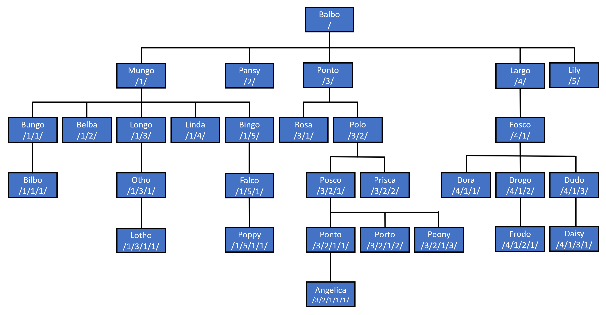

# What's New in EF Core 8

EF Core 8.0 (EF8) was [released in November 2023](https://devblogs.microsoft.com/dotnet/announcing-ef8/).

> [!TIP]
> You can run and debug into the samples by [downloading the sample code from GitHub](https://github.com/dotnet/EntityFramework.Docs). Each section links to the source code specific to that section.

EF8 requires the [.NET 8 SDK](https://aka.ms/get-dotnet-8) to build and requires the .NET 8 runtime to run. EF8 will not run on earlier .NET versions, and will not run on .NET Framework.

## Value objects using Complex Types

Objects saved to the database can be split into three broad categories:

- Objects that are unstructured and hold a single value. For example, `int`, `Guid`, `string`, `IPAddress`. These are (somewhat loosely) called "primitive types".
- Objects that are structured to hold multiple values, and where the identity of the object is defined by a key value. For example, `Blog`, `Post`, `Customer`. These are called "entity types".
- Objects that are structured to hold multiple values, but the object has no key defining identity. For example, `Address`, `Coordinate`.

Prior to EF8, there was no good way to map the third type of object. [Owned types](xref:core/modeling/owned-entities) can be used, but since owned types are actually entity types, they have semantics based on a key value, even when that key value is hidden.

EF8 now supports "Complex Types" to cover this third type of object. Complex type objects:

- Are not identified or tracked by key value.
- Must be defined as part of an entity type.  (In other words, you cannot have a `DbSet` of a complex type.)
- Can be either .NET [value types](/dotnet/csharp/language-reference/builtin-types/value-types) or [reference types](/dotnet/csharp/language-reference/keywords/reference-types).
- Instances can be shared by multiple properties.

### Simple example

For example, consider an `Address` type:

<!--
    public class Address
    {
        public required string Line1 { get; set; }
        public string? Line2 { get; set; }
        public required string City { get; set; }
        public required string Country { get; set; }
        public required string PostCode { get; set; }
    }
-->
[!code-csharp[Address](../../../../samples/core/Miscellaneous/NewInEFCore8/ComplexTypesSample.cs?name=Address)]

`Address` is then used in three places in a simple customer/orders model:

<!--
    public class Customer
    {
        public int Id { get; set; }
        public required string Name { get; set; }
        public required Address Address { get; set; }
        public List<Order> Orders { get; } = new();
    }

    public class Order
    {
        public int Id { get; set; }
        public required string Contents { get; set; }
        public required Address ShippingAddress { get; set; }
        public required Address BillingAddress { get; set; }
        public Customer Customer { get; set; } = null!;
    }
-->
[!code-csharp[CustomerOrders](../../../../samples/core/Miscellaneous/NewInEFCore8/ComplexTypesSample.cs?name=CustomerOrders)]

Let's create and save a customer with their address:

<!--
        #region SaveCustomer
        var customer = new Customer
        {
            Name = "Willow",
            Address = new() { Line1 = "Barking Gate", City = "Walpole St Peter", Country = "UK", PostCode = "PE14 7AV" }
        };

        context.Add(customer);
        await context.SaveChangesAsync();

-->
[!code-csharp[SaveCustomer](../../../../samples/core/Miscellaneous/NewInEFCore8/ComplexTypesSample.cs?name=SaveCustomer)]

This results in the following row being inserted into the database:

```sql
INSERT INTO [Customers] ([Name], [Address_City], [Address_Country], [Address_Line1], [Address_Line2], [Address_PostCode])
OUTPUT INSERTED.[Id]
VALUES (@p0, @p1, @p2, @p3, @p4, @p5);
```

Notice that the complex types do not get their own tables. Instead, they are saved inline to columns of the `Customers` table. This matches the table sharing behavior of owned types.

> [!NOTE]
> We don't plan to allow complex types to be mapped to their own table. However, in a future release, we do plan to allow the complex type to be saved as a JSON document in a single column. Vote for [Issue #31252](https://github.com/dotnet/efcore/issues/31252) if this is important to you.

Now let's say we want to ship an order to a customer and use the customer's address as both the default billing an shipping address. The natural way to do this is to copy the `Address` object from the `Customer` into the `Order`. For example:

<!--
        #region CreateOrder
        customer.Orders.Add(
            new Order { Contents = "Tesco Tasty Treats", BillingAddress = customer.Address, ShippingAddress = customer.Address, });

        await context.SaveChangesAsync();

-->
[!code-csharp[CreateOrder](../../../../samples/core/Miscellaneous/NewInEFCore8/ComplexTypesSample.cs?name=CreateOrder)]

With complex types, this works as expected, and the address is inserted into the `Orders` table:

```sql
INSERT INTO [Orders] ([Contents], [CustomerId],
    [BillingAddress_City], [BillingAddress_Country], [BillingAddress_Line1], [BillingAddress_Line2], [BillingAddress_PostCode],
    [ShippingAddress_City], [ShippingAddress_Country], [ShippingAddress_Line1], [ShippingAddress_Line2], [ShippingAddress_PostCode])
OUTPUT INSERTED.[Id]
VALUES (@p0, @p1, @p2, @p3, @p4, @p5, @p6, @p7, @p8, @p9, @p10, @p11);
```

So far you might be saying, "but I could do this with owned types!" However, the "entity type" semantics of owned types quickly get in the way. For example, running the code above with owned types results in a slew of warnings and then an error:

```text
warn: 8/20/2023 12:48:01.678 CoreEventId.DuplicateDependentEntityTypeInstanceWarning[10001] (Microsoft.EntityFrameworkCore.Update) 
      The same entity is being tracked as different entity types 'Order.BillingAddress#Address' and 'Customer.Address#Address' with defining navigations. If a property value changes, it will result in two store changes, which might not be the desired outcome.
warn: 8/20/2023 12:48:01.687 CoreEventId.DuplicateDependentEntityTypeInstanceWarning[10001] (Microsoft.EntityFrameworkCore.Update) 
      The same entity is being tracked as different entity types 'Order.ShippingAddress#Address' and 'Customer.Address#Address' with defining navigations. If a property value changes, it will result in two store changes, which might not be the desired outcome.
warn: 8/20/2023 12:48:01.687 CoreEventId.DuplicateDependentEntityTypeInstanceWarning[10001] (Microsoft.EntityFrameworkCore.Update)
      The same entity is being tracked as different entity types 'Order.ShippingAddress#Address' and 'Order.BillingAddress#Address' with defining navigations. If a property value changes, it will result in two store changes, which might not be the desired outcome.
fail: 8/20/2023 12:48:01.709 CoreEventId.SaveChangesFailed[10000] (Microsoft.EntityFrameworkCore.Update) 
      An exception occurred in the database while saving changes for context type 'NewInEfCore8.ComplexTypesSample+CustomerContext'.
      System.InvalidOperationException: Cannot save instance of 'Order.ShippingAddress#Address' because it is an owned entity without any reference to its owner. Owned entities can only be saved as part of an aggregate also including the owner entity.
         at Microsoft.EntityFrameworkCore.ChangeTracking.Internal.InternalEntityEntry.PrepareToSave()
```

This is because a single instance of the `Address` entity type (with the same hidden key value) is being used for three _different_ entity instances. On the other hand, sharing the same instance between complex properties is allowed, and so the code works as expected when using complex types.

### Configuration of complex types

Complex types must be configured in the model using either [mapping attributes](xref:core/modeling/index#use-data-annotations-to-configure-a-model) or by calling [`ComplexProperty` API in `OnModelCreating`](xref:core/modeling/index#use-fluent-api-to-configure-a-model). Complex types are not discovered by convention.

For example, the `Address` type can be configured using the <xref:System.ComponentModel.DataAnnotations.Schema.ComplexTypeAttribute>:

```csharp
[ComplexType]
public class Address
{
    public required string Line1 { get; set; }
    public string? Line2 { get; set; }
    public required string City { get; set; }
    public required string Country { get; set; }
    public required string PostCode { get; set; }
}
```

Or in `OnModelCreating`:

<!--
        #region ComplexTypeConfig
        protected override void OnModelCreating(ModelBuilder modelBuilder)
        {
            modelBuilder.Entity<Customer>()
                .ComplexProperty(e => e.Address);

            modelBuilder.Entity<Order>(b =>
            {
                b.ComplexProperty(e => e.BillingAddress);
                b.ComplexProperty(e => e.ShippingAddress);
            });
        }
-->
[!code-csharp[ComplexTypeConfig](../../../../samples/core/Miscellaneous/NewInEFCore8/ComplexTypesSample.cs?name=ComplexTypeConfig)]

### Mutability

In the example above, we ended up with the same `Address` instance used in three places. This is allowed and doesn't cause any issues for EF Core when using complex types. However, sharing instances of the same reference type means that if a property value on the instance is modified, then that change will be reflected in all three usages. For example, following on from above, let's change `Line1` of the customer address and save the changes:

<!--
        #region ChangeSharedAddress
        customer.Address.Line1 = "Peacock Lodge";
        await context.SaveChangesAsync();
-->
[!code-csharp[ChangeSharedAddress](../../../../samples/core/Miscellaneous/NewInEFCore8/ComplexTypesSample.cs?name=ChangeSharedAddress)]

This results in the following update to the database when using SQL Server:

```sql
UPDATE [Customers] SET [Address_Line1] = @p0
OUTPUT 1
WHERE [Id] = @p1;
UPDATE [Orders] SET [BillingAddress_Line1] = @p2, [ShippingAddress_Line1] = @p3
OUTPUT 1
WHERE [Id] = @p4;
```

Notice that all three `Line1` columns have changed, since they are all sharing the same instance. This is usually not what we want.

> [!TIP]
> If order addresses should change automatically when the customer address changes, then consider mapping the address as an entity type. `Order` and `Customer` can then safely reference the same address instance (which is now identified by a key) via a navigation property.

A good way to deal with issues like this is to make the type immutable. Indeed, this immutability is often natural when a type is a good candidate for being a complex type. For example, it usually makes sense to supply a complex new `Address` object rather than to just mutate, say, the country while leaving the rest the same.

Both reference and value types can be made immutable. We'll look at some examples in the following sections.

### Reference types as complex types

#### Immutable class

We used a simple, mutable `class` in the example above. To prevent the issues with accidental mutation described above, we can make the class immutable. For example:

```csharp
public class Address
{
    public Address(string line1, string? line2, string city, string country, string postCode)
    {
        Line1 = line1;
        Line2 = line2;
        City = city;
        Country = country;
        PostCode = postCode;
    }

    public string Line1 { get; }
    public string? Line2 { get; }
    public string City { get; }
    public string Country { get; }
    public string PostCode { get; }
}
```

> [!TIP]
> With C# 12 or above, this class definition can be simplified using a primary constructor:
>
> ```csharp
> public class Address(string line1, string? line2, string city, string country, string postCode)
> {
>     public string Line1 { get; } = line1;
>     public string? Line2 { get; } = line2;
>     public string City { get; } = city;
>     public string Country { get; } = country;
>     public string PostCode { get; } = postCode;
> }
> ```

It is now not possible to change the `Line1` value on an existing address. Instead, we need to create a new instance with the changed value. For example:

<!--
        #region ChangeImmutableAddress
        var currentAddress = customer.Address;
        customer.Address = new Address(
            "Peacock Lodge", currentAddress.Line2, currentAddress.City, currentAddress.Country, currentAddress.PostCode);

        await context.SaveChangesAsync();
-->
[!code-csharp[ChangeImmutableAddress](../../../../samples/core/Miscellaneous/NewInEFCore8/ImmutableComplexTypesSample.cs?name=ChangeImmutableAddress)]

This time the call to `SaveChangesAsync` only updates the customer address:

```sql
UPDATE [Customers] SET [Address_Line1] = @p0
OUTPUT 1
WHERE [Id] = @p1;
```

Note that even though the Address object is immutable, and the entire object has been changed, EF is still tracking changes to the individual properties, so only the columns with changed values are updated.

#### Immutable record

C# 9 introduced [record types](/dotnet/csharp/language-reference/builtin-types/record), which makes creating and using immutable objects easier. For example, the `Address` object can be made a record type:

```csharp
public record Address
{
    public Address(string line1, string? line2, string city, string country, string postCode)
    {
        Line1 = line1;
        Line2 = line2;
        City = city;
        Country = country;
        PostCode = postCode;
    }

    public string Line1 { get; init; }
    public string? Line2 { get; init; }
    public string City { get; init; }
    public string Country { get; init; }
    public string PostCode { get; init; }
}
```

> [!TIP]
> This record definition can be simplified using a primary constructor:
>
> ```csharp
> public record Address(string Line1, string? Line2, string City, string Country, string PostCode);
> ```

Replacing the mutable object and calling `SaveChanges` now requires less code:

<!--
        #region ChangeImmutableRecord
        customer.Address = customer.Address with { Line1 = "Peacock Lodge" };

        await context.SaveChangesAsync();
-->
[!code-csharp[ChangeImmutableRecord](../../../../samples/core/Miscellaneous/NewInEFCore8/RecordComplexTypesSample.cs?name=ChangeImmutableRecord)]

### Value types as complex types

#### Mutable struct

A simple mutable [value type](/dotnet/csharp/language-reference/builtin-types/value-types) can be used as a complex type. For example, `Address` can be defined as a `struct` in C#:

<!--
    #region AddressStruct
    public struct Address
    {
        public string Line1 { get; set; }
        public string? Line2 { get; set; }
        public string City { get; set; }
        public string Country { get; set; }
        public string PostCode { get; set; }
    }
-->
[!code-csharp[AddressStruct](../../../../samples/core/Miscellaneous/NewInEFCore8/StructComplexTypesSample.cs?name=AddressStruct)]

Assigning the customer `Address` object to the shipping and billing `Address` properties results in each property getting a copy of the `Address`, since this is how value types work. This means that modifying the `Address` on the customer will not change the shipping or billing `Address` instances, so mutable structs don't have the same instance-sharing issues that happen with mutable classes.

However, [mutable structs are generally discouraged in C#](/archive/blogs/ericlippert/mutating-readonly-structs), so think very carefully before using them.

#### Immutable struct

Immutable structs work well as complex types, just like immutable classes do. For example, `Address` can be defined such that it can not be modified:

<!--
    #region AddressImmutableStruct
    public readonly struct Address(string line1, string? line2, string city, string country, string postCode)
    {
        public string Line1 { get; } = line1;
        public string? Line2 { get; } = line2;
        public string City { get; } = city;
        public string Country { get; } = country;
        public string PostCode { get; } = postCode;
    }
-->
[!code-csharp[AddressImmutableStruct](../../../../samples/core/Miscellaneous/NewInEFCore8/ImmutableStructComplexTypesSample.cs?name=AddressImmutableStruct)]

The code for changing the address now looks the same as when using immutable class:

<!--
        #region UpdateImmutableStruct
        var currentAddress = customer.Address;
        customer.Address = new Address(
            "Peacock Lodge", currentAddress.Line2, currentAddress.City, currentAddress.Country, currentAddress.PostCode);

        await context.SaveChangesAsync();
-->
[!code-csharp[UpdateImmutableStruct](../../../../samples/core/Miscellaneous/NewInEFCore8/ImmutableStructComplexTypesSample.cs?name=UpdateImmutableStruct)]

#### Immutable struct record

C# 10 introduced `struct record` types, which makes it easy to create and work with immutable struct records like it is with immutable class records. For example, we can define `Address` as an immutable struct record:

<!--
    #region RecordStructAddress
    public readonly record struct Address(string Line1, string? Line2, string City, string Country, string PostCode);
-->
[!code-csharp[RecordStructAddress](../../../../samples/core/Miscellaneous/NewInEFCore8/RecordComplexTypesSample.cs?name=RecordStructAddress)]

The code for changing the address now looks the same as when using immutable class record:

<!--
        #region ChangeImmutableRecord
        customer.Address = customer.Address with { Line1 = "Peacock Lodge" };

        await context.SaveChangesAsync();
-->
[!code-csharp[ChangeImmutableRecord](../../../../samples/core/Miscellaneous/NewInEFCore8/RecordComplexTypesSample.cs?name=ChangeImmutableRecord)]

### Nested complex types

A complex type can contain properties of other complex types. For example, let's use our `Address` complex type from above together with a `PhoneNumber` complex type, and nest them both inside another complex type:

<!--
    #region NestedComplexTypes
    public record Address(string Line1, string? Line2, string City, string Country, string PostCode);

    public record PhoneNumber(int CountryCode, long Number);

    public record Contact
    {
        public required Address Address { get; init; }
        public required PhoneNumber HomePhone { get; init; }
        public required PhoneNumber WorkPhone { get; init; }
        public required PhoneNumber MobilePhone { get; init; }
    }
-->
[!code-csharp[NestedComplexTypes](../../../../samples/core/Miscellaneous/NewInEFCore8/NestedComplexTypesSample.cs?name=NestedComplexTypes)]

We're using immutable records here, since these are a good match for the semantics of our complex types, but nesting of complex types can be done with any flavor of .NET type.

> [!NOTE]
> We're not using a primary constructor for the `Contact` type because EF Core does not yet support constructor injection of complex type values. Vote for [Issue #31621](https://github.com/dotnet/efcore/issues/31621) if this is important to you.

We will add `Contact` as a property of the `Customer`:

<!--
    #region CustomerWithContact
    public class Customer
    {
        public int Id { get; set; }
        public required string Name { get; set; }
        public required Contact Contact { get; set; }
        public List<Order> Orders { get; } = new();
    }
-->
[!code-csharp[CustomerWithContact](../../../../samples/core/Miscellaneous/NewInEFCore8/NestedComplexTypesSample.cs?name=CustomerWithContact)]

And `PhoneNumber` as properties of the `Order`:

<!--
    #region OrderWithPhone
    public class Order
    {
        public int Id { get; set; }
        public required string Contents { get; set; }
        public required PhoneNumber ContactPhone { get; set; }
        public required Address ShippingAddress { get; set; }
        public required Address BillingAddress { get; set; }
        public Customer Customer { get; set; } = null!;
    }
-->
[!code-csharp[OrderWithPhone](../../../../samples/core/Miscellaneous/NewInEFCore8/NestedComplexTypesSample.cs?name=OrderWithPhone)]

Configuration of nested complex types can again be achieved using <xref:System.ComponentModel.DataAnnotations.Schema.ComplexTypeAttribute>:

```csharp
[ComplexType]
public record Address(string Line1, string? Line2, string City, string Country, string PostCode);

[ComplexType]
public record PhoneNumber(int CountryCode, long Number);

[ComplexType]
public record Contact
{
    public required Address Address { get; init; }
    public required PhoneNumber HomePhone { get; init; }
    public required PhoneNumber WorkPhone { get; init; }
    public required PhoneNumber MobilePhone { get; init; }
}
```

Or in `OnModelCreating`:

<!--
        #region ConfigureNestedTypes
        protected override void OnModelCreating(ModelBuilder modelBuilder)
        {
            modelBuilder.Entity<Customer>(
                b =>
                {
                    b.ComplexProperty(
                        e => e.Contact,
                        b =>
                        {
                            b.ComplexProperty(e => e.Address);
                            b.ComplexProperty(e => e.HomePhone);
                            b.ComplexProperty(e => e.WorkPhone);
                            b.ComplexProperty(e => e.MobilePhone);
                        });
                });

            modelBuilder.Entity<Order>(
                b =>
                {
                    b.ComplexProperty(e => e.ContactPhone);
                    b.ComplexProperty(e => e.BillingAddress);
                    b.ComplexProperty(e => e.ShippingAddress);
                });
        }
-->
[!code-csharp[ConfigureNestedTypes](../../../../samples/core/Miscellaneous/NewInEFCore8/NestedComplexTypesSample.cs?name=ConfigureNestedTypes)]

### Queries

Properties of complex types on entity types are treated like any other non-navigation property of the entity type. This means that they are always loaded when the entity type is loaded. This is also true of any nested complex type properties. For example, querying for a customer:

<!--
        #region QueryCustomer
        var customer = await context.Customers.FirstAsync(e => e.Id == customerId);
-->
[!code-csharp[QueryCustomer](../../../../samples/core/Miscellaneous/NewInEFCore8/NestedComplexTypesSample.cs?name=QueryCustomer)]

Is translated to the following SQL when using SQL Server:

```sql
SELECT TOP(1) [c].[Id], [c].[Name], [c].[Contact_Address_City], [c].[Contact_Address_Country],
    [c].[Contact_Address_Line1], [c].[Contact_Address_Line2], [c].[Contact_Address_PostCode],
    [c].[Contact_HomePhone_CountryCode], [c].[Contact_HomePhone_Number], [c].[Contact_MobilePhone_CountryCode],
    [c].[Contact_MobilePhone_Number], [c].[Contact_WorkPhone_CountryCode], [c].[Contact_WorkPhone_Number]
FROM [Customers] AS [c]
WHERE [c].[Id] = @__customerId_0
```

Notice two things from this SQL:

- Everything is returned to populate the customer _and_ all the nested `Contact`, `Address`, and `PhoneNumber` complex types.
- All the complex type values are stored as columns in the table for the entity type. Complex types are never mapped to separate tables.

#### Projections

Complex types can be projected from a query. For example, selecting just the shipping address from an order:

<!--
        #region QueryShippingAddress
        var shippingAddress = await context.Orders
            .Where(e => e.Id == orderId)
            .Select(e => e.ShippingAddress)
            .SingleAsync();
-->
[!code-csharp[QueryShippingAddress](../../../../samples/core/Miscellaneous/NewInEFCore8/NestedComplexTypesSample.cs?name=QueryShippingAddress)]

This translates to the following when using SQL Server:

```sql
SELECT TOP(2) [o].[ShippingAddress_City], [o].[ShippingAddress_Country], [o].[ShippingAddress_Line1],
    [o].[ShippingAddress_Line2], [o].[ShippingAddress_PostCode]
FROM [Orders] AS [o]
WHERE [o].[Id] = @__orderId_0
```

Note that projections of complex types cannot be tracked, since complex type objects have no identity to use for tracking.

### Use in predicates

Members of complex types can be used in predicates. For example, finding all the orders going to a certain city:

<!--
        #region QueryOrdersInCity
        var city = "Walpole St Peter";
        var walpoleOrders = await context.Orders.Where(e => e.ShippingAddress.City == city).ToListAsync();
-->
[!code-csharp[QueryOrdersInCity](../../../../samples/core/Miscellaneous/NewInEFCore8/NestedComplexTypesSample.cs?name=QueryOrdersInCity)]

Which translates to the following SQL on SQL Server:

```sql
SELECT [o].[Id], [o].[Contents], [o].[CustomerId], [o].[BillingAddress_City], [o].[BillingAddress_Country],
    [o].[BillingAddress_Line1], [o].[BillingAddress_Line2], [o].[BillingAddress_PostCode],
    [o].[ContactPhone_CountryCode], [o].[ContactPhone_Number], [o].[ShippingAddress_City],
    [o].[ShippingAddress_Country], [o].[ShippingAddress_Line1], [o].[ShippingAddress_Line2],
    [o].[ShippingAddress_PostCode]
FROM [Orders] AS [o]
WHERE [o].[ShippingAddress_City] = @__city_0
```

A full complex type instance can also be used in predicates. For example, finding all customers with a given phone number:

<!--
        #region QueryWithPhoneNumber
        var phoneNumber = new PhoneNumber(44, 7777555777);
        var customersWithNumber = await context.Customers
            .Where(
                e => e.Contact.MobilePhone == phoneNumber
                     || e.Contact.WorkPhone == phoneNumber
                     || e.Contact.HomePhone == phoneNumber)
            .ToListAsync();
-->
[!code-csharp[QueryWithPhoneNumber](../../../../samples/core/Miscellaneous/NewInEFCore8/NestedComplexTypesSample.cs?name=QueryWithPhoneNumber)]

This translates to the following SQL when using SQL Server:

```sql
SELECT [c].[Id], [c].[Name], [c].[Contact_Address_City], [c].[Contact_Address_Country], [c].[Contact_Address_Line1],
     [c].[Contact_Address_Line2], [c].[Contact_Address_PostCode], [c].[Contact_HomePhone_CountryCode],
     [c].[Contact_HomePhone_Number], [c].[Contact_MobilePhone_CountryCode], [c].[Contact_MobilePhone_Number],
     [c].[Contact_WorkPhone_CountryCode], [c].[Contact_WorkPhone_Number]
FROM [Customers] AS [c]
WHERE ([c].[Contact_MobilePhone_CountryCode] = @__entity_equality_phoneNumber_0_CountryCode
    AND [c].[Contact_MobilePhone_Number] = @__entity_equality_phoneNumber_0_Number)
OR ([c].[Contact_WorkPhone_CountryCode] = @__entity_equality_phoneNumber_0_CountryCode
    AND [c].[Contact_WorkPhone_Number] = @__entity_equality_phoneNumber_0_Number)
OR ([c].[Contact_HomePhone_CountryCode] = @__entity_equality_phoneNumber_0_CountryCode
    AND [c].[Contact_HomePhone_Number] = @__entity_equality_phoneNumber_0_Number)
```

Notice that equality is performed by expanding out each member of the complex type. This aligns with complex types having no key for identity and hence a complex type instance is equal to another complex type instance if and only if all their members are equal. This also aligns with the equality defined by .NET for record types.

### Manipulation of complex type values

EF8 provides access to tracking information such as the current and original values of complex types and whether or not a property value has been modified. The API complex types is an extension of [the change tracking API already used for entity types](xref:core/change-tracking/entity-entries).

The `ComplexProperty` methods of <xref:Microsoft.EntityFrameworkCore.ChangeTracking.EntityEntry> return a entry for an entire complex object. For example, to get the current value of the `Order.BillingAddress`:

<!--
        #region BillingAddressCurrentValue
        var billingAddress = context.Entry(order)
            .ComplexProperty(e => e.BillingAddress)
            .CurrentValue;
-->
[!code-csharp[BillingAddressCurrentValue](../../../../samples/core/Miscellaneous/NewInEFCore8/NestedComplexTypesSample.cs?name=BillingAddressCurrentValue)]

A call to `Property` can be added to access a property of the complex type. For example to get the current value of just the billing post code:

<!--
        #region PostCodeCurrentValue
        var postCode = context.Entry(order)
            .ComplexProperty(e => e.BillingAddress)
            .Property(e => e.PostCode)
            .CurrentValue;
-->
[!code-csharp[PostCodeCurrentValue](../../../../samples/core/Miscellaneous/NewInEFCore8/NestedComplexTypesSample.cs?name=PostCodeCurrentValue)]

Nested complex types are accessed using nested calls to `ComplexProperty`. For example, to get the city from the nested `Address` of the `Contact` on a `Customer`:

<!--
        #region CityCurrentValue
        var currentCity = context.Entry(customer)
            .ComplexProperty(e => e.Contact)
            .ComplexProperty(e => e.Address)
            .Property(e => e.City)
            .CurrentValue;
-->
[!code-csharp[CityCurrentValue](../../../../samples/core/Miscellaneous/NewInEFCore8/NestedComplexTypesSample.cs?name=CityCurrentValue)]

Other methods are available for reading and changing state. For example, <xref:Microsoft.EntityFrameworkCore.ChangeTracking.PropertyEntry.IsModified?displayProperty=nameWithType> can be used to set a property of a complex type as modified:

<!--
        #region SetPostCodeIsModified
        context.Entry(customer)
            .ComplexProperty(e => e.Contact)
            .ComplexProperty(e => e.Address)
            .Property(e => e.PostCode)
            .IsModified = true;
-->
[!code-csharp[SetPostCodeIsModified](../../../../samples/core/Miscellaneous/NewInEFCore8/NestedComplexTypesSample.cs?name=SetPostCodeIsModified)]

### Current limitations

Complex types represent a significant investment across the EF stack. We were not able to make everything work in this release, but we plan to close some of the gaps in a future release. Make sure to vote (👍) on the appropriate GitHub issues if fixing any of these limitations is important to you.

Complex type limitations in EF8 include:

- Support collections of complex types. ([Issue #31237](https://github.com/dotnet/efcore/issues/31237))
- Allow complex type properties to be null. ([Issue #31376](https://github.com/dotnet/efcore/issues/31376))
- Map complex type properties to JSON columns. ([Issue #31252](https://github.com/dotnet/efcore/issues/31252))
- Constructor injection for complex types. ([Issue #31621](https://github.com/dotnet/efcore/issues/31621))
- Add seed data support for complex types. ([Issue #31254](https://github.com/dotnet/efcore/issues/31254))
- Map complex type properties for the Cosmos provider. ([Issue #31253](https://github.com/dotnet/efcore/issues/31253))
- Implement complex types for the in-memory database. ([Issue #31464](https://github.com/dotnet/efcore/issues/31464))

## Primitive collections

A persistent question when using relational databases is what to do with collections of primitive types; that is, lists or arrays of integers, date/times, strings, and so on. If you're using PostgreSQL, then its easy to store these things using PostgreSQL's [built-in array type](https://www.postgresql.org/docs/current/arrays.html). For other databases, there are two common approaches:

- Create a table with a column for the primitive type value and another column to act as a foreign key linking each value to its owner of the collection.
- Serialize the primitive collection into some column type that is handled by the database--for example, serialize to and from a string.

The first option has advantages in many situations--we'll take a quick look at it at the end of this section. However, it's not a natural representation of the data in the model, and if what you really have is a collection of a primitive type, then the second option can be more effective.

Starting with Preview 4, EF8 now includes built-in support for the second option, using JSON as the serialization format. JSON works well for this since modern relational databases include built-in mechanisms for querying and manipulating JSON, such that the JSON column can, effectively, be treated as a table when needed, without the overhead of actually creating that table. These same mechanisms allow JSON to be passed in parameters and then used in similar way to table-valued parameters in queries--more about this later.

> [!TIP]
> The code shown here comes from [PrimitiveCollectionsSample.cs](https://github.com/dotnet/EntityFramework.Docs/tree/main/samples/core/Miscellaneous/NewInEFCore8/PrimitiveCollectionsSample.cs).

### Primitive collection properties

EF Core can map any `IEnumerable<T>` property, where `T` is a primitive type, to a JSON column in the database. This is done by convention for public properties which have both a getter and a setter. For example, all properties in the following entity type are mapped to JSON columns by convention:

```csharp
public class PrimitiveCollections
{
    public IEnumerable<int> Ints { get; set; }
    public ICollection<string> Strings { get; set; }
    public IList<DateOnly> Dates { get; set; }
    public uint[] UnsignedInts { get; set; }
    public List<bool> Booleans { get; set; }
    public List<Uri> Urls { get; set; }
}
```

> [!NOTE]
> What do we mean by "primitive type" in this context? Essentially, something that the database provider knows how to map, using some kind of value conversion if necessary. For example, in the entity type above, the types `int`, `string`, `DateTime`, `DateOnly` and `bool` are all handled without conversion by the database provider. SQL Server does not have native support for unsigned ints or URIs, but `uint` and `Uri` are still treated as primitive types because there are [built-in value converters](xref:core/modeling/value-conversions#built-in-converters) for these types.

By default, EF Core uses an unconstrained Unicode string column type to hold the JSON, since this protects against data loss with large collections. However, on some database systems, such as SQL Server, specifying a maximum length for the string can improve performance. This, along with other column configuration, can be done [in the normal way](xref:core/modeling/entity-properties). For example:

```csharp
modelBuilder
    .Entity<PrimitiveCollections>()
    .Property(e => e.Booleans)
    .HasMaxLength(1024)
    .IsUnicode(false);
```

Or, using mapping attributes:

```csharp
[MaxLength(2500)]
[Unicode(false)]
public uint[] UnsignedInts { get; set; }
```

A default column configuration can be used for all properties of a certain type using [pre-convention model configuration](xref:core/modeling/bulk-configuration#pre-convention-configuration). For example:

```csharp
protected override void ConfigureConventions(ModelConfigurationBuilder configurationBuilder)
{
    configurationBuilder
        .Properties<List<DateOnly>>()
        .AreUnicode(false)
        .HaveMaxLength(4000);
}
```

### Queries with primitive collections

Let's look at some of the queries that make use of collections of primitive types. For this, we'll need a simple model with two entity types. The first represents a [British public house](https://en.wikipedia.org/wiki/Pub), or "pub":

<!--
    public class Pub
    {
        public Pub(string name, string[] beers)
        {
            Name = name;
            Beers = beers;
        }

        public int Id { get; set; }
        public string Name { get; set; }
        public string[] Beers { get; set; }
        public List<DateOnly> DaysVisited { get; private set; } = new();
    }
-->
[!code-csharp[Pub](../../../../samples/core/Miscellaneous/NewInEFCore8/PrimitiveCollectionsSample.cs?name=Pub)]

The `Pub` type contains two primitive collections:

- `Beers` is an array of strings representing the beer brands available at the pub.
- `DaysVisited` is a list of the dates on which the pub was visited.

> [!TIP]
> In a real application, it would probably make more sense to create an entity type for beer, and have a table for beers. We're showing a primitive collection here to illustrate how they work. But remember, just because you can model something as a primitive collection doesn't mean that you necessarily should.

The second entity type represents a dog walk in the British countryside:

<!--
    public class DogWalk
    {
        public DogWalk(string name)
        {
            Name = name;
        }

        public int Id { get; set; }
        public string Name { get; set; }
        public Terrain Terrain { get; set; }
        public List<DateOnly> DaysVisited { get; private set; } = new();
        public Pub? ClosestPub { get; set; }
    }

    public enum Terrain
    {
        Forest,
        River,
        Hills,
        Village,
        Park,
        Beach,
    }
-->
[!code-csharp[DogWalk](../../../../samples/core/Miscellaneous/NewInEFCore8/PrimitiveCollectionsSample.cs?name=DogWalk)]

Like `Pub`, `DogWalk` also contains a collection of the dates visited, and a link to the closest pub since, you know, sometimes the dog needs a saucer of beer after a long walk.

Using this model, the first query we will do is a simple `Contains` query to find all walks with one of several different terrains:

<!--
        var terrains = new[] { Terrain.River, Terrain.Beach, Terrain.Park };
        var walksWithTerrain = await context.Walks
            .Where(e => terrains.Contains(e.Terrain))
            .Select(e => e.Name)
            .ToListAsync();
-->
[!code-csharp[WalksWithTerrain](../../../../samples/core/Miscellaneous/NewInEFCore8/PrimitiveCollectionsSample.cs?name=WalksWithTerrain)]

This is already translated by current versions of EF Core by inlining the values to look for. For example, when using SQL Server:

```sql
SELECT [w].[Name]
FROM [Walks] AS [w]
WHERE [w].[Terrain] IN (1, 5, 4)
```

However, this strategy does not work well with database query caching; see [Announcing EF8 Preview 4](https://devblogs.microsoft.com/dotnet/announcing-ef8-preview-4/) on the .NET Blog for a discussion of the issue.

> [!IMPORTANT]
> The inlining of values here is done in such a way that there is no chance of a SQL injection attack. The change to use JSON described below is all about performance, and nothing to do with security.

For EF Core 8, the default is now to pass the list of terrains as a single parameter containing a JSON collection. For example:

```none
@__terrains_0='[1,5,4]'
```

The query then uses `OpenJson` on SQL Server:

```sql
SELECT [w].[Name]
FROM [Walks] AS [w]
WHERE EXISTS (
    SELECT 1
    FROM OpenJson(@__terrains_0) AS [t]
    WHERE CAST([t].[value] AS int) = [w].[Terrain])
```

Or `json_each` on SQLite:

```sql
SELECT "w"."Name"
FROM "Walks" AS "w"
WHERE EXISTS (
    SELECT 1
    FROM json_each(@__terrains_0) AS "t"
    WHERE "t"."value" = "w"."Terrain")
```

> [!NOTE]
> `OpenJson` is only available on SQL Server 2016 ([compatibility level 130](/sql/t-sql/statements/alter-database-transact-sql-compatibility-level)) and later. You can tell SQL Server that you're using an older version by configuring the compatibility level as part of `UseSqlServer`. For example:
>
> ```csharp
> protected override void OnConfiguring(DbContextOptionsBuilder optionsBuilder)
>     => optionsBuilder
>         .UseSqlServer(
>             @"Data Source=(LocalDb)\MSSQLLocalDB;Database=AllTogetherNow",
>             sqlServerOptionsBuilder => sqlServerOptionsBuilder.UseCompatibilityLevel(120));
> ```

Let's try a different kind of `Contains` query. In this case, we'll look for a value of the parameter collection in the column. For example, any pub that stocks Heineken:

<!--
        var beer = "Heineken";
        var pubsWithHeineken = await context.Pubs
            .Where(e => e.Beers.Contains(beer))
            .Select(e => e.Name)
            .ToListAsync();
-->
[!code-csharp[PubsWithHeineken](../../../../samples/core/Miscellaneous/NewInEFCore8/PrimitiveCollectionsSample.cs?name=PubsWithHeineken)]

The existing [documentation from What's New in EF7](xref:core/what-is-new/ef-core-7.0/whatsnew#json-columns) provides detailed information on JSON mapping, queries, and updates. This documentation now also applies to SQLite.

```sql
SELECT [p].[Name]
FROM [Pubs] AS [p]
WHERE EXISTS (
    SELECT 1
    FROM OpenJson([p].[Beers]) AS [b]
    WHERE [b].[value] = @__beer_0)
```

`OpenJson` is now used to to extract values from JSON column so that each value can be matched to the passed parameter.

We can combine the use of `OpenJson` on the parameter with `OpenJson` on the column. For example, to find pubs that stock any one of a variety of lagers:

<!--
        var beers = new[] { "Carling", "Heineken", "Stella Artois", "Carlsberg" };
        var pubsWithLager = await context.Pubs
            .Where(e => beers.Any(b => e.Beers.Contains(b)))
            .Select(e => e.Name)
            .ToListAsync();
-->
[!code-csharp[PubsWithLager](../../../../samples/core/Miscellaneous/NewInEFCore8/PrimitiveCollectionsSample.cs?name=PubsWithLager)]

This translates to the following on SQL Server:

```sql
SELECT [p].[Name]
FROM [Pubs] AS [p]
WHERE EXISTS (
    SELECT 1
    FROM OpenJson(@__beers_0) AS [b]
    WHERE EXISTS (
        SELECT 1
        FROM OpenJson([p].[Beers]) AS [b0]
        WHERE [b0].[value] = [b].[value] OR ([b0].[value] IS NULL AND [b].[value] IS NULL)))
```

The `@__beers_0` parameter value here is `["Carling","Heineken","Stella Artois","Carlsberg"]`.

Let's look at a query that makes use of the column containing a collection of dates. For example, to find pubs visited this year:

<!--
        var thisYear = DateTime.Now.Year;
        var pubsVisitedThisYear = await context.Pubs
            .Where(e => e.DaysVisited.Any(v => v.Year == thisYear))
            .Select(e => e.Name)
            .ToListAsync();
-->
[!code-csharp[PubsVisitedThisYear](../../../../samples/core/Miscellaneous/NewInEFCore8/PrimitiveCollectionsSample.cs?name=PubsVisitedThisYear)]

This translates to the following on SQL Server:

```sql
SELECT [p].[Name]
FROM [Pubs] AS [p]
WHERE EXISTS (
    SELECT 1
    FROM OpenJson([p].[DaysVisited]) AS [d]
    WHERE DATEPART(year, CAST([d].[value] AS date)) = @__thisYear_0)
```

Notice that the query makes use of the date-specific function `DATEPART` here because EF _knows that the primitive collection contains dates_. It might not seem like it, but this is actually really important. Because EF knows what's in the collection, it can generate appropriate SQL to use the typed values with parameters, functions, other columns etc.

Let's use the date collection again, this time to order appropriately for the type and project values extracted from the collection. For example, let's list pubs in the order that they were first visited, and with the first and last date each pub was visited:

<!--
        var pubsVisitedInOrder = await context.Pubs
            .Select(e => new
            {
                e.Name,
                FirstVisited = e.DaysVisited.OrderBy(v => v).First(),
                LastVisited = e.DaysVisited.OrderByDescending(v => v).First(),
            })
            .OrderBy(p => p.FirstVisited)
            .ToListAsync();
-->
[!code-csharp[PubsVisitedInOrder](../../../../samples/core/Miscellaneous/NewInEFCore8/PrimitiveCollectionsSample.cs?name=PubsVisitedInOrder)]

This translates to the following on SQL Server:

```sql
SELECT [p].[Name], (
    SELECT TOP(1) CAST([d0].[value] AS date)
    FROM OpenJson([p].[DaysVisited]) AS [d0]
    ORDER BY CAST([d0].[value] AS date)) AS [FirstVisited], (
    SELECT TOP(1) CAST([d1].[value] AS date)
    FROM OpenJson([p].[DaysVisited]) AS [d1]
    ORDER BY CAST([d1].[value] AS date) DESC) AS [LastVisited]
FROM [Pubs] AS [p]
ORDER BY (
    SELECT TOP(1) CAST([d].[value] AS date)
    FROM OpenJson([p].[DaysVisited]) AS [d]
    ORDER BY CAST([d].[value] AS date))
```

And finally, just how often do we end up visiting the closest pub when taking the dog for a walk? Let's find out:

<!--
        var walksWithADrink = await context.Walks.Select(
            w => new
            {
                WalkName = w.Name,
                PubName = w.ClosestPub.Name,
                Count = w.DaysVisited.Count(v => w.ClosestPub.DaysVisited.Contains(v)),
                TotalCount = w.DaysVisited.Count
            }).ToListAsync();
-->
[!code-csharp[WalksWithADrink](../../../../samples/core/Miscellaneous/NewInEFCore8/PrimitiveCollectionsSample.cs?name=WalksWithADrink)]

This translates to the following on SQL Server:

```sql
SELECT [w].[Name] AS [WalkName], [p].[Name] AS [PubName], (
    SELECT COUNT(*)
    FROM OpenJson([w].[DaysVisited]) AS [d]
    WHERE EXISTS (
        SELECT 1
        FROM OpenJson([p].[DaysVisited]) AS [d0]
        WHERE CAST([d0].[value] AS date) = CAST([d].[value] AS date) OR ([d0].[value] IS NULL AND [d].[value] IS NULL))) AS [Count], (
    SELECT COUNT(*)
    FROM OpenJson([w].[DaysVisited]) AS [d1]) AS [TotalCount]
FROM [Walks] AS [w]
INNER JOIN [Pubs] AS [p] ON [w].[ClosestPubId] = [p].[Id]
```

And reveals the following data:

```none
The Prince of Wales Feathers was visited 5 times in 8 "Ailsworth to Nene" walks.
The Prince of Wales Feathers was visited 6 times in 9 "Caster Hanglands" walks.
The Royal Oak was visited 6 times in 8 "Ferry Meadows" walks.
The White Swan was visited 7 times in 9 "Woodnewton" walks.
The Eltisley was visited 6 times in 8 "Eltisley" walks.
Farr Bay Inn was visited 7 times in 11 "Farr Beach" walks.
Farr Bay Inn was visited 7 times in 9 "Newlands" walks.
```

Looks like beer and dog walking are a winning combination!

### Primitive collections in JSON documents

In all the examples above, column for primitive collection contains JSON. However, this is not the same as mapping [an owned entity type to a column containing a JSON document](xref:core/what-is-new/ef-core-7.0/whatsnew#json-columns), which was introduced in EF7. But what if that JSON document itself contains a primitive collection? Well, all the queries above still work in the same way! For example, imagine we move the _days visited_ data into an owned type `Visits` mapped to a JSON document:

<!--
    public class Pub
    {
        public Pub(string name)
        {
            Name = name;
        }

        public int Id { get; set; }
        public string Name { get; set; }
        public BeerData Beers { get; set; } = null!;
        public Visits Visits { get; set; } = null!;
    }

    public class Visits
    {
        public string? LocationTag { get; set; }
        public List<DateOnly> DaysVisited { get; set; } = null!;
    }
-->
[!code-csharp[Pub](../../../../samples/core/Miscellaneous/NewInEFCore8/PrimitiveCollectionsInJsonSample.cs?name=Pub)]

> [!TIP]
> The code shown here comes from [PrimitiveCollectionsInJsonSample.cs](https://github.com/dotnet/EntityFramework.Docs/tree/main/samples/core/Miscellaneous/NewInEFCore8/PrimitiveCollectionsInJsonSample.cs).

We can now run a variation of our final query that, this time, extracts data from the JSON document, including queries into the primitive collections contained in the document:

<!--
        var walksWithADrink = await context.Walks.Select(
            w => new
            {
                WalkName = w.Name,
                PubName = w.ClosestPub.Name,
                WalkLocationTag = w.Visits.LocationTag,
                PubLocationTag = w.ClosestPub.Visits.LocationTag,
                Count = w.Visits.DaysVisited.Count(v => w.ClosestPub.Visits.DaysVisited.Contains(v)),
                TotalCount = w.Visits.DaysVisited.Count
            }).ToListAsync();
-->
[!code-csharp[WalksWithADrink](../../../../samples/core/Miscellaneous/NewInEFCore8/PrimitiveCollectionsInJsonSample.cs?name=WalksWithADrink)]

This translates to the following on SQL Server:

```sql
SELECT [w].[Name] AS [WalkName], [p].[Name] AS [PubName], JSON_VALUE([w].[Visits], '$.LocationTag') AS [WalkLocationTag], JSON_VALUE([p].[Visits], '$.LocationTag') AS [PubLocationTag], (
    SELECT COUNT(*)
    FROM OpenJson(JSON_VALUE([w].[Visits], '$.DaysVisited')) AS [d]
    WHERE EXISTS (
        SELECT 1
        FROM OpenJson(JSON_VALUE([p].[Visits], '$.DaysVisited')) AS [d0]
        WHERE CAST([d0].[value] AS date) = CAST([d].[value] AS date) OR ([d0].[value] IS NULL AND [d].[value] IS NULL))) AS [Count], (
    SELECT COUNT(*)
    FROM OpenJson(JSON_VALUE([w].[Visits], '$.DaysVisited')) AS [d1]) AS [TotalCount]
FROM [Walks] AS [w]
INNER JOIN [Pubs] AS [p] ON [w].[ClosestPubId] = [p].[Id]
```

And to a similar query when using SQLite:

```sql
SELECT "w"."Name" AS "WalkName", "p"."Name" AS "PubName", "w"."Visits" ->> 'LocationTag' AS "WalkLocationTag", "p"."Visits" ->> 'LocationTag' AS "PubLocationTag", (
    SELECT COUNT(*)
    FROM json_each("w"."Visits" ->> 'DaysVisited') AS "d"
    WHERE EXISTS (
        SELECT 1
        FROM json_each("p"."Visits" ->> 'DaysVisited') AS "d0"
        WHERE "d0"."value" = "d"."value")) AS "Count", json_array_length("w"."Visits" ->> 'DaysVisited') AS "TotalCount"
FROM "Walks" AS "w"
INNER JOIN "Pubs" AS "p" ON "w"."ClosestPubId" = "p"."Id"
```

> [!TIP]
> Notice that on SQLite EF Core now makes use of the `->>` operator, resulting in queries that are both easier to read and often more performant.

### Mapping primitive collections to a table

We mentioned above that another option for primitive collections is to map them to a different table. First class support for this is tracked by [Issue #25163](https://github.com/dotnet/efcore/issues/25163); make sure to vote for this issue if it is important to you. Until this is implemented, the best approach is to create a wrapping type for the primitive. For example, let's create a type for `Beer`:

<!--
    [Owned]
    public class Beer
    {
        public Beer(string name)
        {
            Name = name;
        }

        public string Name { get; private set; }
    }
-->
[!code-csharp[Beer](../../../../samples/core/Miscellaneous/NewInEFCore8/PrimitiveCollectionToTableSample.cs?name=Beer)]

Notice that the type simply wraps the primitive value--it doesn't have a primary key or any foreign keys defined. This type can then be used in the `Pub` class:

<!--
    public class Pub
    {
        public Pub(string name)
        {
            Name = name;
        }

        public int Id { get; set; }
        public string Name { get; set; }
        public List<Beer> Beers { get; set; } = new();
        public List<DateOnly> DaysVisited { get; private set; } = new();
    }
-->
[!code-csharp[Pub](../../../../samples/core/Miscellaneous/NewInEFCore8/PrimitiveCollectionToTableSample.cs?name=Pub)]

EF will now create a `Beer` table, synthesizing primary key and foreign key columns back to the `Pubs` table. For example, on SQL Server:

```sql
CREATE TABLE [Beer] (
    [PubId] int NOT NULL,
    [Id] int NOT NULL IDENTITY,
    [Name] nvarchar(max) NOT NULL,
    CONSTRAINT [PK_Beer] PRIMARY KEY ([PubId], [Id]),
    CONSTRAINT [FK_Beer_Pubs_PubId] FOREIGN KEY ([PubId]) REFERENCES [Pubs] ([Id]) ON DELETE CASCADE
```

## Enhancements to JSON column mapping

EF8 includes improvements to the [JSON column mapping support introduced in EF7](xref:core/what-is-new/ef-core-7.0/whatsnew#json-columns).

> [!TIP]
> The code shown here comes from [JsonColumnsSample.cs](https://github.com/dotnet/EntityFramework.Docs/tree/main/samples/core/Miscellaneous/NewInEFCore8/JsonColumnsSample.cs).

### Translate element access into JSON arrays

EF8 supports indexing in JSON arrays when executing queries. For example, the following query checks whether the first two updates were made before a given date.

<!--
        var cutoff = DateOnly.FromDateTime(DateTime.UtcNow - TimeSpan.FromDays(365));
        var updatedPosts = await context.Posts
            .Where(
                p => p.Metadata!.Updates[0].UpdatedOn < cutoff
                     && p.Metadata!.Updates[1].UpdatedOn < cutoff)
            .ToListAsync();
-->
[!code-csharp[CollectionIndexPredicate](../../../../samples/core/Miscellaneous/NewInEFCore8/JsonColumnsSample.cs?name=CollectionIndexPredicate)]

This translates into the following SQL when using SQL Server:

```sql
SELECT [p].[Id], [p].[Archived], [p].[AuthorId], [p].[BlogId], [p].[Content], [p].[Discriminator], [p].[PublishedOn], [p].[Title], [p].[PromoText], [p].[Metadata]
FROM [Posts] AS [p]
WHERE CAST(JSON_VALUE([p].[Metadata],'$.Updates[0].UpdatedOn') AS date) < @__cutoff_0
  AND CAST(JSON_VALUE([p].[Metadata],'$.Updates[1].UpdatedOn') AS date) < @__cutoff_0
```

> [!NOTE]
> This query will succeed even if a given post does not have any updates, or only has a single update. In such a case, `JSON_VALUE` returns `NULL` and the predicate is not matched.

Indexing into JSON arrays can also be used to project elements from an array into the final results. For example, the following query projects out the `UpdatedOn` date for the first and second updates of each post.

<!--
        var postsAndRecentUpdatesNullable = await context.Posts
            .Select(p => new
            {
                p.Title,
                LatestUpdate = (DateOnly?)p.Metadata!.Updates[0].UpdatedOn,
                SecondLatestUpdate = (DateOnly?)p.Metadata.Updates[1].UpdatedOn
            })
            .ToListAsync();
-->
[!code-csharp[CollectionIndexProjectionNullable](../../../../samples/core/Miscellaneous/NewInEFCore8/JsonColumnsSample.cs?name=CollectionIndexProjectionNullable)]

This translates into the following SQL when using SQL Server:

```sql
SELECT [p].[Title],
       CAST(JSON_VALUE([p].[Metadata],'$.Updates[0].UpdatedOn') AS date) AS [LatestUpdate],
       CAST(JSON_VALUE([p].[Metadata],'$.Updates[1].UpdatedOn') AS date) AS [SecondLatestUpdate]
FROM [Posts] AS [p]
```

As noted above, `JSON_VALUE` returns null if the element of the array does not exist. This is handled in the query by casting the projected value to a nullable `DateOnly`. An alternative to casting the value is to filter the query results so that `JSON_VALUE` will never return null. For example:

<!--
        var postsAndRecentUpdates = await context.Posts
            .Where(p => p.Metadata!.Updates[0].UpdatedOn != null
                        && p.Metadata!.Updates[1].UpdatedOn != null)
            .Select(p => new
            {
                p.Title,
                LatestUpdate = p.Metadata!.Updates[0].UpdatedOn,
                SecondLatestUpdate = p.Metadata.Updates[1].UpdatedOn
            })
            .ToListAsync();
-->
[!code-csharp[CollectionIndexProjection](../../../../samples/core/Miscellaneous/NewInEFCore8/JsonColumnsSample.cs?name=CollectionIndexProjection)]

This translates into the following SQL when using SQL Server:

```sql
SELECT [p].[Title],
       CAST(JSON_VALUE([p].[Metadata],'$.Updates[0].UpdatedOn') AS date) AS [LatestUpdate],
       CAST(JSON_VALUE([p].[Metadata],'$.Updates[1].UpdatedOn') AS date) AS [SecondLatestUpdate]
FROM [Posts] AS [p]
      WHERE (CAST(JSON_VALUE([p].[Metadata],'$.Updates[0].UpdatedOn') AS date) IS NOT NULL)
        AND (CAST(JSON_VALUE([p].[Metadata],'$.Updates[1].UpdatedOn') AS date) IS NOT NULL)
```

### Translate queries into embedded collections

EF8 supports queries against collections of both primitive (discussed above) and non-primitive types embedded in the JSON document. For example, the following query returns all posts with any of an arbitrary list of search terms:

<!--
        #region PostsWithSearchTerms
        var searchTerms = new[] { "Search #2", "Search #3", "Search #5", "Search #8", "Search #13", "Search #21", "Search #34" };

        var postsWithSearchTerms = await context.Posts
            .Where(post => post.Metadata!.TopSearches.Any(s => searchTerms.Contains(s.Term)))
            .ToListAsync();
-->
[!code-csharp[PostsWithSearchTerms](../../../../samples/core/Miscellaneous/NewInEFCore8/JsonColumnsSample.cs?name=PostsWithSearchTerms)]

This translates into the following SQL when using SQL Server:

```sql
SELECT [p].[Id], [p].[Archived], [p].[AuthorId], [p].[BlogId], [p].[Content], [p].[Discriminator], [p].[PublishedOn], [p].[Title], [p].[PromoText], [p].[Metadata]
FROM [Posts] AS [p]
WHERE EXISTS (
    SELECT 1
    FROM OPENJSON([p].[Metadata], '$.TopSearches') WITH (
        [Count] int '$.Count',
        [Term] nvarchar(max) '$.Term'
    ) AS [t]
    WHERE EXISTS (
        SELECT 1
        FROM OPENJSON(@__searchTerms_0) WITH ([value] nvarchar(max) '$') AS [s]
        WHERE [s].[value] = [t].[Term]))
```

### JSON Columns for SQLite

EF7 introduced support for mapping to JSON columns when using Azure SQL/SQL Server. EF8 extends this support to SQLite databases. As for the SQL Server support, this includes:

- Mapping of aggregates built from .NET types to JSON documents stored in SQLite columns
- Queries into JSON columns, such as filtering and sorting by the elements of the documents
- Queries that project elements out of the JSON document into results
- Updating and saving changes to JSON documents

The existing [documentation from What's New in EF7](xref:core/what-is-new/ef-core-7.0/whatsnew#json-columns) provides detailed information on JSON mapping, queries, and updates. This documentation now also applies to SQLite.

> [!TIP]
> The code shown in the EF7 documentation has been updated to also run on SQLite can can be found in [JsonColumnsSample.cs](https://github.com/dotnet/EntityFramework.Docs/tree/main/samples/core/Miscellaneous/NewInEFCore8/JsonColumnsSample.cs).

#### Queries into JSON columns

Queries into JSON columns on SQLite use the `json_extract` function. For example, the "authors in Chigley" query from the documentation referenced above:

<!--
        var authorsInChigley = await context.Authors
            .Where(author => author.Contact.Address.City == "Chigley")
            .ToListAsync();
-->
[!code-csharp[AuthorsInChigley](../../../../samples/core/Miscellaneous/NewInEFCore8/JsonColumnsSample.cs?name=AuthorsInChigley)]

Is translated to the following SQL when using SQLite:

```sql
SELECT "a"."Id", "a"."Name", "a"."Contact"
FROM "Authors" AS "a"
WHERE json_extract("a"."Contact", '$.Address.City') = 'Chigley'
```

#### Updating JSON columns

For updates, EF uses the `json_set` function on SQLite. For example, when updating a single property in a document:

<!--
        var arthur = await context.Authors.SingleAsync(author => author.Name.StartsWith("Arthur"));

        arthur.Contact.Address.Country = "United Kingdom";

        await context.SaveChangesAsync();
-->
[!code-csharp[UpdateProperty](../../../../samples/core/Miscellaneous/NewInEFCore8/JsonColumnsSample.cs?name=UpdateProperty)]

EF generates the following parameters:

```text
info: 3/10/2023 10:51:33.127 RelationalEventId.CommandExecuted[20101] (Microsoft.EntityFrameworkCore.Database.Command)
      Executed DbCommand (0ms) [Parameters=[@p0='["United Kingdom"]' (Nullable = false) (Size = 18), @p1='4'], CommandType='Text', CommandTimeout='30']
```

Which use the `json_set` function on SQLite:

```sql
UPDATE "Authors" SET "Contact" = json_set("Contact", '$.Address.Country', json_extract(@p0, '$[0]'))
WHERE "Id" = @p1
RETURNING 1;
```

<a name="hierarchyid"></a>

## HierarchyId in .NET and EF Core

Azure SQL and SQL Server have a special data type called [`hierarchyid`](/sql/t-sql/data-types/hierarchyid-data-type-method-reference) that is used to store [hierarchical data](/sql/relational-databases/hierarchical-data-sql-server). In this case, "hierarchical data" essentially means data that forms a tree structure, where each item can have a parent and/or children. Examples of such data are:

- An organizational structure
- A file system
- A set of tasks in a project
- A taxonomy of language terms
- A graph of links between Web pages

The database is then able to run queries against this data using its hierarchical structure. For example, a query can find ancestors and dependents of given items, or find all items at a certain depth in the hierarchy.

### Support in .NET and EF Core

Official support for the SQL Server `hierarchyid` type has only recently come to modern .NET platforms (i.e. ".NET Core"). This support is in the form of the [Microsoft.SqlServer.Types](https://www.nuget.org/packages/Microsoft.SqlServer.Types) NuGet package, which brings in low-level SQL Server-specific types. In this case, the low-level type is called `SqlHierarchyId`.

At the next level, a new [Microsoft.EntityFrameworkCore.SqlServer.Abstractions](https://www.nuget.org/packages/Microsoft.EntityFrameworkCore.SqlServer.Abstractions) package has been introduced, which includes a higher-level `HierarchyId` type intended for use in entity types.

> [!TIP]
> The `HierarchyId` type is more idiomatic to the norms of .NET than `SqlHierarchyId`, which is instead modeled after how .NET Framework types are hosted inside the SQL Server database engine.  `HierarchyId` is designed to work with EF Core, but it can also be used outside of EF Core in other applications. The `Microsoft.EntityFrameworkCore.SqlServer.Abstractions` package doesn't reference any other packages, and so has minimal impact on deployed application size and dependencies.

Use of `HierarchyId` for EF Core functionality such as queries and updates requires the [Microsoft.EntityFrameworkCore.SqlServer.HierarchyId](https://www.nuget.org/packages/Microsoft.EntityFrameworkCore.SqlServer.HierarchyId) package. This package brings in `Microsoft.EntityFrameworkCore.SqlServer.Abstractions` and `Microsoft.SqlServer.Types` as transitive dependencies, and so is often the only package needed. Once the package is installed, use of `HierarchyId` is enabled by calling `UseHierarchyId` as part of the application's call to `UseSqlServer`. For example:

```csharp
options.UseSqlServer(
    connectionString,
    x => x.UseHierarchyId());
```

> [!NOTE]
> Unofficial support for `hierarchyid` in EF Core has been available for many years via the [EntityFrameworkCore.SqlServer.HierarchyId](https://www.nuget.org/packages/EntityFrameworkCore.SqlServer.HierarchyId) package. This package has been maintained as a collaboration between the community and the EF team. Now that there is official support for `hierarchyid` in .NET, the code from this community package forms, with the permission of the original contributors, the basis for the official package described here. Many thanks to all those involved over the years, including [@aljones](https://github.com/aljones), [@cutig3r](https://github.com/cutig3r), [@huan086](https://github.com/huan086), [@kmataru](https://github.com/kmataru), [@mehdihaghshenas](https://github.com/mehdihaghshenas), and [@vyrotek](https://github.com/vyrotek)

### Modeling hierarchies

The `HierarchyId` type can be used for properties of an entity type. For example, assume we want to model the paternal family tree of some fictional [halflings](https://en.wikipedia.org/wiki/Halfling). In the entity type for `Halfling`, a `HierarchyId` property can be used to locate each halfling in the family tree.

<!--
    public class Halfling
    {
        public Halfling(HierarchyId pathFromPatriarch, string name, int? yearOfBirth = null)
        {
            PathFromPatriarch = pathFromPatriarch;
            Name = name;
            YearOfBirth = yearOfBirth;
        }

        public int Id { get; private set; }
        public HierarchyId PathFromPatriarch { get; set; }
        public string Name { get; set; }
        public int? YearOfBirth { get; set; }
    }
-->
[!code-csharp[Halfling](../../../../samples/core/Miscellaneous/NewInEFCore8/HierarchyIdSample.cs?name=Halfling)]

> [!TIP]
> The code shown here and in the examples below comes from [HierarchyIdSample.cs](https://github.com/dotnet/EntityFramework.Docs/tree/main/samples/core/Miscellaneous/NewInEFCore8/HierarchyIdSample.cs).

> [!TIP]
> If desired, `HierarchyId` is suitable for use as a key property type.

In this case, the family tree is rooted with the patriarch of the family. Each halfling can be traced from the patriarch down the tree using its `PathFromPatriarch` property. SQL Server uses a compact binary format for these paths, but it is common to parse to and from a human-readable string representation when when working with code. In this representation, the position at each level is separated by a `/` character. For example, consider the family tree in the diagram below:



In this tree:

- Balbo is at the root of the tree, represented by `/`.
- Balbo has five children, represented by `/1/`, `/2/`, `/3/`, `/4/`, and `/5/`.
- Balbo's first child, Mungo, also has five children, represented by `/1/1/`, `/1/2/`, `/1/3/`, `/1/4/`, and `/1/5/`. Notice that the `HierarchyId` for Balbo (`/1/`) is the prefix for all his children.
- Similarly, Balbo's third child, Ponto, has two children, represented by `/3/1/` and `/3/2/`. Again the each of these children is prefixed by the `HierarchyId` for Ponto, which is represented as `/3/`.
- And so on down the tree...

The following code inserts this family tree into a database using EF Core:

<!--
            await AddRangeAsync(
                new Halfling(HierarchyId.Parse("/"), "Balbo", 1167),
                new Halfling(HierarchyId.Parse("/1/"), "Mungo", 1207),
                new Halfling(HierarchyId.Parse("/2/"), "Pansy", 1212),
                new Halfling(HierarchyId.Parse("/3/"), "Ponto", 1216),
                new Halfling(HierarchyId.Parse("/4/"), "Largo", 1220),
                new Halfling(HierarchyId.Parse("/5/"), "Lily", 1222),
                new Halfling(HierarchyId.Parse("/1/1/"), "Bungo", 1246),
                new Halfling(HierarchyId.Parse("/1/2/"), "Belba", 1256),
                new Halfling(HierarchyId.Parse("/1/3/"), "Longo", 1260),
                new Halfling(HierarchyId.Parse("/1/4/"), "Linda", 1262),
                new Halfling(HierarchyId.Parse("/1/5/"), "Bingo", 1264),
                new Halfling(HierarchyId.Parse("/3/1/"), "Rosa", 1256),
                new Halfling(HierarchyId.Parse("/3/2/"), "Polo"),
                new Halfling(HierarchyId.Parse("/4/1/"), "Fosco", 1264),
                new Halfling(HierarchyId.Parse("/1/1/1/"), "Bilbo", 1290),
                new Halfling(HierarchyId.Parse("/1/3/1/"), "Otho", 1310),
                new Halfling(HierarchyId.Parse("/1/5/1/"), "Falco", 1303),
                new Halfling(HierarchyId.Parse("/3/2/1/"), "Posco", 1302),
                new Halfling(HierarchyId.Parse("/3/2/2/"), "Prisca", 1306),
                new Halfling(HierarchyId.Parse("/4/1/1/"), "Dora", 1302),
                new Halfling(HierarchyId.Parse("/4/1/2/"), "Drogo", 1308),
                new Halfling(HierarchyId.Parse("/4/1/3/"), "Dudo", 1311),
                new Halfling(HierarchyId.Parse("/1/3/1/1/"), "Lotho", 1310),
                new Halfling(HierarchyId.Parse("/1/5/1/1/"), "Poppy", 1344),
                new Halfling(HierarchyId.Parse("/3/2/1/1/"), "Ponto", 1346),
                new Halfling(HierarchyId.Parse("/3/2/1/2/"), "Porto", 1348),
                new Halfling(HierarchyId.Parse("/3/2/1/3/"), "Peony", 1350),
                new Halfling(HierarchyId.Parse("/4/1/2/1/"), "Frodo", 1368),
                new Halfling(HierarchyId.Parse("/4/1/3/1/"), "Daisy", 1350),
                new Halfling(HierarchyId.Parse("/3/2/1/1/1/"), "Angelica", 1381));

            await SaveChangesAsync();
-->
[!code-csharp[AddRangeAsync](../../../../samples/core/Miscellaneous/NewInEFCore8/HierarchyIdSample.cs?name=AddRangeAsync)]

> [!TIP]
> If needed, decimal values can be used to create new nodes between two existing nodes. For example, `/3/2.5/2/` goes between `/3/2/2/` and `/3/3/2/`.

### Querying hierarchies

`HierarchyId` exposes several methods that can be used in LINQ queries.

| Method                                                           | Description                                                                                                                                                                |
|------------------------------------------------------------------|----------------------------------------------------------------------------------------------------------------------------------------------------------------------------|
| `GetAncestor(int n)`                                             | Gets the node `n` levels up the hierarchical tree.                                                                                                                         |
| `GetDescendant(HierarchyId? child1, HierarchyId? child2)`        | Gets the value of a descendant node that is greater than `child1` and less than `child2`.                                                                                  |
| `GetLevel()`                                                     | Gets the level of this node in the hierarchical tree.                                                                                                                      |
| `GetReparentedValue(HierarchyId? oldRoot, HierarchyId? newRoot)` | Gets a value representing the location of a new node that has a path from `newRoot` equal to the path from `oldRoot` to this, effectively moving this to the new location. |
| `IsDescendantOf(HierarchyId? parent)`                            | Gets a value indicating whether this node is a descendant of `parent`.                                                                                                     |

In addition, the operators `==`, `!=`, `<`, `<=`, `>` and `>=` can be used.

The following are examples of using these methods in LINQ queries.

**Get entities at a given level in the tree**

The following query uses `GetLevel` to return all halflings at a given level in the family tree:

<!--
            var generation = await context.Halflings.Where(halfling => halfling.PathFromPatriarch.GetLevel() == level).ToListAsync();
-->
[!code-csharp[GetLevel](../../../../samples/core/Miscellaneous/NewInEFCore8/HierarchyIdSample.cs?name=GetLevel)]

This translates to the following SQL:

```sql
SELECT [h].[Id], [h].[Name], [h].[PathFromPatriarch], [h].[YearOfBirth]
FROM [Halflings] AS [h]
WHERE [h].[PathFromPatriarch].GetLevel() = @__level_0
```

Running this in a loop we can get the halflings for every generation:

```text
Generation 0: Balbo
Generation 1: Mungo, Pansy, Ponto, Largo, Lily
Generation 2: Bungo, Belba, Longo, Linda, Bingo, Rosa, Polo, Fosco
Generation 3: Bilbo, Otho, Falco, Posco, Prisca, Dora, Drogo, Dudo
Generation 4: Lotho, Poppy, Ponto, Porto, Peony, Frodo, Daisy
Generation 5: Angelica
```

**Get the direct ancestor of an entity**

The following query uses `GetAncestor` to find the direct ancestor of a halfling, given that halfling's name:

<!--
        async Task<Halfling?> FindDirectAncestor(string name)
            => await context.Halflings
                .SingleOrDefaultAsync(
                    ancestor => ancestor.PathFromPatriarch == context.Halflings
                        .Single(descendent => descendent.Name == name).PathFromPatriarch
                        .GetAncestor(1));
-->
[!code-csharp[FindDirectAncestor](../../../../samples/core/Miscellaneous/NewInEFCore8/HierarchyIdSample.cs?name=FindDirectAncestor)]

This translates to the following SQL:

```sql
SELECT TOP(2) [h].[Id], [h].[Name], [h].[PathFromPatriarch], [h].[YearOfBirth]
FROM [Halflings] AS [h]
WHERE [h].[PathFromPatriarch] = (
    SELECT TOP(1) [h0].[PathFromPatriarch]
    FROM [Halflings] AS [h0]
    WHERE [h0].[Name] = @__name_0).GetAncestor(1)
```

Running this query for the halfling "Bilbo" returns "Bungo".

**Get the direct descendents of an entity**

The following query also uses `GetAncestor`, but this time to find the direct descendents of a halfling, given that halfling's name:

<!--
        IQueryable<Halfling> FindDirectDescendents(string name)
            => context.Halflings.Where(
                descendent => descendent.PathFromPatriarch.GetAncestor(1) == context.Halflings
                    .Single(ancestor => ancestor.Name == name).PathFromPatriarch);
-->
[!code-csharp[FindDirectDescendents](../../../../samples/core/Miscellaneous/NewInEFCore8/HierarchyIdSample.cs?name=FindDirectDescendents)]

This translates to the following SQL:

```sql
SELECT [h].[Id], [h].[Name], [h].[PathFromPatriarch], [h].[YearOfBirth]
FROM [Halflings] AS [h]
WHERE [h].[PathFromPatriarch].GetAncestor(1) = (
    SELECT TOP(1) [h0].[PathFromPatriarch]
    FROM [Halflings] AS [h0]
    WHERE [h0].[Name] = @__name_0)
```

Running this query for the halfling "Mungo" returns "Bungo", "Belba", "Longo", and "Linda".

**Get all ancestors of an entity**

`GetAncestor` is useful for searching up or down a single level, or, indeed, a specified number of levels. On the other hand, `IsDescendantOf` is useful for finding all ancestors or dependents. For example, the following query uses `IsDescendantOf` to find the all the ancestors of a halfling, given that halfling's name:

<!--
        IQueryable<Halfling> FindAllAncestors(string name)
            => context.Halflings.Where(
                    ancestor => context.Halflings
                        .Single(
                            descendent =>
                                descendent.Name == name
                                && ancestor.Id != descendent.Id)
                        .PathFromPatriarch.IsDescendantOf(ancestor.PathFromPatriarch))
                .OrderByDescending(ancestor => ancestor.PathFromPatriarch.GetLevel());
-->
[!code-csharp[FindAllAncestors](../../../../samples/core/Miscellaneous/NewInEFCore8/HierarchyIdSample.cs?name=FindAllAncestors)]

> [!IMPORTANT]
> `IsDescendantOf` returns true for itself, which is why it is filtered out in the query above.

This translates to the following SQL:

```sql
SELECT [h].[Id], [h].[Name], [h].[PathFromPatriarch], [h].[YearOfBirth]
FROM [Halflings] AS [h]
WHERE (
    SELECT TOP(1) [h0].[PathFromPatriarch]
    FROM [Halflings] AS [h0]
    WHERE [h0].[Name] = @__name_0 AND [h].[Id] <> [h0].[Id]).IsDescendantOf([h].[PathFromPatriarch]) = CAST(1 AS bit)
ORDER BY [h].[PathFromPatriarch].GetLevel() DESC
```

Running this query for the halfling "Bilbo" returns "Bungo", "Mungo", and "Balbo".

**Get all descendents of an entity**

The following query also uses `IsDescendantOf`, but this time to all the descendents of a halfling, given that halfling's name:

<!--
        IQueryable<Halfling> FindAllDescendents(string name)
            => context.Halflings.Where(
                    descendent => descendent.PathFromPatriarch.IsDescendantOf(
                        context.Halflings
                            .Single(
                                ancestor =>
                                    ancestor.Name == name
                                    && descendent.Id != ancestor.Id)
                            .PathFromPatriarch))
                .OrderBy(descendent => descendent.PathFromPatriarch.GetLevel());
-->
[!code-csharp[FindAllDescendents](../../../../samples/core/Miscellaneous/NewInEFCore8/HierarchyIdSample.cs?name=FindAllDescendents)]

This translates to the following SQL:

```sql
SELECT [h].[Id], [h].[Name], [h].[PathFromPatriarch], [h].[YearOfBirth]
FROM [Halflings] AS [h]
WHERE [h].[PathFromPatriarch].IsDescendantOf((
    SELECT TOP(1) [h0].[PathFromPatriarch]
    FROM [Halflings] AS [h0]
    WHERE [h0].[Name] = @__name_0 AND [h].[Id] <> [h0].[Id])) = CAST(1 AS bit)
ORDER BY [h].[PathFromPatriarch].GetLevel()
```

Running this query for the halfling "Mungo" returns "Bungo", "Belba", "Longo", "Linda", "Bingo", "Bilbo", "Otho", "Falco", "Lotho", and "Poppy".

**Finding a common ancestor**

One of the most common questions asked about this particular family tree is, "who is the common ancestor of Frodo and Bilbo?" We can use `IsDescendantOf` to write such a query:

<!--
        async Task<Halfling?> FindCommonAncestor(Halfling first, Halfling second)
            => await context.Halflings
                .Where(
                    ancestor => first.PathFromPatriarch.IsDescendantOf(ancestor.PathFromPatriarch)
                                && second.PathFromPatriarch.IsDescendantOf(ancestor.PathFromPatriarch))
                .OrderByDescending(ancestor => ancestor.PathFromPatriarch.GetLevel())
                .FirstOrDefaultAsync();
-->
[!code-csharp[FindCommonAncestor](../../../../samples/core/Miscellaneous/NewInEFCore8/HierarchyIdSample.cs?name=FindCommonAncestor)]

This translates to the following SQL:

```sql
SELECT TOP(1) [h].[Id], [h].[Name], [h].[PathFromPatriarch], [h].[YearOfBirth]
FROM [Halflings] AS [h]
WHERE @__first_PathFromPatriarch_0.IsDescendantOf([h].[PathFromPatriarch]) = CAST(1 AS bit)
  AND @__second_PathFromPatriarch_1.IsDescendantOf([h].[PathFromPatriarch]) = CAST(1 AS bit)
ORDER BY [h].[PathFromPatriarch].GetLevel() DESC
```

Running this query with "Bilbo" and "Frodo" tells us that their common ancestor is "Balbo".

### Updating hierarchies

The normal [change tracking](xref:core/change-tracking/index) and [SaveChanges](xref:core/saving/basic) mechanisms can be used to update `hierarchyid` columns.

**Re-parenting a sub-hierarchy**

For example, I'm sure we all remember the scandal of SR 1752 (a.k.a. "LongoGate") when DNA testing revealed that Longo was not in fact the son of Mungo, but actually the son of Ponto! One fallout from this scandal was that the family tree needed to be re-written. In particular, Longo and all his descendents needed to be re-parented from Mungo to Ponto. `GetReparentedValue` can be used to do this. For example, first "Longo" and all his descendents are queried:

<!--
        var longoAndDescendents = await context.Halflings.Where(
                descendent => descendent.PathFromPatriarch.IsDescendantOf(
                    context.Halflings.Single(ancestor => ancestor.Name == "Longo").PathFromPatriarch))
            .ToListAsync();
-->
[!code-csharp[LongoAndDescendents](../../../../samples/core/Miscellaneous/NewInEFCore8/HierarchyIdSample.cs?name=LongoAndDescendents)]

Then `GetReparentedValue` is used to update the `HierarchyId` for Longo and each descendent, followed by a call to `SaveChangesAsync`:

<!--
        foreach (var descendent in longoAndDescendents)
        {
            descendent.PathFromPatriarch
                = descendent.PathFromPatriarch.GetReparentedValue(
                    mungo.PathFromPatriarch, ponto.PathFromPatriarch)!;
        }

        await context.SaveChangesAsync();
-->
[!code-csharp[GetReparentedValue](../../../../samples/core/Miscellaneous/NewInEFCore8/HierarchyIdSample.cs?name=GetReparentedValue)]

This results in the following database update:

```sql
SET NOCOUNT ON;
UPDATE [Halflings] SET [PathFromPatriarch] = @p0
OUTPUT 1
WHERE [Id] = @p1;
UPDATE [Halflings] SET [PathFromPatriarch] = @p2
OUTPUT 1
WHERE [Id] = @p3;
UPDATE [Halflings] SET [PathFromPatriarch] = @p4
OUTPUT 1
WHERE [Id] = @p5;
```

Using these parameters:

```text
 @p1='9',
 @p0='0x7BC0' (Nullable = false) (Size = 2) (DbType = Object),
 @p3='16',
 @p2='0x7BD6' (Nullable = false) (Size = 2) (DbType = Object),
 @p5='23',
 @p4='0x7BD6B0' (Nullable = false) (Size = 3) (DbType = Object)
 ```

> [!NOTE]
> The parameters values for `HierarchyId` properties are sent to the database in their compact, binary format.

Following the update, querying for the descendents of "Mungo" returns "Bungo", "Belba", "Linda", "Bingo", "Bilbo", "Falco", and "Poppy", while querying for the descendents of "Ponto" returns "Longo", "Rosa", "Polo", "Otho", "Posco", "Prisca", "Lotho", "Ponto", "Porto", "Peony", and "Angelica".

## Raw SQL queries for unmapped types

EF7 introduced [raw SQL queries returning scalar types](xref:core/querying/sql-queries#querying-scalar-(non-entity)-types). This is enhanced in EF8 to include raw SQL queries returning any mappable CLR type, without including that type in the EF model.

> [!TIP]
> The code shown here comes from [RawSqlSample.cs](https://github.com/dotnet/EntityFramework.Docs/tree/main/samples/core/Miscellaneous/NewInEFCore8/RawSqlSample.cs).

Queries using unmapped types are executed using <xref:Microsoft.EntityFrameworkCore.RelationalDatabaseFacadeExtensions.SqlQuery*> or <xref:Microsoft.EntityFrameworkCore.RelationalDatabaseFacadeExtensions.SqlQueryRaw*>. The former uses string interpolation to parameterize the query, which helps ensure that all non-constant values are parameterized. For example, consider the following database table:

```sql
CREATE TABLE [Posts] (
    [Id] int NOT NULL IDENTITY,
    [Title] nvarchar(max) NOT NULL,
    [Content] nvarchar(max) NOT NULL,
    [PublishedOn] date NOT NULL,
    [BlogId] int NOT NULL,
);
```

`SqlQuery` can be used to query this table and return instances of a `BlogPost` type with properties corresponding to the columns in the table:

For example:

```csharp
public class BlogPost
{
    public int Id { get; set; }
    public string Title { get; set; }
    public string Content { get; set; }
    public DateOnly PublishedOn { get; set; }
    public int BlogId { get; set; }
}
```

For example:

<!--
        var start = new DateOnly(2022, 1, 1);
        var end = new DateOnly(2023, 1, 1);
        var postsIn2022 =
            await context.Database
                .SqlQuery<BlogPost>($"SELECT * FROM Posts as p WHERE p.PublishedOn >= {start} AND p.PublishedOn < {end}")
                .ToListAsync();
-->
[!code-csharp[SqlQueryAllColumns](../../../../samples/core/Miscellaneous/NewInEFCore8/RawSqlSample.cs?name=SqlQueryAllColumns)]

This query is parameterized and executed as:

```sql
SELECT * FROM Posts as p WHERE p.PublishedOn >= @p0 AND p.PublishedOn < @p1
```

The type used for query results can contain common mapping constructs supported by EF Core, such as parameterized constructors and mapping attributes. For example:

<!--
    public class BlogPost
    {
        public BlogPost(string blogTitle, string content, DateOnly publishedOn)
        {
            BlogTitle = blogTitle;
            Content = content;
            PublishedOn = publishedOn;
        }

        public int Id { get; private set; }

        [Column("Title")]
        public string BlogTitle { get; set; }

        public string Content { get; set; }
        public DateOnly PublishedOn { get; set; }
        public int BlogId { get; set; }
    }
-->
[!code-csharp[BlogPost](../../../../samples/core/Miscellaneous/NewInEFCore8/RawSqlSample.cs?name=BlogPost)]

> [!NOTE]
> Types used in this way do not have keys defined and cannot have relationships to other types. Types with relationships must be mapped in the model.

The type used must have a property for every value in the result set, but do not need to match any table in the database. For example, the following type represents only a subset of information for each post, and includes the blog name, which comes from the `Blogs` table:

<!--
    public class PostSummary
    {
        public string BlogName { get; set; }
        public string PostTitle { get; set; }
        public DateOnly PublishedOn { get; set; }
    }
-->
[!code-csharp[PostSummary](../../../../samples/core/Miscellaneous/NewInEFCore8/RawSqlSample.cs?name=PostSummary)]

And can be queried using `SqlQuery` in the same way as before:

<!--
        var summaries =
            await context.Database.SqlQuery<PostSummary>(
                    @$"SELECT b.Name AS BlogName, p.Title AS PostTitle, p.PublishedOn
                    FROM Posts AS p
                    INNER JOIN Blogs AS b ON p.BlogId = b.Id")
                .ToListAsync();
-->
[!code-csharp[SqlQueryJoin](../../../../samples/core/Miscellaneous/NewInEFCore8/RawSqlSample.cs?name=SqlQueryJoin)]

One nice feature of `SqlQuery` is that it returns an `IQueryable` which can be composed on using LINQ. For example, a 'Where' clause can be added to the query above:

<!--
        var summariesIn2022 =
            await context.Database.SqlQuery<PostSummary>(
                    @$"SELECT b.Name AS BlogName, p.Title AS PostTitle, p.PublishedOn
                    FROM Posts AS p
                    INNER JOIN Blogs AS b ON p.BlogId = b.Id")
                .Where(p => p.PublishedOn >= start && p.PublishedOn < end)
                .ToListAsync();
-->
[!code-csharp[SqlQueryJoinComposed](../../../../samples/core/Miscellaneous/NewInEFCore8/RawSqlSample.cs?name=SqlQueryJoinComposed)]

This is executed as:

```sql
SELECT [n].[BlogName], [n].[PostTitle], [n].[PublishedOn]
FROM (
         SELECT b.Name AS BlogName, p.Title AS PostTitle, p.PublishedOn
         FROM Posts AS p
                  INNER JOIN Blogs AS b ON p.BlogId = b.Id
     ) AS [n]
WHERE [n].[PublishedOn] >= @__cutoffDate_1 AND [n].[PublishedOn] < @__end_2
```

At this point it is worth remembering that all of the above can be done completely in LINQ without the need to write any SQL. This includes returning instances of an unmapped type like `PostSummary`. For example, the preceding query can be written in LINQ as:

```csharp
var summaries =
    await context.Posts.Select(
            p => new PostSummary
            {
                BlogName = p.Blog.Name,
                PostTitle = p.Title,
                PublishedOn = p.PublishedOn,
            })
        .Where(p => p.PublishedOn >= start && p.PublishedOn < end)
        .ToListAsync();
```

Which translates to much cleaner SQL:

```sql
SELECT [b].[Name] AS [BlogName], [p].[Title] AS [PostTitle], [p].[PublishedOn]
FROM [Posts] AS [p]
INNER JOIN [Blogs] AS [b] ON [p].[BlogId] = [b].[Id]
WHERE [p].[PublishedOn] >= @__start_0 AND [p].[PublishedOn] < @__end_1
```

> [!TIP]
> EF is able to generate cleaner SQL when it is responsible for the entire query than it is when composing over user-supplied SQL because, in the former case, the full semantics of the query is available to EF.

So far, all the queries have been executed directly against tables. `SqlQuery` can also be used to return results from a view without mapping the view type in the EF model. For example:

<!--
        var summariesFromView =
            await context.Database.SqlQuery<PostSummary>(
                    @$"SELECT * FROM PostAndBlogSummariesView")
                .Where(p => p.PublishedOn >= start && p.PublishedOn < end)
                .ToListAsync();
-->
[!code-csharp[SqlQueryView](../../../../samples/core/Miscellaneous/NewInEFCore8/RawSqlSample.cs?name=SqlQueryView)]

Likewise, `SqlQuery` can be used for the results of a function:

<!--
        var summariesFromFunc =
            await context.Database.SqlQuery<PostSummary>(
                    @$"SELECT * FROM GetPostsPublishedAfter({start})")
                .Where(p => p.PublishedOn < end)
                .ToListAsync();
-->
[!code-csharp[SqlQueryFunction](../../../../samples/core/Miscellaneous/NewInEFCore8/RawSqlSample.cs?name=SqlQueryFunction)]

The returned `IQueryable` can be composed upon when it is the result of a view or function, just like it can be for the result of a table query. Stored procedures can be also be executed using `SqlQuery`, but most databases do not support composing over them. For example:

<!--
        var summariesFromStoredProc =
            await context.Database.SqlQuery<PostSummary>(
                    @$"exec GetRecentPostSummariesProc")
                .ToListAsync();
-->
[!code-csharp[SqlQueryStoredProc](../../../../samples/core/Miscellaneous/NewInEFCore8/RawSqlSample.cs?name=SqlQueryStoredProc)]

## Enhancements to lazy-loading

### Lazy-loading for no-tracking queries

EF8 adds support for [lazy-loading of navigations](xref:core/querying/related-data/lazy) on entities that are not being tracked by the `DbContext`. This means a no-tracking query can be followed by lazy-loading of navigations on the entities returned by the no-tracking query.

> [!TIP]
> The code for the lazy-loading examples shown below comes from [LazyLoadingSample.cs](https://github.com/dotnet/EntityFramework.Docs/tree/main/samples/core/Miscellaneous/NewInEFCore8/LazyLoadingSample.cs).

For example, consider a no-tracking query for blogs:

<!--
var blogs = await context.Blogs.AsNoTracking().ToListAsync();
-->
[!code-csharp[NoTrackingForBlogs](../../../../samples/core/Miscellaneous/NewInEFCore8/LazyLoadingSample.cs?name=NoTrackingForBlogs)]

If `Blog.Posts` is configured for lazy-loading, for example, using lazy-loading proxies, then accessing `Posts` will cause it to load from the database:

<!--
        Console.WriteLine();
        Console.Write("Choose a blog: ");
        if (int.TryParse(ReadLine(), out var blogId))
        {
            Console.WriteLine("Posts:");
            foreach (var post in blogs[blogId - 1].Posts)
            {
                Console.WriteLine($"  {post.Title}");
            }
        }
-->
[!code-csharp[ChooseABlog](../../../../samples/core/Miscellaneous/NewInEFCore8/LazyLoadingSample.cs?name=ChooseABlog)]

EF8 also reports whether or not a given navigation is loaded for entities not tracked by the context. For example:

<!--
        foreach (var blog in blogs)
        {
            if (context.Entry(blog).Collection(e => e.Posts).IsLoaded)
            {
                Console.WriteLine($" Posts for blog '{blog.Name}' are loaded.");
            }
        }
-->
[!code-csharp[IsLoaded](../../../../samples/core/Miscellaneous/NewInEFCore8/LazyLoadingSample.cs?name=IsLoaded)]

There are a few important considerations when using lazy-loading in this way:

- Lazy-loading will only succeed until the `DbContext` used to query the entity is disposed.
- Entities queried in this way maintain a reference to their `DbContext`, even though they are not tracked by it. Care should be taken to avoid memory leaks if the entity instances will have long lifetimes.
- Explicitly detaching the entity by setting its state to `EntityState.Detached` severs the reference to the `DbContext` and lazy-loading will no longer work.
- Remember that all lazy-loading uses synchronous I/O, since there is no way to access a property in an asynchronous manner.

Lazy-loading from untracked entities works for both [lazy-loading proxies](xref:core/querying/related-data/lazy#lazy-loading-with-proxies) and [lazy-loading without proxies](xref:core/querying/related-data/lazy#lazy-loading-without-proxies).

### Explicit loading from untracked entities

EF8 supports loading of navigations on untracked entities even when the entity or navigation is not configured for lazy-loading. Unlike with lazy-loading, this [explicit loading](xref:core/querying/related-data/explicit) can be done asynchronously. For example:

<!--
            await context.Entry(blog).Collection(e => e.Posts).LoadAsync();
-->
[!code-csharp[ExplicitLoad](../../../../samples/core/Miscellaneous/NewInEFCore8/LazyLoadingSample.cs?name=ExplicitLoad)]

### Opt-out of lazy-loading for specific navigations

EF8 allows configuration of specific navigations to not lazy-load, even when everything else is set up to do so. For example, to configure the `Post.Author` navigation to not lazy-load, do the following:

<!--
        modelBuilder
            .Entity<Post>()
            .Navigation(p => p.Author)
            .EnableLazyLoading(false);
-->
[!code-csharp[NoLazyLoading](../../../../samples/core/Miscellaneous/NewInEFCore8/LazyLoadingSample.cs?name=NoLazyLoading)]

Disabling Lazy-loading like this works for both [lazy-loading proxies](xref:core/querying/related-data/lazy#lazy-loading-with-proxies) and [lazy-loading without proxies](xref:core/querying/related-data/lazy#lazy-loading-without-proxies).

Lazy-loading proxies work by overriding virtual navigation properties. In classic EF6 applications, a common source of bugs is forgetting to make a navigation virtual, since the navigation will then silently not lazy-load. Therefore, EF Core proxies throw by default when a navigation is not virtual.

This can be changed in EF8 to opt-in to the classic EF6 behavior such that a navigation can be made to not lazy-load simply by making the navigation non-virtual. This opt-in is configured as part of the call to `UseLazyLoadingProxies`. For example:

<!--
        optionsBuilder.UseLazyLoadingProxies(ignoreNonVirtualNavigations: true);
-->
[!code-csharp[IgnoreNonVirtualNavigations](../../../../samples/core/Miscellaneous/NewInEFCore8/LazyLoadingSample.cs?name=IgnoreNonVirtualNavigations)]

## Access to tracked entities

### Lookup tracked entities by primary, alternate, or foreign key

Internally, EF maintains data structures for finding tracked entities by primary, alternate, or foreign key. These data structures are used for efficient fixup between related entities when new entities are tracked or relationships change.

EF8 contains new public APIs so that applications can now use these data structures to efficiently lookup tracked entities. These APIs are accessed through the <xref:Microsoft.EntityFrameworkCore.ChangeTracking.LocalView`1> of the entity type. For example, to lookup a tracked entity by its primary key:

<!--
        var blogEntry = context.Blogs.Local.FindEntry(2)!;
-->
[!code-csharp[LookupByPrimaryKey](../../../../samples/core/Miscellaneous/NewInEFCore8/LookupByKeySample.cs?name=LookupByPrimaryKey)]

> [!TIP]
> The code shown here comes from [LookupByKeySample.cs](https://github.com/dotnet/EntityFramework.Docs/tree/main/samples/core/Miscellaneous/NewInEFCore8/LookupByKeySample.cs).

The [`FindEntry`](https://github.com/dotnet/efcore/blob/81886272a761df8fafe4970b895b1e1fe35effb8/src/EFCore/ChangeTracking/LocalView.cs#L543) method returns either the <xref:Microsoft.EntityFrameworkCore.ChangeTracking.EntityEntry`1> for the tracked entity, or `null` if no entity with the given key is being tracked. Like all methods on `LocalView`, the database is never queried, even if the entity is not found. The returned entry contains the entity itself, as well as tracking information. For example:

<!--
        Console.WriteLine($"Blog '{blogEntry.Entity.Name}' with key {blogEntry.Entity.Id} is tracked in the '{blogEntry.State}' state.");
-->
[!code-csharp[UseEntry](../../../../samples/core/Miscellaneous/NewInEFCore8/LookupByKeySample.cs?name=UseEntry)]

Looking up an entity by anything other than a primary key requires that the property name be specified. For example, to look up by an alternate key:

<!--
        var siteEntry = context.Websites.Local.FindEntry(nameof(Website.Uri), new Uri("https://www.bricelam.net/"))!;
-->
[!code-csharp[LookupByAlternateKey](../../../../samples/core/Miscellaneous/NewInEFCore8/LookupByKeySample.cs?name=LookupByAlternateKey)]

Or to look up by a unique foreign key:

<!--
        var blogAtSiteEntry = context.Blogs.Local.FindEntry(nameof(Blog.SiteUri), new Uri("https://www.bricelam.net/"))!;
-->
[!code-csharp[LookupByUniqueForeignKey](../../../../samples/core/Miscellaneous/NewInEFCore8/LookupByKeySample.cs?name=LookupByUniqueForeignKey)]

So far, the lookups have always returned a single entry, or `null`. However, some lookups can return more than one entry, such as when looking up by a non-unique foreign key. The [`GetEntries`](https://github.com/dotnet/efcore/blob/81886272a761df8fafe4970b895b1e1fe35effb8/src/EFCore/ChangeTracking/LocalView.cs#L664) method should be used for these lookups. For example:

<!--
        var postEntries = context.Posts.Local.GetEntries(nameof(Post.BlogId), 2);
-->
[!code-csharp[LookupByForeignKey](../../../../samples/core/Miscellaneous/NewInEFCore8/LookupByKeySample.cs?name=LookupByForeignKey)]

In all these cases, the value being used for the lookup is either a primary key, alternate key, or foreign key value. EF uses its internal data structures for these lookups. However, lookups by value can also be used for the value of any property or combination of properties. For example, to find all archived posts:

<!--
        var archivedPostEntries = context.Posts.Local.GetEntries(nameof(Post.Archived), true);
-->
[!code-csharp[LookupByAnyProperty](../../../../samples/core/Miscellaneous/NewInEFCore8/LookupByKeySample.cs?name=LookupByAnyProperty)]

This lookup requires a scan of all tracked `Post` instances, and so will be less efficient than key lookups. However, it is usually still faster than naive queries using <xref:Microsoft.EntityFrameworkCore.ChangeTracking.ChangeTracker.Entries%60`1?displayProperty=nameWithType>.

Finally, it is also possible to perform lookups against composite keys, other combinations of multiple properties, or when the property type is not known at compile time. For example:

<!--
        var postTagEntry = context.Set<PostTag>().Local.FindEntryUntyped(new object[] { 4, "TagEF" });
-->
[!code-csharp[LookupByCompositePrimaryKey](../../../../samples/core/Miscellaneous/NewInEFCore8/LookupByKeySample.cs?name=LookupByCompositePrimaryKey)]

## Model building

### Discriminator columns have max length

In EF8, string discriminator columns used for [TPH inheritance mapping](xref:core/modeling/inheritance) are now configured with a max length. This length is calculated as the smallest Fibonacci number that covers all defined discriminator values. For example, consider the following hierarchy:

```csharp
public abstract class Document
{
    public int Id { get; set; }
    public string Title { get; set; }
}

public abstract class Book : Document
{
    public string? Isbn { get; set; }
}

public class PaperbackEdition : Book
{
}

public class HardbackEdition : Book
{
}

public class Magazine : Document
{
    public int IssueNumber { get; set; }
}
```

With the convention of using the class names for discriminator values, the possible values here are "PaperbackEdition", "HardbackEdition", and "Magazine", and hence the discriminator column is configured for a max length of 21. For example, when using SQL Server:

```sql
CREATE TABLE [Documents] (
    [Id] int NOT NULL IDENTITY,
    [Title] nvarchar(max) NOT NULL,
    [Discriminator] nvarchar(21) NOT NULL,
    [Isbn] nvarchar(max) NULL,
    [IssueNumber] int NULL,
    CONSTRAINT [PK_Documents] PRIMARY KEY ([Id]),
```

> [!TIP]
> Fibonacci numbers are used to limit the number of times a migration is generated to change the column length as new types are added to the hierarchy.

### DateOnly/TimeOnly supported on SQL Server

The <xref:System.DateOnly> and <xref:System.TimeOnly> types were introduced in .NET 6 and have been supported for several database providers (e.g. SQLite, MySQL, and PostgreSQL) since their introduction. For SQL Server, the recent release of a [Microsoft.Data.SqlClient](https://www.nuget.org/packages/Microsoft.Data.SqlClient/) package targeting .NET 6 has allowed [ErikEJ to add support for these types at the ADO.NET level](https://github.com/dotnet/SqlClient/pull/1813). This in turn paved the way for support in EF8 for `DateOnly` and `TimeOnly` as properties in entity types.

> [!TIP]
> `DateOnly` and `TimeOnly` can be used in EF Core 6 and 7 using the [ErikEJ.EntityFrameworkCore.SqlServer.DateOnlyTimeOnly](https://www.nuget.org/packages/ErikEJ.EntityFrameworkCore.SqlServer.DateOnlyTimeOnly) community package from [@ErikEJ](https://github.com/ErikEJ).

For example, consider the following EF model for British schools:

<!--
public class School
{
    public int Id { get; set; }
    public string Name { get; set; } = null!;
    public DateOnly Founded { get; set; }
    public List<Term> Terms { get; } = new();
    public List<OpeningHours> OpeningHours { get; } = new();
}

public class Term
{
    public int Id { get; set; }
    public string Name { get; set; } = null!;
    public DateOnly FirstDay { get; set; }
    public DateOnly LastDay { get; set; }
    public School School { get; set; } = null!;
}

[Owned]
public class OpeningHours
{
    public OpeningHours(DayOfWeek dayOfWeek, TimeOnly? opensAt, TimeOnly? closesAt)
    {
        DayOfWeek = dayOfWeek;
        OpensAt = opensAt;
        ClosesAt = closesAt;
    }

    public DayOfWeek DayOfWeek { get; private set; }
    public TimeOnly? OpensAt { get; set; }
    public TimeOnly? ClosesAt { get; set; }
}
-->
[!code-csharp[BritishSchools](../../../../samples/core/Miscellaneous/NewInEFCore8/DateOnlyTimeOnlySample.cs?name=BritishSchools)]

> [!TIP]
> The code shown here comes from [DateOnlyTimeOnlySample.cs](https://github.com/dotnet/EntityFramework.Docs/tree/main/samples/core/Miscellaneous/NewInEFCore8/DateOnlyTimeOnlySample.cs).

> [!NOTE]
> This model represents only British schools and stores times as local (GMT) times. Handling different timezones would complicate this code significantly. Note that using `DateTimeOffset` would not help here, since opening and closing times have different offsets depending whether daylight saving time is active or not.

These entity types map to the following tables when using SQL Server. Notice that the `DateOnly` properties map to `date` columns, and the `TimeOnly` properties map to `time` columns.

```sql
CREATE TABLE [Schools] (
    [Id] int NOT NULL IDENTITY,
    [Name] nvarchar(max) NOT NULL,
    [Founded] date NOT NULL,
    CONSTRAINT [PK_Schools] PRIMARY KEY ([Id]));

CREATE TABLE [OpeningHours] (
    [SchoolId] int NOT NULL,
    [Id] int NOT NULL IDENTITY,
    [DayOfWeek] int NOT NULL,
    [OpensAt] time NULL,
    [ClosesAt] time NULL,
    CONSTRAINT [PK_OpeningHours] PRIMARY KEY ([SchoolId], [Id]),
    CONSTRAINT [FK_OpeningHours_Schools_SchoolId] FOREIGN KEY ([SchoolId]) REFERENCES [Schools] ([Id]) ON DELETE CASCADE);

CREATE TABLE [Term] (
    [Id] int NOT NULL IDENTITY,
    [Name] nvarchar(max) NOT NULL,
    [FirstDay] date NOT NULL,
    [LastDay] date NOT NULL,
    [SchoolId] int NOT NULL,
    CONSTRAINT [PK_Term] PRIMARY KEY ([Id]),
    CONSTRAINT [FK_Term_Schools_SchoolId] FOREIGN KEY ([SchoolId]) REFERENCES [Schools] ([Id]) ON DELETE CASCADE);
```

Queries using `DateOnly` and `TimeOnly` work in the expected manner. For example, the following LINQ query finds schools that are currently open:

<!--
            openSchools = await context.Schools
                .Where(
                    s => s.Terms.Any(
                             t => t.FirstDay <= today
                                  && t.LastDay >= today)
                         && s.OpeningHours.Any(
                             o => o.DayOfWeek == dayOfWeek
                                  && o.OpensAt < time && o.ClosesAt >= time))
                .ToListAsync();
-->
[!code-csharp[OpenSchools](../../../../samples/core/Miscellaneous/NewInEFCore8/DateOnlyTimeOnlySample.cs?name=OpenSchools)]

This query translates to the following SQL, as shown by <xref:Microsoft.EntityFrameworkCore.EntityFrameworkQueryableExtensions.ToQueryString*>:

```sql
DECLARE @__today_0 date = '2023-02-07';
DECLARE @__dayOfWeek_1 int = 2;
DECLARE @__time_2 time = '19:53:40.4798052';

SELECT [s].[Id], [s].[Founded], [s].[Name], [o0].[SchoolId], [o0].[Id], [o0].[ClosesAt], [o0].[DayOfWeek], [o0].[OpensAt]
FROM [Schools] AS [s]
LEFT JOIN [OpeningHours] AS [o0] ON [s].[Id] = [o0].[SchoolId]
WHERE EXISTS (
    SELECT 1
    FROM [Term] AS [t]
    WHERE [s].[Id] = [t].[SchoolId] AND [t].[FirstDay] <= @__today_0 AND [t].[LastDay] >= @__today_0) AND EXISTS (
    SELECT 1
    FROM [OpeningHours] AS [o]
    WHERE [s].[Id] = [o].[SchoolId] AND [o].[DayOfWeek] = @__dayOfWeek_1 AND [o].[OpensAt] < @__time_2 AND [o].[ClosesAt] >= @__time_2)
ORDER BY [s].[Id], [o0].[SchoolId]
```

`DateOnly` and `TimeOnly` can also be used in JSON columns. For example, `OpeningHours` can be saved as a JSON document, resulting in data that looks like this:

| Column       | Value                                                                                                                                                                                                                                                                                                                                                                                                                                                                                                                                                               |
|--------------|---------------------------------------------------------------------------------------------------------------------------------------------------------------------------------------------------------------------------------------------------------------------------------------------------------------------------------------------------------------------------------------------------------------------------------------------------------------------------------------------------------------------------------------------------------------------|
| Id           | 2                                                                                                                                                                                                                                                                                                                                                                                                                                                                                                                                                                   |
| Name         | Farr High School                                                                                                                                                                                                                                                                                                                                                                                                                                                                                                                                                    |
| Founded      | 1964-05-01                                                                                                                                                                                                                                                                                                                                                                                                                                                                                                                                                          |
| OpeningHours | <pre>[<br>  { "DayOfWeek": "Sunday", "ClosesAt": null, "OpensAt": null },<br>  { "DayOfWeek": "Monday", "ClosesAt": "15:35:00", "OpensAt": "08:45:00" },<br>  { "DayOfWeek": "Tuesday", "ClosesAt": "15:35:00", "OpensAt": "08:45:00" },<br>  { "DayOfWeek": "Wednesday", "ClosesAt": "15:35:00", "OpensAt": "08:45:00" },<br>  { "DayOfWeek": "Thursday", "ClosesAt": "15:35:00", "OpensAt": "08:45:00" },<br>  { "DayOfWeek": "Friday", "ClosesAt": "12:50:00", "OpensAt": "08:45:00" },<br>  { "DayOfWeek": "Saturday", "ClosesAt": null, "OpensAt": null }<br>] |

Combining two features from EF8, we can now query for opening hours by indexing into the JSON collection. For example:

<!--
            openSchools = await context.Schools
                .Where(
                    s => s.Terms.Any(
                             t => t.FirstDay <= today
                                  && t.LastDay >= today)
                         && s.OpeningHours[(int)dayOfWeek].OpensAt < time
                         && s.OpeningHours[(int)dayOfWeek].ClosesAt >= time)
                .ToListAsync();
-->
[!code-csharp[OpenSchoolsJson](../../../../samples/core/Miscellaneous/NewInEFCore8/DateOnlyTimeOnlySample.cs?name=OpenSchoolsJson)]

This query translates to the following SQL, as shown by <xref:Microsoft.EntityFrameworkCore.EntityFrameworkQueryableExtensions.ToQueryString*>:

```sql
DECLARE @__today_0 date = '2023-02-07';
DECLARE @__dayOfWeek_1 int = 2;
DECLARE @__time_2 time = '20:14:34.7795877';

SELECT [s].[Id], [s].[Founded], [s].[Name], [s].[OpeningHours]
FROM [Schools] AS [s]
WHERE EXISTS (
    SELECT 1
    FROM [Term] AS [t]
    WHERE [s].[Id] = [t].[SchoolId] AND [t].[FirstDay] <= @__today_0
      AND [t].[LastDay] >= @__today_0)
      AND CAST(JSON_VALUE([s].[OpeningHours],'$[' + CAST(CAST(@__dayOfWeek_1 AS int) AS nvarchar(max)) + '].OpensAt') AS time) < @__time_2
      AND CAST(JSON_VALUE([s].[OpeningHours],'$[' + CAST(CAST(@__dayOfWeek_1 AS int) AS nvarchar(max)) + '].ClosesAt') AS time) >= @__time_2
```

Finally, updates and deletes can be accomplished with [tracking and SaveChanges](xref:core/saving/basic), or using [ExecuteUpdate/ExecuteDelete](xref:core/what-is-new/ef-core-7.0/whatsnew#executeupdate-and-executedelete-bulk-updates). For example:

<!--
        await context.Schools
            .Where(e => e.Terms.Any(t => t.LastDay.Year == 2022))
            .SelectMany(e => e.Terms)
            .ExecuteUpdateAsync(s => s.SetProperty(t => t.LastDay, t => t.LastDay.AddDays(1)));
-->
[!code-csharp[UpdateForSnowDay](../../../../samples/core/Miscellaneous/NewInEFCore8/DateOnlyTimeOnlySample.cs?name=UpdateForSnowDay)]

This update translates to the following SQL:

```sql
UPDATE [t0]
SET [t0].[LastDay] = DATEADD(day, CAST(1 AS int), [t0].[LastDay])
FROM [Schools] AS [s]
INNER JOIN [Term] AS [t0] ON [s].[Id] = [t0].[SchoolId]
WHERE EXISTS (
    SELECT 1
    FROM [Term] AS [t]
    WHERE [s].[Id] = [t].[SchoolId] AND DATEPART(year, [t].[LastDay]) = 2022)
```

### Reverse engineer Synapse and Dynamics 365 TDS

EF8 reverse engineering (a.k.a. scaffolding from an existing database) now supports [Synapse Serverless SQL Pool](/azure/synapse-analytics/sql/on-demand-workspace-overview) and [Dynamics 365 TDS Endpoint](/power-apps/developer/data-platform/dataverse-sql-query) databases.

> [!WARNING]
> These database systems have differences from normal SQL Server and Azure SQL databases. These differences mean that not all EF Core functionality is supported when writing queries against or performing other operations with these database systems.

## Enhancements to Math translations

[Generic math](/dotnet/standard/generics/math) interfaces were introduced in .NET 7. Concrete types like `double` and `float` implemented these interfaces adding new APIs mirroring the existing functionality of [Math](/dotnet/api/system.math) and [MathF](/dotnet/api/system.mathf).

EF Core 8 translates calls to these generic math APIs in LINQ using providers' existing SQL translations for `Math` and `MathF`. This means you're now free to choose between calls either like `Math.Sin` or `double.Sin` in your EF queries.

We worked with the .NET team to add two new generic math methods in .NET 8 that are implemented on `double` and `float`. These are also translated to SQL in EF Core 8.

| .NET             | SQL     |
|------------------|---------|
| DegreesToRadians | RADIANS |
| RadiansToDegrees | DEGREES |

Finally, we worked with Eric Sink in the [SQLitePCLRaw project](https://github.com/ericsink/SQLitePCL.raw) to enable the [SQLite math functions](https://sqlite.org/lang_mathfunc.html) in their builds of the native SQLite library. This includes the native library you get by default when you install the EF Core SQLite provider. This enables several new SQL translations in LINQ including: Acos, Acosh, Asin, Asinh, Atan, Atan2, Atanh, Ceiling, Cos, Cosh, DegreesToRadians, Exp, Floor, Log, Log2, Log10, Pow, RadiansToDegrees, Sign, Sin, Sinh, Sqrt, Tan, Tanh, and Truncate.

## Checking for pending model changes

We've added a new `dotnet ef` command to check whether any model changes have been made since the last migration. This can be useful in CI/CD scenarios to ensure you or a teammate didn't forget to add a migration.

```dotnetcli
dotnet ef migrations has-pending-model-changes
```

You can also perform this check programmatically in your application or tests using the new `dbContext.Database.HasPendingModelChanges()` method.

## Enhancements to SQLite scaffolding

SQLite only supports four primitive data types--INTEGER, REAL, TEXT, and BLOB. Previously, this meant that when you reverse engineered a SQLite database to [scaffold an EF Core model](xref:core/managing-schemas/scaffolding), the resulting entity types would only included properties of type `long`, `double`, `string`, and `byte[]`. Additional .NET types are supported by the EF Core SQLite provider by converting between them and one of the four primitive SQLite types.

In EF Core 8, we now use the data format and column type name in addition to the SQLite type in order to determine a more appropriate .NET type to use in the model. The following tables show some of the cases where the additional information leads to better property types in the model.

| Column type name | .NET type                  |
| ---------------- | -------------------------- |
| BOOLEAN          | ~~byte[]~~&nbsp;**bool**   |
| SMALLINT         | ~~long~~&nbsp;**short**    |
| INT              | ~~long~~&nbsp;**int**      |
| BIGINT           | long                       |
| STRING           | ~~byte[]~~&nbsp;**string** |

| Data format                            | .NET type                    |
| -------------------------------------- | ---------------------------- |
| '0.0'                                  | ~~string~~&nbsp;**decimal**  |
| '1970-01-01'                           | ~~string~~&nbsp;**DateOnly** |
| '1970-01-01 00:00:00'                  | ~~string~~&nbsp;**DateTime** |
| '00:00:00'                             | ~~string~~&nbsp;**TimeSpan** |
| '00000000-0000-0000-0000-000000000000' | ~~string~~&nbsp;**Guid**     |

## Sentinel values and database defaults

Databases allow columns to be configured to generate a default value if no value is provided when inserting a row. This can be represented in EF using `HasDefaultValue` for constants:

```csharp
b.Property(e => e.Status).HasDefaultValue("Hidden");
```

Or `HasDefaultValueSql` for arbitrary SQL clauses:

```csharp
b.Property(e => e.LeaseDate).HasDefaultValueSql("getutcdate()");
```

> [!TIP]
> The code shown below comes from [DefaultConstraintSample.cs](https://github.com/dotnet/EntityFramework.Docs/tree/main/samples/core/Miscellaneous/NewInEFCore8/DefaultConstraintSample.cs).

In order for EF to make use of this, it must determine when and when not to send a value for the column. By default, EF uses the CLR default as a sentinel for this. That is, when the value of `Status` or `LeaseDate` in the examples above are the CLR defaults for these types, then EF _interprets that to mean that the property has not been set_, and so does not send a value to the database. This works well for reference types--for example, if the `string` property `Status` is `null`, then EF doesn't send `null` to the database, but rather does not include any value so that the database default (`"Hidden"`) is used. Likewise, for the `DateTime` property `LeaseDate`, EF will not insert the CLR default value of `1/1/0001 12:00:00 AM`, but will instead omit this value so that database default is used.

However, in some cases the CLR default value is a valid value to insert. EF8 handles this by allowing the sentinel value for a column to change. For example, consider an integer column configured with a database default:

```csharp
b.Property(e => e.Credits).HasDefaultValueSql(10);
```

In this case, we want the new entity to be inserted with the given number of credits, unless this is not specified, in which case 10 credits are assigned. However, this means that inserting a record with zero credits is not possible, since zero is the CLR default, and hence will cause EF to send no value. In EF8, this can be fixed by changing the sentinel for the property from zero to `-1`:

```csharp
b.Property(e => e.Credits).HasDefaultValueSql(10).HasSentinel(-1);
```

EF will now only use the database default if `Credits` is set to `-1`; a value of zero will be inserted like any other amount.

It can often be useful to reflect this in the entity type as well as in the EF configuration. For example:

```csharp
public class Person
{
    public int Id { get; set; }
    public int Credits { get; set; } = -1;
}
```

This means that the sentinel value of -1 gets set automatically when the instance is created, meaning that the property starts in its "not-set" state.

> [!TIP]
> If you want to configure the database default constraint for use when `Migrations` creates the column, but you want EF to always insert a value, then configure the property as not-generated. For example, `b.Property(e => e.Credits).HasDefaultValueSql(10).ValueGeneratedNever();`.

### Database defaults for booleans

Boolean properties present an extreme form of this problem, since the CLR default (`false`) is one of only two valid values. This means that a `bool` property with a database default constraint will only have a value inserted if that value is `true`. When the database default value is `false`, then this means when the property value is `false`, then the database default will be used, which is `false`. Otherwise, if the property value is `true`, then `true` will be inserted. So when the database default is `false`, then the database column ends up with the correct value.

On the other hand, if the database default value is `true`, this means when the property value is `false`, then the database default will be used, which is `true`! And when the property value is `true`, then `true` will be inserted. So, the value in the column will always end `true` in the database, regardless of what the property value is.

EF8 fixes this problem by setting the sentinel for bool properties to the same value as the database default value. Both cases above then result in the correct value being inserted, regardless of whether the database default is `true` or `false`.

> [!TIP]
> When scaffolding from an existing database, EF8 parses and then includes simple default values into `HasDefaultValue` calls. (Previously, all default values were scaffolded as opaque `HasDefaultValueSql` calls.) This means that non-nullable bool columns with a `true` or `false` constant database default are no longer scaffolded as nullable.

### Database defaults for enums

Enum properties can have similar problems to `bool` properties because enums typically have a very small set of valid values, and the CLR default may be one of these values. For example, consider this entity type and enum:

```csharp
public class Course
{
    public int Id { get; set; }
    public Level Level { get; set; }
}

public enum Level
{
    Beginner,
    Intermediate,
    Advanced,
    Unspecified
}
```

The `Level` property is then configured with a database default:

```csharp
modelBuilder.Entity<Course>()
    .Property(e => e.Level)
    .HasDefaultValue(Level.Intermediate);
```

With this configuration, EF will exclude sending the value to the database when it is set to `Level.Beginner`, and instead `Level.Intermediate` is assigned by the database. This isn't what was intended!

The problem would not have occurred if the the enum been defined with the "unknown" or "unspecified" value being the database default:

```csharp
public enum Level
{
    Unspecified,
    Beginner,
    Intermediate,
    Advanced
}
```

However, it is not always possible to change an existing enum, so in EF8, the sentinel can again be specified. For example, going back to the original enum:

```csharp
modelBuilder.Entity<Course>()
    .Property(e => e.Level)
    .HasDefaultValue(Level.Intermediate)
    .HasSentinel(Level.Unspecified);
```

Now `Level.Beginner` will be inserted as normal, and the database default will only be used when the property value is `Level.Unspecified`. It can again be useful to reflect this in the entity type itself. For example:

```csharp
public class Course
{
    public int Id { get; set; }
    public Level Level { get; set; } = Level.Unspecified;
}
```

### Using a nullable backing field

A more general way to handle the problem described above is to create a nullable backing field for the non-nullable property. For example, consider the following entity type with a `bool` property:

```csharp
public class Account
{
    public int Id { get; set; }
    public bool IsActive { get; set; }
}
```

The property can be given a nullable backing field:

```csharp
public class Account
{
    public int Id { get; set; }

    private bool? _isActive;

    public bool IsActive
    {
        get => _isActive ?? false;
        set => _isActive = value;
    }
}
```

The backing field here will remain `null` _unless the property setter is actually called_. That is, the value of the backing field is a better indication of whether the property has been set or not than the CLR default of the property. This works out-of-the box with EF, since EF will use the backing field to read and write the property by default.

## Better ExecuteUpdate and ExecuteDelete

SQL commands that perform updates and deletes, such as those generated by `ExecuteUpdate` and `ExecuteDelete` methods, must target a single database table. However, in EF7, `ExecuteUpdate` and `ExecuteDelete` did not support updates accessing multiple entity types _even when the query ultimately affected a single table_. EF8 removes this limitation. For example, consider a `Customer` entity type with `CustomerInfo` owned type:

<!--
    #region CustomerAndInfo
    public class Customer
    {
        public int Id { get; set; }
        public required string Name { get; set; }
        public required CustomerInfo CustomerInfo { get; set; }
    }

    [Owned]
    public class CustomerInfo
    {
        public string? Tag { get; set; }
    }
-->
[!code-csharp[CustomerAndInfo](../../../../samples/core/Miscellaneous/NewInEFCore8/ExecuteUpdateDeleteSample.cs?name=CustomerAndInfo)]

Both of these entity types map to the `Customers` table. However, the following bulk update fails on EF7 because it uses both entity types:

<!--
        await context.Customers
            .Where(e => e.Name == name)
            .ExecuteUpdateAsync(
                s => s.SetProperty(b => b.CustomerInfo.Tag, "Tagged")
                    .SetProperty(b => b.Name, b => b.Name + "_Tagged"));
-->
[!code-csharp[UpdateWithOwned](../../../../samples/core/Miscellaneous/NewInEFCore8/ExecuteUpdateDeleteSample.cs?name=UpdateWithOwned)]

In EF8, this now translates to the following SQL when using Azure SQL:

```sql
UPDATE [c]
SET [c].[Name] = [c].[Name] + N'_Tagged',
    [c].[CustomerInfo_Tag] = N'Tagged'
FROM [Customers] AS [c]
WHERE [c].[Name] = @__name_0
```

Similarly, instances returned from a `Union` query can be updated as long as the updates all target the same table. For example, we can update any `Customer` with a region of `France`, and at the same time, any `Customer` who has visited a store with the region `France`:

<!--
        await context.CustomersWithStores
            .Where(e => e.Region == "France")
            .Union(context.Stores.Where(e => e.Region == "France").SelectMany(e => e.Customers))
            .ExecuteUpdateAsync(s => s.SetProperty(b => b.Tag, "The French Connection"));
-->
[!code-csharp[UpdateWithUnion](../../../../samples/core/Miscellaneous/NewInEFCore8/ExecuteUpdateDeleteSample.cs?name=UpdateWithUnion)]

In EF8, this query generates the following when using Azure SQL:

```sql
UPDATE [c]
SET [c].[Tag] = N'The French Connection'
FROM [CustomersWithStores] AS [c]
INNER JOIN (
    SELECT [c0].[Id], [c0].[Name], [c0].[Region], [c0].[StoreId], [c0].[Tag]
    FROM [CustomersWithStores] AS [c0]
    WHERE [c0].[Region] = N'France'
    UNION
    SELECT [c1].[Id], [c1].[Name], [c1].[Region], [c1].[StoreId], [c1].[Tag]
    FROM [Stores] AS [s]
    INNER JOIN [CustomersWithStores] AS [c1] ON [s].[Id] = [c1].[StoreId]
    WHERE [s].[Region] = N'France'
) AS [t] ON [c].[Id] = [t].[Id]
```

As a final example, in EF8, `ExecuteUpdate` can be used to update entities in a TPT hierarchy as long as all updated properties are mapped to the same table. For example, consider these entity types mapped using TPT:

<!--
    [Table("TptSpecialCustomers")]
    public class SpecialCustomerTpt : CustomerTpt
    {
        public string? Note { get; set; }
    }

    [Table("TptCustomers")]
    public class CustomerTpt
    {
        public int Id { get; set; }
        public required string Name { get; set; }
    }
-->
[!code-csharp[CustomerTpt](../../../../samples/core/Miscellaneous/NewInEFCore8/ExecuteUpdateDeleteSample.cs?name=CustomerTpt)]

With EF8, the `Note` property can be updated:

<!--
        await context.TptSpecialCustomers
            .Where(e => e.Name == name)
            .ExecuteUpdateAsync(s => s.SetProperty(b => b.Note, "Noted"));
-->
[!code-csharp[TptUpdateNote](../../../../samples/core/Miscellaneous/NewInEFCore8/ExecuteUpdateDeleteSample.cs?name=TptUpdateNote)]

Or the `Name` property can be updated:

<!--
        await context.TptSpecialCustomers
            .Where(e => e.Name == name)
            .ExecuteUpdateAsync(s => s.SetProperty(b => b.Name, b => b.Name + " (Noted)"));
-->
[!code-csharp[TptUpdateName](../../../../samples/core/Miscellaneous/NewInEFCore8/ExecuteUpdateDeleteSample.cs?name=TptUpdateName)]

However, EF8 fails attempting to update both the `Name` and the `Note` properties because they are mapped to different tables. For example:

<!--
            await context.TptSpecialCustomers
                .Where(e => e.Name == name)
                .ExecuteUpdateAsync(s => s.SetProperty(b => b.Note, "Noted")
                    .SetProperty(b => b.Name, b => b.Name + " (Noted)"));
-->
[!code-csharp[TptUpdateBoth](../../../../samples/core/Miscellaneous/NewInEFCore8/ExecuteUpdateDeleteSample.cs?name=TptUpdateBoth)]

Throws the following exception:

```text
The LINQ expression 'DbSet<SpecialCustomerTpt>()
    .Where(s => s.Name == __name_0)
    .ExecuteUpdate(s => s.SetProperty<string>(
        propertyExpression: b => b.Note,
        valueExpression: "Noted").SetProperty<string>(
        propertyExpression: b => b.Name,
        valueExpression: b => b.Name + " (Noted)"))' could not be translated. Additional information: Multiple 'SetProperty' invocations refer to different tables ('b => b.Note' and 'b => b.Name'). A single 'ExecuteUpdate' call can only update the columns of a single table. See https://go.microsoft.com/fwlink/?linkid=2101038 for more information.
```

## Better use of `IN` queries

When the `Contains` LINQ operator is used with a subquery, EF Core now generates better queries using SQL `IN` instead of `EXISTS`; aside from producing more readable SQL, in some cases this can result in dramatically faster queries. For example, consider the following LINQ query:

```csharp
var blogsWithPosts = await context.Blogs
    .Where(b => context.Posts.Select(p => p.BlogId).Contains(b.Id))
    .ToListAsync();
```

EF7 generates the following for PostgreSQL:

```sql
SELECT b."Id", b."Name"
      FROM "Blogs" AS b
      WHERE EXISTS (
          SELECT 1
          FROM "Posts" AS p
          WHERE p."BlogId" = b."Id")
```

Since the subquery references the external `Blogs` table (via `b."Id"`), this is a _correlated subquery_, meaning that the `Posts` subquery must be executed for each row in the `Blogs` table. In EF8, the following SQL is generated instead:

```sql
SELECT b."Id", b."Name"
      FROM "Blogs" AS b
      WHERE b."Id" IN (
          SELECT p."BlogId"
          FROM "Posts" AS p
      )
```

Since the subquery no longer references `Blogs`, it can be evaluated once, yielding massive performance improvements on most database systems. However, some database systems, most notably SQL Server, the database is able to optimize the first query to the second query so that the performance is the same.

## Numeric rowversions for SQL Azure/SQL Server

SQL Server automatic [optimistic concurrency](xref:core/saving/concurrency) is handled using [`rowversion` columns](/sql/t-sql/data-types/rowversion-transact-sql). A `rowversion` is an 8-byte opaque value passed between database, client, and server. By default, SqlClient exposes `rowversion` types as `byte[]`, despite mutable reference types being a bad match for `rowversion` semantics. In EF8, it is easy to instead map `rowversion` columns to `long` or `ulong` properties. For example:

```csharp
modelBuilder.Entity<Blog>()
    .Property(e => e.RowVersion)
    .IsRowVersion();
```

## Parentheses elimination

Generating readable SQL is an important goal for EF Core. In EF8, the generated SQL is more readable through automatic elimination of unneeded parenthesis. For example, the following LINQ query:

```csharp
await ctx.Customers  
    .Where(c => c.Id * 3 + 2 > 0 && c.FirstName != null || c.LastName != null)  
    .ToListAsync();  
```

Translates to the following Azure SQL when using EF7:

```sql
SELECT [c].[Id], [c].[City], [c].[FirstName], [c].[LastName], [c].[Street]
FROM [Customers] AS [c]
WHERE ((([c].[Id] * 3) + 2) > 0 AND ([c].[FirstName] IS NOT NULL)) OR ([c].[LastName] IS NOT NULL)
```

Which has been improved to the following when using EF8:

```sql
SELECT [c].[Id], [c].[City], [c].[FirstName], [c].[LastName], [c].[Street]
FROM [Customers] AS [c]
WHERE ([c].[Id] * 3 + 2 > 0 AND [c].[FirstName] IS NOT NULL) OR [c].[LastName] IS NOT NULL
```

## Specific opt-out for RETURNING/OUTPUT clause

EF7 changed the default update SQL to use `RETURNING`/`OUTPUT` for fetching back database-generated columns. Some cases where identified where this does not work, and so EF8 introduces explicit opt-outs for this behavior.

For example, to opt-out of `OUTPUT` when using the SQL Server/Azure SQL provider:

```csharp
 modelBuilder.Entity<Customer>().ToTable(tb => tb.UseSqlOutputClause(false));
```

Or to opt-out of `RETURNING` when using the SQLite provider:

```csharp
 modelBuilder.Entity<Customer>().ToTable(tb => tb.UseSqlReturningClause(false));
```

## Other minor changes

In addition to the enhancements described above, there have been many smaller changes made to EF8. This includes:

- [NativeAOT/trimming compatibility for Microsoft.Data.Sqlite](https://github.com/dotnet/efcore/issues/29725)
- [Allow Multi-region or Application Preferred Regions in EF Core Cosmos](https://github.com/dotnet/efcore/issues/29424)
- [SQLite: Add EF.Functions.Unhex](https://github.com/dotnet/efcore/issues/31355)
- [SQL Server Index options SortInTempDB and DataCompression](https://github.com/dotnet/efcore/issues/30408)
- [Allow 'unsharing' connection between contexts](https://github.com/dotnet/efcore/issues/30704)
- [Add Generic version of EntityTypeConfiguration Attribute](https://github.com/dotnet/efcore/issues/30072)
- [Query: add support for projecting JSON entities that have been composed on](https://github.com/dotnet/efcore/issues/31365)
- [Remove unneeded subquery and projection when using ordering without limit/offset in set operations](https://github.com/dotnet/efcore/issues/30684)
- [Allow pooling DbContext with singleton services](https://github.com/dotnet/efcore/issues/27752)
- [Optional RestartSequenceOperation.StartValue](https://github.com/dotnet/efcore/issues/26560)
- [Allow UseSequence and HiLo on non-key properties](https://github.com/dotnet/efcore/issues/29758)
- [Provide more information when 'No DbContext was found' error is generated](https://github.com/dotnet/efcore/issues/18715)
- [Pass query tracking behavior to materialization interceptor](https://github.com/dotnet/efcore/issues/29910)
- [Use case-insensitive string key comparisons on SQL Server](https://github.com/dotnet/efcore/issues/27526)
- [Allow value converters to change the DbType](https://github.com/dotnet/efcore/issues/24771)
- [Resolve application services in EF services](https://github.com/dotnet/efcore/issues/13540)
- [Allow transfer of ownership of DbConnection from application to DbContext](https://github.com/dotnet/efcore/issues/24199)
