# Entity Framework Code First Data Annotations
> **EF4.1 Onwards Only** - The features, APIs, etc. discussed in this page were introduced in Entity Framework 4.1. If you are using an earlier version, some or all of the information does not apply.

The content on this page is adapted from and article originally written by Julie Lerman (\<http://thedatafarm.com>).

Entity Framework Code First allows you to use your own domain classes to represent the model which EF relies on to perform querying, change tracking and updating functions. Code first leverages a programming pattern referred to as convention over configuration. What this means is that code first will assume that your classes follow the conventions that EF uses. In that case, EF will be able to work out the details it needs to do its job. However, if your classes do not follow those conventions, you have the ability to add configurations to your classes to provide EF with the information it needs.

Code first gives you two ways to add these configurations to your classes. One is using simple attributes called DataAnnotations and the other is using code first’s Fluent API, which provides you with a way to describe configurations imperatively, in code.

This article will focus on using DataAnnotations (in the System.ComponentModel.DataAnnotations namespace) to configure your classes – highlighting the most commonly needed configurations. DataAnnotations are also understood by a number of .NET applications, such as ASP.NET MVC which allows these applications to leverage the same annotations for client-side validations.


## The model

I’ll demonstrate code first DataAnnotations with a simple pair of classes: Blog and Post.

```
    public class Blog
    {
        public int Id { get; set; }
        public string Title { get; set; }
        public string BloggerName { get; set;}
        public virtual ICollection<Post> Posts { get; set; }
    }

    public class Post
    {
        public int Id { get; set; }
        public string Title { get; set; }
        public DateTime DateCreated { get; set; }
        public string Content { get; set; }
        public int BlogId { get; set; }
        public ICollection<Comment> Comments { get; set; }
    }
```

As they are, the Blog and Post classes conveniently follow code first convention and required no tweaks to help EF work with them. But you can also use the annotations to provide more information to EF about the classes and the database that they map to.

 

## Key

Entity Framework relies on every entity having a key value that it uses for tracking entities. One of the conventions that code first depends on is how it implies which property is the key in each of the code first classes. That convention is to look for a property named “Id” or one that combines the class name and “Id”, such as “BlogId”. The property will map to a primary key column in the database.

The Blog and Post classes both follow this convention. But what if they didn’t? What if Blog used the name *PrimaryTrackingKey* instead or even *foo*? If code first does not find a property that matches this convention it will throw an exception because of Entity Framework’s requirement that you must have a key property. You can use the key annotation to specify which property is to be used as the EntityKey.

```
    public class Blog
    {
        [Key]
        public int PrimaryTrackingKey { get; set; }
        public string Title { get; set; }
        public string BloggerName { get; set;}
        public virtual ICollection<Post> Posts { get; set; }
    }
```

If you are using code first’s database generation feature, the Blog table will have a primary key column named PrimaryTrackingKey which is also defined as Identity by default.

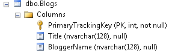

### Composite keys

Entity Framework supports composite keys - primary keys that consist of more than one property. For example, your could have a Passport class whose primary key is a combination of PassportNumber and IssuingCountry.

```
    public class Passport
    {
        [Key]
        public int PassportNumber { get; set; }
        [Key]
        public string IssuingCountry { get; set; }
        public DateTime Issued { get; set; }
        public DateTime Expires { get; set; }
    }
```

If you were to try and use the above class in your EF model you wuld get an InvalidOperationExceptions stating;

*Unable to determine composite primary key ordering for type 'Passport'. Use the ColumnAttribute or the HasKey method to specify an order for composite primary keys.*

When you have composite keys, Entity Framework requires you to define an order of the key properties. You can do this using the Column annotation to specify an order.

> **Note:** The order value is relative (rather than index based) so any values can be used. For example, 100 and 200 would be acceptable in place of 1 and 2.

```
    public class Passport
    {
        [Key]
        [Column(Order=1)]
        public int PassportNumber { get; set; }
        [Key]
        [Column(Order = 2)]
        public string IssuingCountry { get; set; }
        public DateTime Issued { get; set; }
        public DateTime Expires { get; set; }
    }
```

If you have entities with composite foreign keys then you must specify the same column ordering that you used for the corresponding primary key properties.

Only the relative ordering within the foreign key properties needs to be the same, the exact values assigned to **Order** do not need to match. I.e. in the following example 3 and 4 could be used in place of 1 and 2.

```
    public class PassportStamp
    {
        [Key]
        public int StampId { get; set; }
        public DateTime Stamped { get; set; }
        public string StampingCountry { get; set; }

        [ForeignKey("Passport")]
        [Column(Order = 1)]
        public int PassportNumber { get; set; }

        [ForeignKey("Passport")]
        [Column(Order = 2)]
        public string IssuingCountry { get; set; }

        public Passport Passport { get; set; }
    }
```

## Required

The Required annotation tells EF that a particular property is required.

Adding Required to the Title property will force EF (and MVC) to ensure that the property has data in it.

```
    [Required]
    public string Title { get; set; }
```

With no additional no code or markup changes in the application, an MVC application will perform client side validation, even dynamically building a message using the property and annotation names.

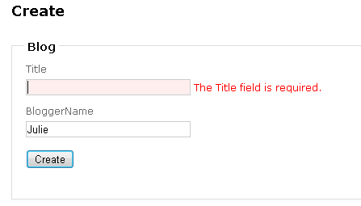

The Required attribute will also affect the generated database by making the mapped property non-nullable. Notice that the Title field has changed to “not null”.

> **Note:** In some cases it may not be possible for the column in the database to be non-nullable even though the property is required. For example, when using a TPH inheritance strategy data for multiple types is stored in a single table. If a derived type includes a required property the column cannot be made non-nullable since not all types in the hierarchy will have this property.

 

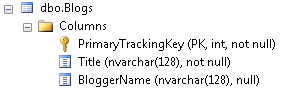

 

## MaxLength and MinLength

The MaxLength and MinLength attributes allow you to specify additional property validations, just as you did with Required.

Here is the BloggerName with length requirements. The example also demonstrates how to combine attributes.

```
    [MaxLength(10),MinLength(5)]
    public string BloggerName { get; set; }
```

The MaxLength annotation will impact the database by setting the property’s length to 10.

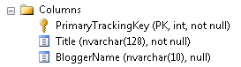

MVC client-side annotation and EF 4.1 server-side annotation will both honor this validation, again dynamically building an error message: “The field BloggerName must be a string or array type with a maximum length of '10'.” That message is a little long. Many annotations let you specify an error message with the ErrorMessage attribute.

```
    [MaxLength(10, ErrorMessage="BloggerName must be 10 characters or less"),MinLength(5)]
    public string BloggerName { get; set; }
```

You can also specify ErrorMessage in the Required annotation.

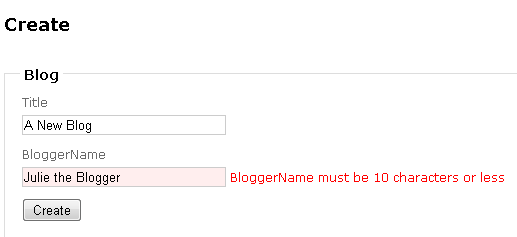

 

## NotMapped

Code first convention dictates that every property that is of a supported data type is represented in the database. But this isn’t always the case in your applications. For example you might have a property in the Blog class that creates a code based on the Title and BloggerName fields. That property can be created dynamically and does not need to be stored. You can mark any properties that do not map to the database with the NotMapped annotation such as this BlogCode property.

```
    [NotMapped]
    public string BlogCode
    {
        get
        {
            return Title.Substring(0, 1) + ":" + BloggerName.Substring(0, 1);
        }
    }
```

 

## ComplexType

It’s not uncommon to describe your domain entities across a set of classes and then layer those classes to describe a complete entity. For example, you may add a class called BlogDetails to your model.

```
    public class BlogDetails
    {
        public DateTime? DateCreated { get; set; }

        [MaxLength(250)]
        public string Description { get; set; }
    }
```

Notice that BlogDetails does not have any type of key property. In domain driven design, BlogDetails is referred to as a value object. Entity Framework refers to value objects as complex types.  Complex types cannot be tracked on their own.

However as a property in the Blog class, BlogDetails it will be tracked as part of a Blog object. In order for code first to recognize this, you must mark the BlogDetails class as a ComplexType.

```
    [ComplexType]
    public class BlogDetails
    {
        public DateTime? DateCreated { get; set; }

        [MaxLength(250)]
        public string Description { get; set; }
    }
```

Now you can add a property in the Blog class to represent the BlogDetails for that blog.

```
        public BlogDetails BlogDetail { get; set; }
```

In the database, the Blog table will contain all of the properties of the blog including the properties contained in its BlogDetail property. By default, each one is preceded with the name of the complex type, BlogDetail.

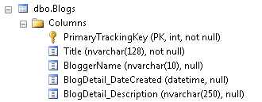

Another interesting note is that although the DateCreated property was defined as a non-nullable DateTime in the class, the relevant database field is nullable. You must use the Required annotation if you wish to affect the database schema.

 

## ConcurrencyCheck

The ConcurrencyCheck annotation allows you to flag one or more properties to be used for concurrency checking in the database when a user edits or deletes an entity. If you've been working with the EF Designer, this aligns with setting a property's ConcurrencyMode to Fixed.

Let’s see how ConcurrencyCheck works by adding it to the BloggerName property.

```
    [ConcurrencyCheck, MaxLength(10, ErrorMessage="BloggerName must be 10 characters or less"),MinLength(5)]
    public string BloggerName { get; set; }
```

When SaveChanges is called, because of the ConcurrencyCheck annotation on the BloggerName field, the original value of that property will be used in the update. The command will attempt to locate the correct row by filtering not only on the key value but also on the original value of BloggerName.  Here are the critical parts of the UPDATE command sent to the database, where you can see the command will update the row that has a PrimaryTrackingKey is 1 and a BloggerName of “Julie” which was the original value when that blog was retrieved from the database.

```
    where (([PrimaryTrackingKey] = @4) and ([BloggerName] = @5))
    @4=1,@5=N'Julie'
```

If someone has changed the blogger name for that blog in the meantime, this update will fail and you’ll get a DbUpdateConcurrencyException that you'll need to handle.

 

## TimeStamp

It's more common to use rowversion or timestamp fields for concurrency checking. But rather than using the ConcurrencyCheck annotation, you can use the more specific TimeStamp annotation as long as the type of the property is byte array. Code first will treat Timestamp properties the same as ConcurrencyCheck properties, but it will also ensure that the database field that code first generates is non-nullable. You can only have one timestamp property in a given class.

Adding the following property to the Blog class:

```
    [Timestamp]
    public Byte[] TimeStamp { get; set; }
```

results in code first creating a non-nullable timestamp column in the database table.

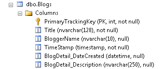

 

## Table and Column

If you are letting Code First create the database, you may want to change the name of the tables and columns it is creating. You can also use Code First with an existing database. But it's not always the case that the names of the classes and properties in your domain match the names of the tables and columns in your database.

My class is named Blog and by convention, code first presumes this will map to a table named Blogs. If that's not the case you can specify the name of the table with the Table attribute. Here for example, the annotation is specifying that the table name is InternalBlogs.

```
    [Table("InternalBlogs")]
    public class Blog
```

The Column annotation is a more adept in specifying the attributes of a mapped column. You can stipulate a name, data type or even the order in which a column appears in the table. Here is an example of the Column attribute.

```
    [Column(“BlogDescription", TypeName="ntext")]
    public String Description {get;set;}
```

Don’t confuse Column’s TypeName attribute with the DataType DataAnnotation. DataType is an annotation used for the UI and is ignored by Code First.

Here is the table after it’s been regenerated. The table name has changed to InternalBlogs and Description column from the complex type is now BlogDescription. Because the name was specified in the annotation, code first will not use the convention of starting the column name with the name of the complex type.

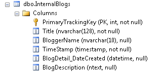

 

## DatabaseGenerated

An important database features is the ability to have computed properties. If you're mapping your Code First classes to tables that contain computed columns, you don't want Entity Framework to try to update those columns. But you do want EF to return those values from the database after you've inserted or updated data. You can use the DatabaseGenerated annotation to flag those properties in your class along with the Computed enum. Other enums are None and Identity.

```
    [DatabaseGenerated(DatabaseGenerationOption.Computed)]
    public DateTime DateCreated { get; set; }
```

You can use database generated on byte or timestamp columns when code first is generating the database, otherwise you should only use this when pointing to existing databases because code first won't be able to determine the formula for the computed column.

You read above that by default, a key property that is an integer will become an identity key in the database. That would be the same as setting DatabaseGenerated to DatabaseGenerationOption.Identity. If you do not want it to be an identity key, you can set the value to DatabaseGenerationOption.None.

 

## Index

> **EF6.1 Onwards Only** - The Index attribute was introduced in Entity Framework 6.1. If you are using an earlier version the information in this section does not apply.

You can create an index on one or more columns using the **IndexAttribute**. Adding the attribute to one or more properties will cause EF to create the corresponding index in the database when it creates the database, or scaffold the corresponding **CreateIndex** calls if you are using Code First Migrations.

For example, the following code will result in an index being created on the **Rating** column of the **Posts** table in the database.

```
    public class Post
    {
        public int Id { get; set; }
        public string Title { get; set; }
        public string Content { get; set; }
        [Index]
        public int Rating { get; set; }
        public int BlogId { get; set; }
    }
```

By default, the index will be named **IX\_&lt;property name&gt;** (i.e. IX\_Rating in the above example). You can also specify a name for the index though. The following example specifies that the index should be named **PostRatingIndex**.

```
    [Index("PostRatingIndex")]
    public int Rating { get; set; }
```

By default, indexes are non-unique, but you can use the **IsUnique** named parameter to specify that an index should be unique. The following example introduces a unique index on a **User**'s login name.

```
    public class User
    {
        public int UserId { get; set; }

        [Index(IsUnique = true)]
        [StringLength(200)]
        public string Username { get; set; }

        public string DisplayName { get; set; }
    }
```

### Multiple-Column Indexes

Indexes that span multiple columns are specified by using the same name in multiple Index annotations for a given table. When you create multi-column indexes, you need to specify an order for the columns in the index. For example, the following code creates a multi-column index on **Rating** and **BlogId** called **IX\_BlogAndRating**. **BlogId** is the first column in the index and **Rating** is the second.

```
    public class Post
    {
        public int Id { get; set; }
        public string Title { get; set; }
        public string Content { get; set; }
        [Index("IX_BlogIdAndRating", 2)]
        public int Rating { get; set; }
        [Index("IX_BlogIdAndRating", 1)]
        public int BlogId { get; set; }
    }
```

 

## Relationship Attributes: InverseProperty and ForeignKey

> **Note**: This page provides information about setting up relationships in your Code First model using Data Annotations. For general information about relationships in EF and how to access and manipulate data using relationships, see [Relationships & Navigation Properties](../ef6/entity-framework-relationships-and-navigation-properties.md).*

Code first convention will take care of the most common relationships in your model, but there are some cases where it needs help.

Changing the name of the key property in the Blog class created a problem with its relationship to Post. 

When generating the database, code first sees the BlogId property in the Post class and recognizes it, by the convention that it matches a class name plus “Id”, as a foreign key to the Blog class. But there is no BlogId property in the blog class. The solution for this is to create a navigation property in the Post and use the Foreign DataAnnotation to help code first understand how to build the relationship between the two classes —using the Post.BlogId property — as well as how to specify constraints in the database.

```
    public class Post
    {
            public int Id { get; set; }
            public string Title { get; set; }
            public DateTime DateCreated { get; set; }
            public string Content { get; set; }
            public int BlogId { get; set; }
            [ForeignKey("BlogId")]
            public Blog Blog { get; set; }
            public ICollection<Comment> Comments { get; set; }
    }
```

The constraint in the database shows a relationship between InternalBlogs.PrimaryTrackingKey and Posts.BlogId. 

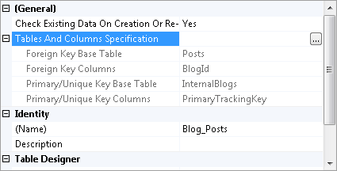

The InverseProperty is used when you have multiple relationships between classes.

In the Post class, you may want to keep track of who wrote a blog post as well as who edited it. Here are two new navigation properties for the Post class.

```
    public Person CreatedBy { get; set; }
    public Person UpdatedBy { get; set; }
```

You’ll also need to add in the Person class referenced by these properties. The Person class has navigation properties back to the Post, one for all of the posts written by the person and one for all of the posts updated by that person.

```
    public class Person
    {
            public int Id { get; set; }
            public string Name { get; set; }
            public List<Post> PostsWritten { get; set; }
            public List<Post> PostsUpdated { get; set; }
    }
```

Code first is not able to match up the properties in the two classes on its own. The database table for Posts should have one foreign key for the CreatedBy person and one for the UpdatedBy person but code first will create four will foreign key properties: Person\_Id, Person\_Id1, CreatedBy\_Id and UpdatedBy\_Id.

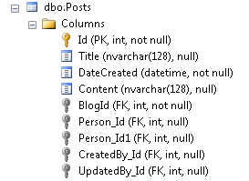

To fix these problems, you can use the InverseProperty annotation to specify the alignment of the properties.

```
    [InverseProperty("CreatedBy")]
    public List<Post> PostsWritten { get; set; }

    [InverseProperty("UpdatedBy")]
    public List<Post> PostsUpdated { get; set; }
```

Because the PostsWritten property in Person knows that this refers to the Post type, it will build the relationship to Post.CreatedBy. Similarly, PostsUpdated will be connected to Post.UpdatedBy. And code first will not create the extra foreign keys.

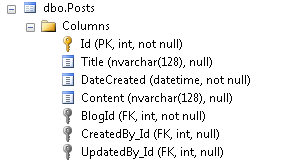

 

## Summary

DataAnnotations not only let you describe client and server side validation in your code first classes, but they also allow you to enhance and even correct the assumptions that code first will make about your classes based on its conventions. With DataAnnotations you can not only drive database schema generation, but you can also map your code first classes to a pre-existing database.

While they are very flexible, keep in mind that DataAnnotations provide only the most commonly needed configuration changes you can make on your code first classes. To configure your classes for some of the edge cases, you should look to the alternate configuration mechanism, Code First’s Fluent API .
