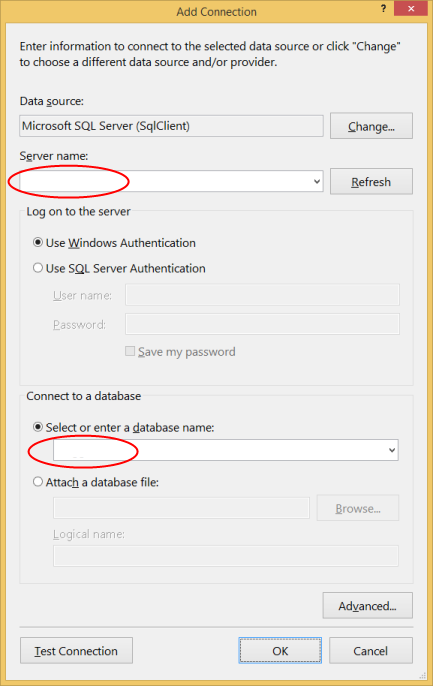
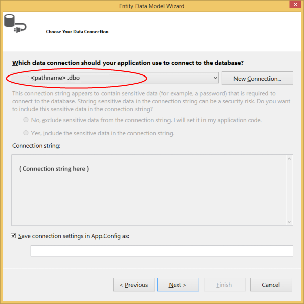

# Entity Framework Code First to an Existing Database
This video and step-by-step walkthrough provide an introduction to Code First development targeting an existing database. Code First allows you to define your model using C\# or VB.Net classes. Optionally additional configuration can be performed using attributes on your classes and properties or by using a fluent API.

[See the video that accompanies this step-by-step walkthrough.](http://channel9.msdn.com/blogs/ef/code-first-to-existing-database-ef6-1-onwards-)
 

## Pre-Requisites

You will need to have **Visual Studio 2012** or **Visual Studio 2013** installed to complete this walkthrough.

You will also need version **6.1** (or later) of the **Entity Framework Tools for Visual Studio** installed. See [Get Entity Framework](../ef6/get-entity-framework.md) for information on installing the latest version of the Entity Framework Tools.

## 1. Create an Existing Database

Typically when you are targeting an existing database it will already be created, but for this walkthrough we need to create a database to access.

Let's go ahead and generate the database.

-   Open Visual Studio
-   **View -&gt; Server Explorer**
-   Right click on **Data Connections -&gt; Add Connection…**
-   If you haven’t connected to a database from **Server Explorer** before you’ll need to select **Microsoft SQL Server** as the data source
    
    
    
-   Connect to your LocalDb instance (**(localdb)\\v11.0**), and enter **Blogging** as the database name
    
    
    
-   Select **OK** and you will be asked if you want to create a new database, select **Yes**
    
    
    
-   The new database will now appear in Server Explorer, right-click on it and select **New Query**
-   Copy the following SQL into the new query, then right-click on the query and select **Execute**

```
CREATE TABLE [dbo].[Blogs] ( 
    [BlogId] INT IDENTITY (1, 1) NOT NULL, 
    [Name] NVARCHAR (200) NULL, 
    [Url]  NVARCHAR (200) NULL, 
    CONSTRAINT [PK_dbo.Blogs] PRIMARY KEY CLUSTERED ([BlogId] ASC) 
); 
 
CREATE TABLE [dbo].[Posts] ( 
    [PostId] INT IDENTITY (1, 1) NOT NULL, 
    [Title] NVARCHAR (200) NULL, 
    [Content] NTEXT NULL, 
    [BlogId] INT NOT NULL, 
    CONSTRAINT [PK_dbo.Posts] PRIMARY KEY CLUSTERED ([PostId] ASC), 
    CONSTRAINT [FK_dbo.Posts_dbo.Blogs_BlogId] FOREIGN KEY ([BlogId]) REFERENCES [dbo].[Blogs] ([BlogId]) ON DELETE CASCADE 
); 
 
INSERT INTO [dbo].[Blogs] ([Name],[Url]) 
VALUES ('The Visual Studio Blog', 'http://blogs.msdn.com/visualstudio/') 
 
INSERT INTO [dbo].[Blogs] ([Name],[Url]) 
VALUES ('.NET Framework Blog', 'http://blogs.msdn.com/dotnet/')
```

## 2. Create the Application

To keep things simple we’re going to build a basic console application that uses Code First to perform data access:

-   Open Visual Studio
-   **File -&gt; New -&gt; Project…**
-   Select **Windows** from the left menu and **Console Application**
-   Enter **CodeFirstExistingDatabaseSample** as the name
-   Select **OK**

 

## 3. Reverse Engineer Model

We’re going to make use of the Entity Framework Tools for Visual Studio to help us generate some initial code to map to the database. These tools are just generating code that you could also type by hand if you prefer.

-   **Project -&gt; Add New Item…**
-   Select **Data** from the left menu and then **ADO.NET Entity Data Model**
-   Enter **BloggingContext** as the name and click **OK**
-   This launches the **Entity Data Model Wizard**
-   Select **Code First from Database** and click **Next**
    
    
    
-   Select the connection to the database you created in the first section and click **Next**
    
    
    
-   Click the checkbox next to **Tables** to import all tables and click **Finish**
    
    

Once the reverse engineer process completes a number of items will have been added to the project, let's take a look at what's been added.

### Configuration file

An App.config file has been added to the project, this file contains the connection string to the existing database.

```
<connectionStrings> 
  <add  
    name="BloggingContext"  
    connectionString="data source=(localdb)\v11.0;initial catalog=Blogging;integrated security=True;MultipleActiveResultSets=True;App=EntityFramework"  
    providerName="System.Data.SqlClient" /> 
</connectionStrings>
```

*You’ll notice some other settings in the configuration file too, these are default EF settings that tell Code First where to create databases. Since we are mapping to an existing database these setting will be ignored in our application.*

### Derived Context

A **BloggingContext** class has been added to the project. The context represents a session with the database, allowing us to query and save data.
The context exposes a **DbSet&lt;TEntity&gt;** for each type in our model. You’ll also notice that the default constructor calls a base constructor using the **name=** syntax. This tells Code First that the connection string to use for this context should be loaded from the configuration file.

```
public partial class BloggingContext : DbContext 
    { 
        public BloggingContext() 
            : base("name=BloggingContext") 
        { 
        } 
 
        public virtual DbSet<Blog> Blogs { get; set; } 
        public virtual DbSet<Post> Posts { get; set; } 
 
        protected override void OnModelCreating(DbModelBuilder modelBuilder) 
        { 
        } 
    }
```

*You should always use the **name=** syntax when you are using a connection string in the config file. This ensures that if the connection string is not present then Entity Framework will throw rather than creating a new database by convention.*

### Model classes

Finally, a **Blog** and **Post** class have also been added to the project. These are the domain classes that make up our model. You'll see Data Annotations applied to the classes to specify configuration where the Code First conventions would not align with the structure of the existing database. For example, you'll see the **StringLength** annotation on **Blog.Name** and **Blog.Url** since they have a maximum length of **200** in the database (the Code First default is to use the maximun length supported by the database provider - **nvarchar(max)** in SQL Server).

```
public partial class Blog 
{ 
    public Blog() 
    { 
        Posts = new HashSet<Post>(); 
    } 
 
    public int BlogId { get; set; } 
 
    [StringLength(200)] 
    public string Name { get; set; } 
 
    [StringLength(200)] 
    public string Url { get; set; } 
 
    public virtual ICollection<Post> Posts { get; set; } 
}
```

## 4. Reading & Writing Data

Now that we have a model it’s time to use it to access some data. Implement the **Main** method in **Program.cs** as shown below. This code creates a new instance of our context and then uses it to insert a new **Blog**. Then it uses a LINQ query to retrieve all **Blogs** from the database ordered alphabetically by **Title**.

```
class Program 
{ 
    static void Main(string[] args) 
    { 
        using (var db = new BloggingContext()) 
        { 
            // Create and save a new Blog 
            Console.Write("Enter a name for a new Blog: "); 
            var name = Console.ReadLine(); 
 
            var blog = new Blog { Name = name }; 
            db.Blogs.Add(blog); 
            db.SaveChanges(); 
 
            // Display all Blogs from the database 
            var query = from b in db.Blogs 
                        orderby b.Name 
                        select b; 
 
            Console.WriteLine("All blogs in the database:"); 
            foreach (var item in query) 
            { 
                Console.WriteLine(item.Name); 
            } 
 
            Console.WriteLine("Press any key to exit..."); 
            Console.ReadKey(); 
        } 
    } 
}
```

You can now run the application and test it out.

```
Enter a name for a new Blog: ADO.NET Blog
All blogs in the database:
.NET Framework Blog
ADO.NET Blog
The Visual Studio Blog
Press any key to exit...
```
 

## Customizing the Scaffolded Code

For information on customizing the code that is generated by the wizard, see [Customizing Code First to an Existing Database](../ef6/customizing-code-first-to-an-existing-database.md).

 

## What if My Database Changes?

The Code First to Database wizard is designed to generate a starting point set of classes that you can then tweak and modify. If your database schema changes you can either manually edit the classes or perform another reverse engineer to overwrite the classes.

 

## Using Code First Migrations with an Existing Database

If you want to use Code First Migrations with your existing database, see [Code First Migrations with an existing database](../ef6/entity-framework-code-first-migrations-with-an-existing-database.md).

 

## Summary

In this walkthrough we looked at Code First development using an existing database. We used the Entity Framework Tools for Visual Studio to reverse engineer a set of classes that mapped to the database and could be used to store and retrieve data.
