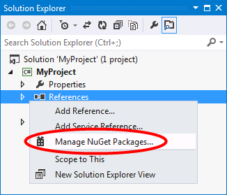

# Get Entity Framework
Entity Framework is made up of the EF Tools for Visual Studio and the EF Runtime.

##  EF Tools for Visual Studio

The Entity Framework 6 Tools are included in Visual Studio 2013. If you are using Visual Studio 2012, the tooling is [available on the Microsoft Download Center](https://www.microsoft.com/en-us/download/details.aspx?id=40762).

If you perform a custom install of Visual Studio you will need to ensure **Microsoft Web Developer Tools** or **Microsoft SQL Server Data Tools** is selected, otherwise the EF Tools will not be installed.

##  EF Runtime

The latest version of Entity Framework is available as the [EntityFramework NuGet package](http://nuget.org/packages/EntityFramework/). If you are not familiar with the NuGet Package Manager, we encourage you to read the [NuGet Overview](http://docs.nuget.org/docs/start-here/overview).

### Installing the EF NuGet Package

You can install the EntityFramework package by right-clicking on the **References** folder of your project and selecting **Manage NuGet Packages…**



### Installing from Package Manager Console

Alternatively, you can install EntityFramework by running the following command in the [Package Manager Console](http://docs.nuget.org/docs/start-here/using-the-package-manager-console).

```
Install-Package EntityFramework
```

### Installing the Latest Preview

The above methods will give you the latest fully supported release of Entity Framework. There are often prerelease versions of Entity Framework available that we would love you to try out and give us feedback on.

To install the latest preview of EntityFramework you can select **Include Prerelease** in the Manage NuGet Packages window. If no prerelease versions are available you will automatically get the latest fully supported version of Entity Framework.


Alternatively, you can run the following command in the [Package Manager Console](http://docs.nuget.org/docs/start-here/using-the-package-manager-console).

```
Install-Package EntityFramework -Pre
```
